# Exam Questions — Impact of Natural Hazards
**Hazardous Environments** · Edexcel IGCSE Geography (4GE1)
> Source: [https://www.savemyexams.com/igcse/geography/edexcel/19/topic-questions/3-hazardous-environments/3-2-impact-of-natural-hazards/exam-questions/](https://www.savemyexams.com/igcse/geography/edexcel/19/topic-questions/3-hazardous-environments/3-2-impact-of-natural-hazards/exam-questions/) · 26 questions · total 102 marks

## Q1 — easy — 3 marks · exam-questions

### 3() — 1 mark — command: identify — structured — from paper June 2017 · 4GE1/01
**Hazardous environments**

Study Figure 3 which shows an area of Kathmandu, Nepal, before and after a hazard event which affected much of the country.

Identify one short-term impact of this hazard event.

### 3() — 2 marks — command: suggest — structured — from paper June 2017 · 4GE1/01
Suggest how the scale of this event might have affected its long-term impact.

## Q2 — easy — 3 marks · exam-questions

### 3() — 1 mark — command: state — structured — from paper June 2019 · 4GE1/01R
State **one **human factor that affects the impact of a tectonic hazard.

### 3() — 2 marks — command: explain — structured — from paper June 2019 · 4GE1/01R
Explain **one** physical impact of a volcanic eruption.

## Q3 — easy — 1 marks · exam-questions

### 1() — 1 mark — multiple_choice — from paper Nov 2021 · 4GE1/01
Identify a way to help plan for tropical cyclone hazards
- **A.** Monitor earth movement with a seismograph
- **B.** Satellite technology to track development of storms
- **C.** Send emergency aid to countries that experience cyclones
- **D.** Monitor any changes in groundwater levels

## Q4 — easy — 2 marks · exam-questions

### 1() — 1 mark — command: state — structured — from paper Nov 2021 · 4GE1/01
State **one** reason why people continue to live in areas at risk from natural hazard events

### 2() — 1 mark — command: state — structured — from paper June 2022 · 4GE1/01R
State **one** factor that can affect how much damage an earthquake can cause

## Q5 — easy — 2 marks · exam-questions

### 1() — 2 marks — command: explain — structured — from paper Nov 2021 · 4GE1/01
Explain** one **economic impact of a tropical cyclone hazard

## Q6 — easy — 2 marks · exam-questions

### 1() — 2 marks — command: explain — structured
Explain **one** long-term impact of a tropical cyclone

## Q7 — easy — 2 marks · exam-questions

### 1() — 1 mark — command: identify — structured — from paper June 2022 · 4GE1/01
Study Figure 3b

Identify a potential short-term impact of the hazard shown

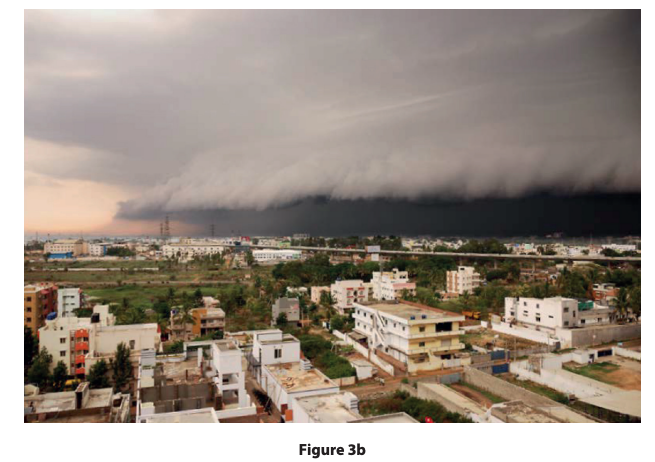

### 2() — 1 mark — command: suggest — structured — from paper June 2022 · 4GE1/01R
Study Figure 3b below

Suggest a long term impact of the hazard shown

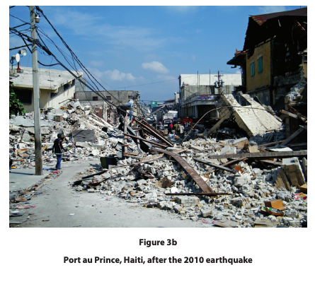

## Q8 — easy — 1 marks · exam-questions

### 3() — 1 mark — multiple_choice — from paper Nov 2024 · 4GE1/01
Identify **one** hazard associated with volcanic eruptions
- **A.** Coriolis force
- **B.** Pyroclastic flow
- **C.** Strong wind
- **D.** Wind shear

## Q9 — easy — 1 marks · exam-questions

### 3() — 1 mark — command: explain — structured — from paper Nov 2024 · 4GE1/01
Explain **one **reason people live near volcanoes.

## Q10 — easy — 1 marks · exam-questions

### 3() — 1 mark — command: state — structured — from paper Nov 2023 · 4GE1/01
State **one** impact of a volcanic eruption.

## Q11 — easy — 2 marks · exam-questions

### 1() — 2 marks — command: describe — structured
**Figure 1** shows a photograph taken after an earthquake in a city in a developing country.

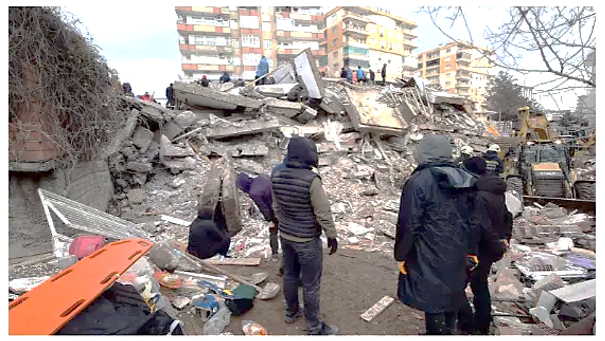

Describe **two **impacts of the earthquake shown in Figure 1.

## Q12 — easy — 3 marks · exam-questions

### 1() — 3 marks — command: explain — structured
Explain **one **reason why people continue to live in areas at risk from hazardous events.

## Q13 — medium — 8 marks · exam-questions

### 3() — 4 marks — command: outline — structured — from paper June 2018 · 4GE1/01
Outline **two **reasons why people continue to live in areas at risk from natural disasters.

### 3((f)) — 4 marks — command: explain — structured — from paper June 2019 · 4GE1/01
Explain why some countries are more vulnerable than others to the impacts of natural hazards.

## Q14 — medium — 4 marks · exam-questions

### 3((f)) — 4 marks — command: explain — structured — from paper June 2019 · 4GE1/01R
Explain why people live in areas at risk from hazardous events.

## Q15 — medium — 4 marks · exam-questions

### 3((c)) — 4 marks — command: suggest — structured — from paper Nov 2021 · 4GE1/01
Study Figure 3a

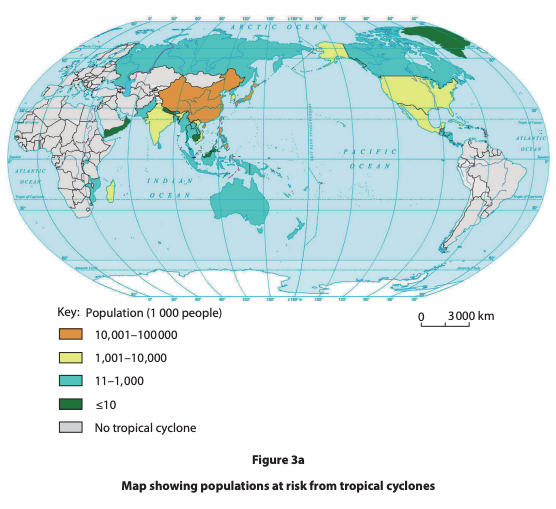

Suggest two reasons why some populations are more at risk from the impacts of tropical cyclones than others

## Q16 — medium — 4 marks · exam-questions

### 3() — 4 marks — command: explain — structured — from paper June 2022 · 4GE0/01
Study 3a below

Explain** two **reasons why people continue to live in areas at risk from volcanoesThe

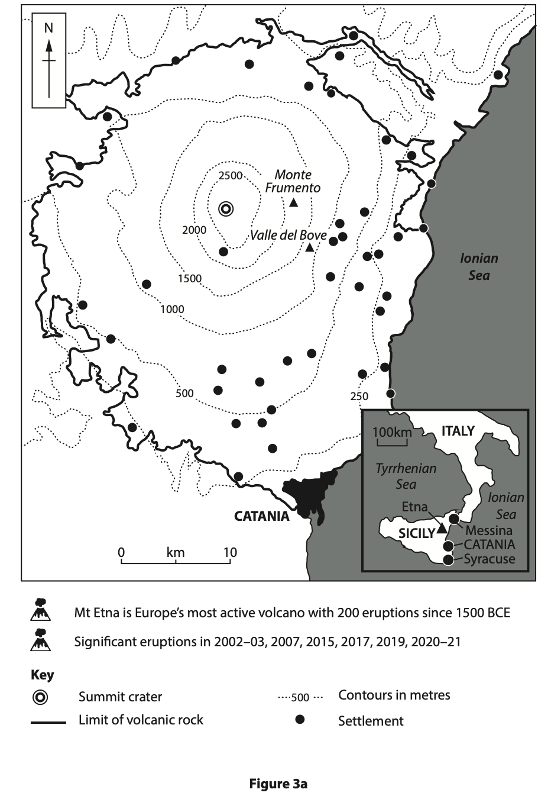

## Q17 — medium — 4 marks · exam-questions

### 3() — 4 marks — command: explain — structured — from paper June 2022 · 4GE1/01R
Explain **two** reasons why people continue to live in areas at risk of tropical cyclones

## Q18 — medium — 4 marks · exam-questions

### 3((c)) — 4 marks — command: suggest — structured — from paper Nov 2024 · 4GE1/01
Study Figure 3a.

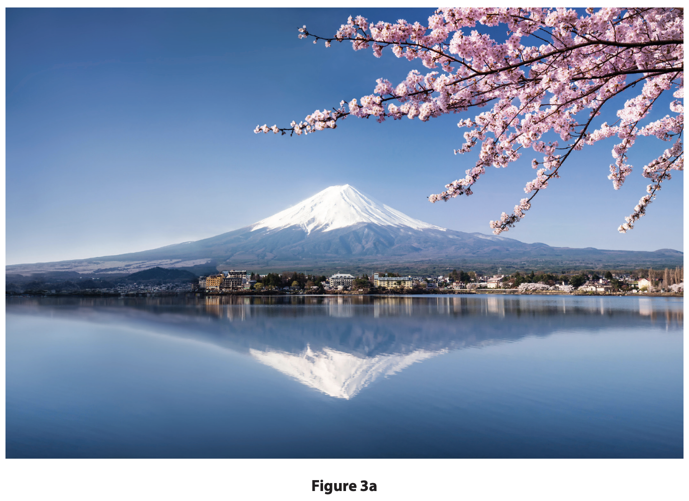

Suggest two physical characteristics that make this volcanic region vulnerable.

You must refer to the resource in you

## Q19 — medium — 3 marks · exam-questions

### 3((e)) — 3 marks — command: explain — structured — from paper Nov 2024 · 4GE1/01
Explain **one** impact tropical cyclones can have on people.

## Q20 — medium — 4 marks · exam-questions

### 3((d)) — 4 marks — command: suggest — structured — from paper June 2023 · 4GE1/01R
Study Figure 3a.

Suggest two short-term impacts of the earthquake shown.

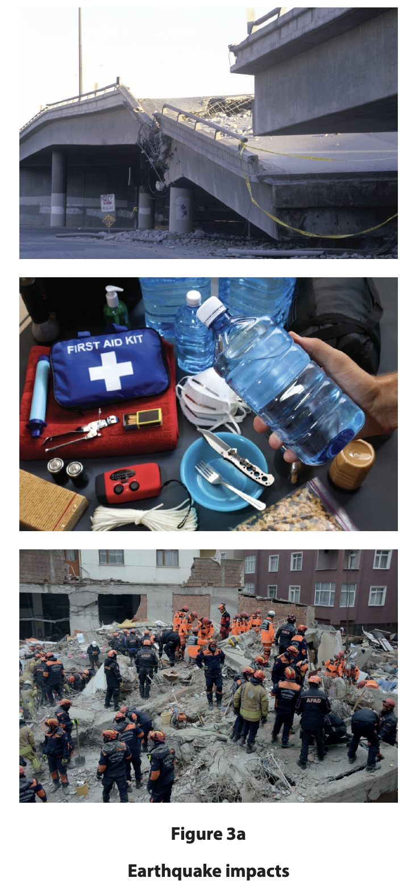

## Q21 — medium — 4 marks · exam-questions

### 3((f)) — 4 marks — command: explain — structured — from paper June 2023 · 4GE1/01R
Explain the long-term impacts of tropical cyclones.

## Q22 — hard — 8 marks · exam-questions

### 3((h)) — 8 marks — command: analyse — structured — from paper June 2022 · 4GE1/01
Study Figure 3c below

Analyse the hazard risk from this predicted distribution of tropical cyclones

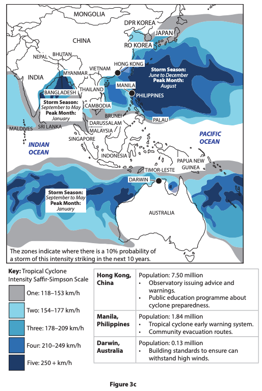

## Q23 — hard — 8 marks · exam-questions

### 3((h)) — 8 marks — command: analyse — structured — from paper June 2022 · 4GE1/01R
Study Figure 3c below

Analyse the reasons for the different impacts of the two volcanic eruptions shown

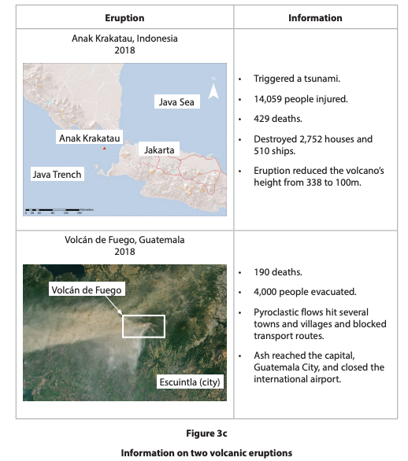

## Q24 — hard — 8 marks · exam-questions

### 1() — 8 marks — command: analyse — structured
Using a named tectonic hazard event you have studied, analyse the impacts of that event on people and the environment.

## Q25 — hard — 8 marks · exam-questions

### 3((h)) — 8 marks — command: analyse — structured — from paper June 2023 · 4GE1/01
Study Figure 3c and Figure 3d.

Analyse possible reasons why some countries are more vulnerable to the impact of earthquakes.

Refer to the resources in your answer.

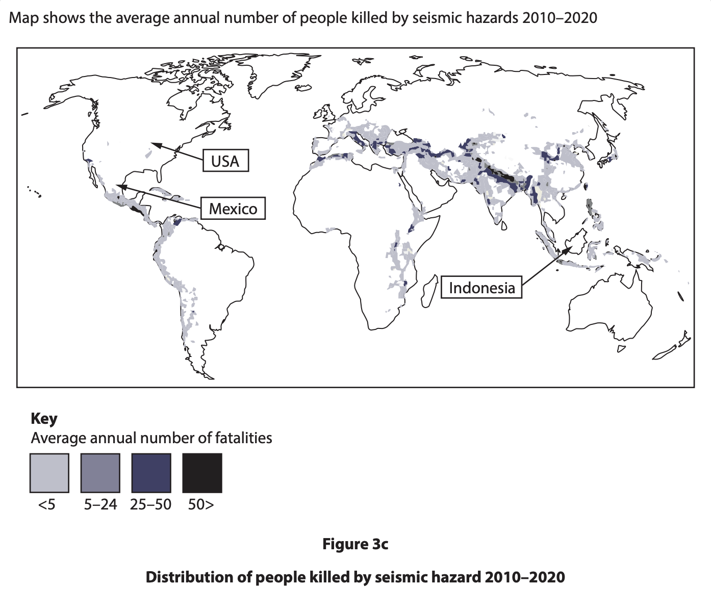

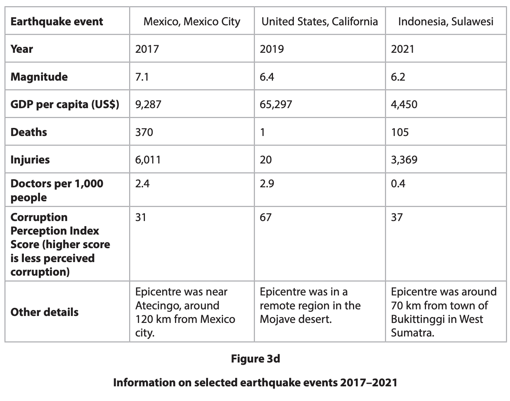

## Q26 — hard — 8 marks · exam-questions

### 3((g)) — 8 marks — command: analyse — structured — from paper June 2023 · 4GE1/01R
Study Figure 3c and Figure 3d.

Analyse the reasons why people continue to live in areas prone to volcanic eruptions. Refer to the resources in your answer

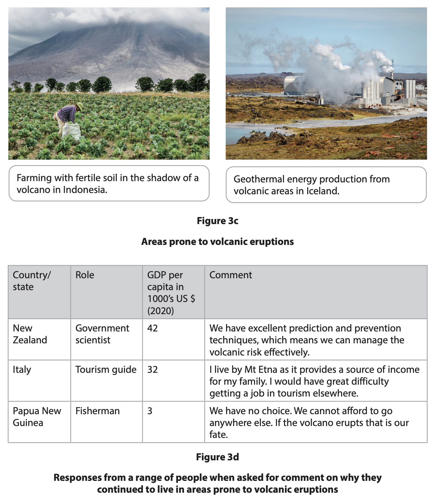
