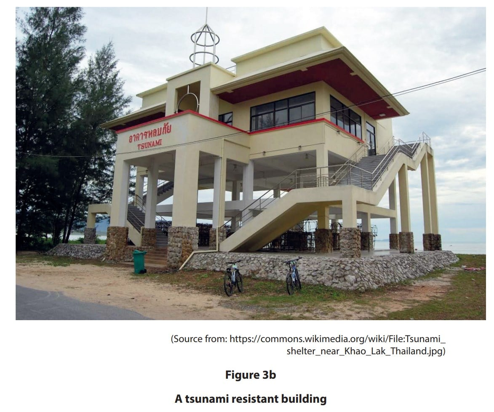
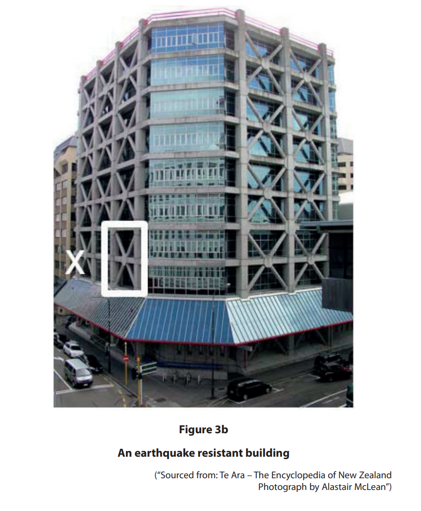
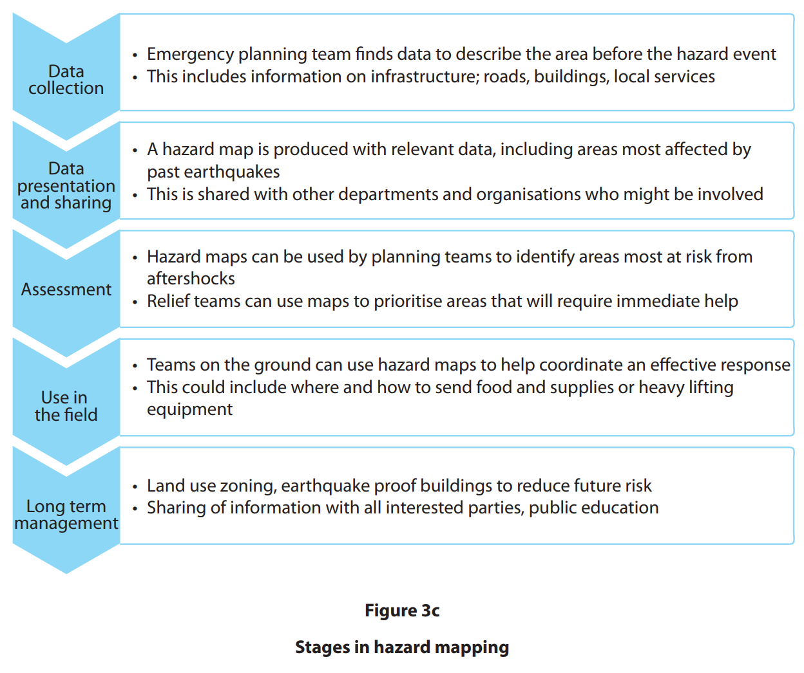
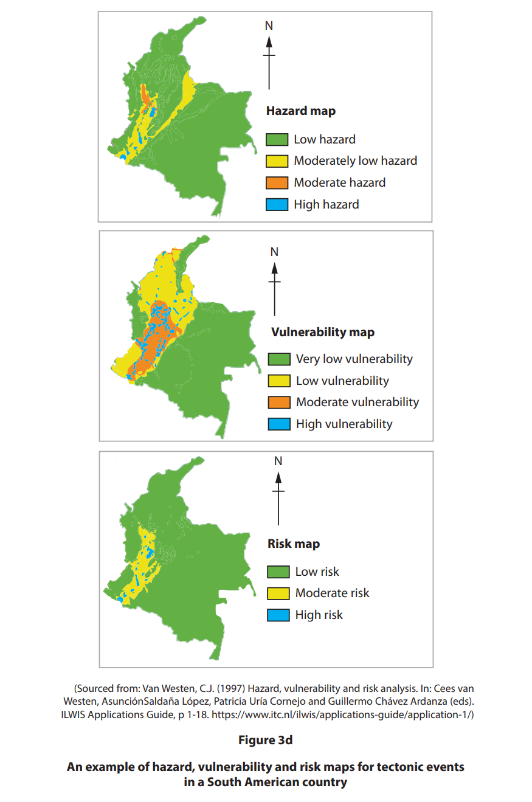
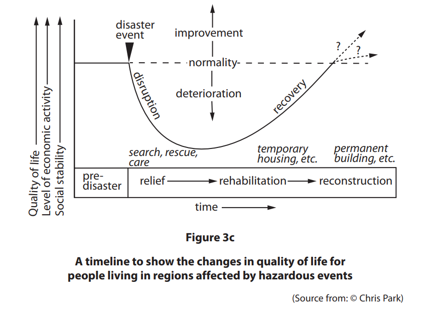
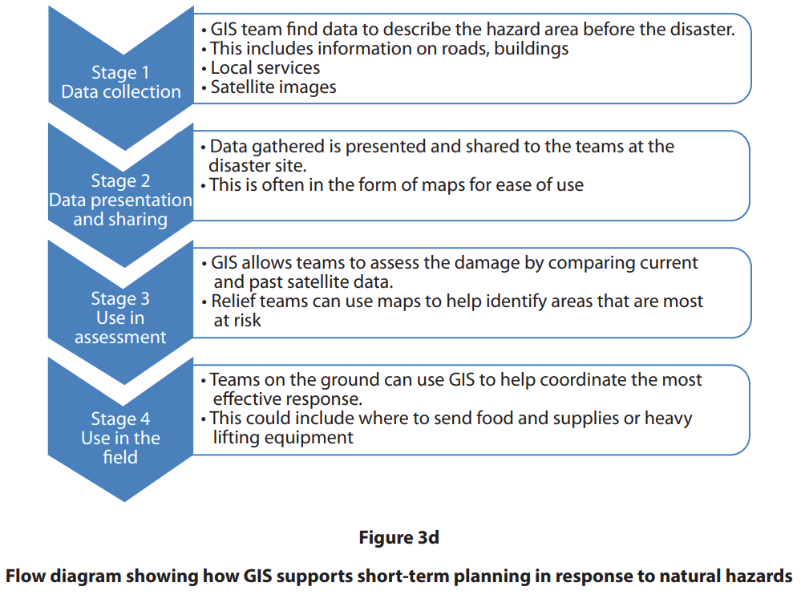
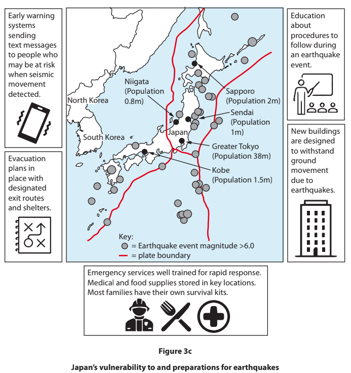
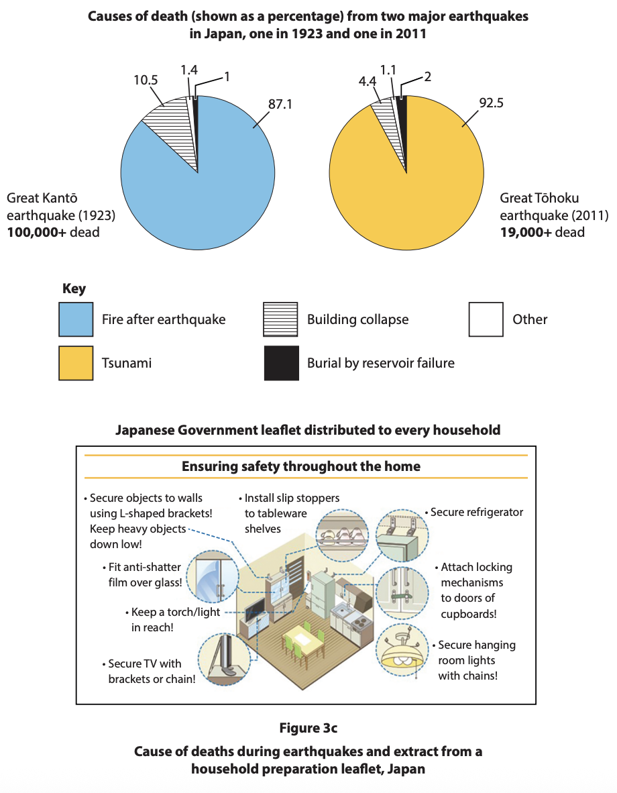

# Exam Questions — Earthquake Management
**Hazardous Environments** · Edexcel IGCSE Geography (4GE1)
> Source: [https://www.savemyexams.com/igcse/geography/edexcel/19/topic-questions/3-hazardous-environments/3-3-earthquake-management/exam-questions/](https://www.savemyexams.com/igcse/geography/edexcel/19/topic-questions/3-hazardous-environments/3-3-earthquake-management/exam-questions/) · 13 questions · total 53 marks

## Q1 — easy — 1 marks · exam-questions

### 3((e)) — 1 mark — command: identify — structured — from paper June 2019 · 4GE1/01
Study Figure 3b below.

Identify **one** feature of this building that makes it more tsunami resistant.

## Q2 — easy — 1 marks · exam-questions

### 3((e)) — 1 mark — command: identify — structured — from paper June 2019 · 4GE1/01R
Study Figure 3b below.

Identify the building design characteristic in Box X that makes this building more resistant to collapse.

## Q3 — easy — 1 marks · exam-questions

### 3((b)) — 1 mark — command: define — structured — from paper Nov 2024 · 4GE1/01
Define the term **earthquake risk assessment**

## Q4 — easy — 2 marks · exam-questions

### 3() — 2 marks — command: explain — structured — from paper Nov 2023 · 4GE1/01
Explain **one **way risk assessments can be used to manage earthquake hazards.

## Q5 — easy — 2 marks · exam-questions

### 3((c)) — 2 marks — command: explain — structured — from paper June 2023 · 4GE1/01
Explain **one** way people can prepare for earthquakes.

## Q6 — medium — 3 marks · exam-questions

### 3((e)) — 3 marks — command: explain — structured — from paper June 2022 · 4GE0/01
Explain** one** way building design can help prepare for earthquakes.

## Q7 — medium — 3 marks · exam-questions

### 3((e)) — 3 marks — command: explain — structured — from paper June 2022 · 4GE1/01R
Explain **one** way hazard mapping can help preparation for an earthquake event

## Q8 — medium — 4 marks · exam-questions

### 3((c)) — 4 marks — command: explain — structured — from paper June 2024 · 4GE1/01
Explain **two** reasons preparation for earthquakes may be more effective in some countries than others.

## Q9 — medium — 4 marks · exam-questions

### 3((c)) — 4 marks — command: explain — structured — from paper June 2024 · 4GE1/01R
Explain **two **reasons short-term responses to earthquakes can be more effective in some countries than others.

## Q10 — hard — 8 marks · exam-questions

### 3((g)) — 8 marks — command: analyse — structured — from paper June 2019 · 4GE1/01
Study Figure 3c and Figure 3d below.

Analyse the use of hazard, vulnerability and risk mapping in reducing the impact  of earthquakes.

## Q11 — hard — 8 marks · exam-questions

### 3((g)) — 8 marks — command: analyse — structured — from paper June 2019 · 4GE1/01R
Study Figure 3c and Figure 3d below.

Analyse the use of GIS in managing earthquake risk.

## Q12 — hard — 8 marks · exam-questions

### 3((g)) — 8 marks — command: analyse — structured — from paper Nov 2021 · 4GE1/01
Study Figure 3c below

Analyse the different strategies for preparing for earthquakes.

## Q13 — hard — 8 marks · exam-questions

### 3((g)) — 8 marks — command: analyse — structured — from paper Nov 2024 · 4GE1/01
Study Figure 3c.

Analyse the effectiveness of earthquake preparation strategies used to reduce risk.

You must refer to the resource in your answer.
