# Exam Questions — Economic Sectors
**Economic Activity & Energy** · Edexcel IGCSE Geography (4GE1)
> Source: [https://www.savemyexams.com/igcse/geography/edexcel/19/topic-questions/4-economic-activity-and-energy/4-1-economic-sectors/exam-questions/](https://www.savemyexams.com/igcse/geography/edexcel/19/topic-questions/4-economic-activity-and-energy/4-1-economic-sectors/exam-questions/) · 31 questions · total 100 marks

## Q1 — easy — 1 marks · exam-questions

### 4() — 1 mark — multiple_choice — from paper June 2017 · 4GE1/02
Study Figure 4, an Ordnance Survey map extract which shows a Motor Works.

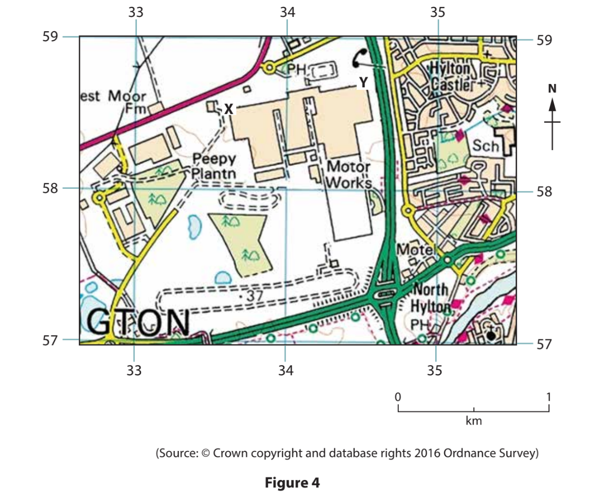

What is the straight-line distance between the western (X) and eastern (Y) edges of the Motor Works?
- **A.** 0.7 km
- **B.** 0.9 km
- **C.** 1.1 km
- **D.** 1.3 km

## Q2 — easy — 3 marks · exam-questions

### 1((a)) — 1 mark — multiple_choice — from paper June 2019 · 4GE1/02
Identify what is meant by an **economic sector**.
- **A.** the chain of production in manufacturing
- **B.** an economic shift in employment
- **C.** a classification system for types of employment
- **D.** a classification of employment structures

### 1((b)) — 1 mark — multiple_choice — from paper June 2019 · 4GE1/02
Identify the economic sector that includes agriculture as an activity.
- **A.** quaternary
- **B.** tertiary
- **C.** secondary
- **D.** primary

### 1((c)) — 1 mark — command: define — structured — from paper June 2019 · 4GE1/02
Define the term **raw material**.

## Q3 — easy — 3 marks · exam-questions

### 1((a)) — 1 mark — multiple_choice — from paper June 2019 · 4GE1/02R
The Clark Fisher model is used to describe the process of industrialisation. Identify the stage which is characterised by agriculture being the most important sector.
- **A.** pre-industrial phase
- **B.** industrial phase
- **C.** development pathway phase
- **D.** post-industrial phase

### 1((b)) — 1 mark — command: define — structured — from paper June 2019 · 4GE1/02R
Define the term employment structure.

### 1((c)) — 1 mark — multiple_choice — from paper June 2019 · 4GE1/02R
Identify the economic sector that includes manufacturing as an activity.
- **A.** quaternary
- **B.** tertiary
- **C.** secondary
- **D.** primary

## Q4 — easy — 2 marks · exam-questions

### 4() — 2 marks — command: what — structured — from paper June 2018 · 4GE1/02
What is meant by the term **de-industrialisation?**

## Q5 — easy — 1 marks · exam-questions

### 1((e)) — 1 mark — command: state — structured — from paper Nov 2020 · 4GE1/02
State** one** example of primary employment.

## Q6 — easy — 2 marks · exam-questions

### 1() — 2 marks — command: suggest — structured
Study Figure 1a.

Suggest one reason for the choice of economic activity in this location.

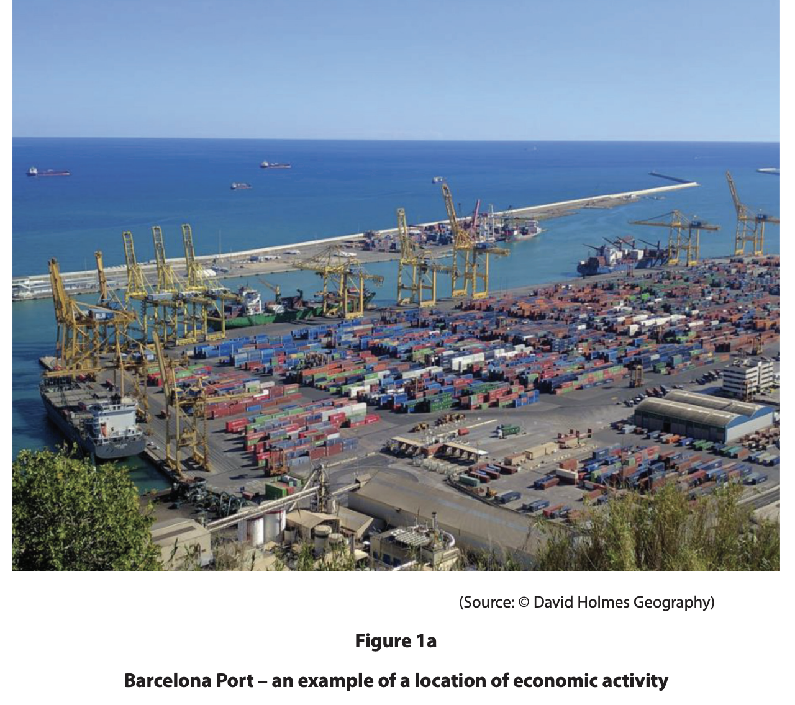

## Q7 — easy — 1 marks · exam-questions

### 1((e)) — 1 mark — command: state — structured — from paper Nov 2020 · 4GE1/02R
State** one** example of secondary employment.

## Q8 — easy — 1 marks · exam-questions

### 1((a)) — 1 mark — multiple_choice — from paper June 2024 · 4GE1/02
Identify which employment sector a school teacher belongs to.
- **A.** Primary
- **B.** Secondary
- **C.** Tertiary
- **D.** Quaternary

## Q9 — easy — 2 marks · exam-questions

### 1((c)) — 2 marks — command: suggest — structured — from paper June 2023 · 4GE1/02
Study Figure 1a.

Suggest one reason why the activities shown are part of the primary sector.

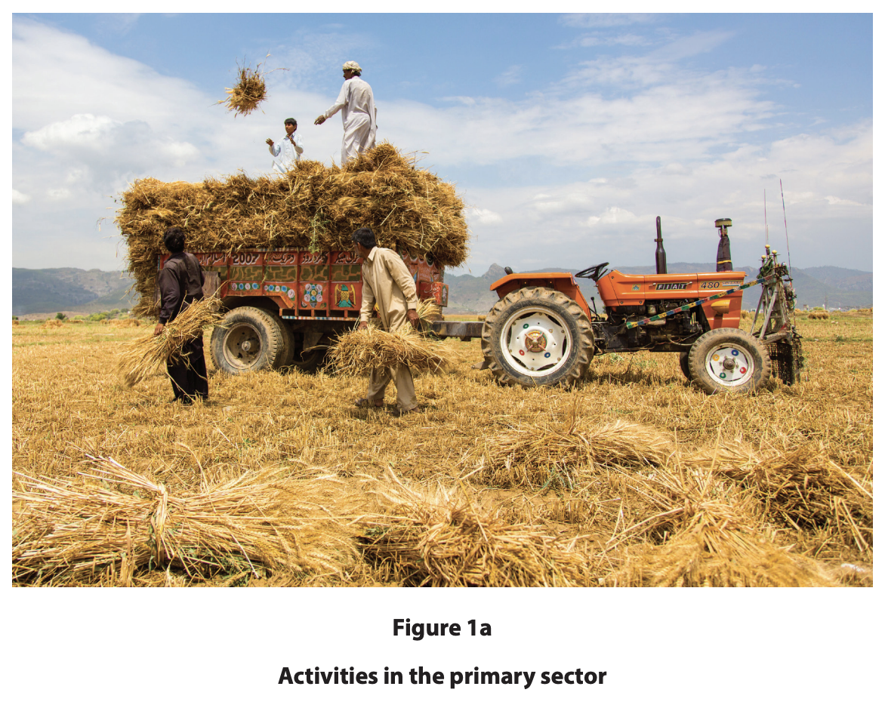

## Q10 — easy — 1 marks · exam-questions

### 1((d)) — 1 mark — command: state — structured — from paper June 2024 · 4GE1/02
State **one** reason for a decline in employment in the primary sector in many countries.

## Q11 — easy — 1 marks · exam-questions

### 1((b)) — 1 mark — multiple_choice — from paper June 2023 · 4GE1/02R
Identify which employment sector a research scientist would belong to.
- **A.** Primary
- **B.** Secondary
- **C.** Tertiary
- **D.** Quaternary

## Q12 — easy — 3 marks · exam-questions

### 1((c)) — 2 marks — command: suggest — structured — from paper June 2024 · 4GE1/02R
Study Figure 1a.

Suggest one reason this is considered a secondary sector industry

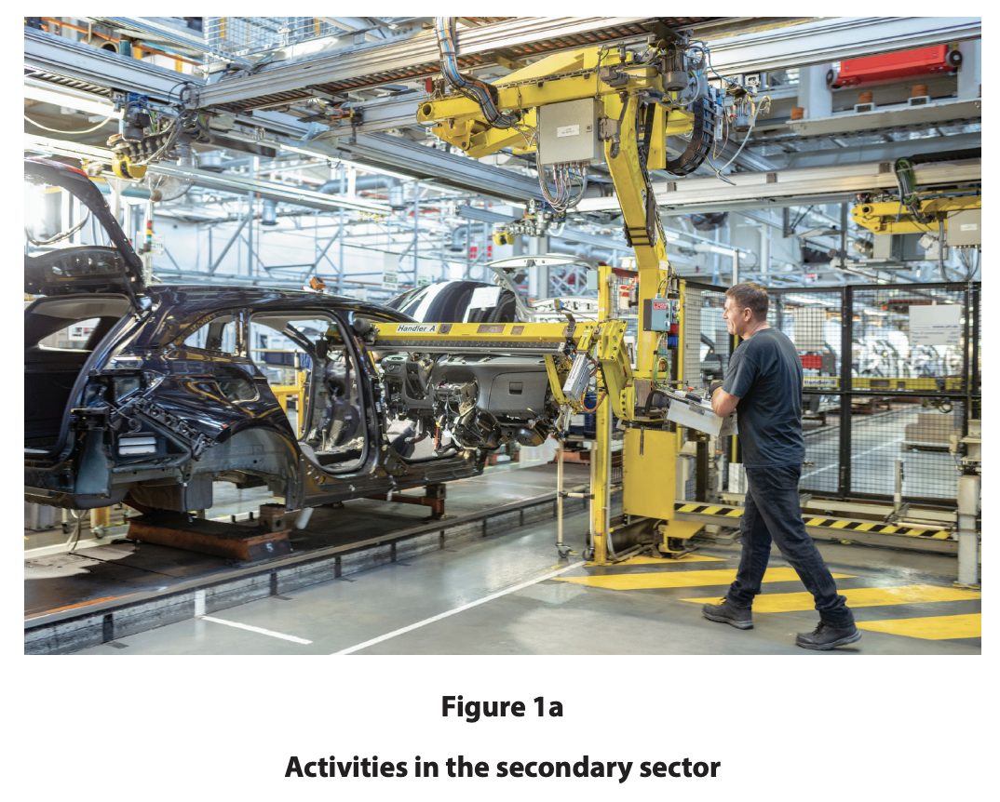

### 1((d)) — 1 mark — command: state — structured — from paper June 2024 · 4GE1/02R
State **one** reason for the growth in tertiary sector employment in many countries.

## Q13 — easy — 2 marks · exam-questions

### 1() — 2 marks — command: suggest — structured — from paper June 2022 · 4GE1/02R
Study Figure 1a.

Suggest one reason why this might be considered primary sector employment.

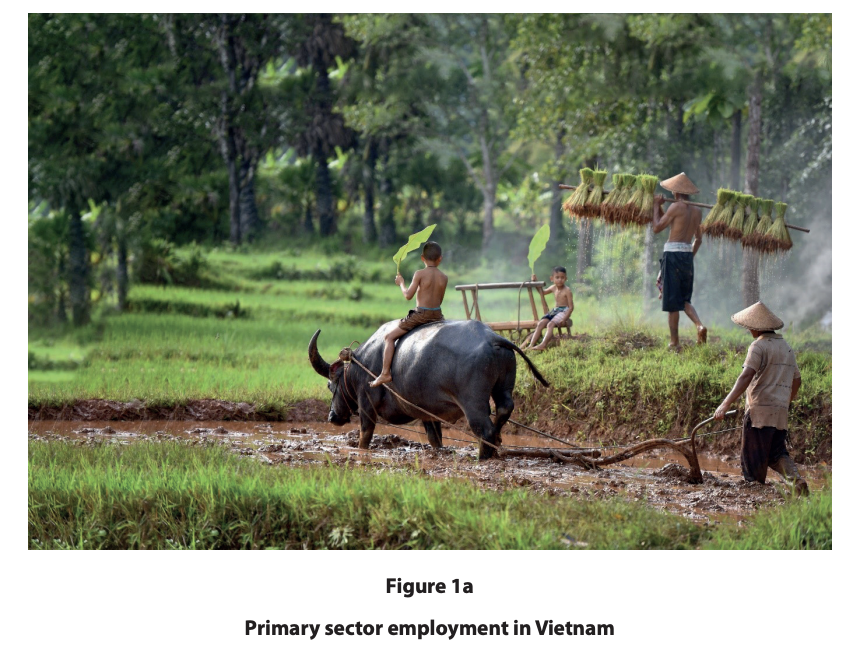

## Q14 — easy — 1 marks · exam-questions

### 1() — 1 mark — command: name — structured — from paper June 2022 · 4GE1/02R
Name **one **raw material produced in the primary sector.

## Q15 — easy — 2 marks · exam-questions

### 1() — 1 mark — multiple_choice — from paper June 2023 · 4GE1/02R
Identify one type of employment associated with the primary sector.
- **A.** doctor
- **B.** computer engineer
- **C.** miner
- **D.** teacher

### 1() — 1 mark — command: state — structured — from paper June 2023  · 4GE1/02R
State **one** factor that affects the location of primary sector economic activity.

## Q16 — easy — 3 marks · exam-questions

### 1((c)) — 2 marks — command: suggest — structured — from paper June 2023 · 4GE1/02R
Study Figure 1a.

Suggest one factor that has influenced the location of this factory.

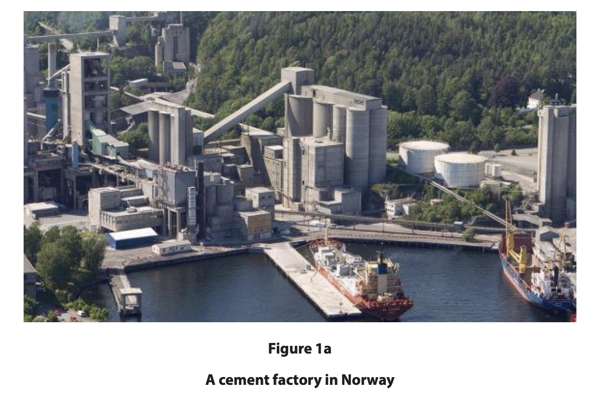

### 1((d)) — 1 mark — command: state — structured — from paper June 2023 · 4GE1/02R
State **one **economic activity that is part of the primary sector

## Q17 — easy — 2 marks · exam-questions

### 1((c)) — 2 marks — command: suggest — structured — from paper June 2023 · 4GE1/02R
Study Figure 1a.

Suggest one factor that has affected the location of this business park.

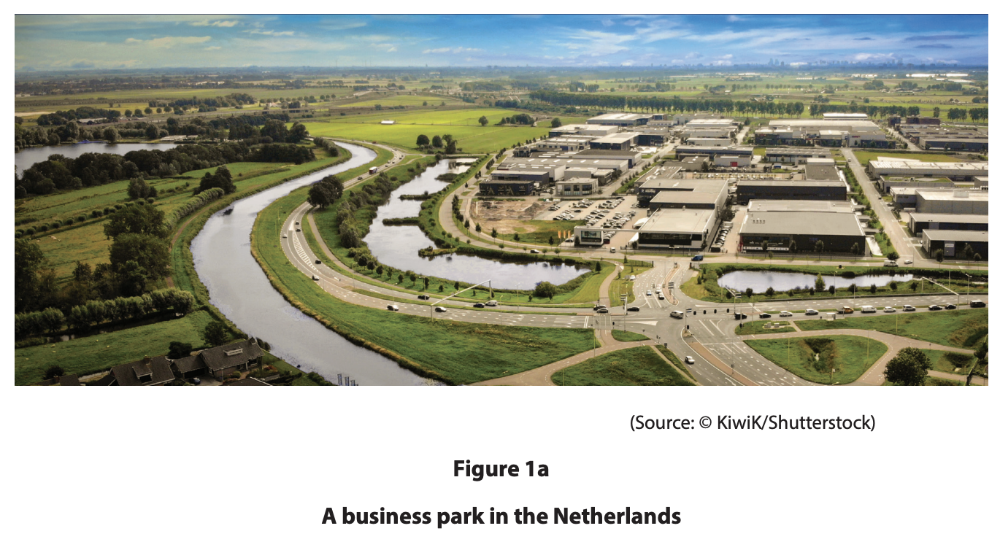

## Q18 — easy — 1 marks · exam-questions

### 1() — 1 mark — multiple_choice
Which of the following is the most important factor affecting the location of a steel manufacturing plant?
- **A.** Proximity to tourist attractions
- **B.** Proximity to raw materials such as iron ore and coal
- **C.** Proximity to national parks
- **D.** Proximity to universities

## Q19 — easy — 2 marks · exam-questions

### 1() — 2 marks — command: explain — structured
Explain **one **factor that affects the location of tertiary sector economic activity.

## Q20 — medium — 3 marks · exam-questions

### 4() — 3 marks — command: suggest — structured — from paper June2017 · 4GE1/01
Study Figure 4 which shows the location of motor works

Suggest **three** reasons why this location was chosen for the Motor Works.

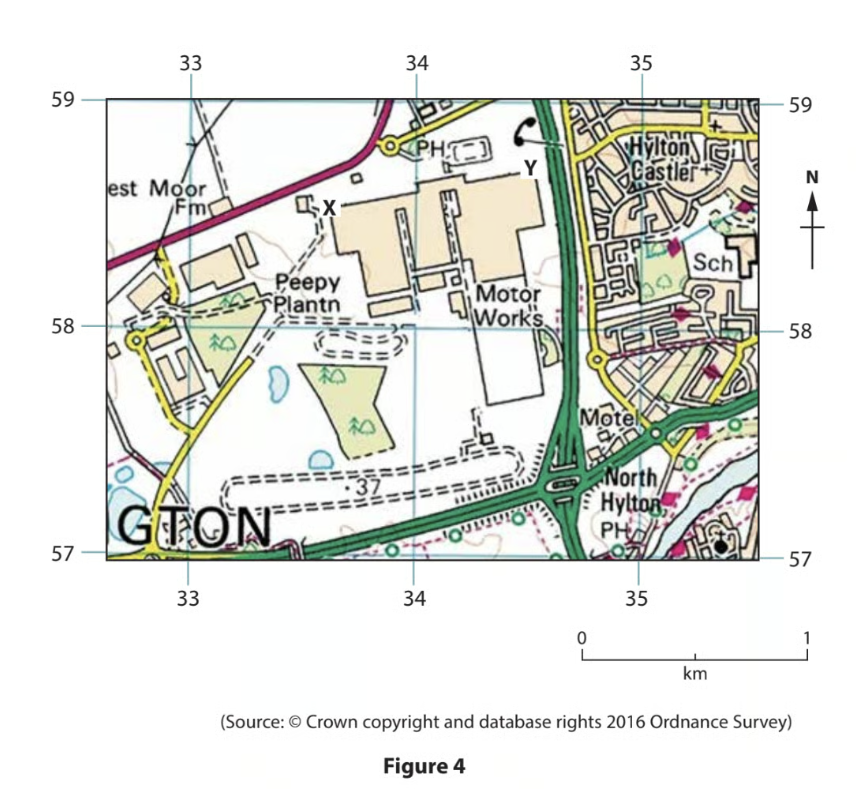

## Q21 — medium — 4 marks · exam-questions

### 4() — 4 marks — command: explain — structured — from paper June 2018 · 4GE1/01
Explain **two** causes of de-industrialisation.

## Q22 — medium — 4 marks · exam-questions

### 1((e)) — 4 marks — command: explain — structured — from paper Nov 2024 · 4GE1/01
Explain **one **human and** one** physical factor that can affect the location of primary sector activities.

## Q23 — medium — 4 marks · exam-questions

### 1((f)) — 4 marks — command: explain — structured — from paper June 2022 · 4GE1/02
Explain **two** factors that affect the location of quaternary sector employment.

## Q24 — medium — 4 marks · exam-questions

### 1() — 4 marks — command: explain — structured
Explain how rural-urban migration can lead to the growth of informal employment in megacities.

## Q25 — medium — 4 marks · exam-questions

### 1((f)) — 4 marks — command: explain — structured — from paper June 2022 · 4GE1/02R
Explain** two** factors that affect the location of secondary sector industries

## Q26 — medium — 3 marks · exam-questions

### 1((e)) — 3 marks — command: suggest — structured — from paper June 2023 · 4GE1/02R
Study Figure 1b.

Suggest one possible reason for changes to secondary sector employment.

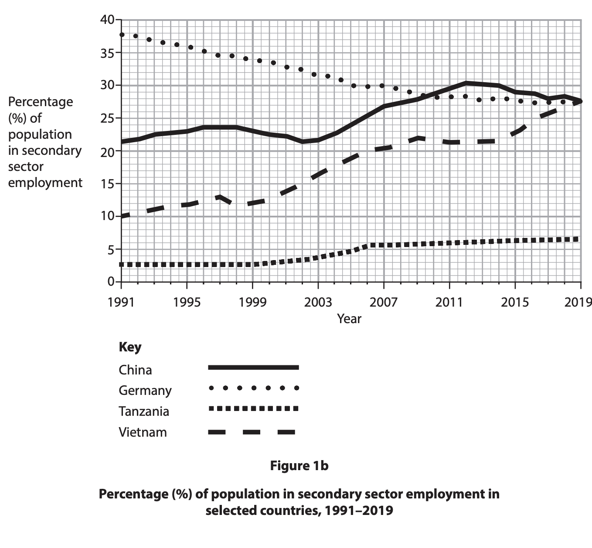

## Q27 — hard — 8 marks · exam-questions

### 1((i)) — 8 marks — command: analyse — structured — from paper June 2019 · 4GE1/02
Study Figure 1c below.

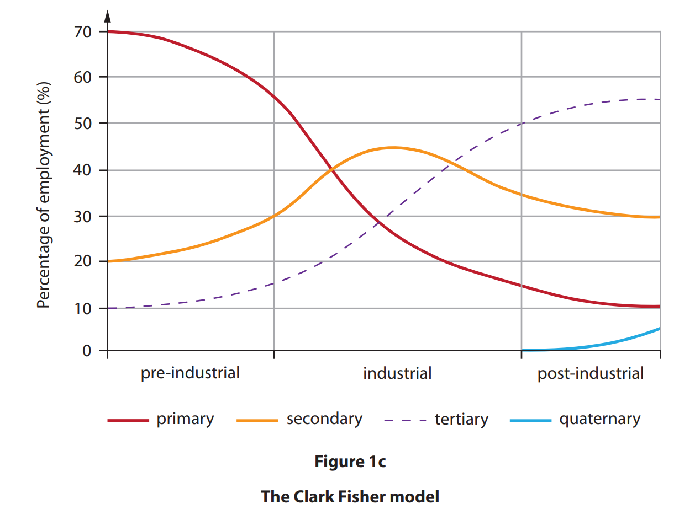

Analyse the reasons for changes in primary and quaternary employment.

## Q28 — hard — 8 marks · exam-questions

### 1((h)) — 8 marks — command: analyse — structured — from paper Nov 2024 · 4GE1/01
Study Figure 1c.

Analyse possible reasons for the differences in employment structure. You must refer to the resource in your answer.

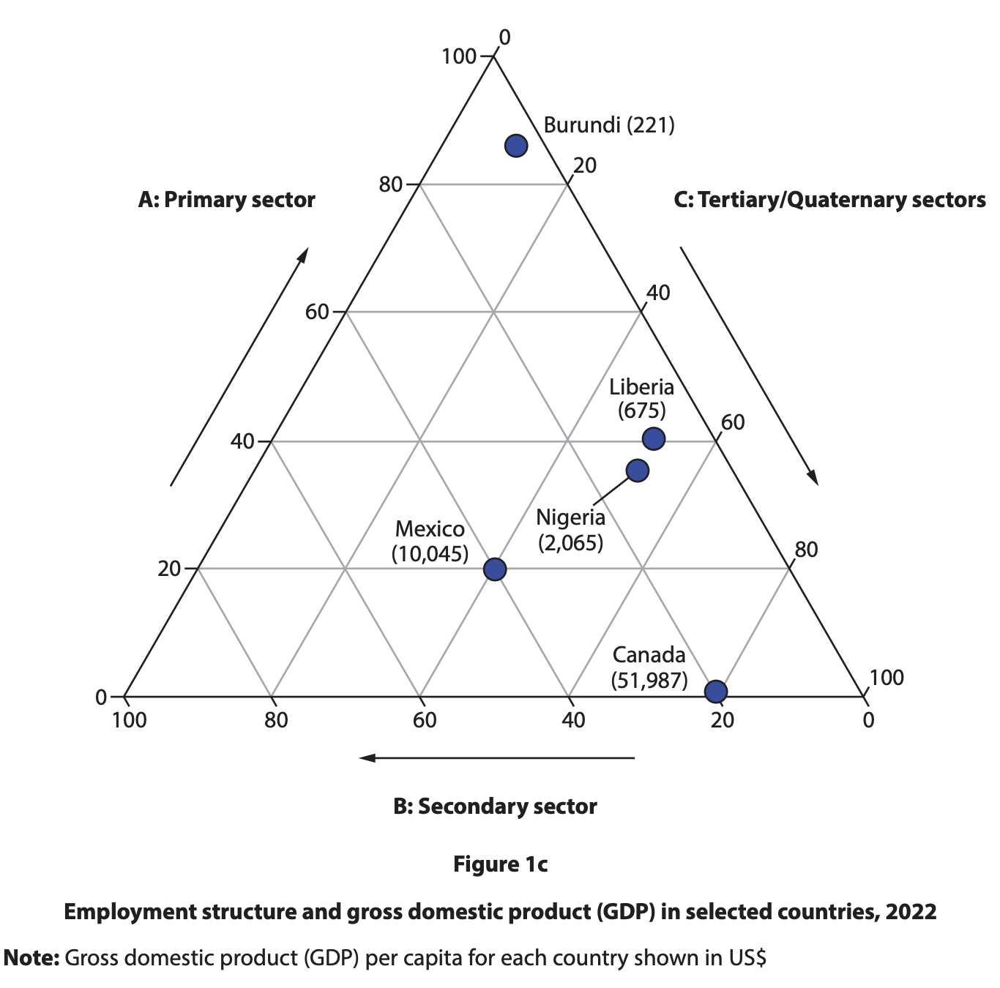

## Q29 — hard — 8 marks · exam-questions

### 1((g)) — 8 marks — command: analyse — structured — from paper June 2022 · 4GE1/02
Study Figure 1c.

Analyse the reasons for the changes in the percentage of people employed in the secondary sector.

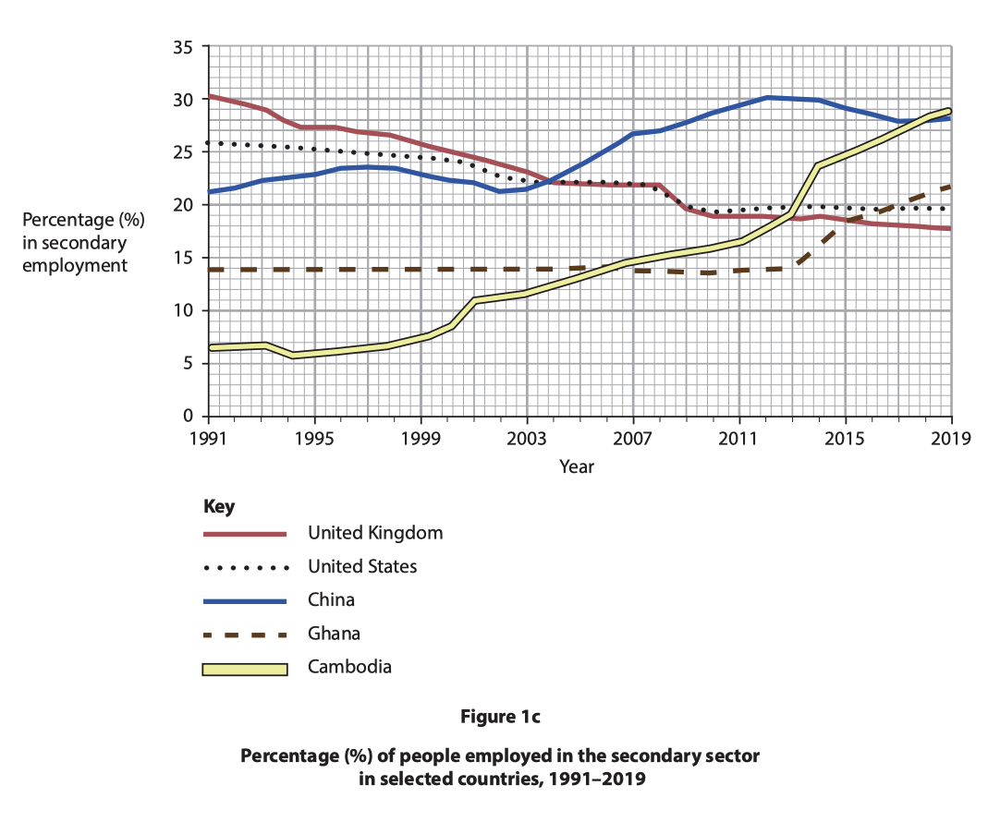

## Q30 — hard — 8 marks · exam-questions

### 1((g)) — 8 marks — command: analyse — structured — from paper June 2022 · 4GE1/02R
Study Figure 1c.

Analyse the reasons for the differences in the percentage of people employed in the tertiary sector

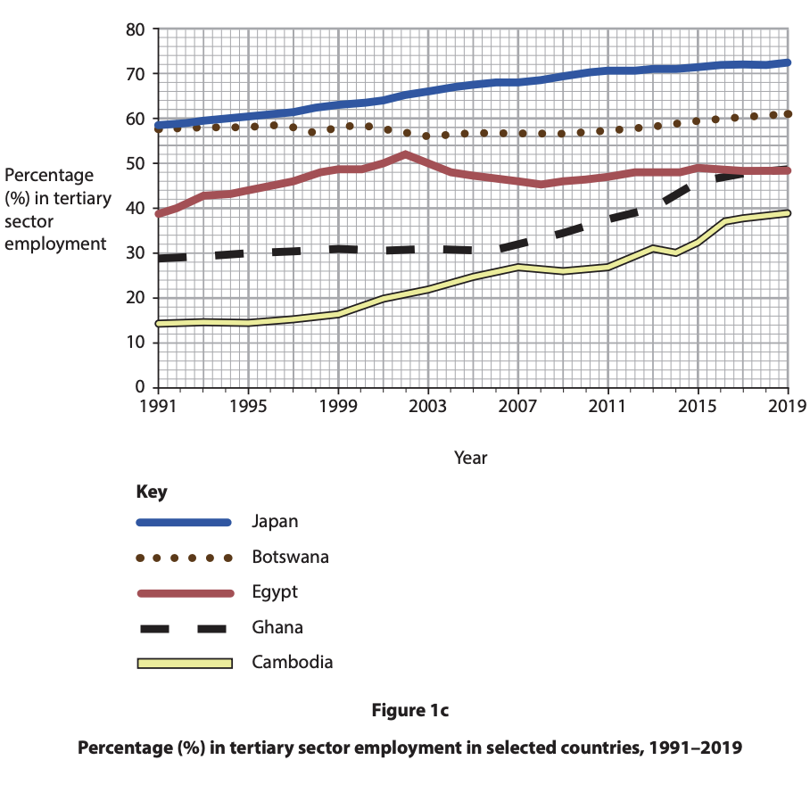

## Q31 — hard — 8 marks · exam-questions

### 1((g)) — 8 marks — command: analyse — structured — from paper June 2023 · 4GE1/02R
Study Figure 1c.

Analyse reasons for changes in the employment sectors shown. Refer to the resource in your answer.

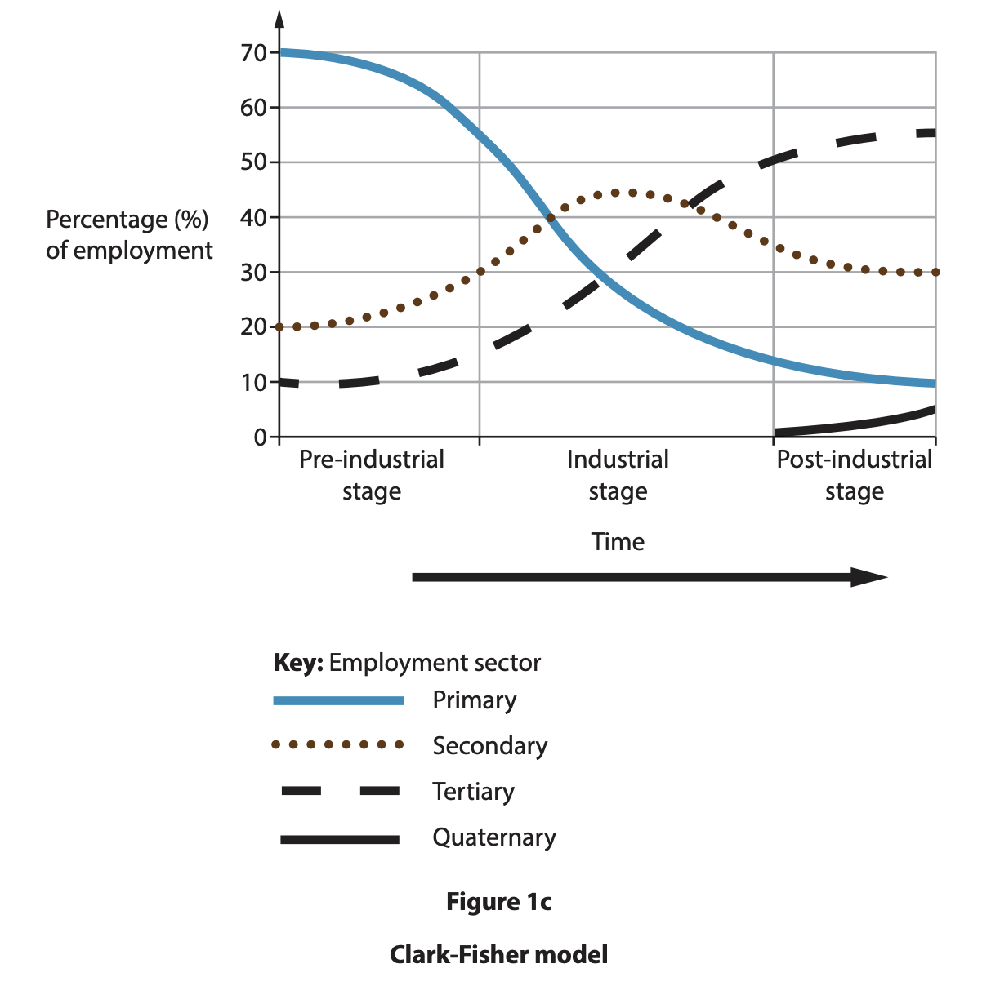
