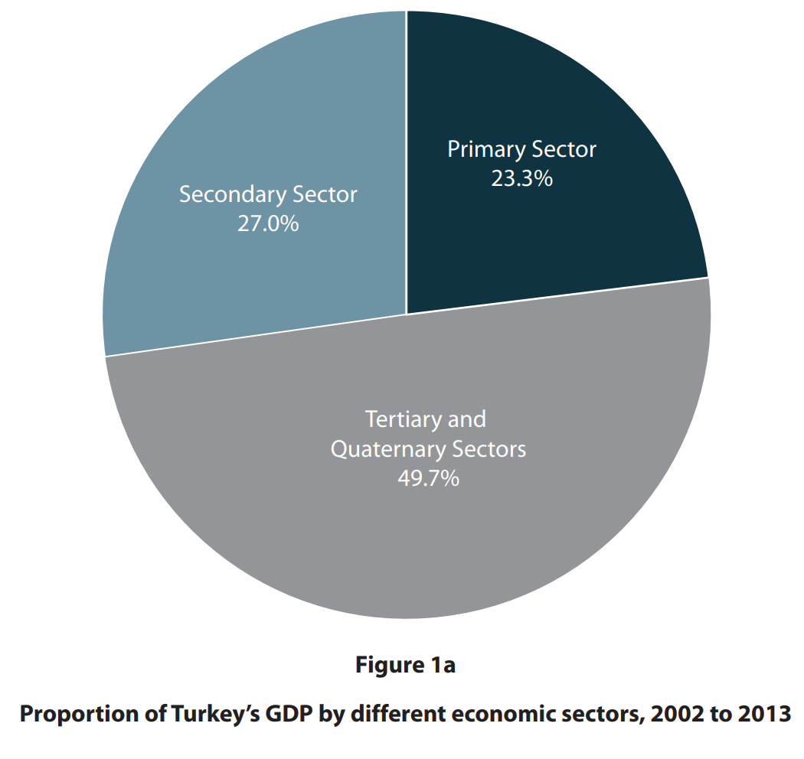
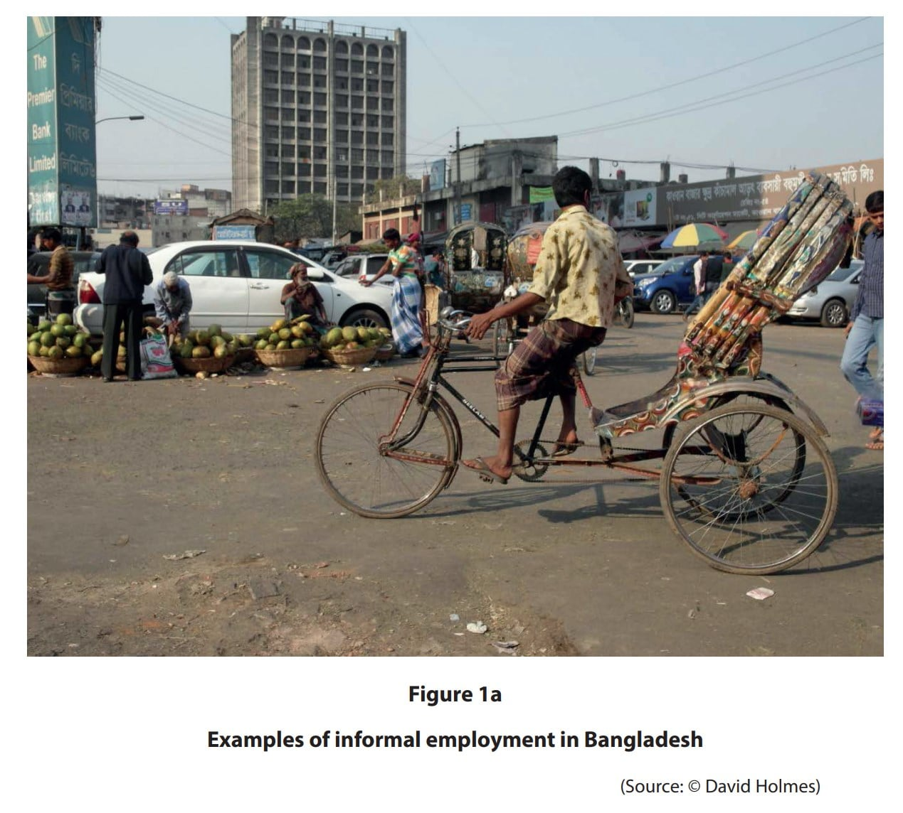
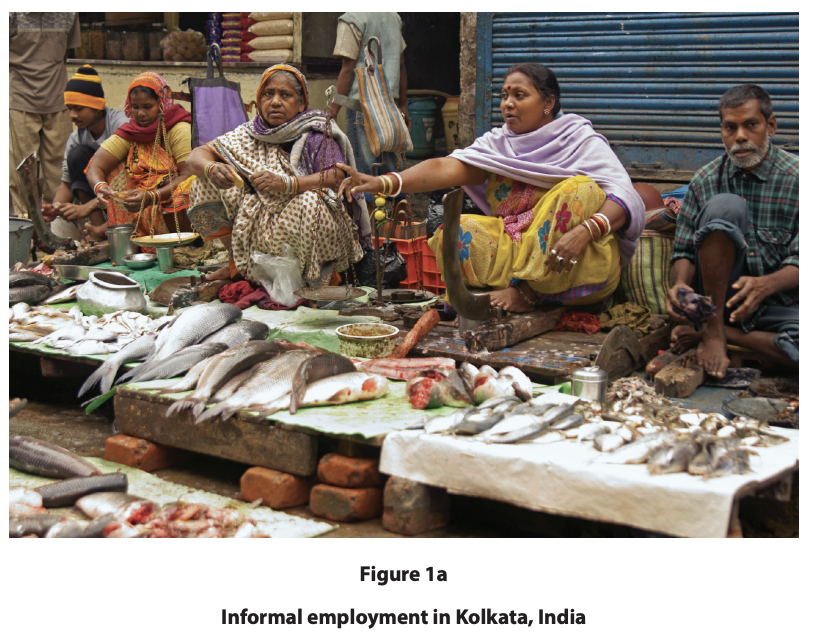
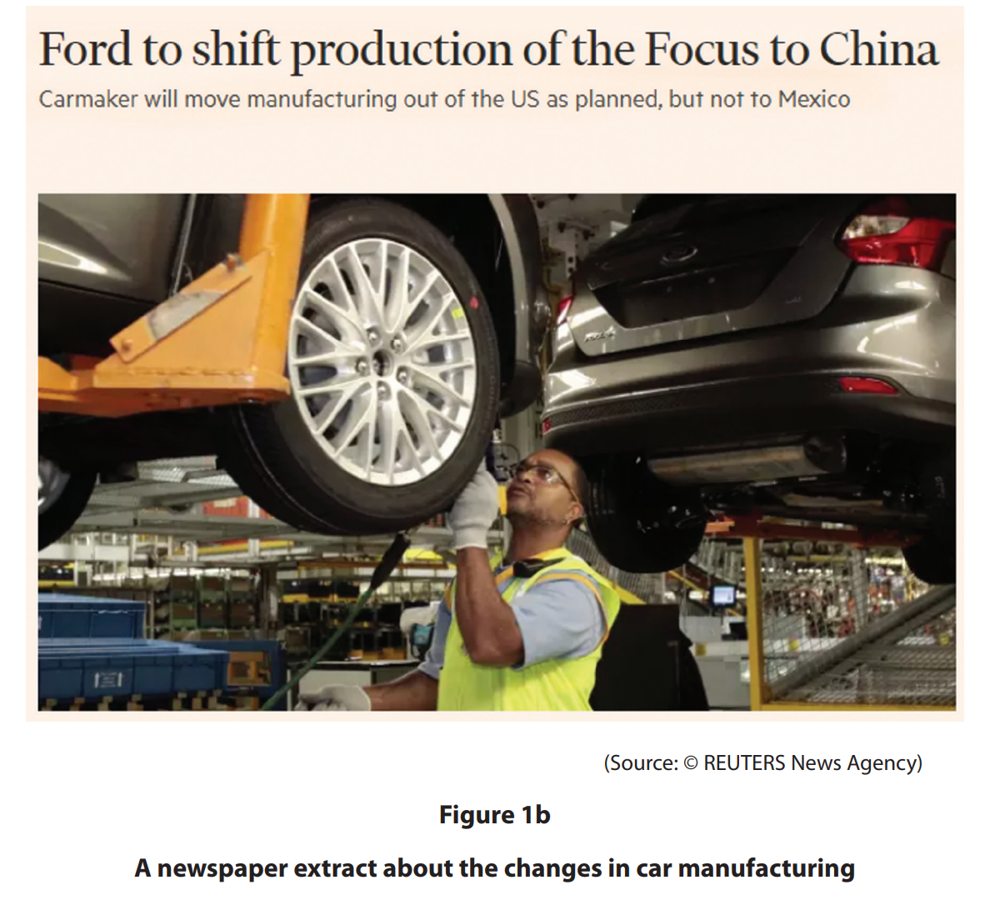
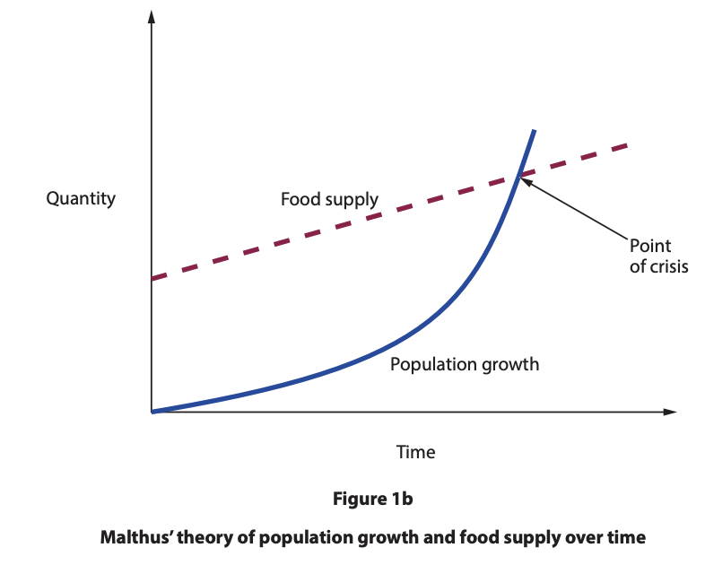
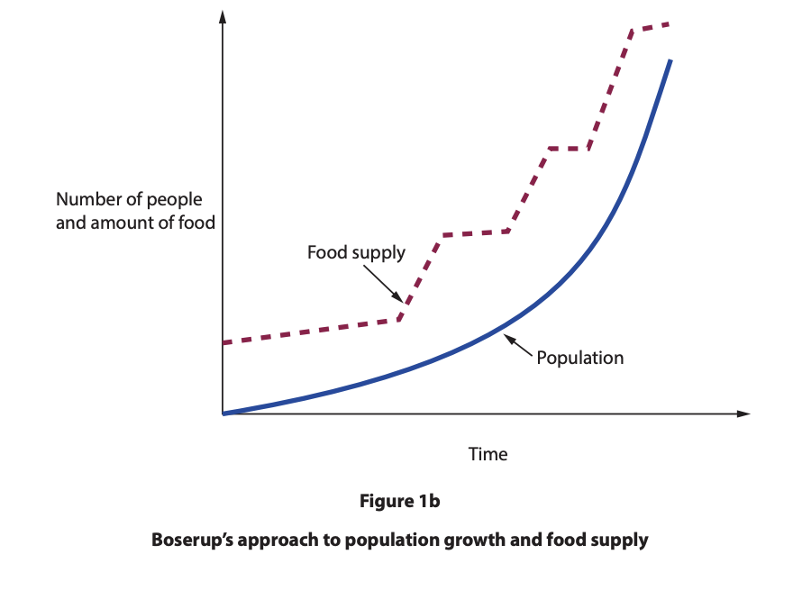
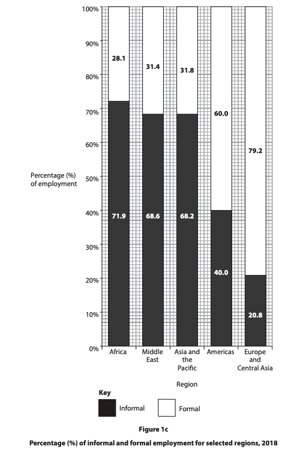

# Exam Questions — Impacts of Economic Sectors on Resources
**Economic Activity & Energy** · Edexcel IGCSE Geography (4GE1)
> Source: [https://www.savemyexams.com/igcse/geography/edexcel/19/topic-questions/4-economic-activity-and-energy/4-2-impacts-of-economic-sectors-on-resources/exam-questions/](https://www.savemyexams.com/igcse/geography/edexcel/19/topic-questions/4-economic-activity-and-energy/4-2-impacts-of-economic-sectors-on-resources/exam-questions/) · 17 questions · total 50 marks

## Q1 — easy — 2 marks · exam-questions

### 1((d)) — 2 marks — command: suggest — structured — from paper June 2019 · 4GE1/02R
Study Figure 1a below.

Suggest **one** reason that has influenced the proportions of GDP shown in Turkey.

## Q2 — easy — 2 marks · exam-questions

### 1((d)) — 2 marks — command: suggest — structured — from paper June 2019 · 4GE1/02
Study Figure 1a below.

Suggest **one** piece of evidence that shows there is informal employment in this photograph.

## Q3 — easy — 1 marks · exam-questions

### 1() — 1 mark — multiple_choice — from paper June 2024 · 4GE1/02
Identify **one** cause of employment in the informal sector.
- **A.** access to pensions
- **B.** lack of qualifications
- **C.** population decline
- **D.** reliable income

## Q4 — easy — 1 marks · exam-questions

### 1() — 1 mark — command: state — structured — from paper June 2024 · 4GE1/02
State **one** job that can be found in the informal sector.

## Q5 — easy — 1 marks · exam-questions

### 1() — 1 mark — multiple_choice — from paper June 2024 · 4GE1/02R
Identify **one** cause of informal employment.
- **A.** lack of airport facilities
- **B.** lack of air pollution
- **C.** lack of brownfield sites
- **D.** lack of education

## Q6 — easy — 1 marks · exam-questions

### 1() — 1 mark — command: state — structured — from paper June 2024 · 4GE1/02R
State **one** advantage of informal employment.

## Q7 — easy — 2 marks · exam-questions

### 1() — 2 marks — command: suggest — structured — from paper June 2022 · 4GE1/02
Study Figure 1a.

Suggest **one** reason why the activity shown might be considered informal employment.

## Q8 — easy — 1 marks · exam-questions

### 1() — 1 mark — multiple_choice
Which of the following best describes informal employment?
- **A.** Work that is registered with the government and pays regular taxes
- **B.** Work that is carried out in large factories owned by transnational corporations
- **C.** Work that is unregistered, unregulated and not officially recorded
- **D.** Work that is carried out by skilled professionals in the quaternary sector

## Q9 — easy — 2 marks · exam-questions

### 1() — 2 marks — command: state — structured
State **two **characteristics of informal employment in a named megacity.

## Q10 — easy — 3 marks · exam-questions

### 1() — 3 marks — command: explain — structured
Explain the difference between the **Malthusian** and **Boserupian **views on population and resources.

## Q11 — medium — 4 marks · exam-questions

### 1((g)) — 4 marks — command: suggest — structured — from paper June 2019 · 4GE1/02R
Study Figure 1b below.

Suggest **one** reason for the shift in manufacturing production shown Figure 1b.

## Q12 — medium — 4 marks · exam-questions

### 1((e)) — 4 marks — command: explain — structured — from paper June 2024 · 4GE1/02R
For a named developed country, explain **one** positive and **one** negative impact of an economic sector shift.

## Q13 — medium — 4 marks · exam-questions

### 1((e)) — 4 marks — command: explain — structured — from paper June 2024 · 4GE1/02
For a named developing or emerging country, explain **one** positive and **one** negative impact of an economic sector shift.

Named developing or emerging country.....

## Q14 — medium — 3 marks · exam-questions

### 1((e)) — 3 marks — command: explain — structured — from paper June 2022 · 4GE1/01
Study Figure 1b

Explain the relationship between population growth and food supply.

## Q15 — medium — 3 marks · exam-questions

### 1((e)) — 3 marks — command: explain — structured — from paper June 2022 · 4GE1/02R
Study Figure 1b.

Explain the relationship between population growth and food supply.

## Q16 — hard — 8 marks · exam-questions

### 1((h)) — 8 marks — command: analyse — structured — from paper June 2023 · 4GE1/02
Study Figure 1c.

Analyse the reasons for the patterns of informal employment.

Refer to the resource in your answer.

## Q17 — hard — 8 marks · exam-questions

### 1() — 8 marks — command: analyse — structured
Analyse the extent to which Boserup's theory provides a more convincing explanation of the relationship between population growth and resources than Malthus's theory.
