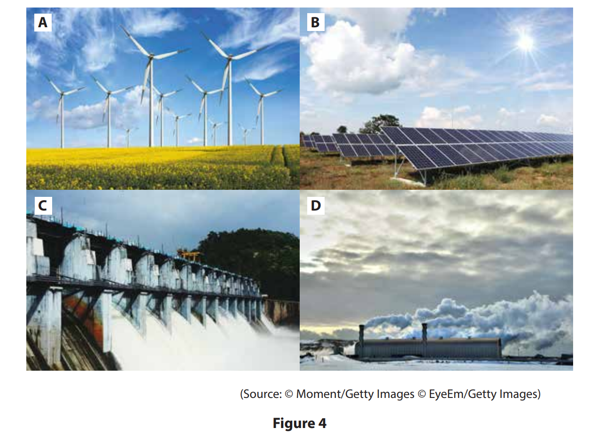
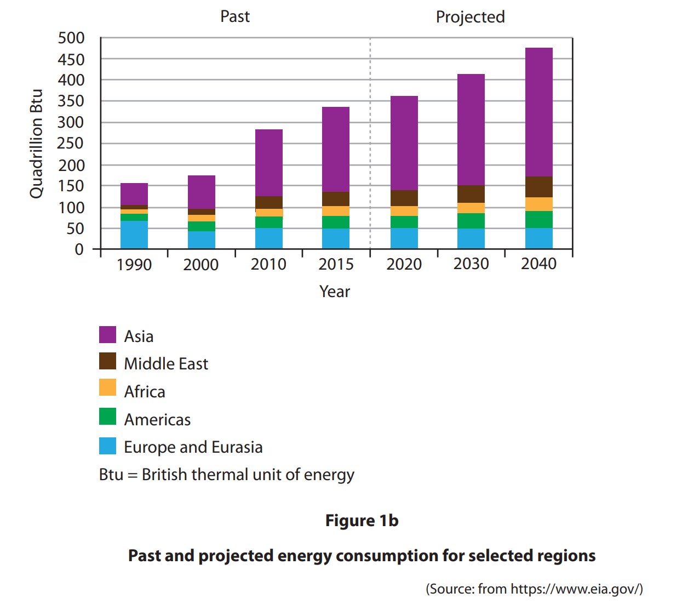
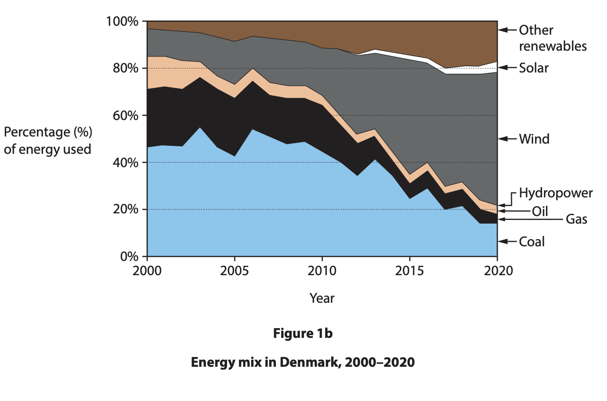
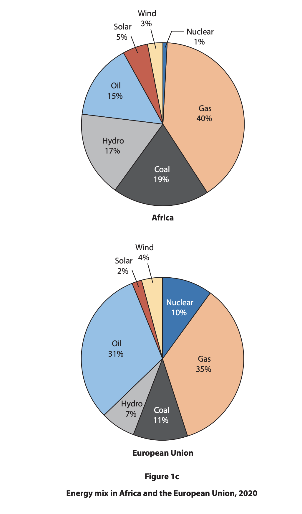
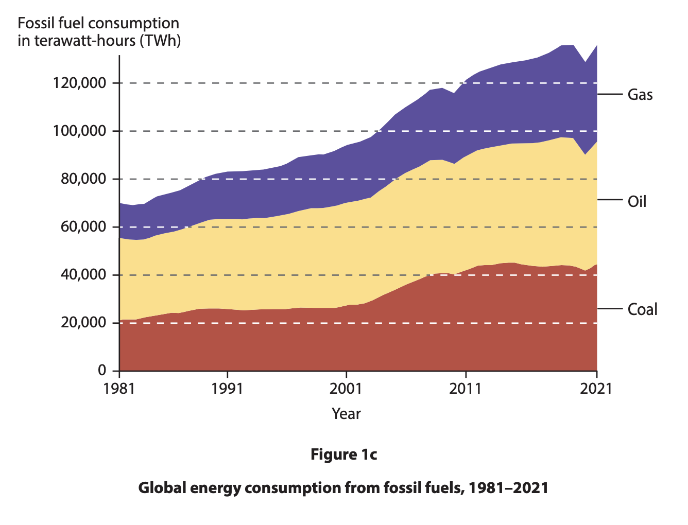

# Exam Questions — Energy - Production, Security & Managment
**Economic Activity & Energy** · Edexcel IGCSE Geography (4GE1)
> Source: [https://www.savemyexams.com/igcse/geography/edexcel/19/topic-questions/4-economic-activity-and-energy/4-3-energy---production-security-and-management/exam-questions/](https://www.savemyexams.com/igcse/geography/edexcel/19/topic-questions/4-economic-activity-and-energy/4-3-energy---production-security-and-management/exam-questions/) · 27 questions · total 87 marks

## Q1 — easy — 4 marks · exam-questions

### 4() — 1 mark — multiple_choice — from paper June 2018 · 4GE1/02
Study Figure 4 which shows four sources of clean renewable energy.

Clean renewable energy is
- **A.** energy from polluting and inexhaustible sources
- **B.** energy from non-polluting and inexhaustible sources
- **C.** energy from non-polluting and exhaustible sources
- **D.** energy from polluting and exhaustible sources

### 4() — 1 mark — command: which — structured — from paper June 2018 · 4GE1/02
(i) Which **one** of the four sources shown in Figure 4 is used to generate energy both onshore and offshore

### 4() — 2 marks — command: suggest — structured — from paper June 2018 · 4GE1/02
For **one** of the other three sources, suggest why it cannot be used to generate energy everywhere

## Q2 — easy — 1 marks · exam-questions

### 1((e)) — 1 mark — command: state — structured — from paper June 2019 · 4GE1/02
State **one** example of a renewable energy resource.

## Q3 — easy — 1 marks · exam-questions

### 1((e)) — 1 mark — command: state — structured — from paper June 2019 · 4GE1/02R
State **one** example of a non-renewable energy resource.

## Q4 — easy — 2 marks · exam-questions

### 4() — 2 marks — command: what — structured — from paper June 2017 · 4GE0/02
What is meant by the term **energy efficiency**?

## Q5 — easy — 1 marks · exam-questions

### 1() — 1 mark — multiple_choice — from paper June 2023 · 4GE1/02
Identify **one **advantage of using solar energy.
- **A.** Many turbines are needed
- **B.** Could also protect coastlines from erosion.
- **C.** Can be used in most areas of the world.
- **D.** The waste can be recycled.

## Q6 — easy — 1 marks · exam-questions

### 1() — 1 mark — command: define — structured — from paper June 2023 · 4GE1/02
Define the term **geothermal energy**.

## Q7 — easy — 1 marks · exam-questions

### 1((b)) — 1 mark — multiple_choice — from paper June 2023 · 4GE1/02
Identify the correct definition of the term **energy gap**.
- **A.** The difference between renewable and non-renewable energy use.
- **B.** The difference between a country’s energy demand and its ability to produce it.
- **C.** The difference between production of energy ten years ago and today
- **D.** The difference between energy imports and population growth.

## Q8 — easy — 1 marks · exam-questions

### 1((d)) — 1 mark — command: define — structured — from paper June 2023 · 4GE1/02R
Define the term **energy gap**.

## Q9 — easy — 2 marks · exam-questions

### 1() — 1 mark — multiple_choice — from paper June 2022 · 4GE1/02
Identify **one** advantage of using geothermal energy as a source of energy.
- **A.** It uses the power of the sun.
- **B.** It uses the power of the wind.
- **C.** It is a type of non-renewable energy.
- **D.** It is a type of renewable energy.

### 1() — 1 mark — command: define — structured — from paper June 2022 · 4GE1/02
Define the term renewable energy.

## Q10 — easy — 1 marks · exam-questions

### 1((b)) — 1 mark — multiple_choice — from paper June 2022 · 4GE1/02
Identify **one** way to make transport more sustainable.
- **A.** increasing the use of powerful petrol engines
- **B.** increasing air travel routes.
- **C.** increasing the use of electric battery technology
- **D.** increasing the size of motorways.

## Q11 — easy — 2 marks · exam-questions

### 1() — 1 mark — multiple_choice — from paper June 2022 · 4GE1/02R
Identify **one **disadvantage of using natural gas as a source of energy.
- **A.** There is an infinite supply.
- **B.** It is easy to export.
- **C.** It is a renewable energy source.
- **D.** Burning it releases CO2.

### 1() — 1 mark — command: define — structured — from paper June 2022 · 4GE1/02R
Define the term **non-renewable energy**.

## Q12 — easy — 1 marks · exam-questions

### 1() — 1 mark — command: state — structured
**State **what is meant by the term 'energy gap'?

## Q13 — easy — 3 marks · exam-questions

### 1() — 3 marks — command: suggest — structured
Study** Figure 1, **which shows the percentage of electricity generated from renewable sources in four countries in 2022.

| Country | Percentage of electricity from renewables (%) |
|---|---|
| Norway | 98 |
| Brazil | 83 |
| India | 22 |
| Nigeria | 19 |

Using **Figure 1, **suggest reasons why some countries have a higher percentage of renewable energy in their electricity mix than others.

## Q14 — medium — 4 marks · exam-questions

### 4() — 4 marks — command: explain — structured — from paper June 2017 · 4GE1/01
Explain **two** reasons why energy efficiency is needed.

## Q15 — medium — 7 marks · exam-questions

### 1((f)) — 4 marks — command: explain — structured — from paper June 2019 · 4GE1/02
Explain **two** reasons why the production of energy varies between countries.

### 1((g)) — 3 marks — command: suggest — structured — from paper June 2019 · 4GE1/02
Study Figure 1b below.

Suggest **one** reason for the projected increase in energy demand in Asia.

## Q16 — medium — 4 marks · exam-questions

### 1((f)) — 4 marks — command: explain — structured — from paper June 2019 · 4GE1/02R
Explain **two** reasons why energy demand varies globally.

## Q17 — medium — 4 marks · exam-questions

### 1((h)) — 4 marks — command: explain — structured — from paper June 2019 · 4GE1/02
For a named developing** or** emerging** **country, explain **two** ways the increasing demand for energy has created problems.

## Q18 — medium — 4 marks · exam-questions

### 1((h)) — 4 marks — command: explain — structured — from paper June 2019 · 4GE1/02R
For a named **developing **or **emerging **country, explain **two** ways energy resources have been managed in a sustainable way.

## Q19 — medium — 4 marks · exam-questions

### 1((g)) — 4 marks — command: explain — structured — from paper June 2024 · 4GE1/02
Explain **one** advantage and **one** disadvantage of using hydroelectric power (HEP) to generate electricity.

## Q20 — medium — 4 marks · exam-questions

### 1() — 4 marks — command: explain — structured
Explain **one** advantage and **one** disadvantage of using solar panels to generate electricity.

## Q21 — medium — 4 marks · exam-questions

### 1((f)) — 4 marks — command: explain — structured — from paper June 2023 · 4GE1/02
Explain **one** advantage and **one** disadvantage of using non-renewable energy sources to generate electricity.

## Q22 — medium — 4 marks · exam-questions

### 1((g)) — 4 marks — command: explain — structured — from paper June 2023 · 4GE1/02
For a named developed country, explain **two** ways it has tried to increase energy security.

## Q23 — medium — 3 marks · exam-questions

### 1((f)) — 3 marks — command: suggest — structured — from paper June 2023 · 4GE1/02R
Study Figure 1b.

Suggest one possible reason for a change in the energy mix shown

## Q24 — medium — 4 marks · exam-questions

### 1((g)) — 4 marks — command: explain — structured — from paper June 2023 · 4GE1/02R
Explain **one** advantage and **one** disadvantage of using renewable energy sources to generate electricity.

## Q25 — medium — 4 marks · exam-questions

### 1((d)) — 4 marks — command: explain — structured — from paper June 2022 · 4GE1/02
Explain **two** factors that affect global energy demand.

## Q26 — hard — 8 marks · exam-questions

### 1((h)) — 8 marks — command: analyse — structured — from paper June 2024 · 4GE1/02
Study Figure 1c.

Analyse the reasons for differences in the energy mix of these two regions.

You must refer to the resource in your answer.

## Q27 — hard — 8 marks · exam-questions

### 1() — 8 marks — command: analyse — structured
Study Figure 1c.

Analyse the possible reasons for changes in global energy consumption.

You must refer to the resource in your answer

