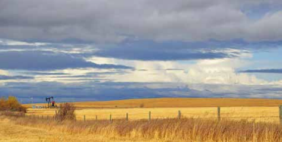
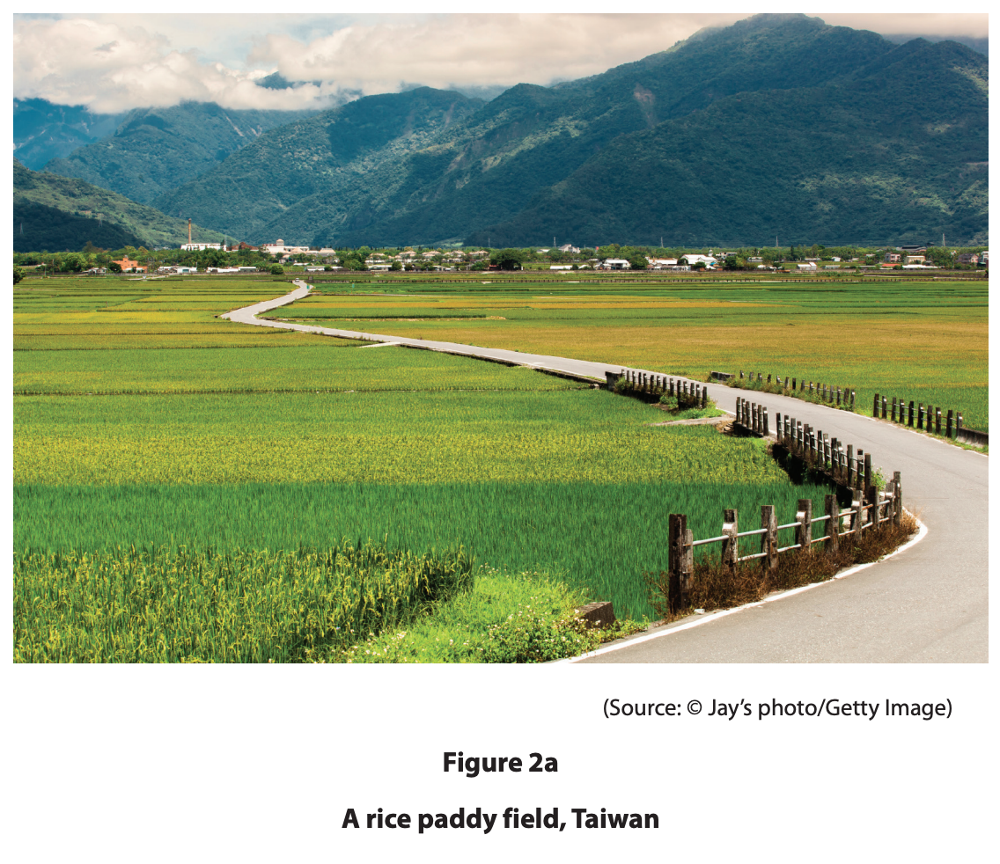
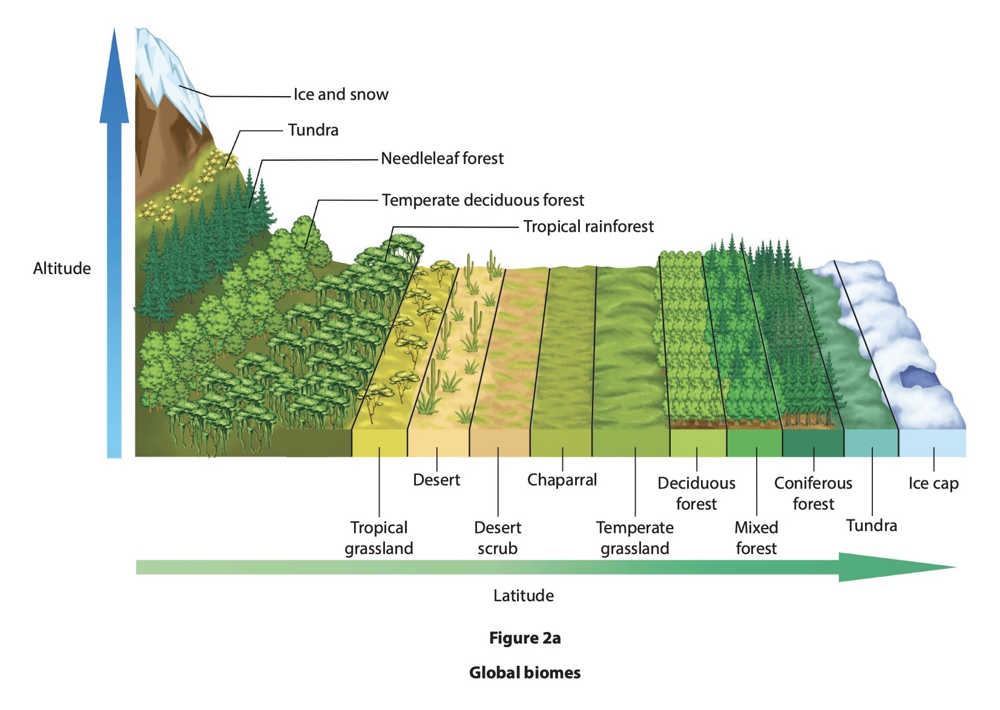
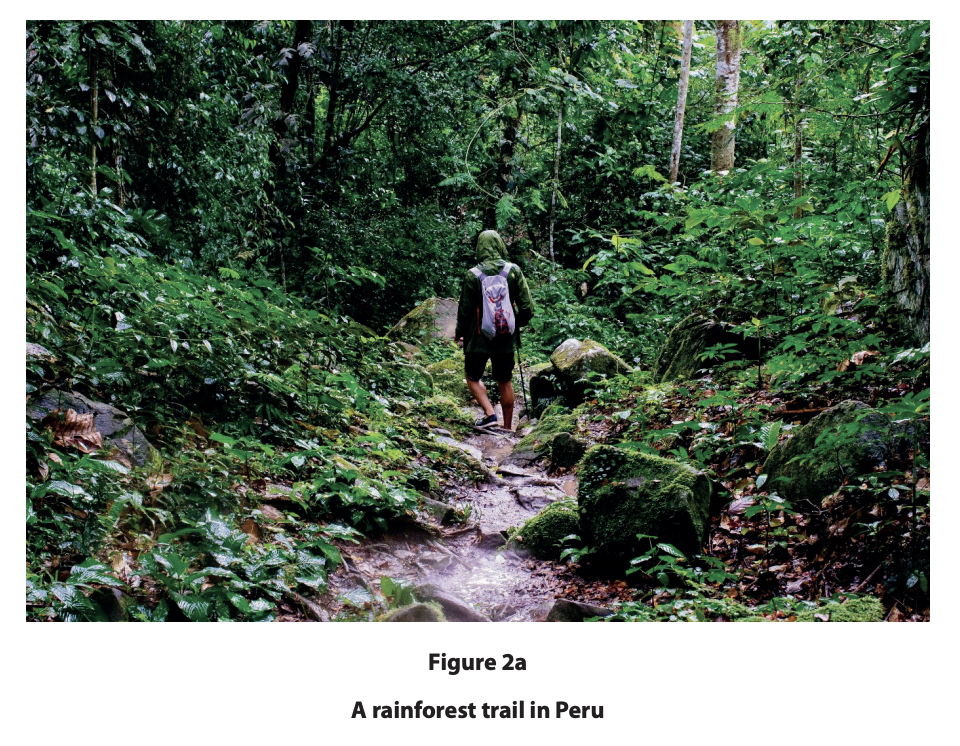
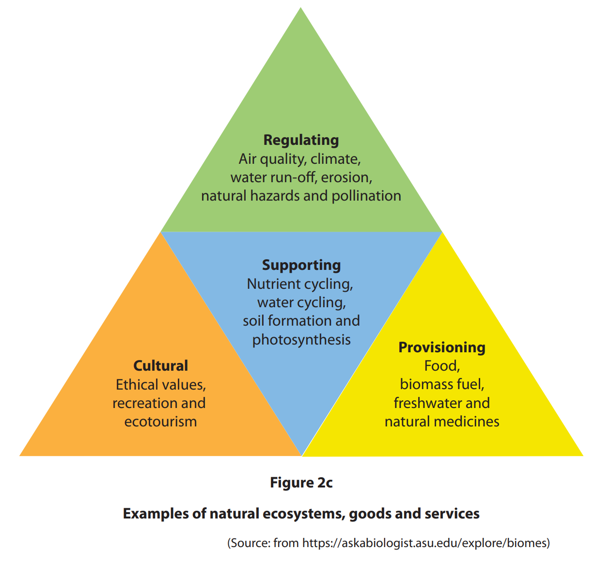
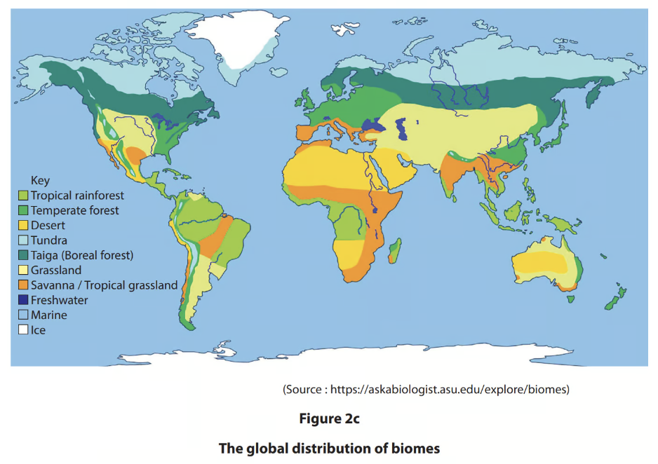
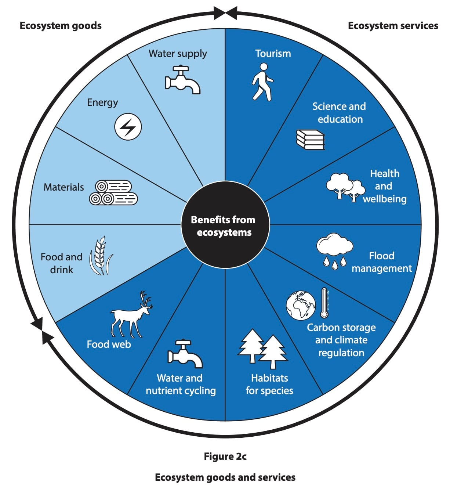

# Exam Questions — The World's Biomes
**Rural Environments** · Edexcel IGCSE Geography (4GE1)
> Source: [https://www.savemyexams.com/igcse/geography/edexcel/19/topic-questions/5-rural-environments/5-1-the-worlds-biomes/exam-questions/](https://www.savemyexams.com/igcse/geography/edexcel/19/topic-questions/5-rural-environments/5-1-the-worlds-biomes/exam-questions/) · 18 questions · total 49 marks

## Q1 — easy — 3 marks · exam-questions

### 5() — 1 mark — multiple_choice — from paper June 2018 · 4GE1/01
Study Figure 5 below which shows a farmed area in one of the world's biomes

Identify the biome

- **A.** hot desert
- **B.** temperate grassland
- **C.** tropical rainforest
- **D.** tundra

### 5() — 2 marks — command: define — structured — from paper June 2018 · 4GE1/01
Define the term **biodiversity**.

## Q2 — easy — 2 marks · exam-questions

### 1() — 1 mark — command: identify — structured — from paper June 2018 · 4GE1/01
Study Figure 5 which shows a farmed area in one of the world's biome

Identify the type of farming

### 2((c)) — 1 mark — multiple_choice — from paper June 2019 · 4GE1/02
Identify **one** example of a global biome.
- **A.** pond
- **B.** moorland
- **C.** salt marsh
- **D.** tundra

## Q3 — easy — 3 marks · exam-questions

### 2((c)) — 1 mark — multiple_choice — from paper June 2019 · 4GE1/02R
Identify **one** of the goods provided by natural ecosystems.
- **A.** soil formation
- **B.** waste decomposition
- **C.** timber
- **D.** gas exchange

### 2((d)) — 2 marks — command: explain — structured — from paper June 2019 · 4GE1/02R
Study Figure 2a below.

Explain **one** physical factor that could have influenced the choice of crop shown in the farming system on Figure 2a.

## Q4 — easy — 1 marks · exam-questions

### 2() — 1 mark — multiple_choice — from paper June 2024 · 4GE1/02
Identify the best definition of a biome.
- **A.** a community of animals which are connected through a food web
- **B.** a community of animals and plants occupying a major habitat
- **C.** a habitat where weather conditions change all year around
- **D.** a habitat that is affected by human activity

## Q5 — easy — 1 marks · exam-questions

### 2() — 1 mark — command: state — structured — from paper June 2024 · 4GE1/02
State** one** characteristic of a desert biome.

## Q6 — easy — 2 marks · exam-questions

### 2((b)) — 2 marks — command: explain — structured — from paper June 2024 · 4GE1/02
Study Figure 2a

Explain **one** factor that can affect the distribution of biomes.

## Q7 — easy — 1 marks · exam-questions

### 2() — 1 mark — multiple_choice — from paper June 2024 · 4GE1/02R
Identify the best definition of a natural ecosystem.
- **A.** animals connected in a food chain
- **B.** human interaction with nature
- **C.** interaction of living organisms with their environment
- **D.** products from living organisms to be sold for profit

## Q8 — easy — 1 marks · exam-questions

### 2() — 1 mark — command: state — structured — from paper June 2024 · 4GE1/02R
State **one** service provided by natural ecosystems.

## Q9 — easy — 1 marks · exam-questions

### 1() — 1 mark — command: state — structured
State **one** good provided by natural ecosystems.

## Q10 — easy — 1 marks · exam-questions

### 2() — 1 mark — multiple_choice — from paper June 2022 · 4GE1/02R
Identify one characteristic of the savanna biome
- **A.** daily rainfall
- **B.** grassland
- **C.** dense forest
- **D.** permafrost

## Q11 — easy — 1 marks · exam-questions

### 1() — 1 mark — command: define — structured — from paper June 2022 · 4GE1/02R
Define the term **natural ecosystem**.

## Q12 — easy — 2 marks · exam-questions

### 2((c)) — 2 marks — command: suggest — structured — from paper June 2022 · 4GE1/02R
Study Figure 2a.

Suggest how this natural ecosystem might provide services

## Q13 — easy — 1 marks · exam-questions

### 2() — 1 mark — multiple_choice — from paper June 2022 · 4GE1/02
Identify one characteristic associated with a tropical forest
- **A.** arid conditions
- **B.** low temperature
- **C.** high humidity
- **D.** strong winds

## Q14 — easy — 1 marks · exam-questions

### 2() — 1 mark — command: define — structured — from paper June 2022 · 4GE1/02
Define the term biome.

## Q15 — medium — 4 marks · exam-questions

### 1() — 4 marks — command: explain — structured
Explain **two** reasons why biodiversity varies between ecosystems.

## Q16 — hard — 8 marks · exam-questions

### 2((i)) — 8 marks — command: analyse — structured — from paper June 2019 · 4GE1/02
Study Figure 2c below.

Analyse how exploiting natural ecosystems can affect their goods and services.

## Q17 — hard — 8 marks · exam-questions

### 2((i)) — 8 marks — command: analyse — structured — from paper June 2019 · 4GE1/02
Study Figure 2c which shows the world's biomes

Analyse the reasons for the distribution of the world's biomes

## Q18 — hard — 8 marks · exam-questions

### 2((h)) — 8 marks — command: analyse — structured — from paper June 2024 · 4GE1/02
Study Figure 2c.

Analyse the importance of natural ecosystems for the provision of goods.

You must refer to the resource in your answer.

