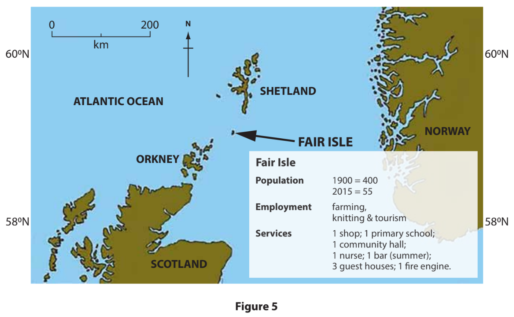
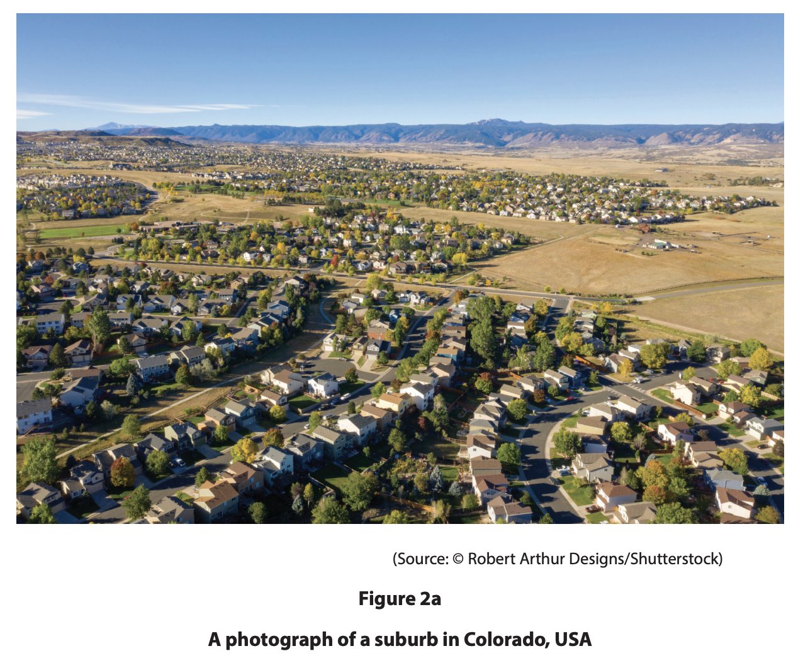
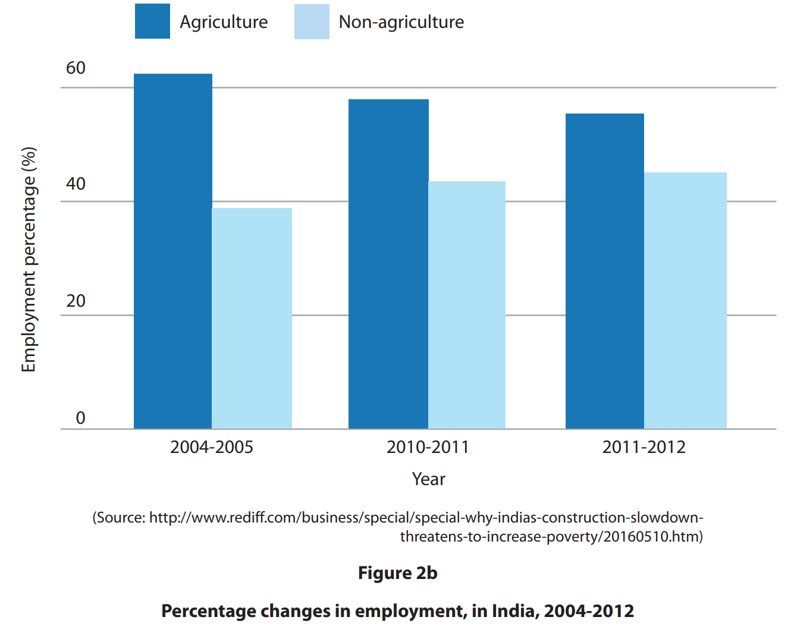
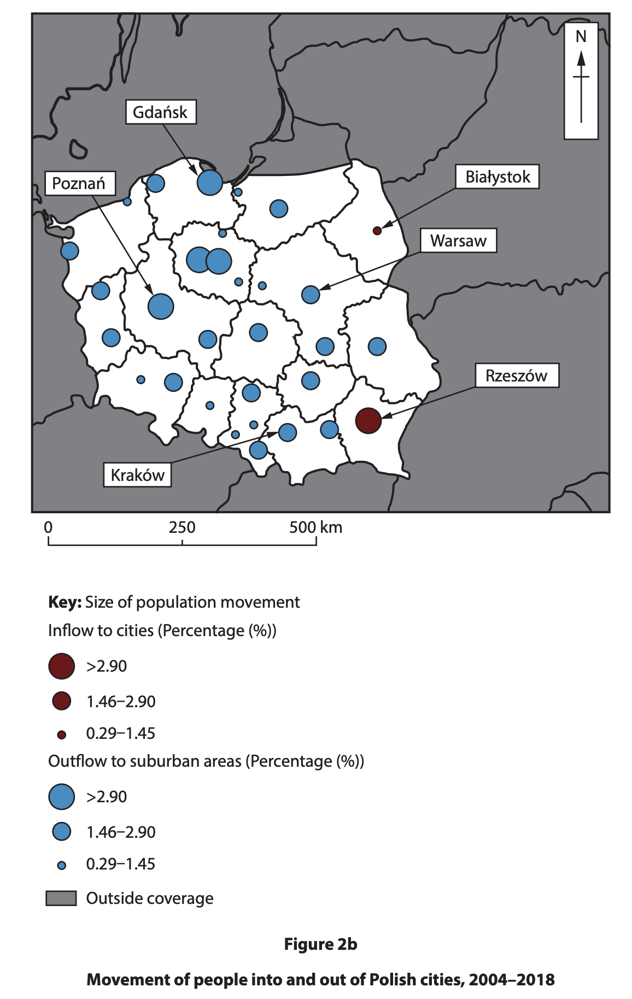
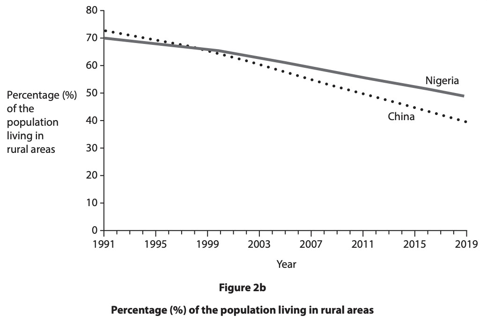
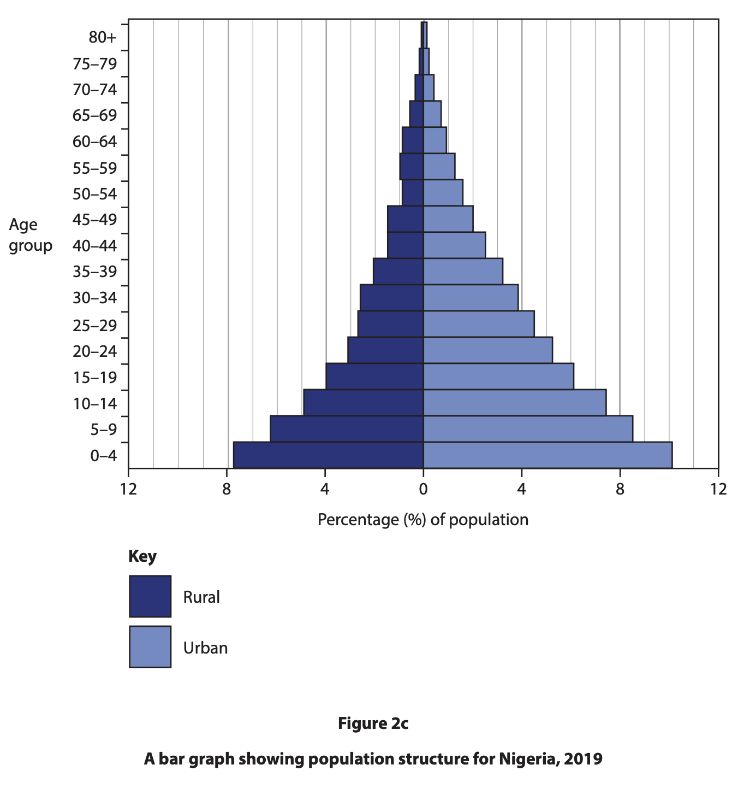
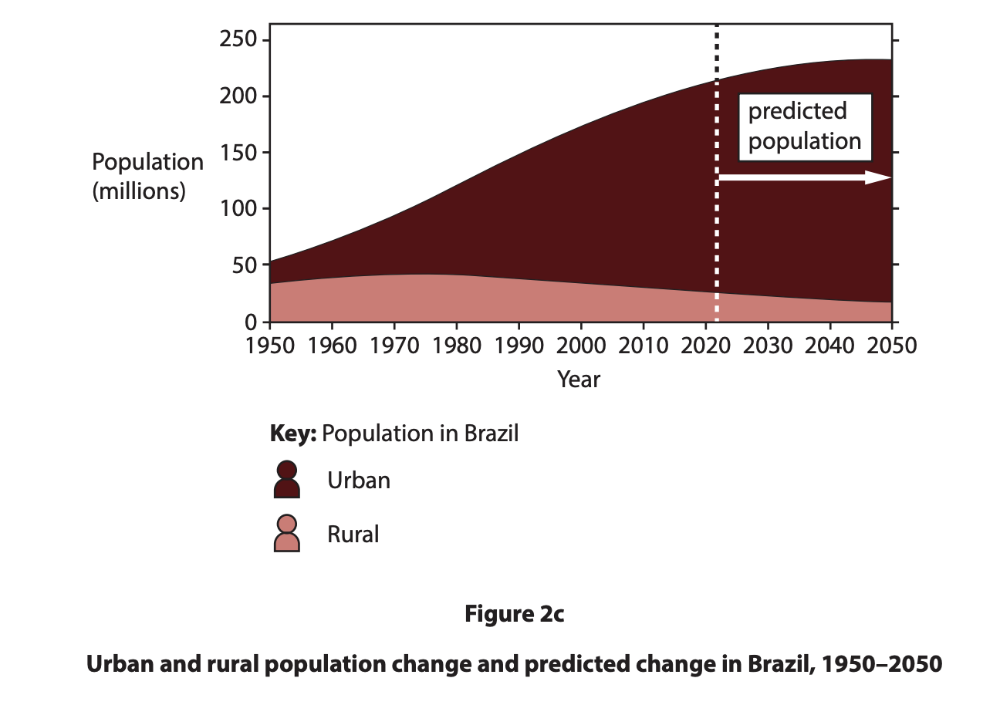
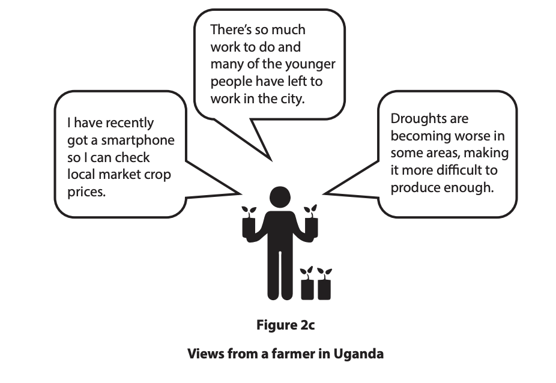
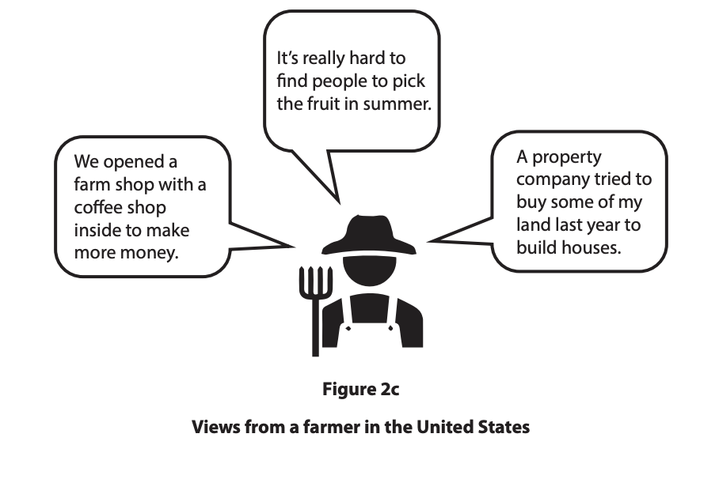
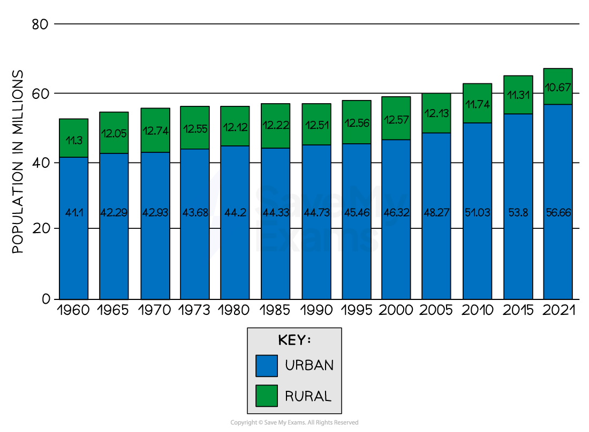

# Exam Questions — Characteristics of Rural Environments
**Rural Environments** · Edexcel IGCSE Geography (4GE1)
> Source: [https://www.savemyexams.com/igcse/geography/edexcel/19/topic-questions/5-rural-environments/5-2-characteristics-of-rural-environments/exam-questions/](https://www.savemyexams.com/igcse/geography/edexcel/19/topic-questions/5-rural-environments/5-2-characteristics-of-rural-environments/exam-questions/) · 28 questions · total 94 marks

## Q1 — easy — 4 marks · exam-questions

### 5() — 1 mark — multiple_choice — from paper June 2017 · 4GE1/01
Study Figure 5 which shows the location of Fair Isle and gives some information about the island.

What is the distance between Fair Isle and the southern tip of Shetland?
- **A.** 20 km
- **B.** 40 km
- **C.** 60 km
- **D.** 80 km

### 5() — 1 mark — command: state — structured — from paper June 2017 · 4GE1/01
State the evidence for the depopulation of Fair Isle since 1900.

### 3() — 2 marks — command: suggest — structured
Suggest two factors that might have encouraged the depopulation of this island.

## Q2 — easy — 1 marks · exam-questions

### 2((b)) — 1 mark — command: define — structured — from paper June 2019 · 4GE1/02
Define the term **negative multiplier effect**.

## Q3 — easy — 1 marks · exam-questions

### 2((a)) — 1 mark — multiple_choice — from paper June 2019 · 4GE1/02R
Identify the meaning of the term **suburbanisation**.
- **A.** the outward growth of urban development
- **B.** population movement from rural to urban areas
- **C.** increasing movement of people from urban to rural areas
- **D.** population movement from the suburbs to the countryside

## Q4 — easy — 1 marks · exam-questions

### 2((c)) — 1 mark — multiple_choice — from paper June 2024 · 4GE1/02
Identify the best definition of arable farming.
- **A.** farming that grows trees
- **B.** farming that produces crops
- **C.** farming that specialises in rearing fish
- **D.** farming that specialises in rearing livestock

## Q5 — easy — 1 marks · exam-questions

### 1() — 1 mark — multiple_choice
Identify the best definition of pastoral farming.
- **A.** farming that produces crops
- **B.** farming that specialises in rearing fish
- **C.** farming that grows fruit and vegetables
- **D.** farming that specialises in rearing livestock

## Q6 — easy — 1 marks · exam-questions

### 2((d)) — 1 mark — command: state — structured — from paper June 2024 · 4GE1/02
State **one** way commercial farming can affect rural environments

## Q7 — easy — 2 marks · exam-questions

### 2((c)) — 2 marks — command: suggest — structured — from paper June 2023 · 4GE1/02R
Study Figure 2a.

Suggest one reason suburbanisation has led to changes in this rural area.

## Q8 — easy — 1 marks · exam-questions

### 2((d)) — 1 mark — command: state — structured — from paper June 2022 · 4GE1/02R
State **one** type of land use found in a rural environment.

## Q9 — easy — 1 marks · exam-questions

### 1() — 1 mark — multiple_choice
Which of the following best describes a **rural environment**?
- **A.** A densely populated area with many high-rise buildings and factories
- **B.** An area dominated by open land, farming, and small settlements with low population density
- **C.** An area located on the edge of a major city with large shopping centres
- **D.** An area with a highly developed transport network and large industrial zones

## Q10 — easy — 1 marks · exam-questions

### 1() — 1 mark — multiple_choice
Which of the following is a cause of** rural depopulation**?
- **A.** The growth of tourism in rural areas
- **B.** Young people migrating to cities in search of better employment opportunities
- **C.** Government investment in rural infrastructure and services
- **D.** The arrival of commuters moving out of cities into rural settlements

## Q11 — easy — 1 marks · exam-questions

### 1() — 1 mark — command: state — structured
State what is meant by the term '**rural depopulation**'?

## Q12 — easy — 2 marks · exam-questions

### 1() — 2 marks — command: explain — structured
Explain **one** cause of rural depopulation in developing or emerging countries.

## Q13 — easy — 2 marks · exam-questions

### 1() — 2 marks — command: state — structured
State **two **changes that have occurred in rural areas of a named developing or emerging country.

## Q14 — easy — 3 marks · exam-questions

### 1() — 3 marks — command: suggest — structured
Study **Figure 1, **which shows the percentage of India's population living in rural areas between 1960 and 2020.

| Year | Percentage of population living in rural areas (%) |
|---|---|
| 1960 | 82 |
| 1980 | 77 |
| 2000 | 72 |
| 2020 | 65 |

Using **Figure 1, **suggest reasons why the percentage of India's population living in rural areas has decreased.

## Q15 — easy — 3 marks · exam-questions

### 1() — 3 marks — command: explain — structured
Explain how rural depopulation can affect the communities left behind.

## Q16 — medium — 4 marks · exam-questions

### 2((f)) — 4 marks — command: explain — structured — from paper June 2019 · 4GE1/02
Explain **two** factors that have led to changes in rural areas in a named developed country.

## Q17 — medium — 3 marks · exam-questions

### 2((g)) — 3 marks — command: suggest — structured — from paper June 2019 · 4GE1/02R
Study Figure 2b below.

Suggest **one** reason for one of the trends shown on Figure 2b.

## Q18 — medium — 4 marks · exam-questions

### 2((e)) — 4 marks — command: explain — structured — from paper June 2024 · 4GE1/02
Explain **two **reasons accessibility is important in rural environments.

## Q19 — medium — 4 marks · exam-questions

### 2((g)) — 4 marks — command: explain — structured — from paper June 2024 · 4GE1/02
For a named developed country, explain **two** ways tourist pressures can affect rural areas.

## Q20 — medium — 4 marks · exam-questions

### 1() — 4 marks — command: explain — structured
Explain **two** factors that have led to changes in rural areas in a named developing or emerging country.

## Q21 — medium — 4 marks · exam-questions

### 2((g)) — 4 marks — command: explain — structured — from paper June 2024 · 4GE1/02R
For a named developing or emerging country explain two impacts of rural-urban migration on rural environments.

## Q22 — medium — 3 marks · exam-questions

### 2((f)) — 3 marks — command: suggest — structured — from paper June 2023 · 4GE1/02R
Study Figure 2b.

Suggest one way the patterns shown in Figure 2b might change the characteristics of rural areas.

## Q23 — medium — 3 marks · exam-questions

### 2((f)) — 3 marks — command: suggest — structured — from paper June 2022 · 4GE1/02R
Study Figure 2b.

Suggest one reason for the trends shown.

## Q24 — hard — 8 marks · exam-questions

### 2((h)) — 8 marks — command: analyse — structured — from paper June 2023 · 4GE1/02
Study Figure 2c.

Analyse the factors that affect the structure of rural populations in developing countries.

Refer to the resource in your answer.

## Q25 — hard — 8 marks · exam-questions

### 2((h)) — 8 marks — command: analyse — structured — from paper June 2023 · 4GE1/02R
Study Figure 2c.

Analyse the factors that are leading to changes in rural areas in developing and emerging countries.

Refer to the resource in your answer

## Q26 — hard — 8 marks · exam-questions

### 2((h)) — 8 marks — command: analyse — structured — from paper June 2022 · 4GE1/02
Study Figure 2c.

Analyse the factors that can lead to rural changes in developing or emerging countries.

## Q27 — hard — 8 marks · exam-questions

### 2((h)) — 8 marks — command: analyse — structured — from paper June 2022 · 4GE1/02R
Study Figure 2c.

Analyse the factors that have caused rural change in developed countries.

## Q28 — hard — 8 marks · exam-questions

### 1() — 8 marks — command: analyse — structured
Study Figure 1.

*Figure 1 - UK Urban and rural population*

Analyse the factors that are leading to changes in rural areas in developed countries.

Refer to the resource in your answer.
