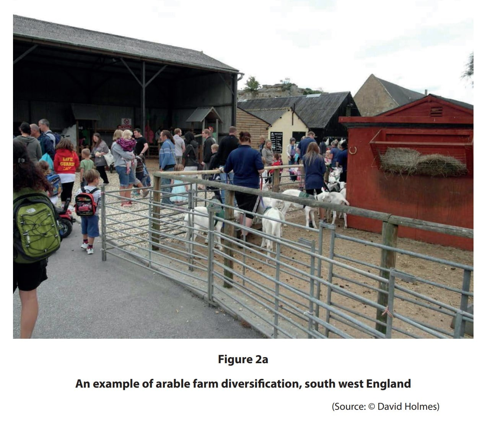
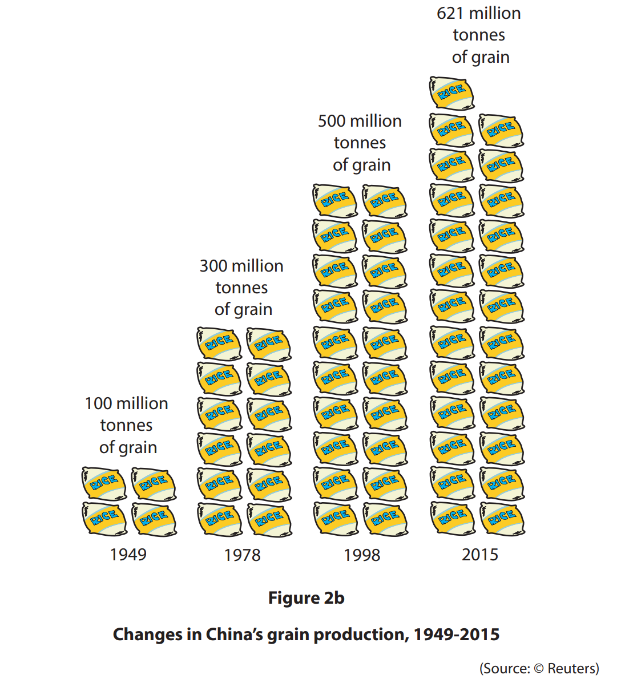
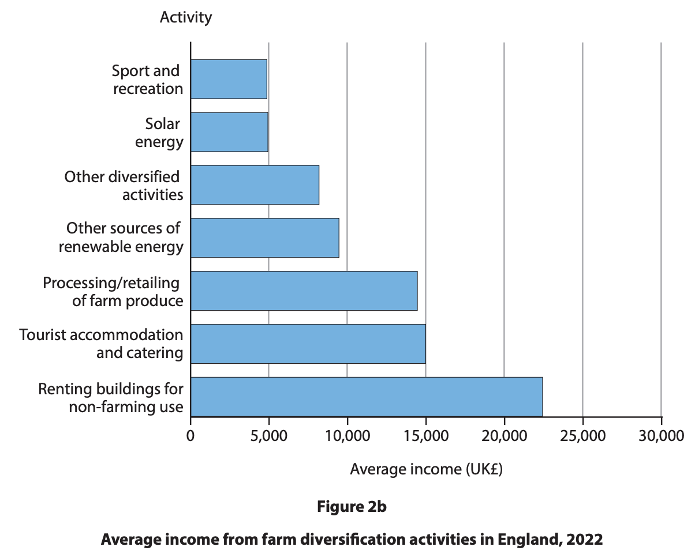
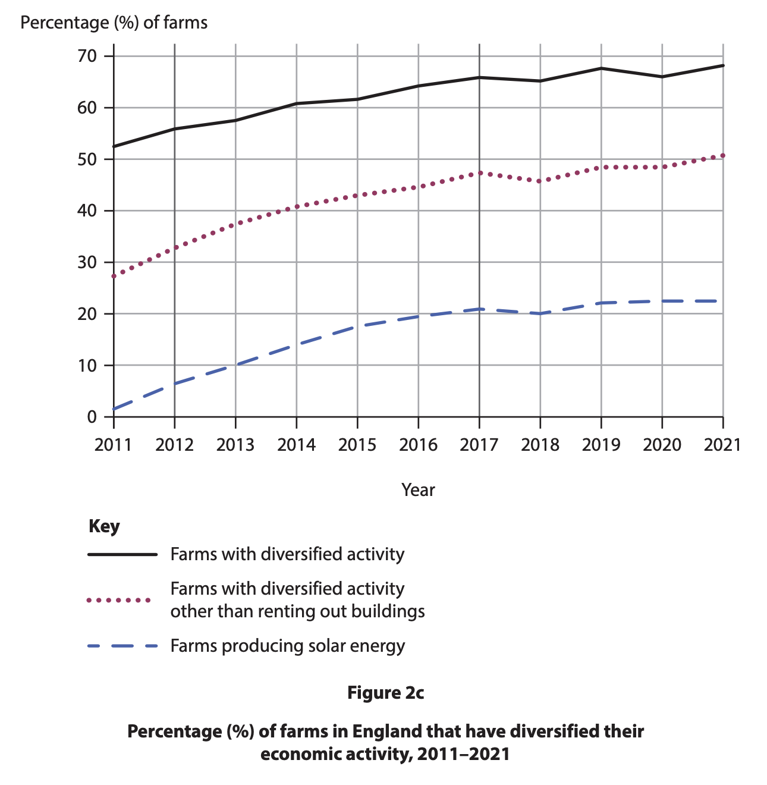

# Exam Questions — Management of Rural Environments
**Rural Environments** · Edexcel IGCSE Geography (4GE1)
> Source: [https://www.savemyexams.com/igcse/geography/edexcel/19/topic-questions/5-rural-environments/5-3-management-of-rural-environments/exam-questions/](https://www.savemyexams.com/igcse/geography/edexcel/19/topic-questions/5-rural-environments/5-3-management-of-rural-environments/exam-questions/) · 20 questions · total 72 marks

## Q1 — easy — 2 marks · exam-questions

### 2((b)) — 1 mark — command: define — structured — from paper June 2019 · 4GE1/02R
Define the term **GM crop**.

### 2((e)) — 1 mark — command: state — structured — from paper June 2019 · 4GE1/02R
State **one **way that farmers can modify natural ecosystems to improve farm system productivity.

## Q2 — easy — 1 marks · exam-questions

### 2((a)) — 1 mark — multiple_choice — from paper June 2019 · 4GE1/02
Identify the meaning of the term **NGO**.
- **A.** non-governmental organisation
- **B.** non-global organisation
- **C.** non-geographically organised
- **D.** non-global operation

## Q3 — easy — 3 marks · exam-questions

### 2((d)) — 2 marks — command: suggest — structured — from paper June 2019 · 4GE1/02
Study Figure 2a below.

Suggest **one** piece of evidence from the photograph that shows this farm has diversified.

### 2((e)) — 1 mark — command: state — structured — from paper June 2019 · 4GE1/02
State **one** other type of rural or farm diversification.

## Q4 — easy — 2 marks · exam-questions

### 1() — 2 marks — command: define — structured
Define the term **conservation**?

## Q5 — easy — 1 marks · exam-questions

### 2((d)) — 1 mark — command: state — structured — from paper June 2023 · 4GE1/02R
State **one** way farmers try to increase crop yields.

## Q6 — easy — 1 marks · exam-questions

### 2((b)) — 1 mark — multiple_choice — from paper June 2022 · 4GE1/02R
Identify the meaning of **genetically-modified (GM) crops.**
- **A.** Plants with root systems that have been changed to increase size.
- **B.** Plants with DNA that have been changed to increase yield.
- **C.** Animals with DNA that have been changed to increase size.
- **D.** Livestock that have greater resistance to disease.

## Q7 — medium — 4 marks · exam-questions

### 5() — 4 marks — command: outline — structured — from paper June 2017 · 4GE1/01
Outline **two** reasons for conservation in rural environments.

## Q8 — medium — 3 marks · exam-questions

### 2((g)) — 3 marks — command: suggest — structured — from paper June 2019 · 4GE1/02
Study Figure 2b.

Suggest **one** reason for the trend shown on Figure 2b.

## Q9 — medium — 4 marks · exam-questions

### 2((f)) — 4 marks — command: explain — structured — from paper June 2019 · 4GE1/02R
Explain **two** reasons why some farmers are moving into diversification of farming.

## Q10 — medium — 4 marks · exam-questions

### 2((h)) — 4 marks — command: explain — structured — from paper June 2019 · 4GE1/02R
For a named developing or emerging country, explain how **two** different groups have managed challenges within the rural environment.

Named developing or emerging country :

Group 1:

Group 2:

## Q11 — medium — 3 marks · exam-questions

### 2((f)) — 3 marks — command: suggest — structured — from paper June 2024 · 4GE1/02
Study Figure 2b.

Suggest **one** reason why diversification is important for farmers, using the information shown.

## Q12 — medium — 4 marks · exam-questions

### 2((g)) — 4 marks — command: explain — structured — from paper June 2023 · 4GE1/02
Explain **two** strategies that improve quality of life in rural environments.

## Q13 — medium — 4 marks · exam-questions

### 2((g)) — 4 marks — command: explain — structured — from paper June 2023 · 4GE1/02R
Explain **two** strategies being used to make rural living more sustainable in developing or emerging countries.

## Q14 — medium — 4 marks · exam-questions

### 2((e)) — 4 marks — command: explain — structured — from paper Jun 2023 · 4GE1/02
For a named developing or emerging country, explain **two** ways farm incomes are being diversified.

## Q15 — medium — 4 marks · exam-questions

### 2((e)) — 4 marks — command: explain — structured — from paper June 2022 · 4GE1/02R
Explain how NGOs have managed **two** challenges in rural environments in developing or emerging countries.

## Q16 — medium — 4 marks · exam-questions

### 1() — 4 marks — command: explain — structured
Explain how governments in developed countries have managed **two** challenges in rural environments.

## Q17 — medium — 4 marks · exam-questions

### 2((g)) — 4 marks — command: explain — structured — from paper June 2023 · 4GE1/02R
Explain **one** strategy used to improve health and **one** strategy used to improve housing in rural areas in developing or emerging countries.

## Q18 — medium — 4 marks · exam-questions

### 1() — 4 marks — command: explain — structured
For a named developing or emerging country you have studied, explain how changes in agriculture have affected rural communities.

## Q19 — hard — 8 marks · exam-questions

### 2((h)) — 8 marks — command: analyse — structured — from paper June 2024 · 4GE1/02R
Study Figure 2c.

Analyse possible reasons for the changes in farm diversification.

You must refer to the resource in your answer.

## Q20 — hard — 8 marks · exam-questions

### 1() — 8 marks — command: analyse — structured
Analyse the extent to which sustainable management can successfully protect rural environments in developing or emerging countries.
