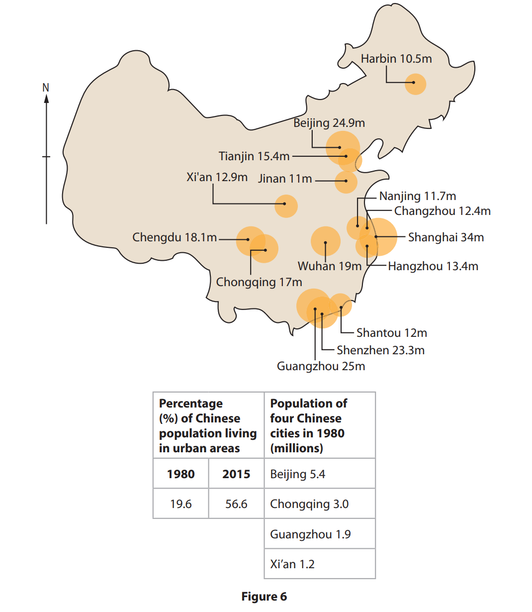
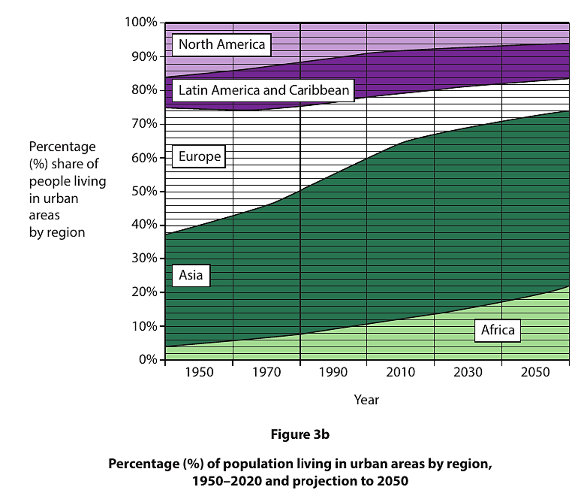
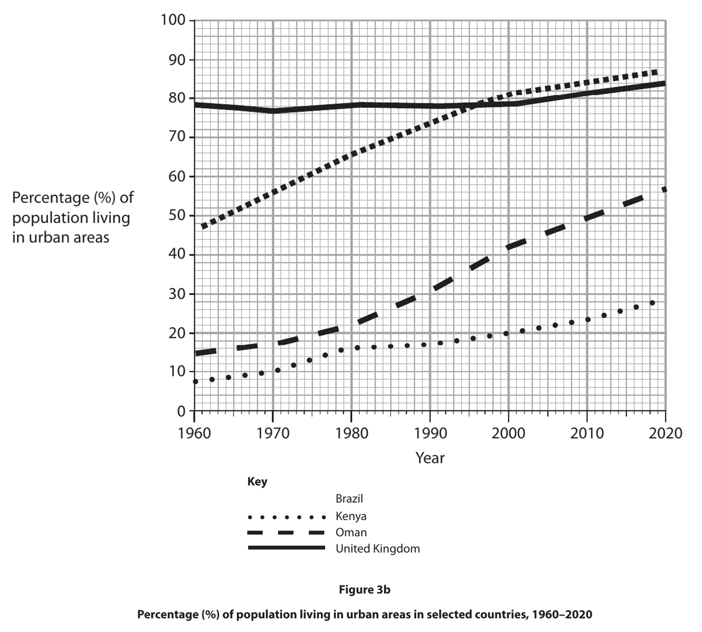
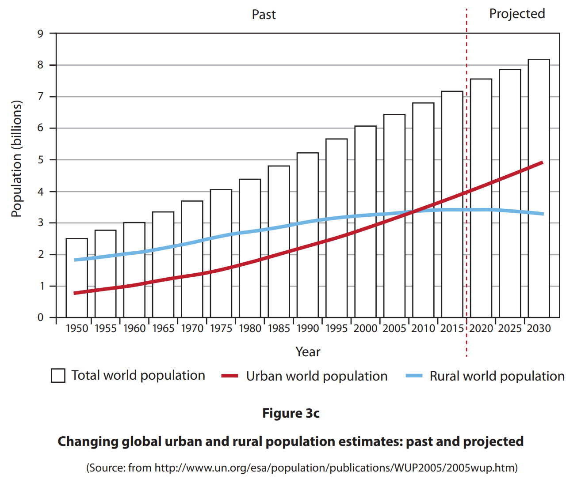
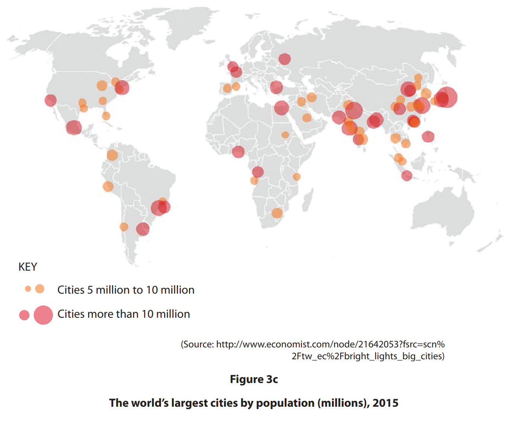

# Exam Questions — The Rise & Characteristics of Urbanisation
**Urban Environments** · Edexcel IGCSE Geography (4GE1)
> Source: [https://www.savemyexams.com/igcse/geography/edexcel/19/topic-questions/6-urban-environments/6-1-the-rise-and-characteristics-of-urbanisation/exam-questions/](https://www.savemyexams.com/igcse/geography/edexcel/19/topic-questions/6-urban-environments/6-1-the-rise-and-characteristics-of-urbanisation/exam-questions/) · 24 questions · total 84 marks

## Q1 — easy — 1 marks · exam-questions

### 6() — 1 mark — multiple_choice — from paper June 2017 · 4GE0/01
Study Figure 6 which shows the location of nine urban regeneration projects in the centre of Sheffield, UK.

What is the approximate distance between the sites of project 4 and project 8?
- **A.** 1.3 km
- **B.** 1.8 km
- **C.** 2.3 km
- **D.** 2.8 km

## Q2 — easy — 3 marks · exam-questions

### 6() — 1 mark — command: how — structured — from paper June 2018 · 4GE0/01
Study Figure 6, which shows information about Chinese cities in 1980 and Chinese megacities in 2015.

How many megacities were there in China in 2015?

### 6() — 2 marks — command: identify — structured — from paper June 2018 · 4GE0/01
Identify the evidence in Figure 6 that China has experienced rapid urbanisation.

## Q3 — easy — 1 marks · exam-questions

### 6() — 1 mark — multiple_choice — from paper June 2018 · 4GE0/01
What is the minimum population of a mega-city?
- **A.** 6 million
- **B.** 8 million
- **C.** 10 million
- **D.** 12 million

## Q4 — easy — 1 marks · exam-questions

### 3((a)) — 1 mark — multiple_choice — from paper June 2019 · 4GE1/02R
Identify the meaning of the term **urbanisation.**
- **A.** increasing proportion of people living in urban areas
- **B.** population movement from one country to another
- **C.** increasing population growth on the edge of urban areas
- **D.** population movement from one urban area to another

## Q5 — easy — 1 marks · exam-questions

### 3((a)) — 1 mark — multiple_choice — from paper June 2019 · 4GE1/02
Identify the meaning of the term **counter-urbanisation**.
- **A.** increasing proportion of people living in urban areas
- **B.** population movement from one country to another
- **C.** increasing population growth on the edge of urban areas
- **D.** population movement from urban areas to the countryside

## Q6 — easy — 1 marks · exam-questions

### 3((c)) — 1 mark — multiple_choice — from paper June 2019 · 4GE1/02
Identify the meaning of the term **megacity**.
- **A.** a very large urban area
- **B.** a city with a population over 1 million
- **C.** a city with a population over 10 million
- **D.** a very large rural area

## Q7 — easy — 1 marks · exam-questions

### 3((c)) — 1 mark — multiple_choice — from paper June 2019 · 4GE1/02R
Identify **one **characteristic of a squatter settlement.
- **A.** a location that has previously been built on
- **B.** a location that has high-rise development
- **C.** a location that has illegally built housing
- **D.** a location that has a planned housing development

## Q8 — easy — 1 marks · exam-questions

### 3() — 1 mark — command: state — structured — from paper May 2023 · 4GE1/02R
State **one **reason why suburbanisation occurs.

## Q9 — easy — 1 marks · exam-questions

### 3((a)) — 1 mark — multiple_choice — from paper June 2024 · 4GE1/02R
Identify which one of the following cities is a megacity.
- **A.** Bogota, Colombia – 7.4 million
- **B.** Lahore, Pakistan – 11.1 million people
- **C.** Zhengzhou, China – 6.7 million people
- **D.** Chattogram, Bangladesh – 5.4 million people

## Q10 — easy — 1 marks · exam-questions

### 3((d)) — 1 mark — command: state — structured — from paper June 2024 · 4GE0/02r
State **one **source of air pollution in cities.

## Q11 — easy — 3 marks · exam-questions

### 3((f)) — 3 marks — command: suggest — structured — from paper June 2024 · 4GE1/02R
Study Figure 3b.

Suggest **one **reason for a trend shown.

## Q12 — easy — 1 marks · exam-questions

### 1() — 1 mark — multiple_choice
Which of the following best describes the term 'urbanisation'?
- **A.** The movement of people from cities to rural areas
- **B.** The growth of out-of-town shopping centres
- **C.** The decline of city centre populations
- **D.** The increase in the proportion of people living in urban areas

## Q13 — easy — 1 marks · exam-questions

### 1() — 1 mark — multiple_choice
Which of the following is the best definition of a megacity?
- **A.** A city with a population of more than 1 million people
- **B.** A city that covers a very large geographical area
- **C.** A city with a population of more than 10 million people
- **D.** A city that is the capital of its country

## Q14 — medium — 4 marks · exam-questions

### 3((f)) — 4 marks — command: explain — structured — from paper June 2019 · 4GE1/02R
Explain **two **reasons why urban land use patterns vary.

## Q15 — medium — 4 marks · exam-questions

### 3((e)) — 4 marks — command: explain — structured — from paper June 2023 · 4GE1/02R
Explain **two** factors that affect the rate of urbanisation.

## Q16 — medium — 4 marks · exam-questions

### 1() — 4 marks — command: explain — structured
Explain **two **factors that have led to the emergence of megacities.

## Q17 — medium — 4 marks · exam-questions

### 1() — 4 marks — command: explain — structured
Explain **two **ways urbanisation can sometimes cause housing challenges in cities that are growing rapidly.

## Q18 — medium — 3 marks · exam-questions

### 3((f)) — 3 marks — command: suggest — structured — from paper May 2023 · 4GE1/02R
Study Figure 3b.

Suggest **one** reason for a trend shown.

## Q19 — hard — 8 marks · exam-questions

### 6((d)) — 8 marks — command: discuss — structured — from paper June 2017 · 4GE0/01
Discuss why a population is distributed according to its socio-economic and ethnic background in **one** named city.

## Q20 — hard — 8 marks · exam-questions

### 3() — 8 marks — command: analyse — structured — from paper June 2019 · 4GE1/02
Study Figure 3c below.

Analyse the reasons for the changes in the global **urban** population.

## Q21 — hard — 8 marks · exam-questions

### 3() — 8 marks — command: analyse — structured — from paper June 2019 · 4GE1/02R
Study Figure 3c.

Analyse the reasons for the distribution of the world’s largest cities.

## Q22 — hard — 8 marks · exam-questions

### 1() — 8 marks — command: analyse — structured
Analyse the reasons for the rapid rise of megacities and the issues associated with urbanisation.

## Q23 — hard — 8 marks · exam-questions

### 1() — 8 marks — command: analyse — structured
Study Figure 3c below.

Analyse the trend in global urbanisation over time.

## Q24 — hard — 8 marks · exam-questions

### 1() — 8 marks — command: analyse — structured
Analyse the reasons why an increasing proportion of the world's population is living in urban areas.
