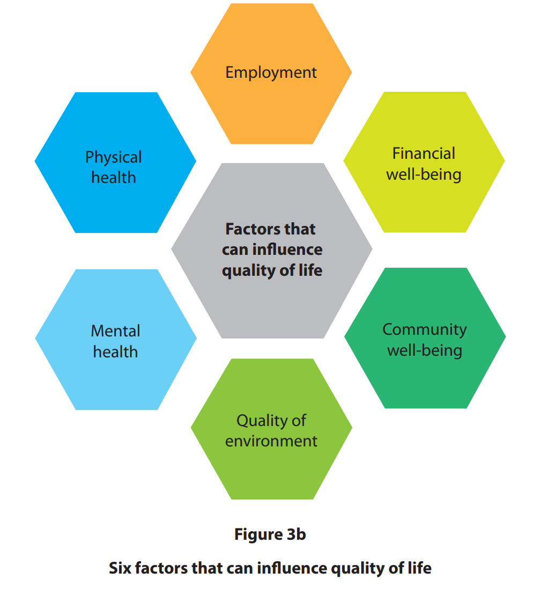
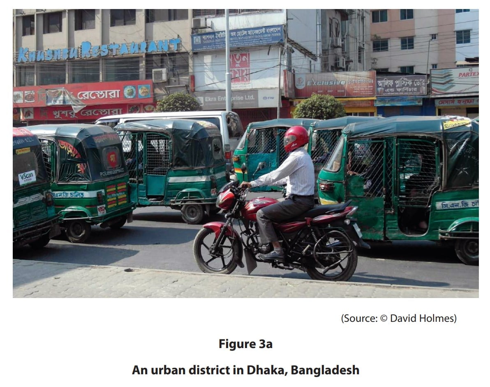
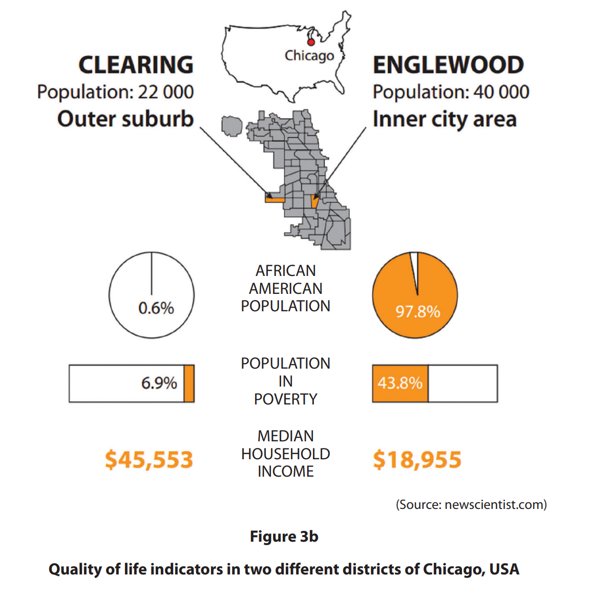

# Exam Questions — Challenges to Urban Environments
**Urban Environments** · Edexcel IGCSE Geography (4GE1)
> Source: [https://www.savemyexams.com/igcse/geography/edexcel/19/topic-questions/6-urban-environments/6-2-challenges-to-urban-environments/exam-questions/](https://www.savemyexams.com/igcse/geography/edexcel/19/topic-questions/6-urban-environments/6-2-challenges-to-urban-environments/exam-questions/) · 19 questions · total 47 marks

## Q1 — easy — 2 marks · exam-questions

### 6() — 2 marks — command: what — structured — from paper June 2017 · 4GE0/01
What is meant by the term **shanty town**?

## Q2 — easy — 1 marks · exam-questions

### 3((b)) — 1 mark — command: define — structured — from paper June 2019 · 4GE1/02
Define the term **segregation**.

## Q3 — easy — 3 marks · exam-questions

### 3((g)) — 3 marks — command: explain — structured — from paper June 2019 · 4GE1/02
Study Figure 3b below.

Explain how **one **factor affects quality of life.

## Q4 — easy — 2 marks · exam-questions

### 3((d)) — 2 marks — command: explain — structured — from paper June 2019 · 4GE1/02R
Study Figure 3a below.

Explain one piece of evidence that shows this urban area has transport challenges.

## Q5 — easy — 1 marks · exam-questions

### 3((e)) — 1 mark — command: state — structured — from paper June 2019 · 4GE1/02R
State **one** environmental issue associated with the rapid growth of megacities.

## Q6 — easy — 3 marks · exam-questions

### 3((g)) — 3 marks — command: explain — structured — from paper June 2019 · 4GE1/02R
Study Figure 3b.

Explain one reason for the differences in quality of life shown.

## Q7 — easy — 2 marks · exam-questions

### 6() — 2 marks — command: what — structured — from paper June 2018 · 4GE0/02
What is meant by the term land value?

## Q8 — easy — 1 marks · exam-questions

### 3((b)) — 1 mark — multiple_choice — from paper June 2023 · 4GE1/02R
Identify a factor that can affect urban land use values.
- **A.** food supplies
- **B.** temperature
- **C.** international aid
- **D.** transport connections

## Q9 — easy — 1 marks · exam-questions

### 3() — 1 mark — multiple_choice — from paper June 2023 · 4GE1/02
Identify the location where you would usually find a science park.
- **A.** central business district
- **B.** city centre
- **C.** remote rural location
- **D.** rural-urban fringe

## Q10 — easy — 1 marks · exam-questions

### 3() — 1 mark — multiple_choice — from paper June 2023 · 4GE1/02
Identify the feature you would expect to find in a city centre.
- **A.** theme park
- **B.** houses with large gardens
- **C.** financial district
- **D.** business park

## Q11 — easy — 2 marks · exam-questions

### 1() — 2 marks — command: state — structured
State what is meant by the term '**congestion**'?

## Q12 — easy — 2 marks · exam-questions

### 1() — 2 marks — command: describe — structured
Describe **one **way that land values affect urban land use patterns.

## Q13 — easy — 3 marks · exam-questions

### 1() — 3 marks — command: suggest — structured
Suggest reasons why informal settlements may develop in some cities.

## Q14 — easy — 3 marks · exam-questions

### 1() — 3 marks — command: describe — structured
**Study **the information below.

In 2022, Transport for London reported that approximately 3.9 million journeys were made on the London Underground every day. Despite this, an estimated 27% of all journeys in London were still made by private car, contributing to an average traffic speed in central London of just 7.4 mph during peak hours.

Using the information above and your own knowledge, **describe** the transport challenges facing London.

## Q15 — medium — 4 marks · exam-questions

### 6() — 4 marks — command: outline — structured — from paper June 2018 · 4GE0/02
Outline **two **reasons why land values vary within urban areas.

## Q16 — medium — 4 marks · exam-questions

### 3((f)) — 4 marks — command: explain — structured — from paper June 2019 · 4GE1/02R
Explain **two **reasons why urban land use patterns vary.

## Q17 — medium — 4 marks · exam-questions

### 3((e)) — 4 marks — command: explain — structured — from paper June 2024 · 4GE1/02R
Explain **two** ways urbanisation can sometimes cause housing challenges in cities that are growing rapidly.

## Q18 — medium — 4 marks · exam-questions

### 3((e)) — 4 marks — command: explain — structured — from paper June 2024 · 4GE1/02
Explain **two **challenges caused by the informal economy in cities.

## Q19 — medium — 4 marks · exam-questions

### 1() — 4 marks — command: explain — structured
Explain **two **methods used to improve living conditions in shanty towns in LIC cities.
