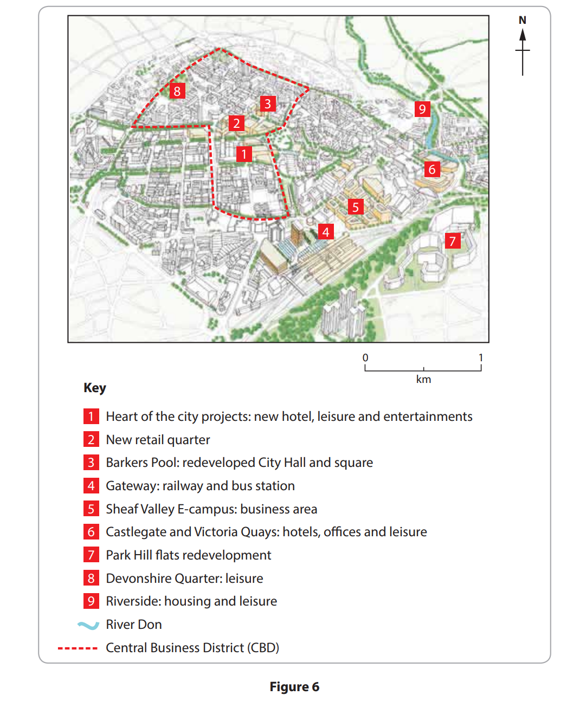
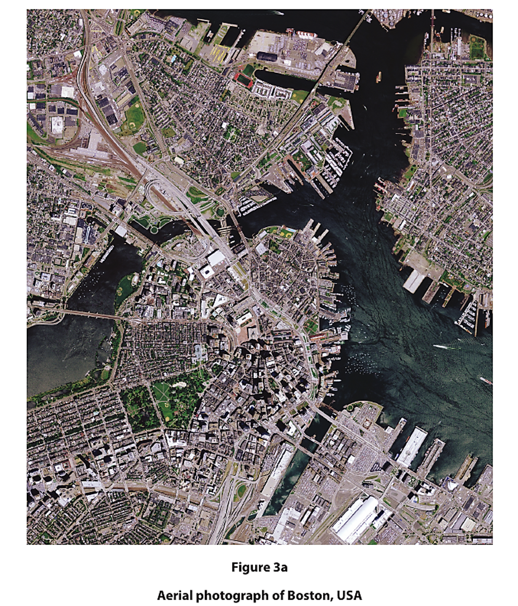
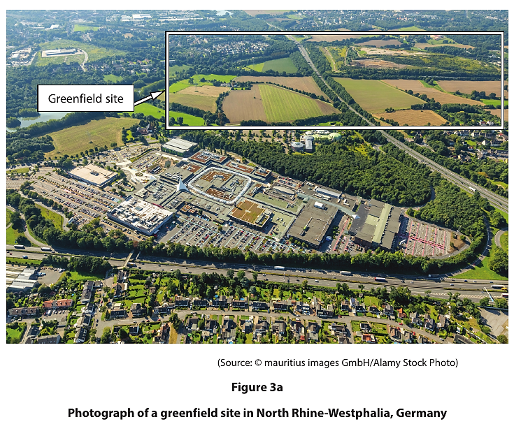
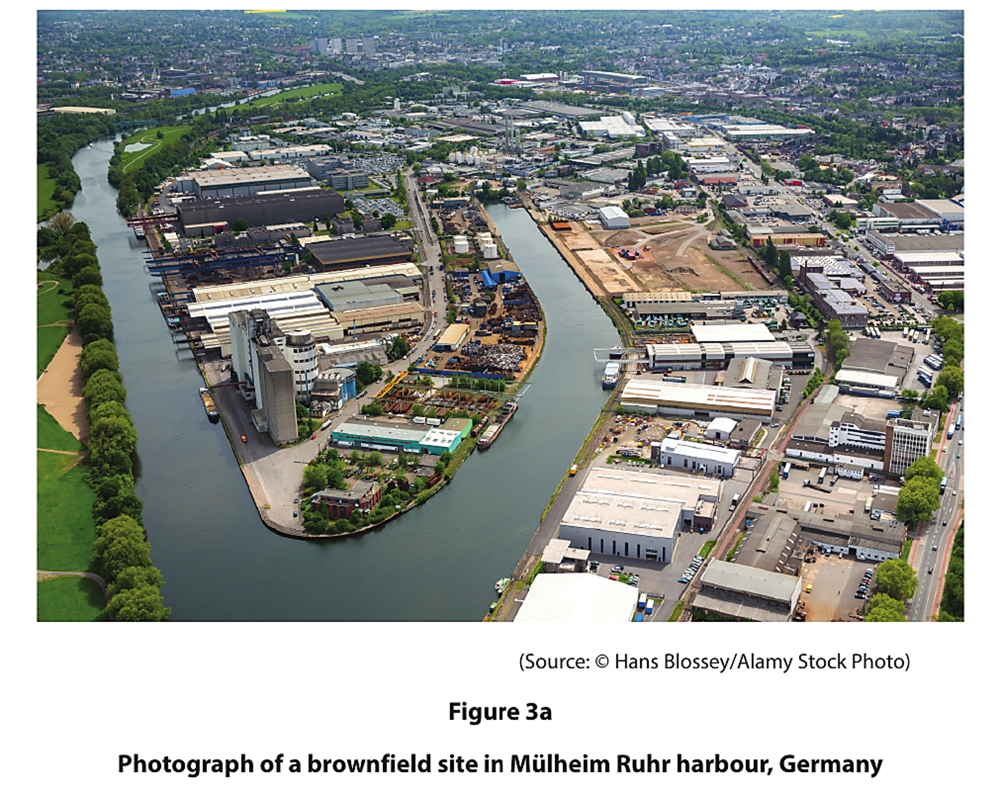

# Exam Questions — Management of Urban Environments
**Urban Environments** · Edexcel IGCSE Geography (4GE1)
> Source: [https://www.savemyexams.com/igcse/geography/edexcel/19/topic-questions/6-urban-environments/6-3-management-of-urban-environments/exam-questions/](https://www.savemyexams.com/igcse/geography/edexcel/19/topic-questions/6-urban-environments/6-3-management-of-urban-environments/exam-questions/) · 21 questions · total 70 marks

## Q1 — easy — 2 marks · exam-questions

### 6() — 2 marks — command: describe — structured — from paper June 2017 · 4GE1/01
Study Figure 6 which shows the location of nine urban regeneration projects in the centre of Sheffield, UK.

Describe how the type of regeneration projects in the city’s CBD are different from the other projects in the centre of Sheffield.

## Q2 — easy — 1 marks · exam-questions

### 3((e)) — 1 mark — command: state — structured — from paper June 2019 · 4GE1/02
State **one** group or organisation involved in managing urban challenges.

## Q3 — easy — 1 marks · exam-questions

### 3((d)) — 1 mark — command: state — structured — from paper June 2024 · 4GE1/02
State **one **group of stakeholders who can help improve the quality of life in urban areas.

## Q4 — easy — 1 marks · exam-questions

### 3((b)) — 1 mark — multiple_choice — from paper June 2024 · 4GE1/02
Identify one reason for building on the rural-urban fringe.
- **A.** to support biodiversity in the area
- **B.** to preserve the greenbelt
- **C.** population growth
- **D.** to be close to the Central Business District (CBD)

## Q5 — easy — 1 marks · exam-questions

### 3((b)) — 1 mark — multiple_choice — from paper June 2024 · 4GE1/02r
Identify one reason for developing a brownfield site.
- **A.** land has never been used before
- **B.** costly removal of contaminated waste
- **C.** existing roads and electricity present
- **D.** lots of room to expand

## Q6 — easy — 2 marks · exam-questions

### 3((c)) — 2 marks — command: suggest — structured — from paper June 2024 · 4GE1/02r
Study Figure 3a.

Suggest **one **factor that has affected the land uses shown.

## Q7 — easy — 2 marks · exam-questions

### 3((c)) — 2 marks — command: suggest — structured — from paper May 2023 · 4GE1/02r
Study Figure 3a.

Suggest **one **advantage of building on the greenfield site shown.

## Q8 — easy — 2 marks · exam-questions

### 3((c)) — 2 marks — command: explain — structured — from paper May 2023 · 4GE1/02
Study Figure 3a.

Explain **one **advantage of building on a brownfield site.

## Q9 — easy — 1 marks · exam-questions

### 3() — 1 mark — multiple_choice — from paper May 2023 · 4GE1/02
Identify the location where you would usually find a science park.
- **A.** central business district
- **B.** city centre
- **C.** remote rural location
- **D.** rural-urban fringe

## Q10 — easy — 1 marks · exam-questions

### 1() — 1 mark — command: state — structured
State one strategy that can be used to make urban areas more sustainable.

## Q11 — medium — 4 marks · exam-questions

### 6() — 4 marks — command: outline — structured — from paper June 2017 · 4GE0/01
Outline **two **strategies for improving shanty towns.

## Q12 — medium — 4 marks · exam-questions

### 3((h)) — 4 marks — command: explain — structured — from paper June 2019 · 4GE1/02
For a named developed country, explain **two **ways the rural-urban fringe has been developed.

## Q13 — medium — 4 marks · exam-questions

### 3((f)) — 4 marks — command: explain — structured — from paper June 2019 · 4GE1/02
Explain **two** ways in which urban challenges have been managed.

## Q14 — medium — 4 marks · exam-questions

### 3((h)) — 4 marks — command: explain — structured — from paper June 2019 · 4GE1/02R
For a named **developing or emerging** country, explain how two different groups managed challenges within urban environments.

## Q15 — medium — 4 marks · exam-questions

### 3((g)) — 4 marks — command: explain — structured — from paper June 2023 · 4GE1/02r
For a named developing or emerging country, explain how two groups of stakeholders are trying to manage environmental urban challenges.

## Q16 — medium — 4 marks · exam-questions

### 3((g)) — 4 marks — command: explain — structured — from paper June 2023 · 4GE1/02
For a named developed country, explain how **two **different groups of people manage urban environmental challenges.

## Q17 — medium — 4 marks · exam-questions

### 1() — 4 marks — command: explain — structured
For a named developing country, explain how **two** different groups of people manage urban environmental challenges.

## Q18 — medium — 4 marks · exam-questions

### 1() — 4 marks — command: explain — structured
Explain the advantages and disadvantages of building new housing on brownfield sites.

## Q19 — hard — 8 marks · exam-questions

### 1() — 8 marks — command: analyse — structured
Analyse whether developments in developed cities should be encouraged to take place on brownfield rather than greenfield sites.

Reference to named examples may help your answer.

## Q20 — hard — 8 marks · exam-questions

### 1() — 8 marks — command: analyse — structured
Analyse the possible reasons for changes on the rural–urban fringe of a named developed city.

## Q21 — hard — 8 marks · exam-questions

### 1() — 8 marks — command: analyse — structured
Analyse the problems associated with the management of slums.
