# Exam Questions — Threats to Fragile Environments
**Fragile Environments & Climate Change** · Edexcel IGCSE Geography (4GE1)
> Source: [https://www.savemyexams.com/igcse/geography/edexcel/19/topic-questions/7-fragile-environments-and-climate-change/7-1-threats-to-fragile-environments/exam-questions/](https://www.savemyexams.com/igcse/geography/edexcel/19/topic-questions/7-fragile-environments-and-climate-change/7-1-threats-to-fragile-environments/exam-questions/) · 38 questions · total 117 marks

## Q1 — easy — 5 marks · exam-questions

### 11() — 1 mark — multiple_choice — from paper June 2017 · 4GE0/01
Study Figure 11a which shows annual deforestation in five states of Brazil between 2004 and 2013.

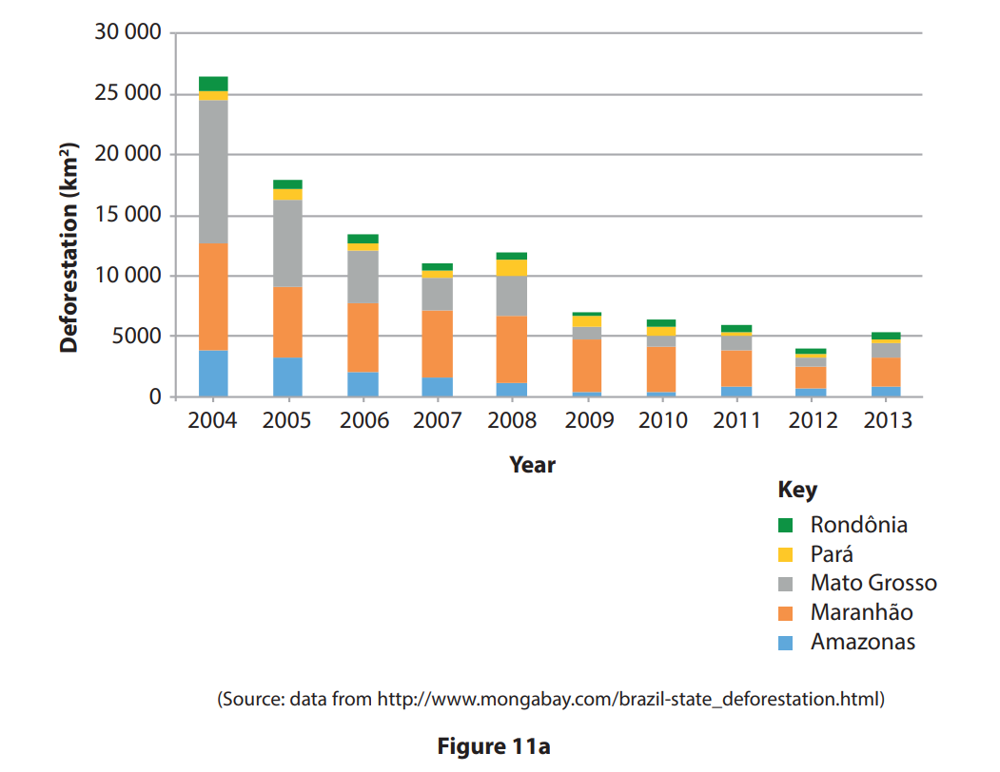

In which** one** of the following states was there most deforestation between 2004 and 2013?
- **A.** Rondônia
- **B.** Pará
- **C.** Mato Grosso
- **D.** Amazonas

### 11() — 2 marks — command: describe — structured — from paper June 2017 · 4GE1/01
Describe the trend in the rate of deforestation in Brazil between 2004 and 2013.

### 11() — 2 marks — command: suggest — structured — from paper June 2017 · 4GE1/01
Suggest **one** issue resulting from deforestation.

## Q2 — easy — 2 marks · exam-questions

### 11() — 1 mark — multiple_choice — from paper June 2018 · 4GE0/01
Study Figure 11a which shows the temperature record for Central England from 1950 to 2014.

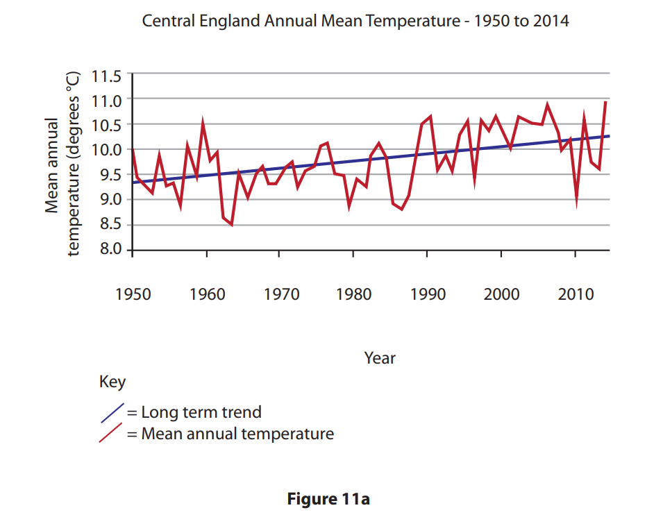

What was the mean annual temperature in 1950?
- **A.** 9.0 °C
- **B.** 9.4 °C
- **C.** 9.7 °C
- **D.** 10.0 °C

### 11() — 1 mark — command: identify — structured — from paper June 2018 · 4GE0/01
Identify a year when the mean temperature varied significantly from the long-term trend shown in Figure 11a

## Q3 — easy — 2 marks · exam-questions

### 7() — 1 mark — command: state — structured — from paper June 2019 · 4GE1/02
State **one** example of a greenhouse gas.

### 7() — 1 mark — multiple_choice — from paper June 2019 · 4GE1/02
Identify the meaning of the term **enhanced greenhouse effect**.
- **A.** cooling of the Earth's atmosphere resulting from human activities
- **B.** warming of the Earth’s atmosphere resulting from human activities
- **C.** additional heat trapped in the Earth's atmosphere as a result of natural effects
- **D.** greenhouse gases naturally present in the Earth's atmosphere causing warming

## Q4 — easy — 2 marks · exam-questions

### 7() — 1 mark — multiple_choice — from paper June 2019 · 4GE1/02R
Identify  **one** natural cause of climate change.
- **A.** industry
- **B.** transport
- **C.** volcanoes
- **D.** intensive farming

### 7() — 1 mark — multiple_choice — from paper June 2019 · 4GE1/02R
Identify the meaning of the term **enhanced greenhouse effect**.
- **A.** cooling of the Earth’s atmosphere from human activities
- **B.** less heat trapped in the Earth’s atmosphere
- **C.** additional heat trapped as a result of natural effects
- **D.** additional heat trapped as a result of human activities

## Q5 — easy — 5 marks · exam-questions

### 7() — 1 mark — multiple_choice — from paper June 2019 · 4GE1/02
Identify the meaning of the term **Milankovitch cycle**.
- **A.** cyclical movement of the Earth's orbit around the Sun
- **B.** differences in the amount of energy emitted from the Sun
- **C.** additional heat trapped in the Earth’s atmosphere
- **D.** seasonal movement of the Sun in different orbits

### 7() — 2 marks — command: calculate — structured — from paper June 2019 · 4GE1/02
Study Figure 7b below.

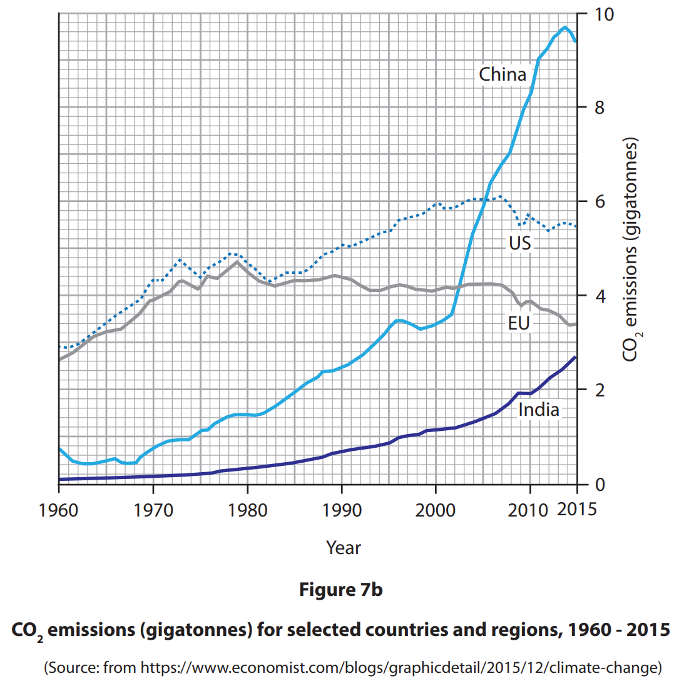

Calculate the range in $\mathrm{CO}_{2}$  emissions in **India** between 1960 and 2015.

You must show all your workings in the space below

### 3() — 2 marks — command: identify — structured
Identify the trends in $\mathrm{CO}_{2}$  emissions in China, 1960-2015.

## Q6 — easy — 6 marks · exam-questions

### 7() — 2 marks — command: define — structured — from paper June 2019 · 4GE1/02R
Define the term **deforestation**.

### 7() — 2 marks — command: calculate — structured — from paper June 2019 · 4GE1/02R
Study Figure 7b below.

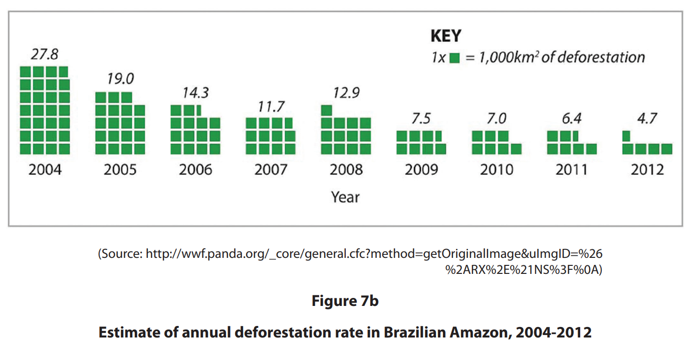

Calculate the range  in total deforestation loass between 2004 and 2012.

You must show all your workings.

### 3() — 2 marks — command: describe — structured
Describe the extent to which deforestation rates have changed from  2004-2012 in Figure 7b.

## Q7 — easy — 2 marks · exam-questions

### 11() — 2 marks — command: define — structured — from paper June 2017 ·  4GE1/01
Define the term **desertification**.

## Q8 — easy — 1 marks · exam-questions

### 1() — 1 mark — command: identify — structured
Study Figure 7a

Identify the** two** countries labelled in Figure 7a with the most and least $\mathrm{CO}_{2}$ emissions.

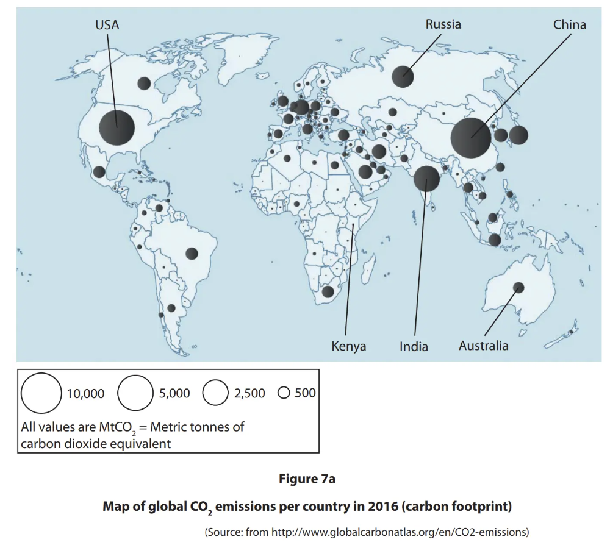

## Q9 — easy — 2 marks · exam-questions

### 7() — 2 marks — command: identify — structured — from paper June 2019 · 4GE1/02R
Study Figure 7a.

Identify **two** countries labelled in Figure 7a with a net loss in forest cover of greater than 5,000 $\mathrm{km}^{2}$ /year.

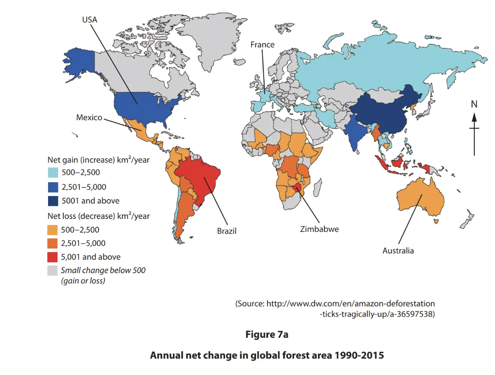

## Q10 — easy — 1 marks · exam-questions

### 7((a)) — 1 mark — multiple_choice — from paper June 2022 · 4GE1/02R
Identify the correct word to complete the sentence below.

Climate change is the long-term changes in ........ conditions
- **A.** atmospheric
- **B.** aerobic
- **C.** evaporation
- **D.** forest

## Q11 — easy — 1 marks · exam-questions

### 7((c)) — 1 mark — command: state — structured — from paper June 2022 · 4GE1/02R
State **one** cause of the enhanced greenhouse effect.

## Q12 — easy — 2 marks · exam-questions

### 7() — 2 marks — command: identify — structured — from paper June 2022 · 4GE1/02R
Study Figure 7a.

Identify the countries labelled in Figure 7a with the highest net percentage decrease and lowest net percentage decrease in forest cover.

## Q13 — easy — 2 marks · exam-questions

### 7() — 2 marks — command: identify — structured — from paper June 2024 · 4GE1/02
Study Figure 7a. Identify **two **labelled countries with the highest risk of drought

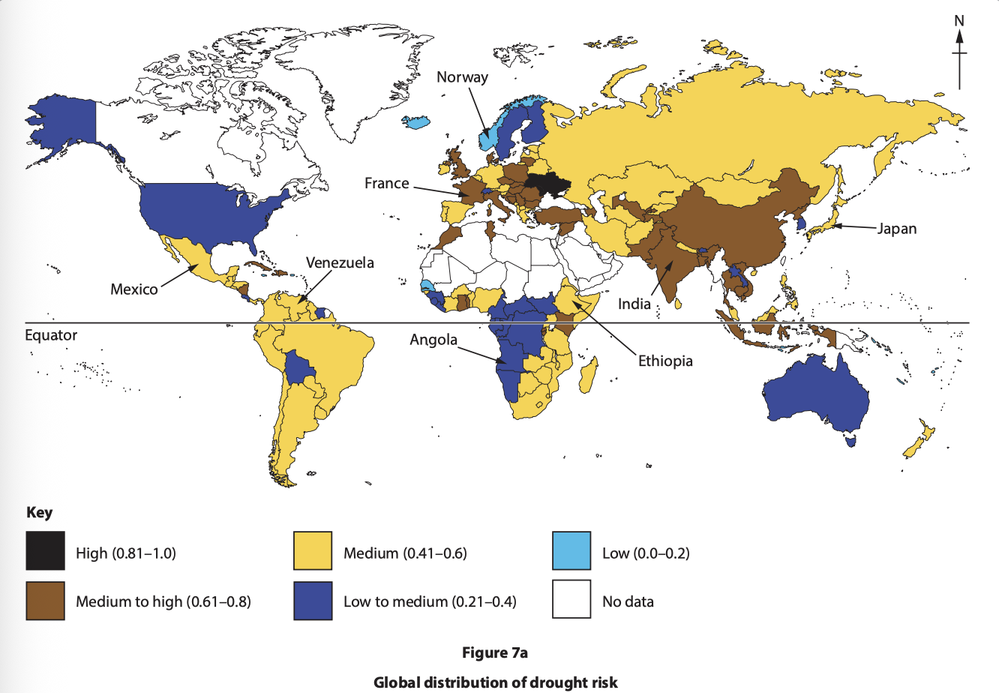

## Q14 — easy — 4 marks · exam-questions

### 7() — 2 marks — command: calculate — structured — from paper June 2024 · 4GE1/02
Study Figure 7b. Calculate the range in total forest loss, 2001–2015. You must show all your workings in the space below.

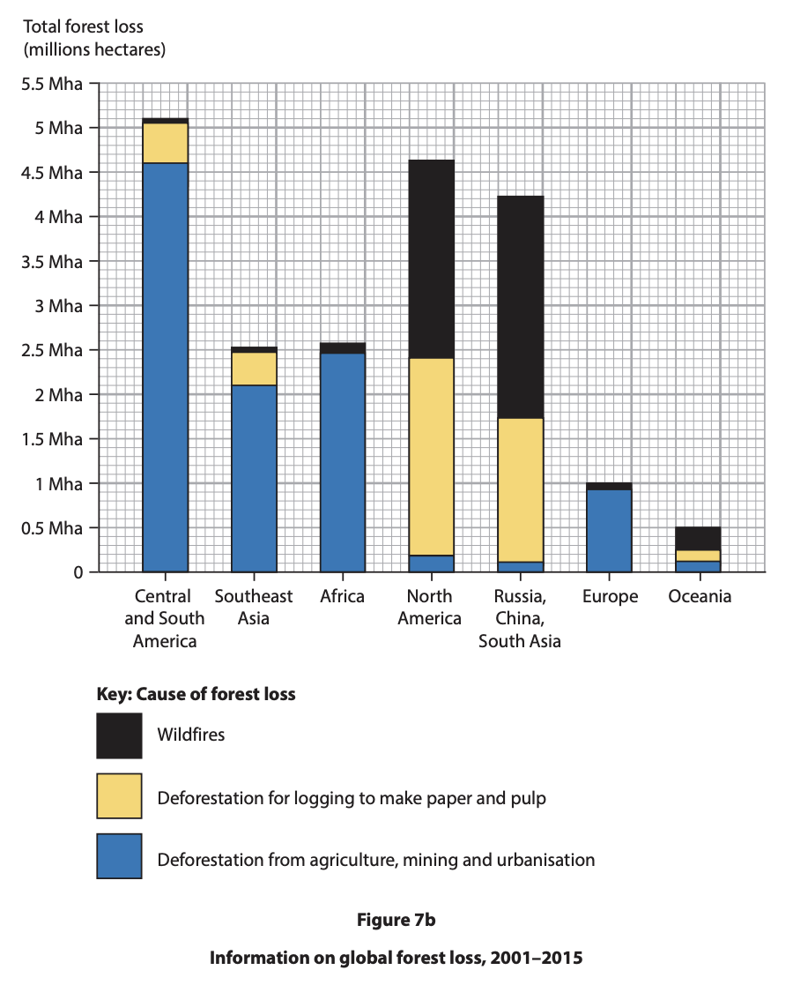

### 7() — 2 marks — command: describe — structured — from paper June 2024 · 4GE1/02
Describe a variation in forest loss shown for 2001–2015.

## Q15 — easy — 1 marks · exam-questions

### 1((a)) — 1 mark — command: name — structured — from paper June 2024 · 4GE1/02R
Name **one** location of a fragile environment.

## Q16 — easy — 2 marks · exam-questions

### 7() — 2 marks — command: identify — structured — from paper June 2024 · 4GE1/02R
Study Figure 7a. Identify the two labelled countries with the highest forest loss.

## Q17 — easy — 1 marks · exam-questions

### 7() — 1 mark — multiple_choice — from paper June 2023 · 4GE1/02
Identify a cause of desertification.
- **A.** hydroelectric power
- **B.** increased rainfall
- **C.** international trade
- **D.** overgrazing

## Q18 — easy — 2 marks · exam-questions

### 7((c)) — 2 marks — command: explain — structured — from paper June 2023 · 4GE1/02
Explain one natural cause of climate change.

## Q19 — easy — 2 marks · exam-questions

### 7((e)) — 2 marks — command: state — structured — from paper June 2023 · 4GE1/02
State two causes of deforestation

## Q20 — easy — 1 marks · exam-questions

### 7() — 1 mark — multiple_choice — from paper June 2022 · 4GE1/02
Identify the correct word to complete the sentence below.

Greenhouse gases allow … radiation through the atmosphere to warm the Earth’s surface.
- **A.** nuclear
- **B.** light
- **C.** temperature
- **D.** solar

## Q21 — easy — 1 marks · exam-questions

### 7((b)) — 1 mark — command: state — structured — from paper June 2022 · 4GE1/02
State **one** human cause of climate change

## Q22 — easy — 1 marks · exam-questions

### 1() — 1 mark — multiple_choice
Which **one **of the following best describes a fragile environment?
- **A.** An environment that receives low levels of rainfall throughout the year
- **B.** An environment that is found only in tropical regions of the world
- **C.** An environment that has a large and growing human population
- **D.** An environment that is easily damaged and slow to recover from change

## Q23 — easy — 2 marks · exam-questions

### 7() — 2 marks — command: name — structured — from paper June 2022 · 4GE1/01
Study Figure 7.

Name two countries labelled in Figure 7a at ‘Very High’ risk of desertification.

## Q24 — easy — 1 marks · exam-questions

### 1() — 1 mark — multiple_choice
Which **one** of the following is a cause of desertification?
- **A.** Increased irrigation of farmland
- **B.** Overgrazing by livestock
- **C.** Planting of shelter belts
- **D.** Expansion of woodland cover

## Q25 — easy — 3 marks · exam-questions

### 7() — 2 marks — command: calculate — structured — from paper June 2022 · 4GE1/02
Study Figure 7b.

Calculate the range in the number of tropical storms for 2019. You must show all your workings in the space below.

Give your answer to one decimal place.

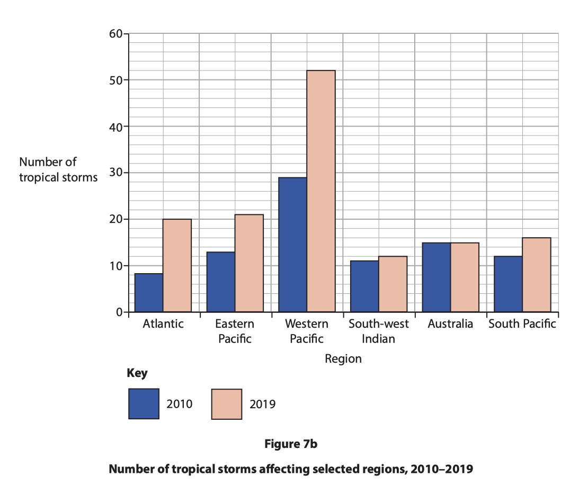

### 7() — 1 mark — command: describe — structured — from paper June 2022 · 4GE1/02
Describe one difference in the number of tropical storms between 2010 and 2019.

## Q26 — medium — 4 marks · exam-questions

### 1() — 4 marks — command: explain — structured
Explain **two **causes of deforestation.

## Q27 — medium — 4 marks · exam-questions

### 1() — 4 marks — command: explain — structured
Explain **two **causes of climate change.

## Q28 — medium — 4 marks · exam-questions

### 11() — 4 marks — command: explain — structured — from paper June 2017 ·  4GE1/01
Explain **two** causes of desertification.

## Q29 — medium — 4 marks · exam-questions

### 7() — 4 marks — command: suggest — structured — from paper June 2019 ·  4GE1/02
Study Figure 7a below.

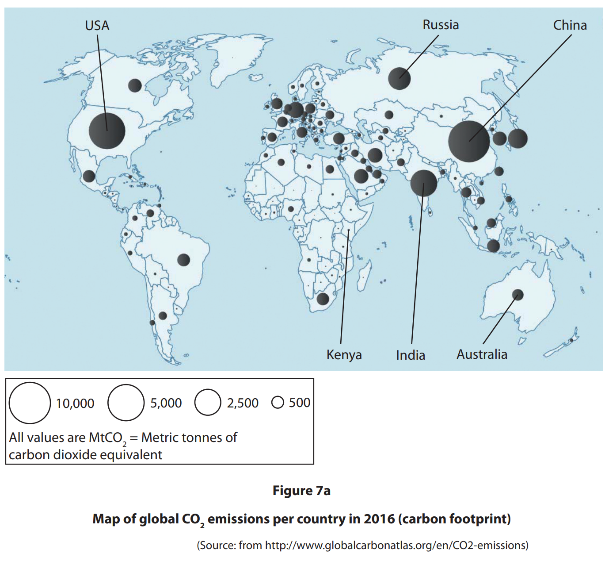

Suggest **two** reasons for the pattern shown on Figure 7a.

## Q30 — medium — 4 marks · exam-questions

### 7() — 4 marks — command: suggest — structured — from paper June 2019 · 4GE1/02R
Study Figure 7a below.

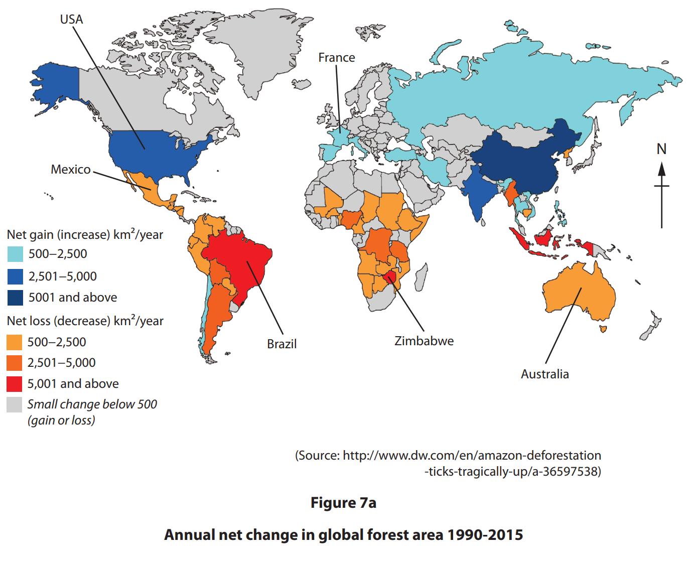

Suggest **two **possible reasons for the pattern shown on Figure 7a.

## Q31 — medium — 6 marks · exam-questions

### 7((e)) — 6 marks — command: assess — structured — from paper June 2019 · 4GE1/02
Study Figure 7c below.

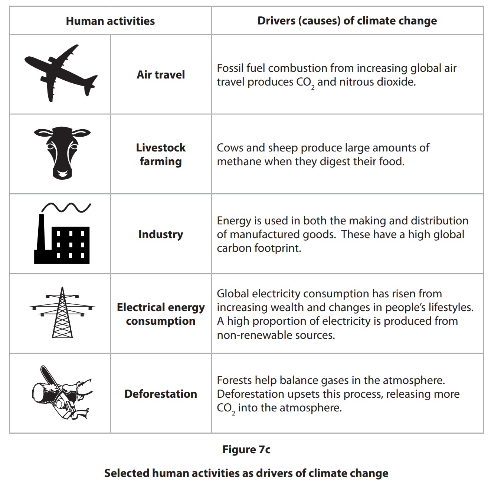

Assess the different human factors that cause climate change.

## Q32 — medium — 6 marks · exam-questions

### 7((e)) — 6 marks — command: assess — structured — from paper June 2019 · 4GE1/02R
Study Figure 7c in the Resource Booklet.

Assess the different factors that have caused deforestation.

## Q33 — medium — 3 marks · exam-questions

### 11() — 3 marks — command: suggest — structured — from paper 2018 · 4GE1/02
Study Figure 11a.

Suggest why the data in this graph supports the idea of global warming.

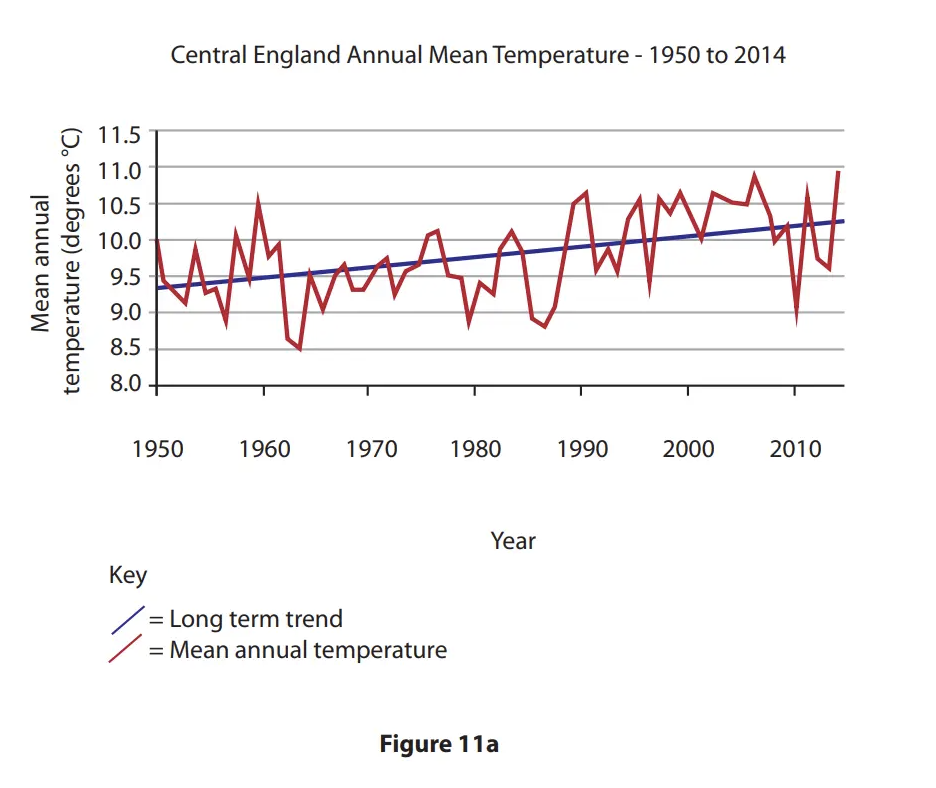

## Q34 — medium — 4 marks · exam-questions

### 7() — 4 marks — command: suggest — structured — from paper June 2022 · 4GE1/02R
Study Figure 7a in the Resource Booklet.

Suggest **two** reasons for this pattern of change.

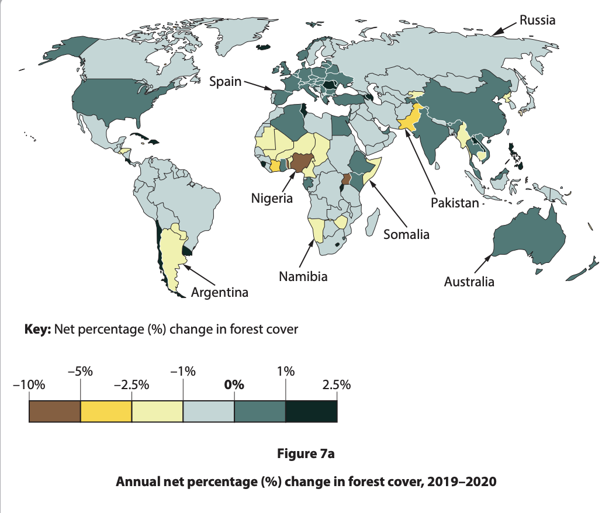

## Q35 — medium — 4 marks · exam-questions

### 7() — 4 marks — command: suggest — structured — from paper June 2024 · 4GE1/02
Suggest two reasons for the pattern shown in Figure 7a.

## Q36 — medium — 4 marks · exam-questions

### 7() — 4 marks — command: suggest — structured — from paper June 2024 · 4GE1/02R
Suggest two reasons for the pattern shown in Figure 7a.

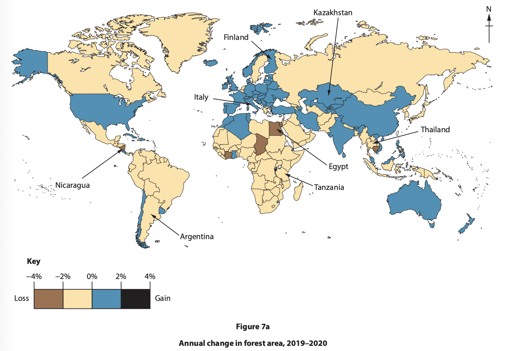

## Q37 — medium — 4 marks · exam-questions

### 7() — 4 marks — command: suggest — structured — from paper June 2022 · 4GE1/02
Study Figure 7a.

Suggest two possible reasons for the distribution of countries at risk of desertification.

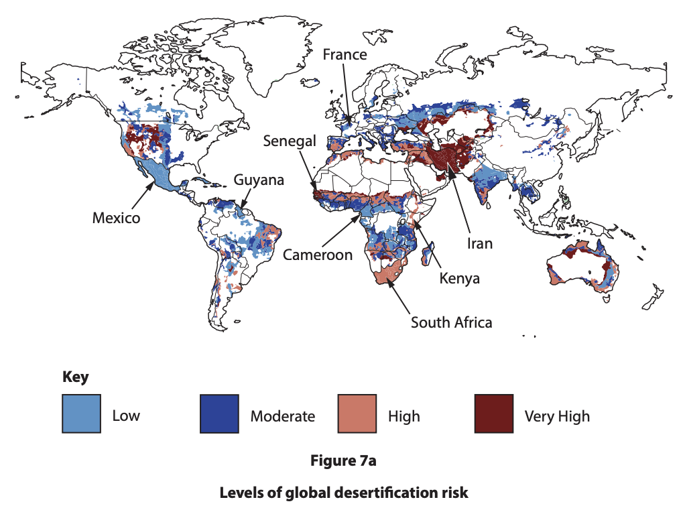

## Q38 — hard — 12 marks · exam-questions

### 1() — 12 marks — command: discuss — structured
Study **Figure 10a.**

'The world's fragile environments are under threat from many directions.In the Amazon rainforest, an area roughly the size of a football pitch is cleared every single minute. Desertification claims approximately 200,000 square kilometres of productive land annually in the Sahel region of Africa. Scientists warn that without urgent action, these trends will accelerate as global temperatures continue to rise, putting millions of people and countless species at risk.'

**'Human activity is the main cause of threats facing the world's fragile environments.'**

Discuss this view. Use** Figure 10a **and your own knowledge.
