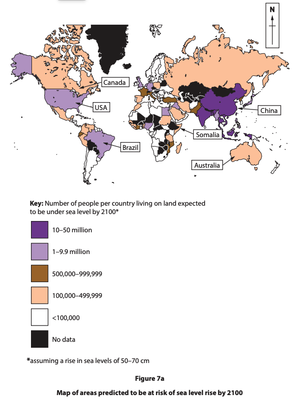
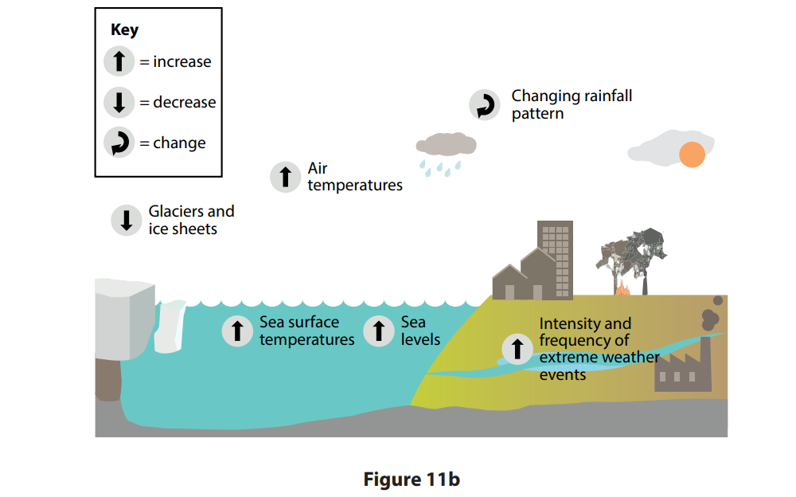
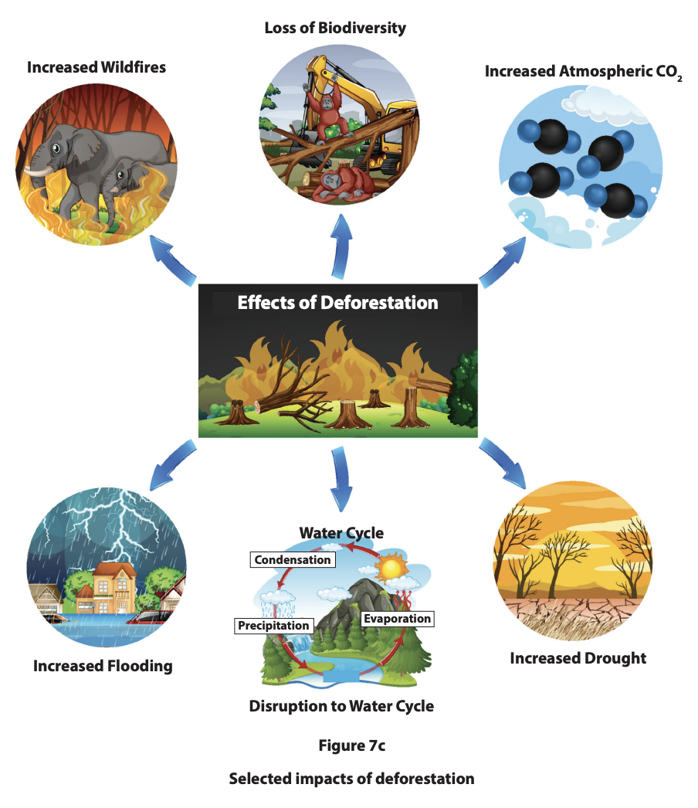
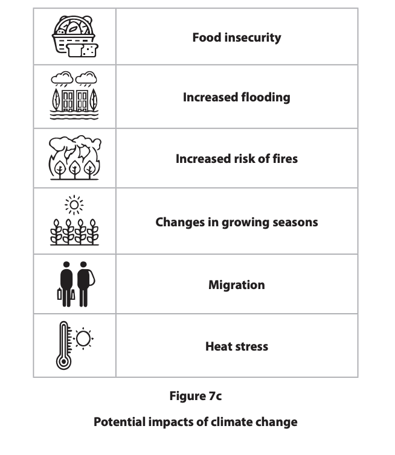
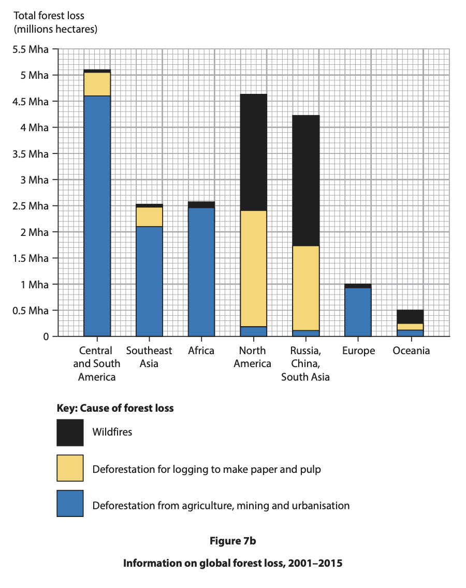
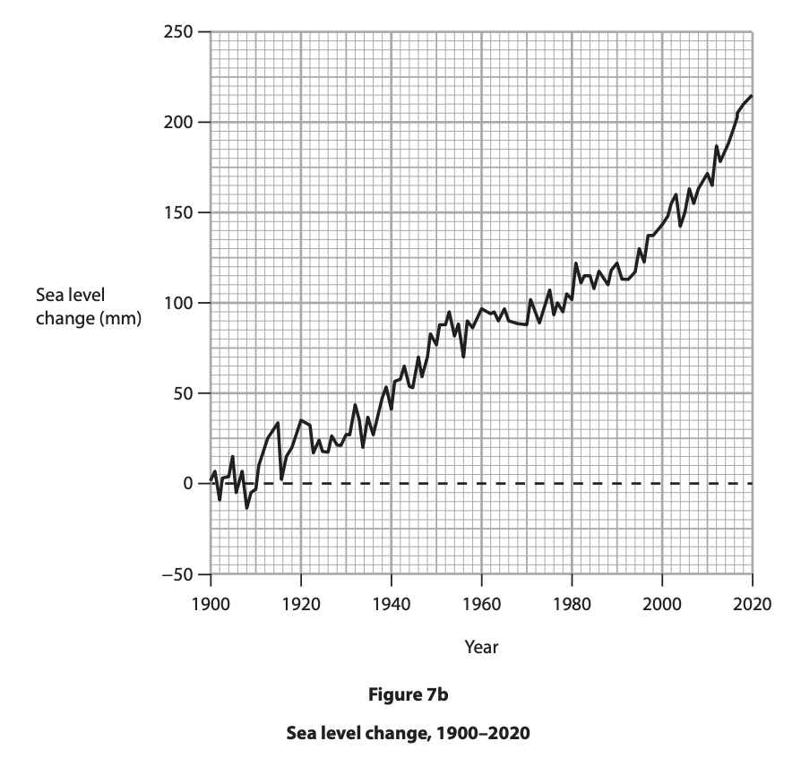
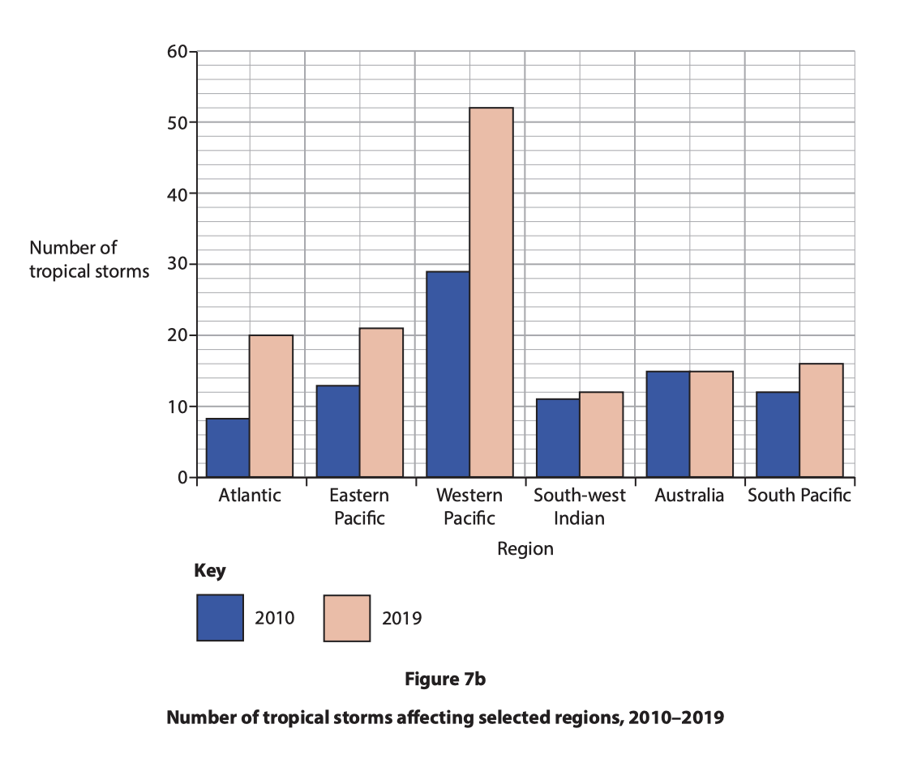
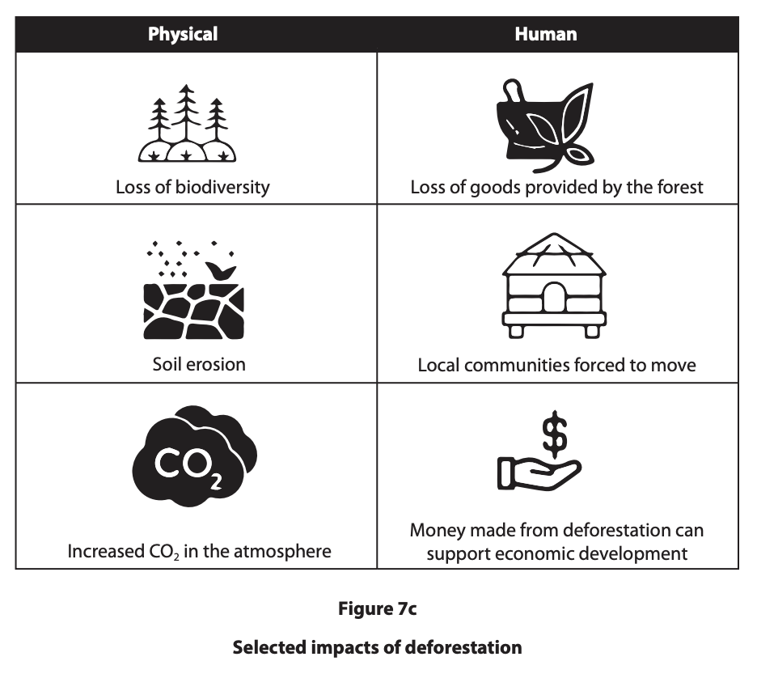
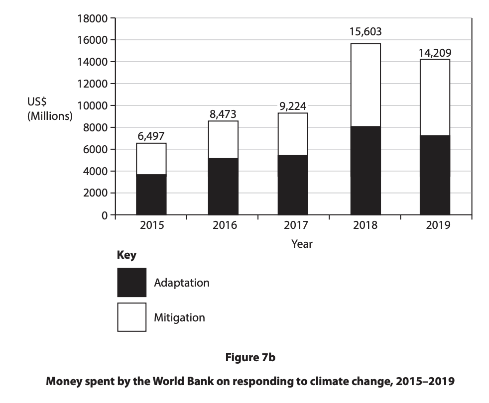
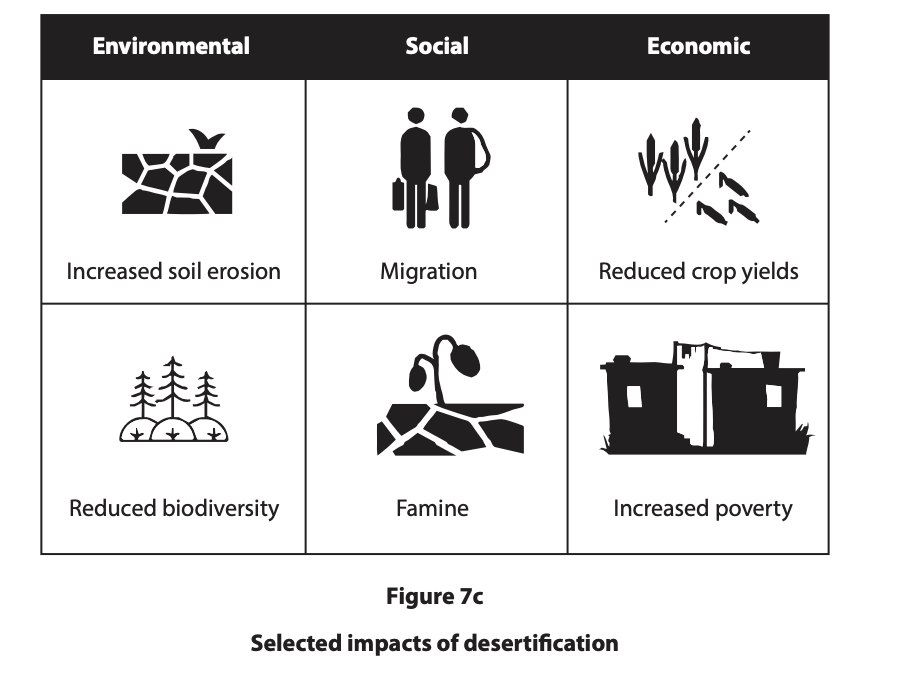

# Exam Questions — Impacts on Fragile Environments
**Fragile Environments & Climate Change** · Edexcel IGCSE Geography (4GE1)
> Source: [https://www.savemyexams.com/igcse/geography/edexcel/19/topic-questions/7-fragile-environments-and-climate-change/7-2-impacts-on-fragile-environments/exam-questions/](https://www.savemyexams.com/igcse/geography/edexcel/19/topic-questions/7-fragile-environments-and-climate-change/7-2-impacts-on-fragile-environments/exam-questions/) · 21 questions · total 119 marks

## Q1 — easy — 1 marks · exam-questions

### 7((b)) — 1 mark — multiple_choice — from paper June 2022 · 4GE1/02R
Identify **one **environmental impact of deforestation.
- **A.** increased exports of timber
- **B.** loss of species diversity
- **C.** local communities forced to move
- **D.** extra space for cattle ranching

## Q2 — easy — 1 marks · exam-questions

### 7() — 1 mark — multiple_choice — from paper June 2024 · 4GE1/02R
Identify one impact of desertification.
- **A.** heavy rainfall
- **B.** population increase
- **C.** soil erosion
- **D.** tree logging

## Q3 — easy — 1 marks · exam-questions

### 7((b)) — 1 mark — multiple_choice — from paper June 2023 · 4GE1/02
Identify an impact of desertification.
- **A.** increased exports
- **B.** increased of species diversity
- **C.** reduced crop yields
- **D.** reduced energy production

## Q4 — easy — 7 marks · exam-questions

### 7() — 1 mark — command: identify — structured — from paper June 2023 · 4GE1/02
Study Figure 7a.

Identify the labelled country most at risk from sea level rise.

### 7() — 2 marks — command: compare — structured — from paper June 2023 · 4GE1/02
Compare the level of risk for Asia and North America

### 7() — 2 marks — command: suggest — structured — from paper June 2023 · 4GE1/02
Suggest one reason for the pattern shown

### 7() — 2 marks — command: explain — structured — from paper June 2023 · 4GE1/02
Explain why the data shown is useful for understanding the potential impacts of climate change.

## Q5 — easy — 1 marks · exam-questions

### 1() — 1 mark — command: state — structured
State **one **social impact of desertification.

## Q6 — easy — 2 marks · exam-questions

### 1() — 2 marks — command: explain — structured
Explain **one **environmental impact of deforestation.

## Q7 — easy — 2 marks · exam-questions

### 1() — 2 marks — command: describe — structured
Describe **one** way that climate change is affecting fragile environments.

## Q8 — medium — 4 marks · exam-questions

### 1() — 4 marks — command: explain — structured
Study Figure 11b, which shows some pieces of evidence that the climate is currently changing.

Explain **two**  pieces of evidence that show that the climate is currently changing.

## Q9 — medium — 4 marks · exam-questions

### 7((c)) — 4 marks — command: explain — structured — from paper June 2019 · 4GE1/02
Explain **two **negative effects of deforestation on people in fragile environments.

## Q10 — medium — 4 marks · exam-questions

### 7((c)) — 4 marks — command: explain — structured — from paper June 2019 · 4GE1/02R
Explain **two** negative effects climate change is having on people.

## Q11 — medium — 4 marks · exam-questions

### 7((c)) — 4 marks — command: explain — structured — from paper June 2024 · 4GE1/02
Explain **two **potential impacts of climate change.

## Q12 — medium — 6 marks · exam-questions

### 7((e)) — 6 marks — command: assess — structured — from paper June 2024 · 4GE1/02
Study Figure 7c. Assess the potential impacts of deforestation. You must refer to the resource in your answer.

## Q13 — medium — 6 marks · exam-questions

### 7((f)) — 6 marks — command: assess — structured — from paper June 2024 · 4GE1/02R
Study Figure 7c. Assess the potential impacts of climate change. You must refer to the resource in your answer.

## Q14 — medium — 4 marks · exam-questions

### 7((f)) — 4 marks — command: explain — structured — from paper June 2023 · 4GE1/02
Explain two impacts of deforestation.

## Q15 — medium — 6 marks · exam-questions

### 7((f)) — 6 marks — command: assess — structured — from paper June 2022 · 4GE1/02
Study Figure 7c.

Assess the potential impacts of deforestation.

## Q16 — medium — 6 marks · exam-questions

### 7((g)) — 6 marks — command: assess — structured — from paper June 2022 · 4GE1/02R
Study Figure 7c. Assess the potential impacts of desertification.

## Q17 — hard — 12 marks · exam-questions

### 7((f)) — 12 marks — command: discuss — structured — from paper June 2019 · 4GE1/02
Discuss the view:

| “Those people contributing the most to climate change will experience  the greatest impact”. |
|---|

Use Figures 7a, 7b and 7c below and your own knowledge and understanding to support your answer.

## Q18 — hard — 12 marks · exam-questions

### 7((f)) — 12 marks — command: discuss — structured — from paper June 2024 · 4GE1/02
Discuss the view:

“Deforestation is the greatest threat to fragile environments.”

Use Figures 7b and 7c, and your own knowledge and understanding to support your answer. You must refer to the resources in your answer.

## Q19 — hard — 12 marks · exam-questions

### 7((g)) — 12 marks — command: discuss — structured — from paper June 2024 · 4GE1/02R
Discuss the view:

“Climate change is the greatest threat to fragile environments.”

Use Figures 7b and 7c, and your own knowledge and understanding to support your answer. You must refer to the resources in your answer.

## Q20 — hard — 12 marks · exam-questions

### 7((g)) — 12 marks — command: discuss — structured — from paper June 2022 · 4GE1/02
Discuss the view

‘The most significant impact of climate change will be the increased frequency of extreme weather events.’

Use Figures 7a and 7b, your own knowledge and understanding to support your answer.

## Q21 — hard — 12 marks · exam-questions

### 7((h)) — 12 marks — command: discuss — structured — from paper June 2022 · 4GE1/02R
Discuss the view

‘The environmental impacts of climate change will be greater in the future than the economic impacts.’

Use Figures 7b and 7c, and your own knowledge and understanding to support your answer.

