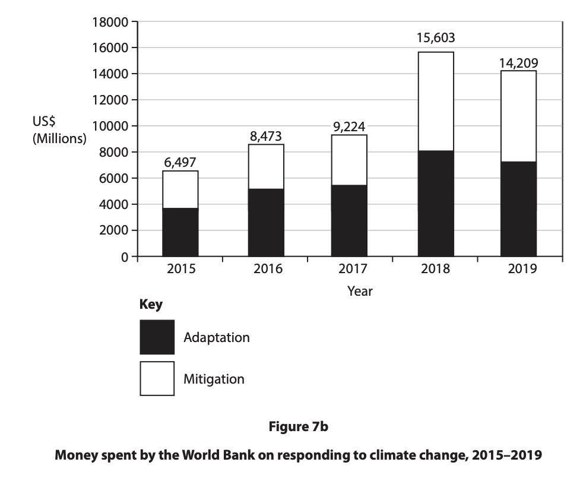
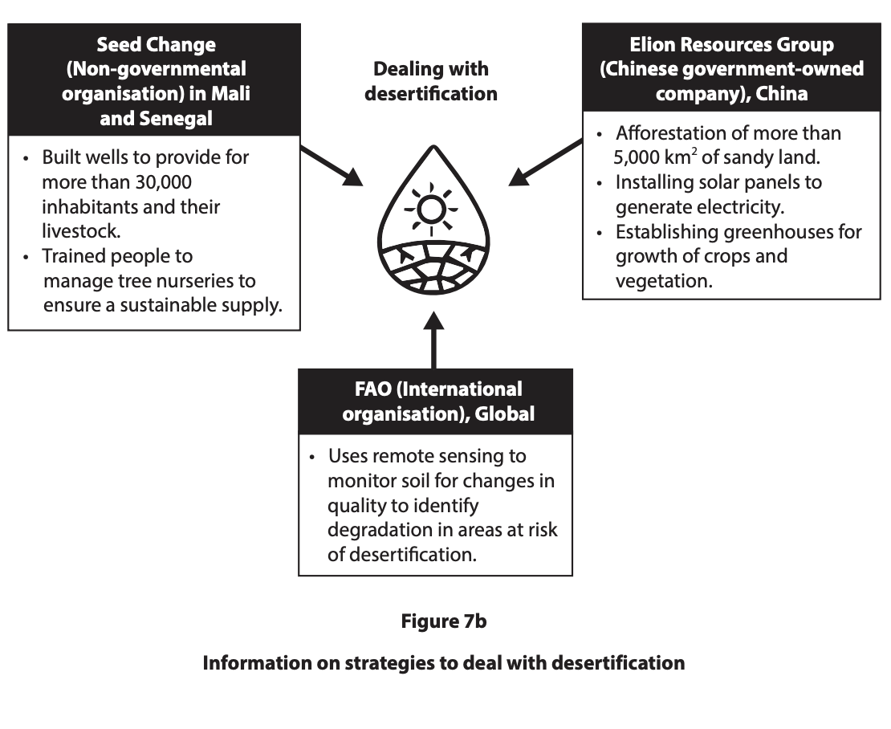
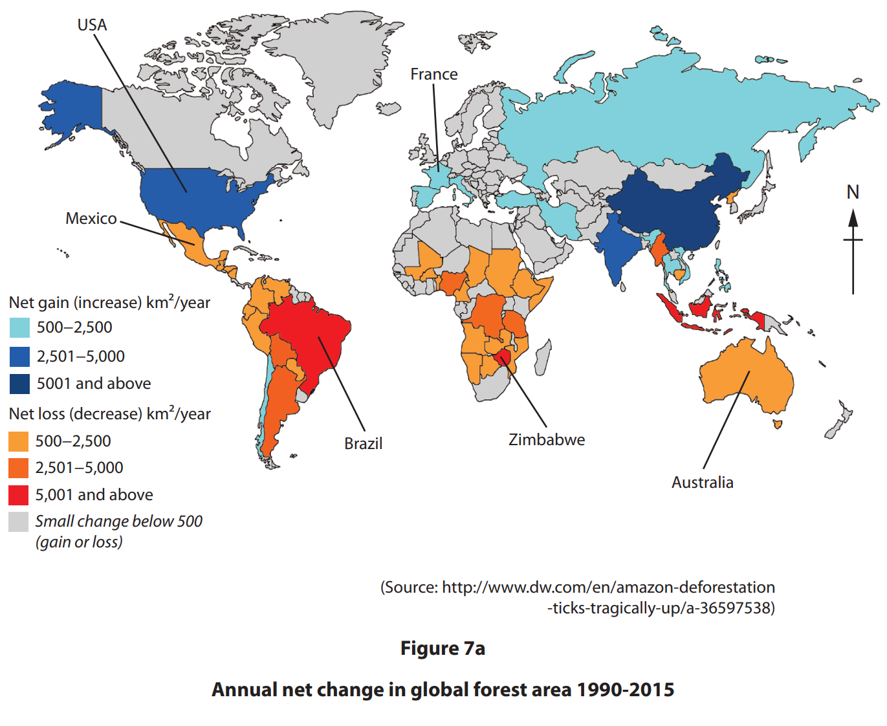
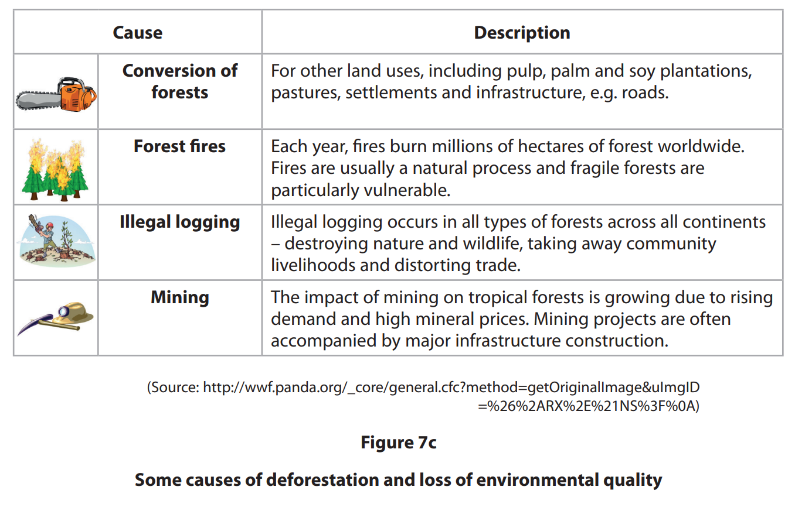
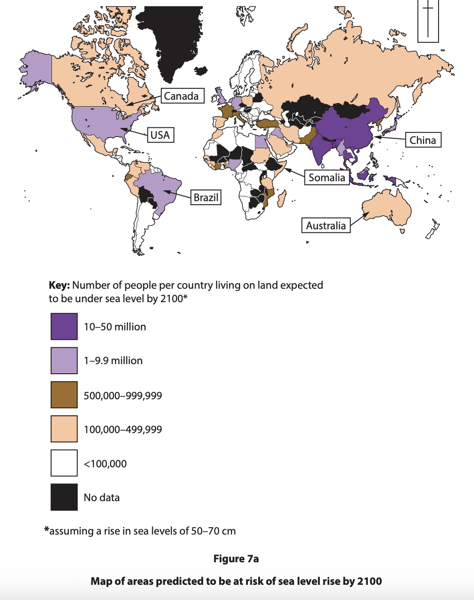

# Exam Questions — Responses on Fragile Environments
**Fragile Environments & Climate Change** · Edexcel IGCSE Geography (4GE1)
> Source: [https://www.savemyexams.com/igcse/geography/edexcel/19/topic-questions/7-fragile-environments-and-climate-change/7-3-responses-on-fragile-environments/exam-questions/](https://www.savemyexams.com/igcse/geography/edexcel/19/topic-questions/7-fragile-environments-and-climate-change/7-3-responses-on-fragile-environments/exam-questions/) · 15 questions · total 67 marks

## Q1 — easy — 2 marks · exam-questions

### 1() — 2 marks — command: define — structured
Define the term** sustainability**?

## Q2 — easy — 1 marks · exam-questions

### 7() — 1 mark — multiple_choice — from paper June 2024 · 4GE1/02
Identify a strategy to try and reduce the impacts of climate change.
- **A.** use of low yield seed varieties
- **B.** use more timber from forests
- **C.** use more fossil fuels
- **D.** use more renewable energy

## Q3 — easy — 1 marks · exam-questions

### 7() — 1 mark — multiple_choice — from paper June 2024 · 4GE1/02
Identify which statement best describes a way of adapting to climate change.
- **A.** increase in cattle farming
- **B.** increase in flood protection
- **C.** increase in the number of airports
- **D.** increase in the use of coal

## Q4 — easy — 1 marks · exam-questions

### 7() — 1 mark — multiple_choice — from paper June 2024 · 4GE1/02R
Identify one potential strategy to reduce desertification.
- **A.** increased grazing
- **B.** increased use of trees for fuelwood
- **C.** over-cultivation
- **D.** water purification systems

## Q5 — easy — 4 marks · exam-questions

### 7((d)) — 4 marks — command: explain — structured — from paper June 2024 · 4GE1/02R
Explain two sustainable rainforest management strategies.

## Q6 — easy — 4 marks · exam-questions

### 7() — 2 marks — command: calculate — structured — from paper June 2023 · 4GE1/02R
Study Figure 7b.

Calculate the mean amount of money spent on responding to climate change. You must show all your workings in the space below.

Give your answer to one decimal place.

### 7() — 2 marks — command: describe — structured — from paper June 2023 · 4GE1/02R
Describe the trends shown in Figure 7b.

## Q7 — easy — 2 marks · exam-questions

### 1() — 2 marks — command: explain — structured
Explain **one **strategy used to manage deforestation.

## Q8 — medium — 4 marks · exam-questions

### 11() — 4 marks — command: explain — structured — from paper June 2017 · 4GE1/01
Explain **two **strategies used to manage desertification.

## Q9 — medium — 4 marks · exam-questions

### 1() — 4 marks — command: outline — structured
Outline **two**  strategies used to ensure a sustainable future for fragile environments.

## Q10 — medium — 4 marks · exam-questions

### 7((e)) — 4 marks — command: explain — structured — from paper June 2022 · 4GE1/02R
Explain **two** strategies to manage water shortages in fragile environments

## Q11 — medium — 6 marks · exam-questions

### 7((g)) — 6 marks — command: assess — structured — from paper June 2023 · 4GE1/02
Study Figure 7b. Assess strategies used to reduce threats from desertification. Refer to the resource in your answer.

## Q12 — medium — 4 marks · exam-questions

### 1() — 4 marks — command: explain — structured
Explain **two **strategies for sustainable rainforest management.

## Q13 — hard — 12 marks · exam-questions

### 7((f)) — 12 marks — command: discuss — structured — from paper June 2019 ·  4GE1/02R
Discuss the view:

| “It is possible to manage the global rates of deforestation in a more sustainable way”. |
|---|

Use Figures 7a, 7b and 7c below and your own knowledge and understanding to support your answer.

## Q14 — hard — 12 marks · exam-questions

### 7((h)) — 12 marks — command: discuss — structured — from paper June 2023 · 4GE1/02
Discuss the view:

“Strategies to reduce threats to fragile environments should be led by governments.”

Use Figures 7a and 7b,  with your own knowledge and understanding, to support your answer. Refer to the resources in your answer.

## Q15 — hard — 6 marks · exam-questions

### 1() — 6 marks — command: assess — structured
Study** Figure 9a.**

**Figure 9a: **Government responses to climate change

| Response | United Kingdom | Developing/emerging country |
|---|---|---|
| Renewable energy targets | Net zero carbon emissions by 2050; 50% of electricity from renewables by 2030 | Targets set but limited by lack of funding and technology |
| International agreements | Signatory to Paris Agreement; hosted COP26 in Glasgow 2021 | Signatory to Paris Agreement but limited capacity to enforce commitments |
| Domestic policy | Carbon tax on industry; phase-out of new petrol and diesel cars by 2035 | Some carbon reduction policies but enforcement inconsistent |
| Financial investment | £12 billion committed to green industries through the Green Industrial Revolution plan | Dependent on international climate finance and aid to fund low-carbon development |
| Public awareness | High levels of public awareness; government campaigns and school curriculum requirements | Growing awareness but literacy and access to media limit reach in rural areas |

Using** Figure 9a, **assess how effective government responses to climate change have been.
