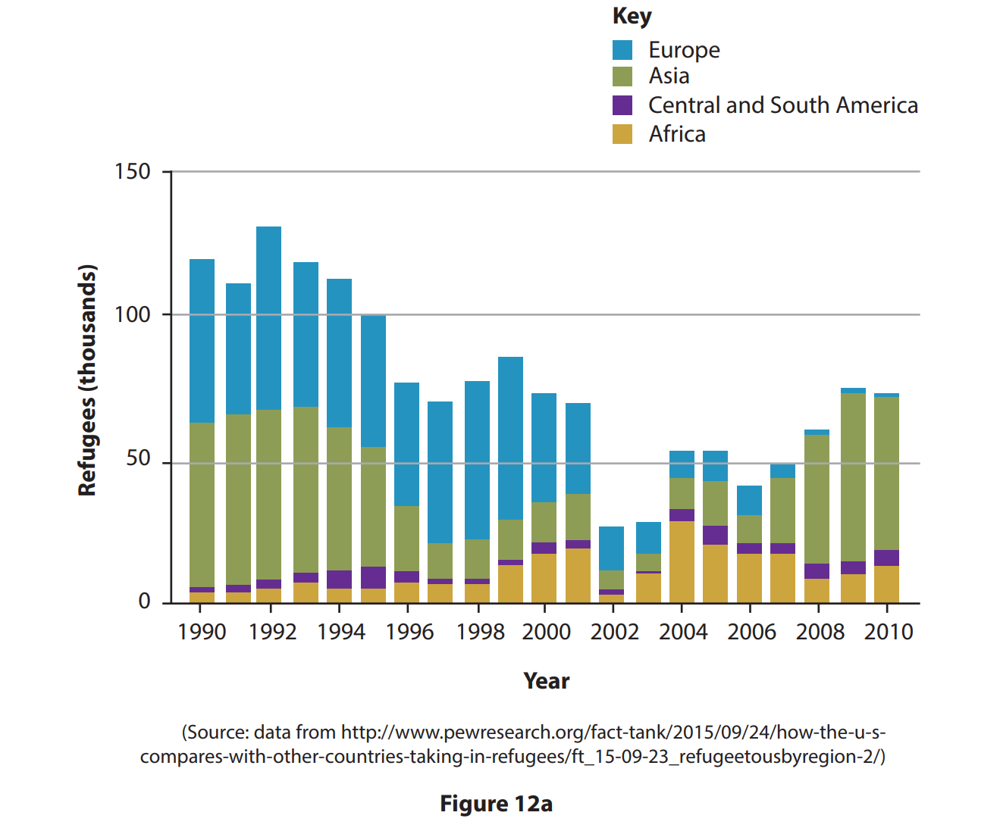
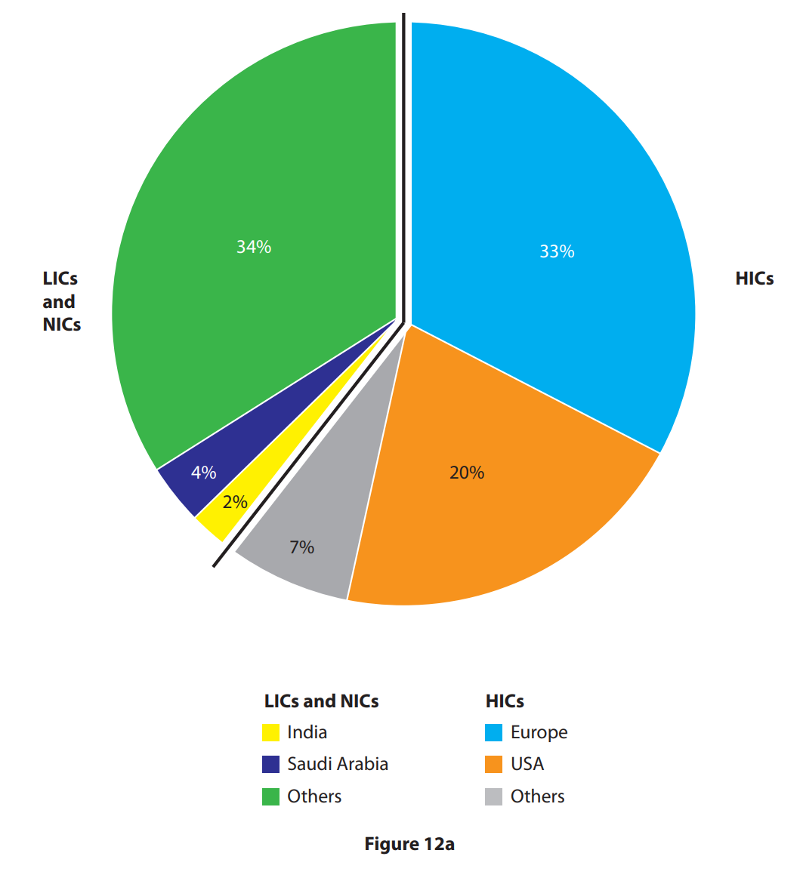
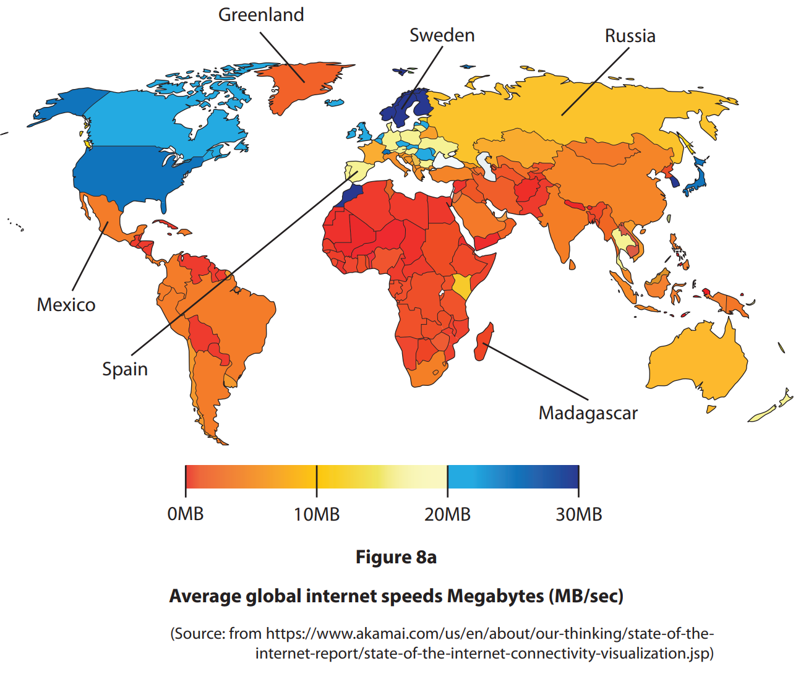
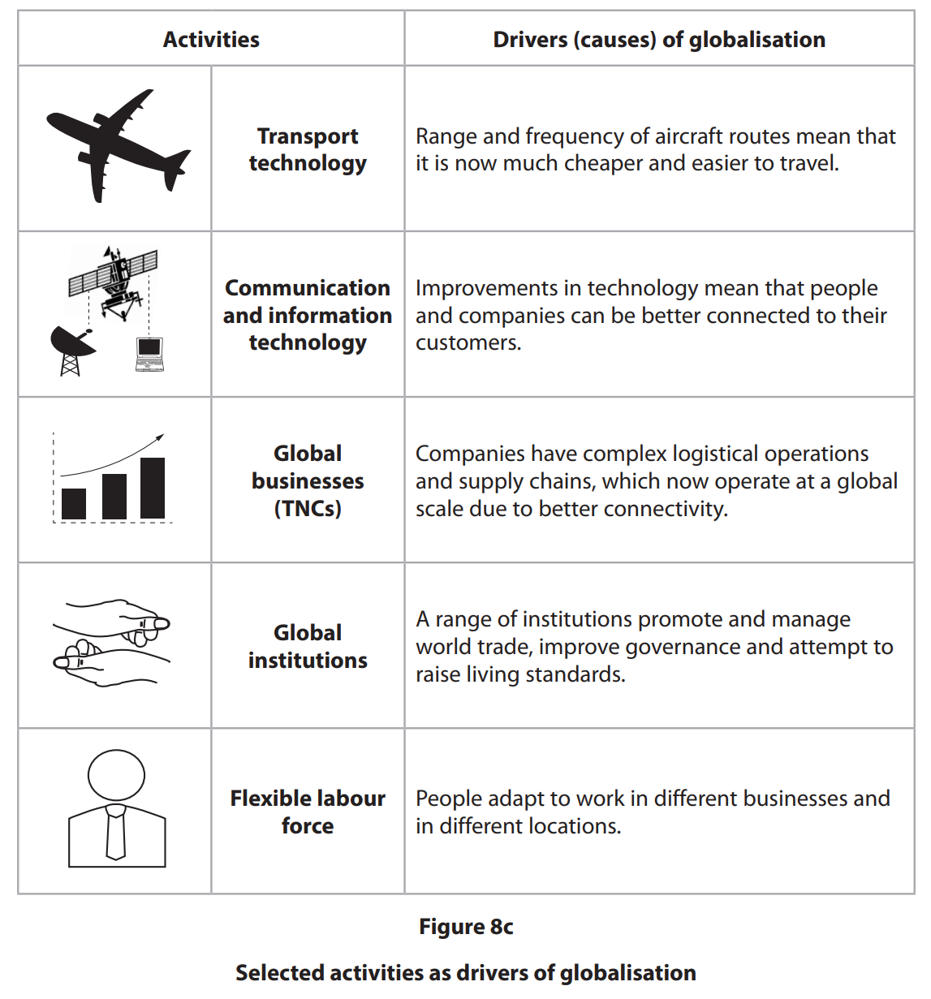
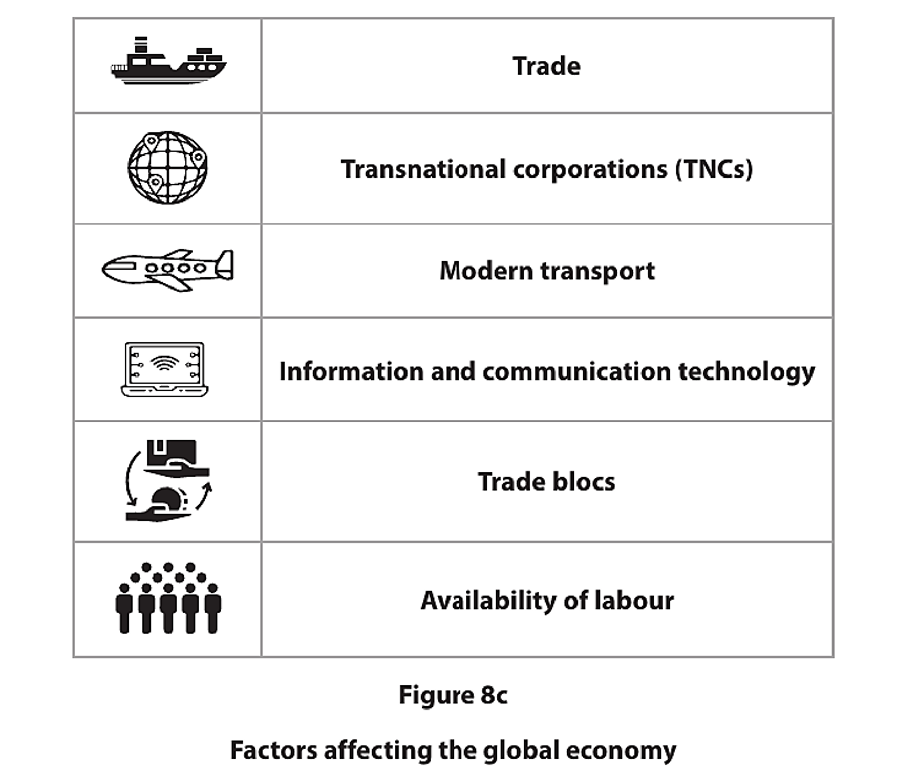
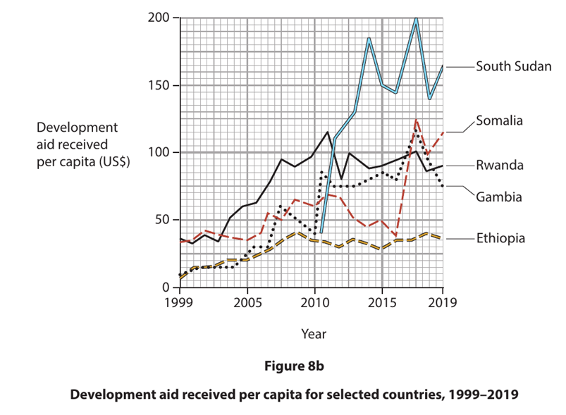
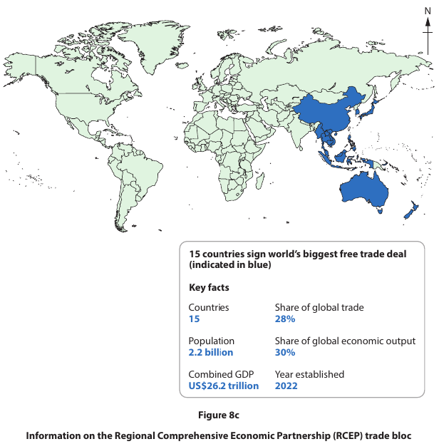

# Exam Questions — The Globalised World
**Globalisation & Migration** · Edexcel IGCSE Geography (4GE1)
> Source: [https://www.savemyexams.com/igcse/geography/edexcel/19/topic-questions/8-globalisation-and-migration/8-1-the-globalised-world/exam-questions/](https://www.savemyexams.com/igcse/geography/edexcel/19/topic-questions/8-globalisation-and-migration/8-1-the-globalised-world/exam-questions/) · 26 questions · total 75 marks

## Q1 — easy — 3 marks · exam-questions

### 12() — 1 mark — multiple_choice — from paper June 2017 · 4GE1/01
Study Figure 12a which shows the continents of origin of refugees entering the USA between 1990 and 2010.

The smallest number of refugees to the USA between 1990 and 2010 came from which continent?

- **A.** Europe
- **B.** Asia
- **C.** Central and South America
- **D.** Africa

### 12() — 2 marks — command: describe — structured — from paper June 2017 · 4GE1/01
Describe the trend in the rate of refugees entering the USA between 1990 and 2010.

## Q2 — easy — 5 marks · exam-questions

### 12() — 1 mark — multiple_choice — from paper June 2018 · 4GE1/01
Study Figure 12a, which shows the destinations of international migrants between 1960 and 2010.

Which area receives the **most **international migrants?

- **A.** USA
- **B.** Europe
- **C.** India
- **D.** Saudi Arabia

### 12() — 2 marks — command: what — structured — from paper June 2018 · 4GE1/01
What is the evidence that developed countries are the main destinations for international migrants?

### 12() — 2 marks — command: suggest — structured — from paper June 2018 · 4GE1/01
Suggest why some international migrants settle in a developing or emerging country.

## Q3 — easy — 1 marks · exam-questions

### 8() — 1 mark — multiple_choice — from paper June 2019 · 4GE1/02
Identify the meaning of the term international migration.
- **A.** people who cross a regional boundary within a country
- **B.** people going on holiday to an overseas destination
- **C.** people moving across international borders
- **D.** people moving from the city to the countryside

## Q4 — easy — 1 marks · exam-questions

### 8() — 1 mark — multiple_choice — from paper June 2019 · 4GE1/02R
Identify **one **main factor encouraging the rise of the global economy.
- **A.** increasing sport
- **B.** overfishing
- **C.** technology
- **D.** intensive agriculture

## Q5 — easy — 1 marks · exam-questions

### 8((b)) — 1 mark — command: define — structured — from paper June 2019 · 4GE1/02
Define the term **push factor.**

## Q6 — easy — 2 marks · exam-questions

### 8() — 2 marks — command: identify — structured — from paper June 2019 · 4GE1/02
Study Figure 8a.

Identify the **two** countries labelled in Figure 8a as having the **highest** and **lowest **internet speeds.

## Q7 — easy — 1 marks · exam-questions

### 8() — 1 mark — multiple_choice — from paper June 2019 · 4GE1/02R
Identify the meaning of the term **WTO**.
- **A.** World Technology Organisation
- **B.** World Trade Operations
- **C.** World Typhoon Organisation
- **D.** World Trade Organisation

## Q8 — easy — 1 marks · exam-questions

### 8() — 1 mark — command: define — structured — from paper June 2019 · 4GE1/02R
Define the term **foreign investment**.

## Q9 — easy — 2 marks · exam-questions

### 8() — 1 mark — multiple_choice — from paper May 2023 · 4GE1/02R
Identify an example of forced migration.
- **A.** moving to another country for work
- **B.** moving to another country to study
- **C.** moving to another country due to war
- **D.** moving to another country to be with family

### 8() — 1 mark — multiple_choice — from paper May 2023 · 4GE1/02R
Identify a pull factor for migration.
- **A.** more job opportunities
- **B.** more unemployment
- **C.** lack of services
- **D.** lack of housing

## Q10 — easy — 2 marks · exam-questions

### 8() — 1 mark — multiple_choice — from paper May 2023 · 4GE1/02
Identify an example of voluntary migration.
- **A.** moving to another country for work
- **B.** moving to another country to escape poverty
- **C.** moving to another country due to war
- **D.** moving to another country due to exploitation

### 8() — 1 mark — multiple_choice — from paper May 2023 · 4GE1/02
Identify a push factor for migration.
- **A.** job opportunities
- **B.** shortage of jobs
- **C.** better services
- **D.** better education

## Q11 — easy — 2 marks · exam-questions

### 8() — 1 mark — multiple_choice — from paper June 2022 · 4GE1/02
Identify the correct word to complete the sentence below:

The … was established to promote free trade and fair trade between countries.
- **A.** International Monetary Fund
- **B.** Oxfam
- **C.** World Bank
- **D.** World Trade Organisation

### 8() — 1 mark — multiple_choice — from paper June 2022 · 4GE1/02
Identify one advantage of transnational corporations (TNCs) for host countries.
- **A.** exploitation of workers
- **B.** infrastructure development
- **C.** profits leak out of the country
- **D.** environmental damage

## Q12 — easy — 1 marks · exam-questions

### 8() — 1 mark — command: define — structured — from paper June 2022 · 4GE1/02
Define the term **commodity chain**.

## Q13 — easy — 3 marks · exam-questions

### 8() — 1 mark — multiple_choice — from paper SAM 2017 · 4GE1/02
Identify **one **reason for economic migration.
- **A.** Go to university
- **B.** Get married
- **C.** Find a job
- **D.** Retire from work

### 8() — 1 mark — command: state — structured — from paper SAM 2017 · 4GE1/02
State **one** economic push factor leading to rural-urban migration

### 8() — 1 mark — command: define — structured — from paper SAM 2017 · 4GE1/02
Define the term ‘voluntary migration’.

## Q14 — easy — 1 marks · exam-questions

### 8((d)) — 1 mark — command: define — structured — from paper Nov 2024 · 4GE1/02
Define the term **global economy**?

## Q15 — easy — 2 marks · exam-questions

### 8((d)) — 2 marks — command: name — structured — from paper June 2023 · 4GE1/02
Name **two **global institutions that can influence the global economy.

## Q16 — easy — 1 marks · exam-questions

### 1() — 1 mark — multiple_choice
Which **one** of the following best describes globalisation?
- **A.** The process by which countries close their borders to international trade
- **B.** The decline of international trade due to rising transport costs
- **C.** The movement of people from rural areas to cities within one country
- **D.** The increasing connection and integration of the world's economies, cultures, and populations

## Q17 — easy — 1 marks · exam-questions

### 1() — 1 mark — multiple_choice
Which **one **of the following is a pull factor for international migration?
- **A.** Lack of employment opportunities in the home country
- **B.** Political conflict and persecution in the home country
- **C.** Higher wages and better living standards in the destination country
- **D.** Environmental disasters destroying homes and farmland

## Q18 — easy — 1 marks · exam-questions

### 1() — 1 mark — command: state — structured
State **one **way that transnational corporations (TNCs) contribute to globalisation.

## Q19 — medium — 4 marks · exam-questions

### 8((c)) — 4 marks — command: explain — structured — from paper June 2022 · 4GE1/02
Explain **two** reasons why trade is important for the global economy.

## Q20 — medium — 4 marks · exam-questions

### 12((b)) — 4 marks — command: outline — structured — from paper June 2017 · 4GE1/01
Outline **two **reasons for the rise of the global economy.

## Q21 — medium — 4 marks · exam-questions

### 12((b)) — 4 marks — command: outline — structured — from paper June 2018 · 4GE1/01
Outline **two **reasons for the growth of production chains.

## Q22 — medium — 4 marks · exam-questions

### 1() — 4 marks — command: explain — structured
Explain **two** ways global institutions help countries to develop.

## Q23 — medium — 4 marks · exam-questions

### 1() — 4 marks — command: explain — structured
Explain **two** push factors that cause people to migrate from rural areas.

## Q24 — hard — 6 marks · exam-questions

### 8((f)) — 6 marks — command: assess — structured — from paper June 2019 · 4GE1/02
Study Figure 8c.

Assess the different factors that have enabled globalisation.

## Q25 — hard — 6 marks · exam-questions

### 8((e)) — 6 marks — command: assess — structured — from paper June 2024 · 4GE1/02R
Study Figure 8c.

Assess the factors that have contributed to a more globalised economy.

You **must **refer to the resource in your answer.

## Q26 — hard — 12 marks · exam-questions

### 8((f)) — 12 marks — command: discuss — structured — from paper June 2024 · 4GE1/02
Discuss the view:

'Trade has been the greatest driver of the global economy.'

Use Figures 8b and 8c and your knowledge and understanding to support the answer.

You **must **refer to the resources in your answer.
