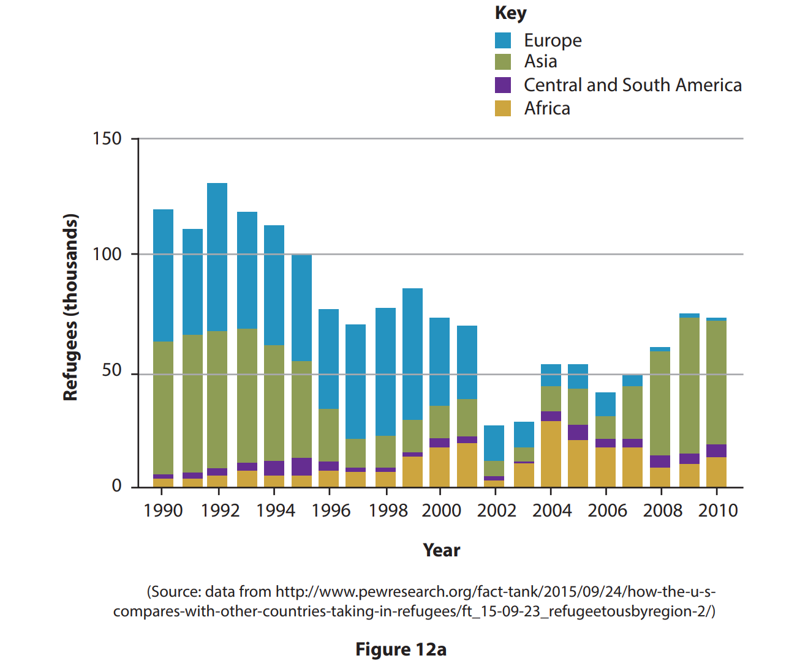
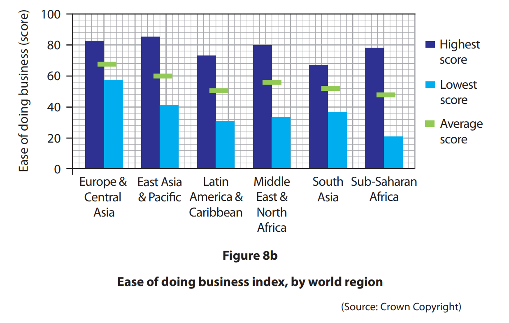
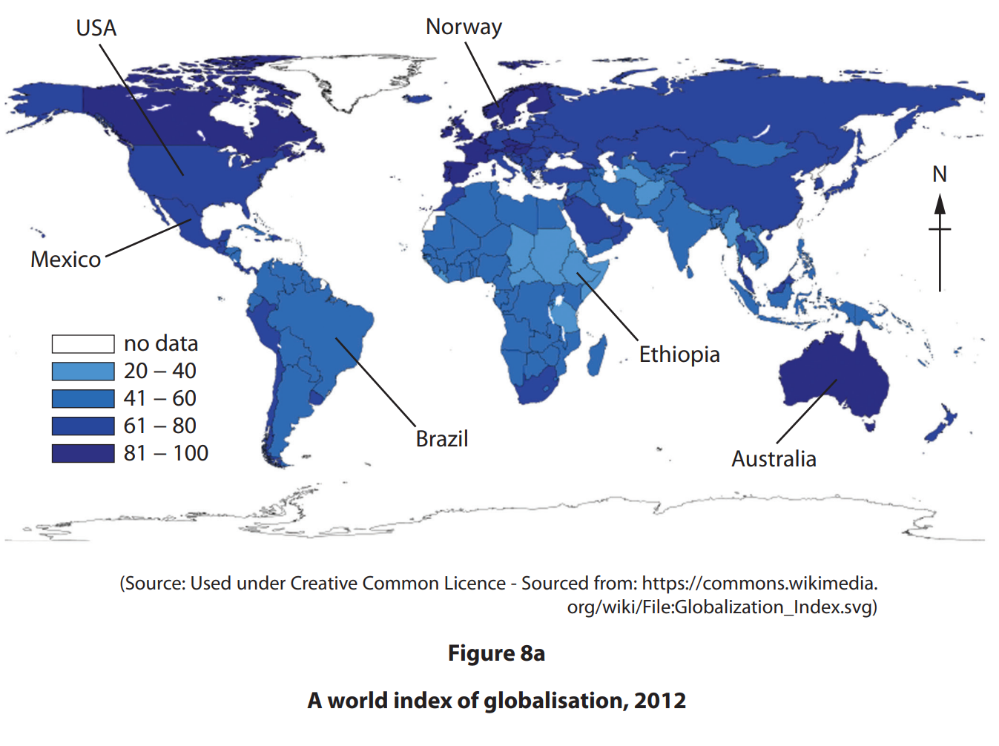
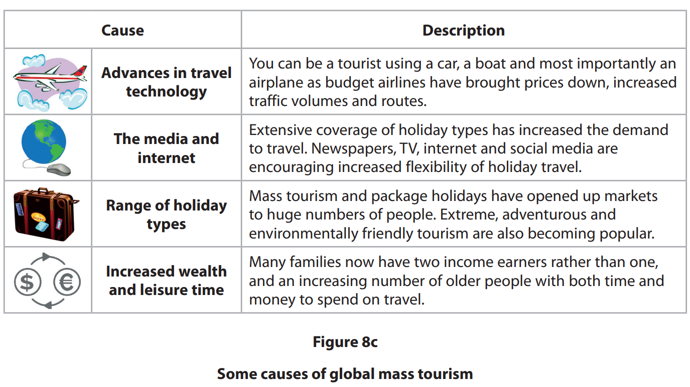

# Exam Questions — Impacts of Globalisation
**Globalisation & Migration** · Edexcel IGCSE Geography (4GE1)
> Source: [https://www.savemyexams.com/igcse/geography/edexcel/19/topic-questions/8-globalisation-and-migration/8-2-impacts-of-globalisation/exam-questions/](https://www.savemyexams.com/igcse/geography/edexcel/19/topic-questions/8-globalisation-and-migration/8-2-impacts-of-globalisation/exam-questions/) · 24 questions · total 106 marks

## Q1 — easy — 2 marks · exam-questions

### 12() — 2 marks — command: suggest — structured — from paper June 2017 · 4GE1/01
Study Figure 12a which shows the continents of origin of refugees entering the USA between 1990 and 2010.

Suggest **one **issue resulting from refugees entering HICs like the USA.

## Q2 — easy — 2 marks · exam-questions

### 12() — 2 marks — command: describe — structured — from paper June 2018 · 4GE1/01
Describe the nature of the global shift in manufacturing.

## Q3 — easy — 4 marks · exam-questions

### 8() — 2 marks — command: calculate — structured — from paper June 2019 · 4GE1/02
Study Figure 8b.

Calculate the range in the ‘Ease of doing business’ index for Sub-Saharan Africa.

You **must **show all your workings in the space below.

### 8() — 2 marks — command: identify — structured — from paper June 2019 · 4GE1/02
Identify the differences in the ‘Ease of doing business’ index between Europe and Central Asia and Sub-Saharan Africa.

## Q4 — easy — 2 marks · exam-questions

### 1() — 2 marks — command: explain — structured
Explain **one** advantage of mass tourism.

## Q5 — easy — 1 marks · exam-questions

### 1() — 1 mark — command: identify — structured
Identify **one **disadvantage of mass tourism.

## Q6 — easy — 1 marks · exam-questions

### 1() — 1 mark — multiple_choice
Identify **one **factor that has encouraged growth of mass tourism.
- **A.** access to more forests
- **B.** availability of jobs
- **C.** faster transport
- **D.** increased exports

## Q7 — easy — 2 marks · exam-questions

### 8((b)) — 2 marks — command: state — structured — from paper May 2023 · 4GE1/02
State **one **reason why a government might want to encourage tourism.

## Q8 — easy — 1 marks · exam-questions

### 1() — 1 mark — multiple_choice
Identify **one **disadvantage of transnational corporations (TNCs) for host countries.
- **A.** job creation
- **B.** technology transfer
- **C.** profits leak out of the country
- **D.** increased tax revenue

## Q9 — easy — 1 marks · exam-questions

### 8() — 1 mark — command: state — structured — from paper June 2024 · 4GE1/02
State **one **environmental impact of tourism.

## Q10 — easy — 2 marks · exam-questions

### 1() — 2 marks — command: explain — structured
Explain **one **negative environmental impact of the growth of global tourism.

## Q11 — medium — 4 marks · exam-questions

### 1() — 4 marks — command: describe — structured
Describe the consequences for an emerging country when its place in the world economy changes.

## Q12 — medium — 6 marks · exam-questions

### 8() — 2 marks — command: identify — structured — from paper June 2019 · 4GE1/02R
Study Figure 8a.

Identify **two **countries labelled in Figure 8a with the highest index of globalisation.

### 2() — 4 marks — command: suggest — structured
Suggest **two **possible reasons for the pattern shown on Figure 8a.

## Q13 — medium — 4 marks · exam-questions

### 8((d)) — 4 marks — command: explain — structured — from paper June 2019 · 4GE1/02
Explain **two **positive impacts of migration for destination areas.

## Q14 — medium — 4 marks · exam-questions

### 8() — 4 marks — command: suggest — structured — from paper June 2019 · 4GE1/02
Suggest **two **reasons for the pattern shown on Figure 8a.

## Q15 — medium — 4 marks · exam-questions

### 8((c)) — 4 marks — command: explain — structured — from paper June 2019 · 4GE1/02R
Explain **two** positive impacts of globalisation.

## Q16 — medium — 4 marks · exam-questions

### 8((c)) — 4 marks — command: explain — structured — from paper June 2022 · 4GE1/02
Explain **two** reasons why trade is important for the global economy.

## Q17 — medium — 4 marks · exam-questions

### 1() — 4 marks — command: explain — structured
Explain **one positive **and **one negative **impact of migration on people.

## Q18 — medium — 4 marks · exam-questions

### 1() — 4 marks — command: explain — structured
Explain **one **benefit and **one **cost to a developing or emerging country of hosting a transnational corporation (TNC).

## Q19 — hard — 6 marks · exam-questions

### 8((e)) — 6 marks — command: assess — structured — from paper June 2019 · 4GE1/02R
Study Figure 8c.

Assess the different factors that have caused the rise in global tourism.

## Q20 — hard — 6 marks · exam-questions

### 12((d)) — 6 marks — command: discuss — structured — from paper June 2017 · 4GE1/01
Discuss the costs and benefits that TNCs bring to countries in which they locate.

## Q21 — hard — 12 marks · exam-questions

### 8((g)) — 12 marks — command: discuss — structured — from paper June 2019 · 4GE1/02
Discuss the view. 'The causes and impacts of globalisation are distributed unevenly.'

Use Figures 8a, 8b and 8c and your own knowledge and understanding to support your answer.

## Q22 — hard — 12 marks · exam-questions

### 1() — 12 marks — command: discuss — structured
Discuss the extent to which economic factors have been more important than technological factors in causing the growth of global mass tourism.

You must refer to **Figure 8c** and your own knowledge and understanding in your answer.

## Q23 — hard — 6 marks · exam-questions

### 1() — 6 marks — command: assess — structured
Study** Figure 9a.**

**Figure 9a: **Approaches to sustainable tourism

| Approach | Named developed country | Named developing or emerging country |
|---|---|---|
| Limiting visitor numbers | National park visitor caps introduced in some areas to reduce erosion and overcrowding | Gorilla trekking permits strictly limited to protect endangered species and reduce habitat disturbance |
| Eco-certification schemes | Government-backed eco-labelling for hotels and tour operators meeting sustainability standards | Community-run eco-lodges certified by national tourism boards to ensure local benefit |
| Community involvement | Local communities consulted on tourism development plans; some profit-sharing schemes in place | Tourism revenue directed into community funds for schools, healthcare, and conservation |
| Transport policies | Investment in low-carbon transport options such as electric buses in tourist hotspots | Limited infrastructure making low-carbon transport difficult; most tourists rely on internal flights or road travel |
| Education and awareness | Tourist information campaigns promoting responsible behaviour at natural and cultural sites | Ranger-led guided tours educating visitors about local ecosystems and conservation challenges |

Using** Figure 9a, **assess how effective these approaches are in making tourism more sustainable.

## Q24 — hard — 12 marks · exam-questions

### 1() — 12 marks — command: discuss — structured
Study** Figure 10a.**

'The world has never been more connected. International trade has more than doubled in value since 2000. Over 280 million people now live outside their country of birth. Global tourism generates over \$1.5 trillion in export earnings each year, supporting millions of jobs worldwide. Yet for many communities in developing countries, the benefits of this connected world remain out of reach. Wages in TNC factories are often a fraction of those paid in developed countries, while profits flow back to wealthy shareholders abroad. Migration separates families, drains skilled workers from the countries that trained them, and leaves millions vulnerable to exploitation.'

**'Globalisation has brought more benefits than problems for people around the world.'**

Discuss this view. Use **Figure 10a** and your own knowledge.
