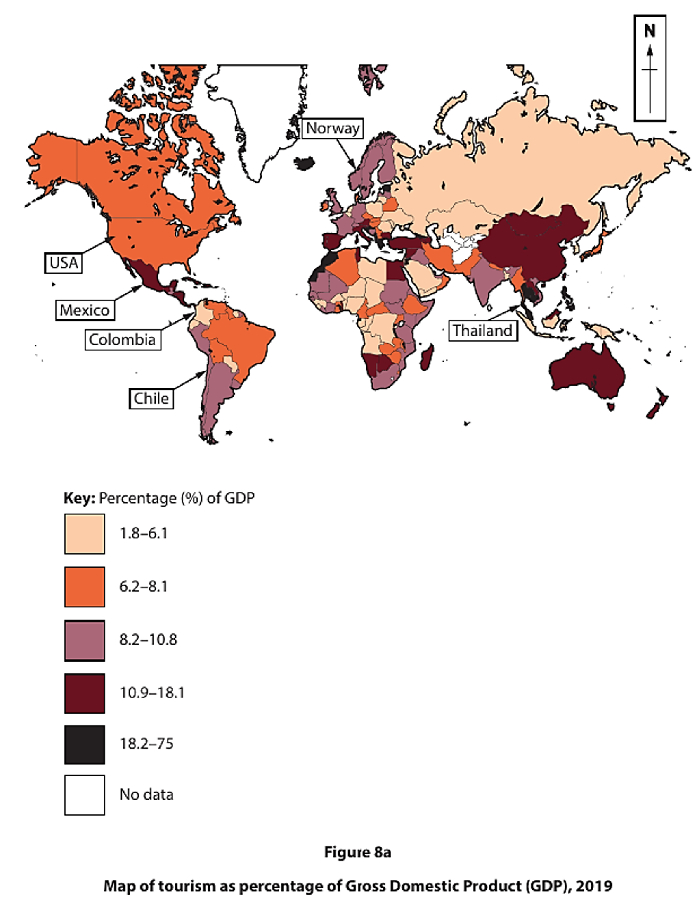
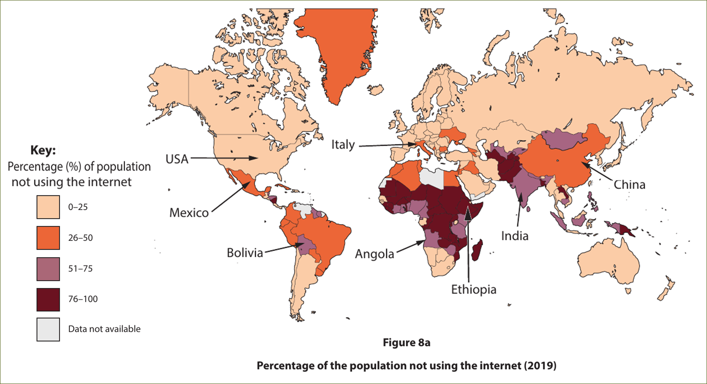
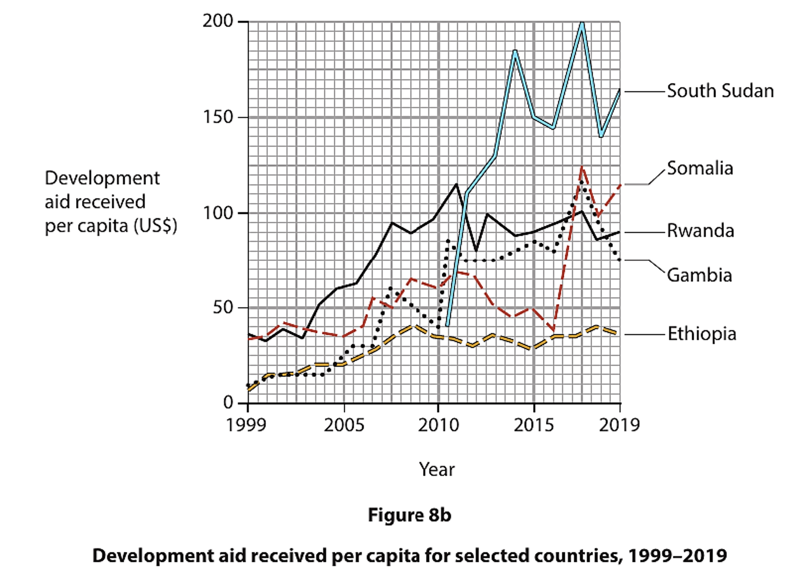
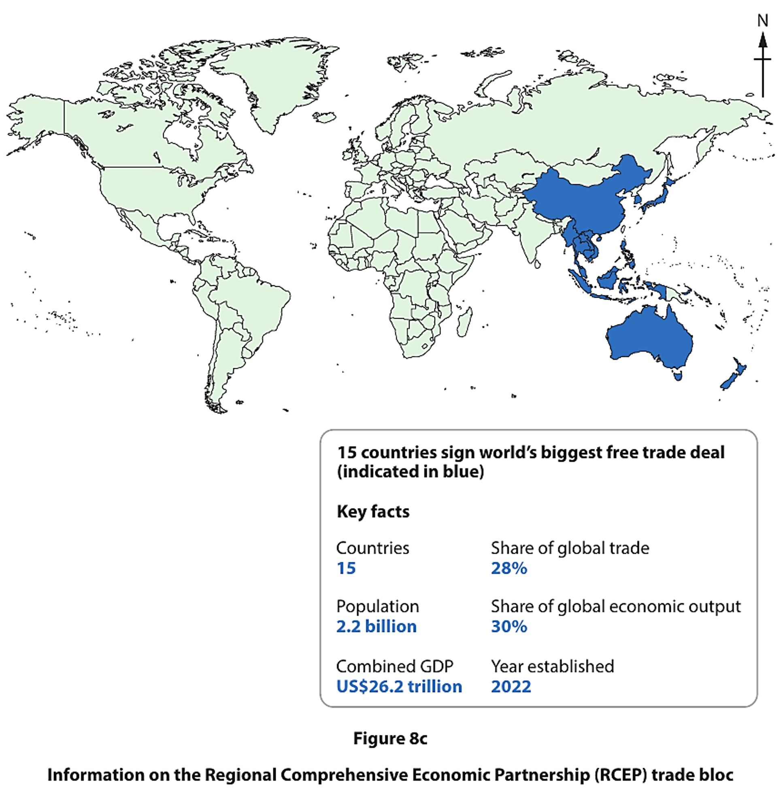

# Exam Questions — Responses to Globalisation
**Globalisation & Migration** · Edexcel IGCSE Geography (4GE1)
> Source: [https://www.savemyexams.com/igcse/geography/edexcel/19/topic-questions/8-globalisation-and-migration/8-3-responses-to-globalisation/exam-questions/](https://www.savemyexams.com/igcse/geography/edexcel/19/topic-questions/8-globalisation-and-migration/8-3-responses-to-globalisation/exam-questions/) · 14 questions · total 54 marks

## Q1 — easy — 2 marks · exam-questions

### 12() — 2 marks — command: suggest — structured — from paper June 2017 · 4GE1/01
Study Figure 12a, which shows the continents of origin of refugees entering the USA between 1990 and 2010.

Suggest **one **issue resulting from refugees entering developed countries like the USA.

## Q2 — easy — 2 marks · exam-questions

### 8((b)) — 2 marks — command: state — structured — from paper June 2023 · 4GE1/02r
State **one** reason why a government might want to encourage sustainable tourism.

## Q3 — easy — 2 marks · exam-questions

### 8((d)) — 2 marks — command: state — structured — from paper June 2023 · 4GE1/02r
State **two **ways countries manage migration.

## Q4 — easy — 1 marks · exam-questions

### 1() — 1 mark — multiple_choice
Identify the best strategy to make tourism more sustainable.
- **A.** increasing the number of flights
- **B.** increasing international investment
- **C.** limiting information on the tourist sites
- **D.** limiting numbers of tourists

## Q5 — easy — 2 marks · exam-questions

### 1() — 2 marks — command: state — structured
State **two **geographical characteristics that influence a nation's geopolitical influence.

## Q6 — easy — 7 marks · exam-questions

### 8() — 1 mark — command: identify — structured — from paper June 2023 · 4GE1/02
Study Figure 8a.

Identify the labelled country with the highest percentage of GDP from tourism.

### 8() — 2 marks — command: compare — structured — from paper June 2023 · 4GE1/02
Compare the patterns shown for Asia and for South America.

### 8() — 2 marks — command: suggest — structured — from paper June 2023 · 4GE1/02
Suggest one possible impact of the global pattern shown.

### 8() — 2 marks — command: explain — structured — from paper June2023 · 4GE1/02
Explain why the data shown in Figure 8a might be a good indicator of a global economy.

## Q7 — easy — 2 marks · exam-questions

### 1() — 2 marks — command: describe — structured
Describe **one** way that geopolitical relationships between countries affect international trade.

## Q8 — easy — 2 marks · exam-questions

### 1() — 2 marks — command: explain — structured
Explain **one **strategy used by a named developed or developing country to manage long-term migration.

## Q9 — medium — 4 marks · exam-questions

### 8((e)) — 4 marks — command: explain — structured — from paper June 2023 · 4GE1/02r
Explain **two** impacts of international migration on the countries migrants have left (donor countries).

## Q10 — medium — 4 marks · exam-questions

### 8((d)) — 4 marks — command: explain — structured — from paper June 2019 · 4GE1/02
Explain **two **positive impacts of migration for destination areas.

## Q11 — medium — 4 marks · exam-questions

### 8((c)) — 4 marks — command: explain — structured — from paper June 2024 · 4GE1/02r
Explain how geopolitical relationships between countries can affect trade and tourism.

## Q12 — medium — 4 marks · exam-questions

### 1() — 4 marks — command: explain — structured
Explain how geopolitical relationships between countries can affect migration.

## Q13 — medium — 6 marks · exam-questions

### 8() — 2 marks — command: identify — structured — from paper June 2022 · 4GE1/02
Study Figure 8a.

Identify the country with the highest and lowest percentage of the population who do not use the internet.

### 8() — 4 marks — command: suggest — structured — from paper June 2022 · 4GE1/02
Suggest two possible reasons for the pattern shown in Figure 8a.

## Q14 — hard — 12 marks · exam-questions

### 8((f)) — 12 marks — command: discuss — structured — from paper June 2024 · 4GE1/02
Discuss the view:

**'Trade has been the greatest driver of the global economy.'**

Use Figures 8b and 8c and your own knowledge and understanding to support your answer.

You must refer to the resources in your answer.

