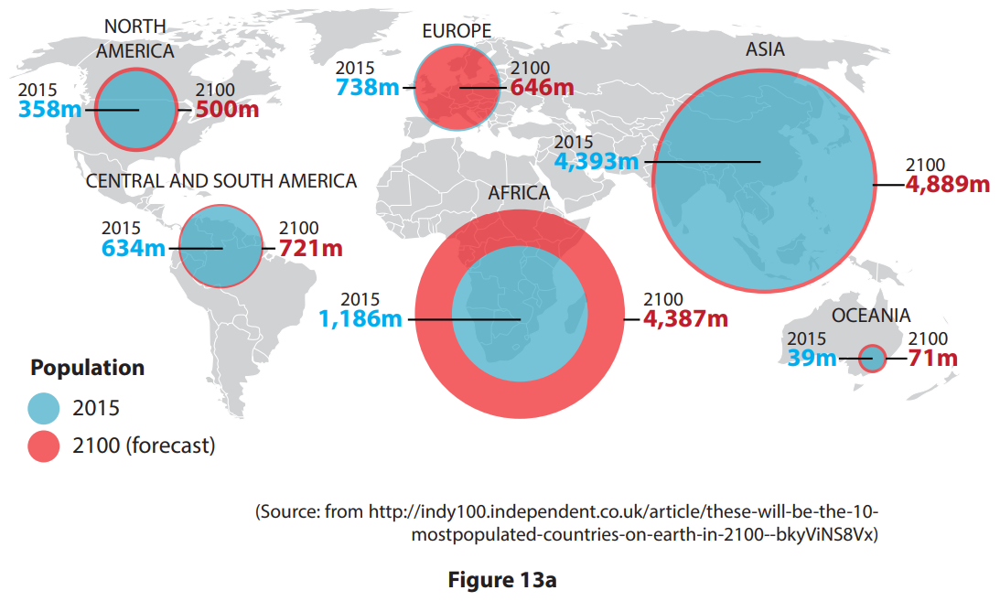
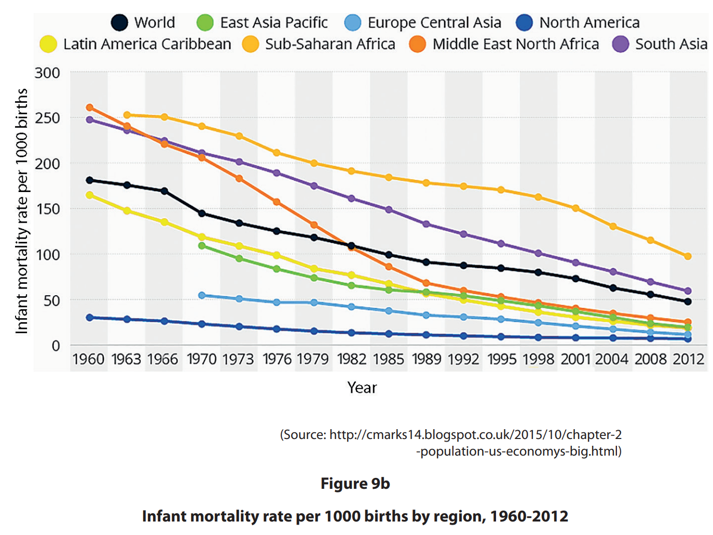
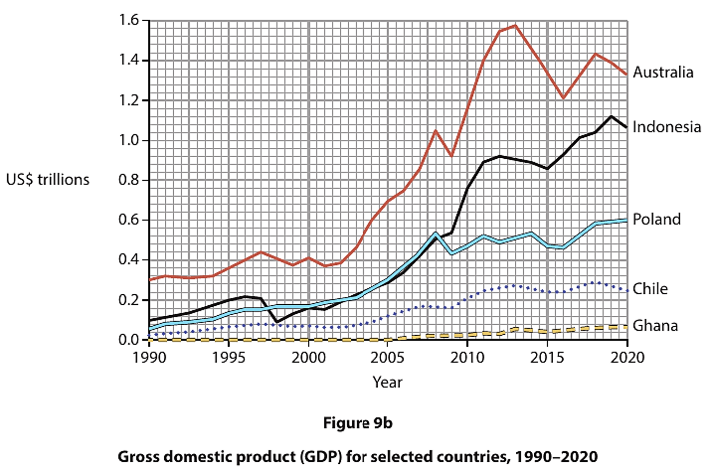
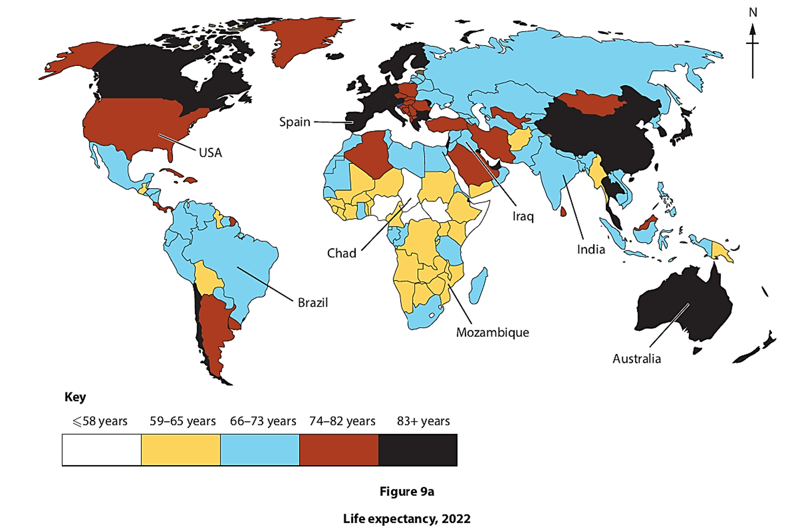
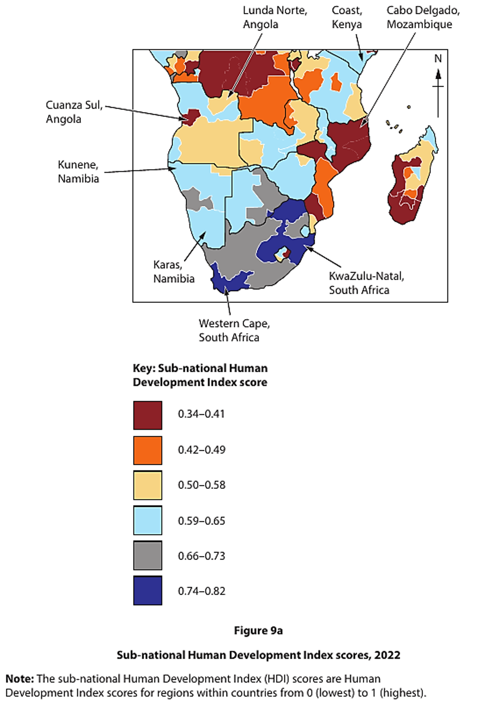
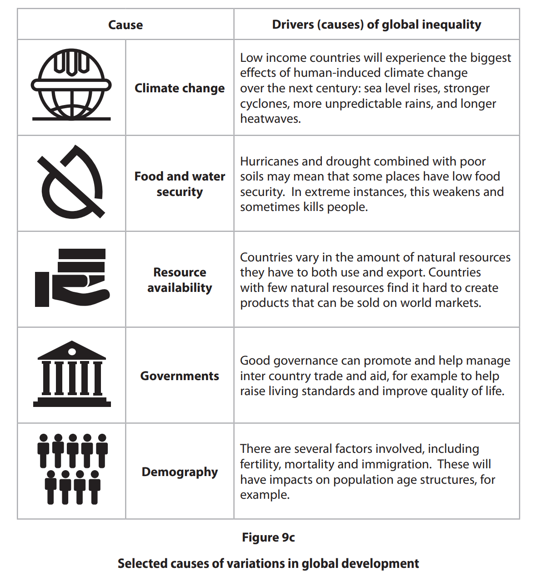
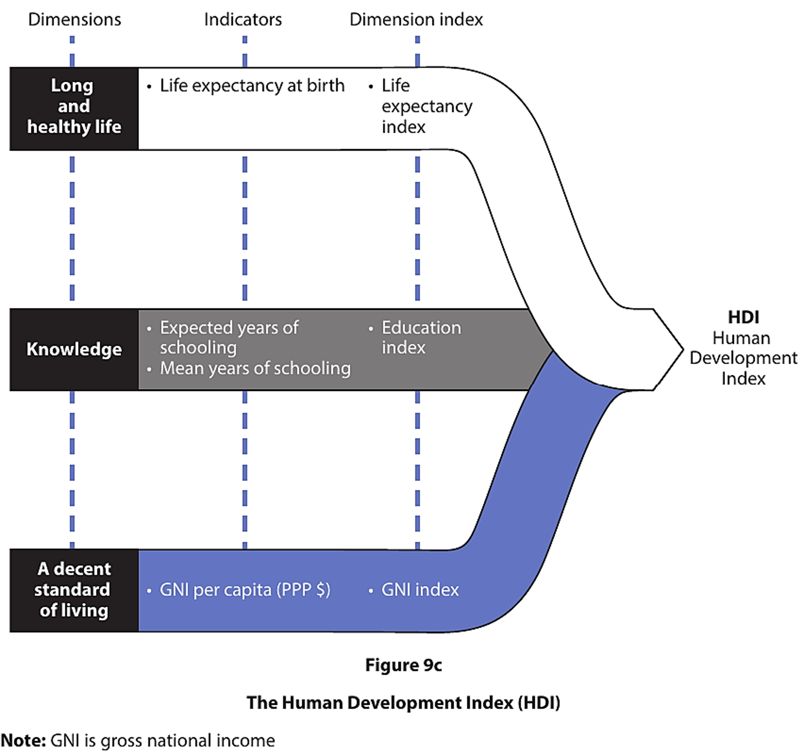
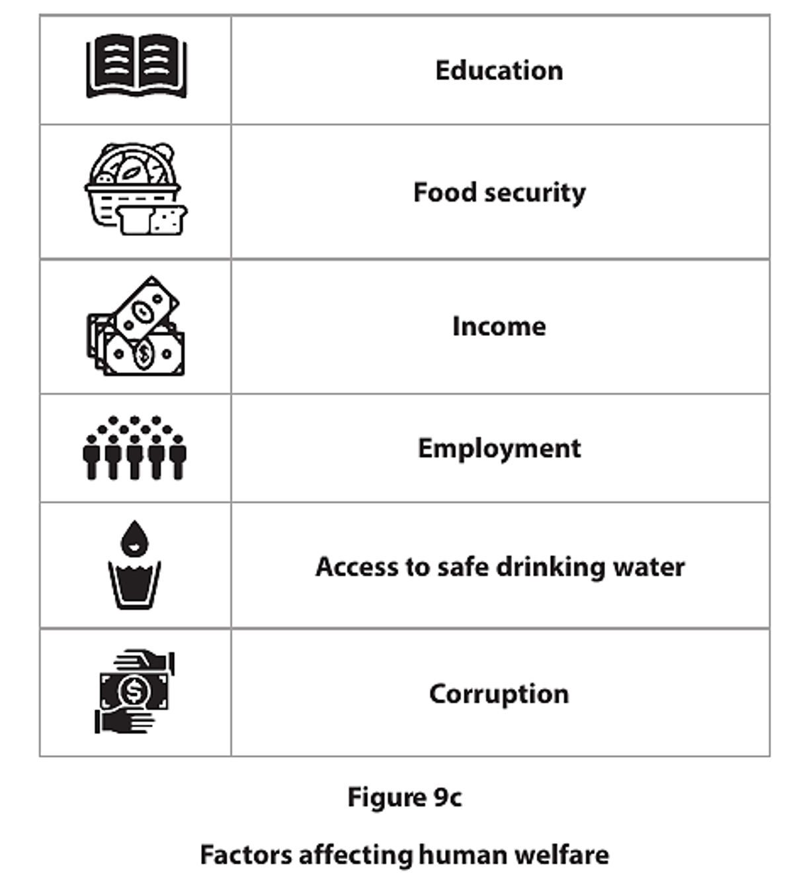
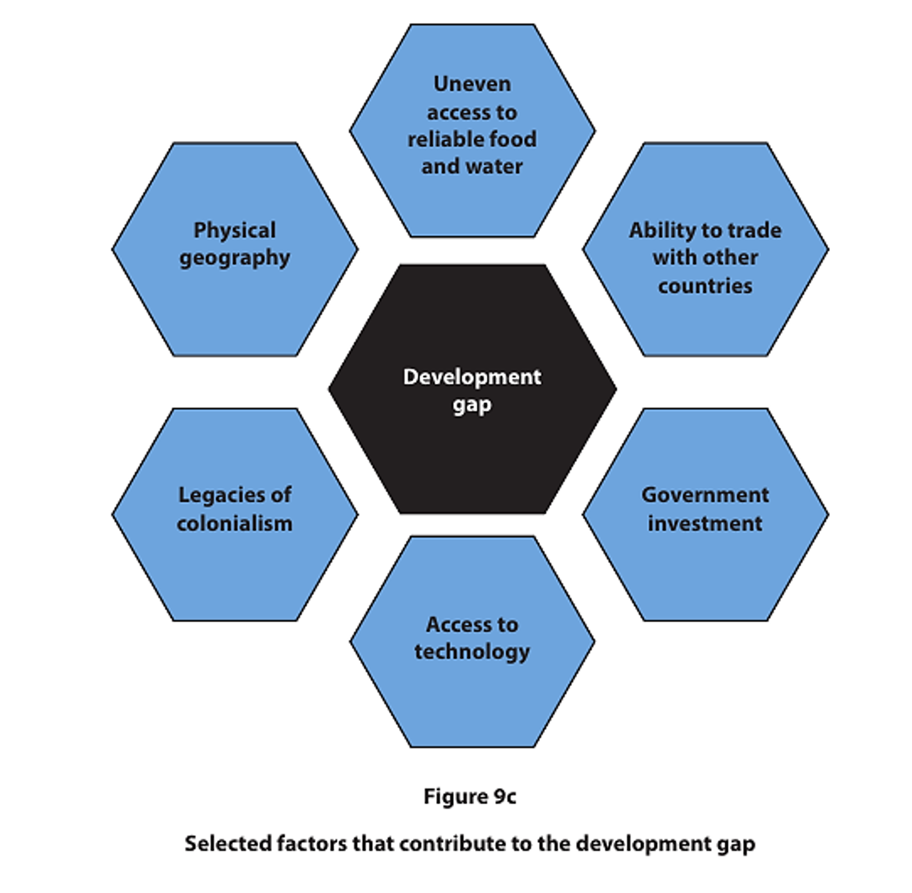
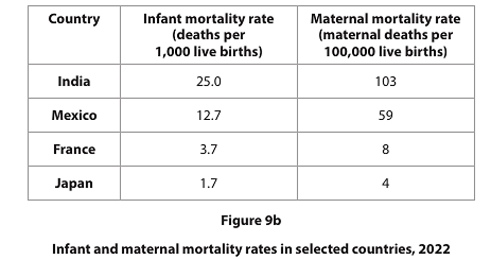

# Exam Questions — Development & Human Welfare
**Development & Human Welfare** · Edexcel IGCSE Geography (4GE1)
> Source: [https://www.savemyexams.com/igcse/geography/edexcel/19/topic-questions/9-development-and-human-welfare/9-1-development-and-human-welfare/exam-questions/](https://www.savemyexams.com/igcse/geography/edexcel/19/topic-questions/9-development-and-human-welfare/9-1-development-and-human-welfare/exam-questions/) · 24 questions · total 100 marks

## Q1 — easy — 3 marks · exam-questions

### 13() — 1 mark — multiple_choice — from paper June 2017 · 4GE1/01
Study Figure 13a which gives the population of the continents in 2015 and forecasts for 2100.

Which **one** of the following continents had the largest population in 2015?

- **A.** North America
- **B.** Africa
- **C.** Asia
- **D.** Europe

### 13() — 2 marks — command: describe — structured — from paper June 2017 · 4GE1/01
Describe the trends in the rate of population growth by 2100.

## Q2 — easy — 1 marks · exam-questions

### 9() — 1 mark — multiple_choice — from paper June 2019 · 4GE1/02
Identify the meaning of the term **quality of life**.
- **A.** a person’s well-being in terms of health and happiness
- **B.** a person’s level of deprivation
- **C.** a person’s cultural identity
- **D.** a person’s type of employment and income level

## Q3 — easy — 2 marks · exam-questions

### 9() — 1 mark — multiple_choice — from paper June 2019 · 4GE1/02R
Identify **one** factor that could be used as a measure of development.
- **A.** participation in sport
- **B.** water availability
- **C.** index of political corruption
- **D.** bottom-up development

### 9() — 1 mark — command: define — structured — from paper June 2019 · 4GE1/02R
Define the term **water security**.

## Q4 — easy — 3 marks · exam-questions

### 9() — 1 mark — multiple_choice — from paper June 2019 · 4GE1/02R
Identify the meaning of the term **fertility rate**.
- **A.** the number of live births per thousand of population per year
- **B.** the number of deaths in a particular population
- **C.** the number of births in the total population
- **D.** the number of births per woman in a population

### 9() — 2 marks — command: calculate — structured — from paper June 2019 · 4GE1/02R
Study Figure 9b .

Calculate the range in infant mortality for **South Asia** between 1960 and 2012.

You must show all your workings in the space below.

## Q5 — easy — 1 marks · exam-questions

### 9() — 1 mark — multiple_choice — from paper Nov 2024 · 4GE1/02
Identify **one** social indicator of development.
- **A.** carbon emissions per capita
- **B.** gross domestic product
- **C.** gross national product
- **D.** literacy rate

## Q6 — easy — 1 marks · exam-questions

### 9() — 1 mark — multiple_choice — from paper June 2024 · 4GE1/02
Identify the definition of gross domestic product (GDP).
- **A.** a measure of development including health and income
- **B.** a measure of improvement in inequality
- **C.** the total value of all imports within a country in a year
- **D.** the total value of goods and services produced by a country in a year

## Q7 — easy — 1 marks · exam-questions

### 9() — 1 mark — multiple_choice — from paper June 2024 · 4GE1/02R
Identify the best definition of infant mortality rate.
- **A.** number of deaths before age 1, per 1,000 live births in a month
- **B.** number of deaths before age 1, per 1,000 live births in a year
- **C.** number of deaths before age 5, per 1,000 live births in a year
- **D.** number of deaths before age 5, per 1,000 live births in a month

## Q8 — easy — 4 marks · exam-questions

### 9() — 2 marks — command: calculate — structured — from paper June 2024 · 4GE1/02R
Study Figure 9b.

Calculate the range in gross domestic product (GDP) for Australia from 2000 to 2020.

You must show all your workings in the space below in US\$ trillions.

### 2() — 2 marks — command: describe — structured
Describe a trend shown.

## Q9 — easy — 1 marks · exam-questions

### 9((b)) — 1 mark — command: state — structured — from paper June 2023 · 4GE1/02
State two ways of measuring inequality.

## Q10 — easy — 2 marks · exam-questions

### 9() — 2 marks — command: state — structured — from paper June  2023 · 4GE1/02R
State two quality of life indicators other than GDP per capita.

## Q11 — easy — 1 marks · exam-questions

### 1() — 1 mark — multiple_choice
Which **one **of the following is the best definition of gross domestic product (GDP)?
- **A.** A measure of development that includes health, education, and income combined
- **B.** The total value of goods and services produced by a country in a year
- **C.** The total value of all imports entering a country in a year
- **D.** A measure of the inequality between rich and poor within a country

## Q12 — easy — 1 marks · exam-questions

### 1() — 1 mark — multiple_choice
Which **one **of the following best describes the Human Development Index (HDI)?
- **A.** A measure of a country's total economic output per year
- **B.** A measure of the number of people living below the poverty line
- **C.** A composite measure combining life expectancy, education, and income
- **D.** A measure of a country's total exports and imports

## Q13 — easy — 1 marks · exam-questions

### 1() — 1 mark — command: state — structured
State **one **factor that contributes to the development and human welfare of a country.

## Q14 — medium — 4 marks · exam-questions

### 13() — 4 marks — command: outline — structured — from paper June 2018 · 4GE1/01
Outline the difficulties of measuring development.

## Q15 — medium — 6 marks · exam-questions

### 9() — 2 marks — command: identify — structured — from paper June 2024 · 4GE1/02
Study Figure 9a.

Identify **two **labelled countries with the highest life expectancy.

### 9() — 4 marks — command: suggest — structured — from paper June 2024 · 4GE1/02
Suggest two reasons for the pattern shown in Figure 9a.

## Q16 — medium — 6 marks · exam-questions

### 9() — 2 marks — command: identify — structured — from paper Nov  2024 · 4GE1/02
Study Figure 9a.

Identify two labelled regions with the lowest sub-national Human Development Index (HDI).

### 9() — 4 marks — command: suggest — structured — from paper Nov 2024 · 4GE1/02
Suggest two reasons for the pattern shown in Figure 9a.

## Q17 — medium — 4 marks · exam-questions

### 9() — 2 marks — command: calculate — structured — from paper Nov  2024 · 4GE1/02
Study Figure 9b.

Calculate the mean infant mortality rate.

You must show all your workings in the space below.

### 9() — 2 marks — command: describe — structured — from paper Nov 2024 · 4GE1/02
Describe a pattern shown in Figure 9b.

## Q18 — medium — 4 marks · exam-questions

### 9((e)) — 4 marks — command: explain — structured — from paper Nov  2023 · 4GE1/02
Explain two factors that can lead to uneven development within a country.

## Q19 — hard — 6 marks · exam-questions

### 9((f)) — 6 marks — command: assess — structured — from paper June 2019 · 4GE1/02
Study Figure 9c.

Assess the different factors that have caused variations in global development.

## Q20 — hard — 6 marks · exam-questions

### 9((e)) — 6 marks — command: assess — structured — from paper June 2024 · 4GE1/02
Study Figure 9c.

Assess how useful the Human Development Index (HDI) is for understanding patterns of development.

You must refer to the resource in your answer.

## Q21 — hard — 12 marks · exam-questions

### 9((f)) — 12 marks — command: discuss — structured — from paper June 2024 · 4GE1/02R
Discuss the view:

Progress in development can be best measured through economic indicators.

Use Figures 9b and 9c, and your own knowledge and understanding to support your answer.

You must refer to the resources in your answer.

## Q22 — hard — 6 marks · exam-questions

### 9((e)) — 6 marks — command: assess — structured — from paper Nov  2024 · 4GE1/02
Study Figure 9c.

Assess factors that have contributed to the development gap.

You must refer to the resource in your answer.

## Q23 — hard — 12 marks · exam-questions

### 9((f)) — 12 marks — command: discuss — structured — from paper Nov  2024 · 4GE1/02
Discuss the view:

Food and water security are essential for ensuring greater human welfare.

Use Figures 9b and 9c, and your own knowledge and understanding to support your answer.

You must refer to the resources in your answer.

## Q24 — hard — 12 marks · exam-questions

### 1() — 12 marks — command: discuss — structured
Study **Figure 10a.**

'Economic growth has transformed living standards in many parts of the world. Since 1990, global GDP has tripled, and the proportion of people living in extreme poverty has fallen from 36% to under 10%. Yet in some of the world's fastest-growing economies, inequality has widened rather than narrowed. In countries where GDP has risen sharply, millions still lack access to clean water, quality healthcare, and education. HDI scores tell a more complex story: some countries with modest GDP growth have achieved remarkable improvements in life expectancy and literacy through targeted investment in public services.'

**'Improvements in human welfare are mainly driven by economic development.'**

Discuss this view. Use **Figure 10a **and your own knowledge.
