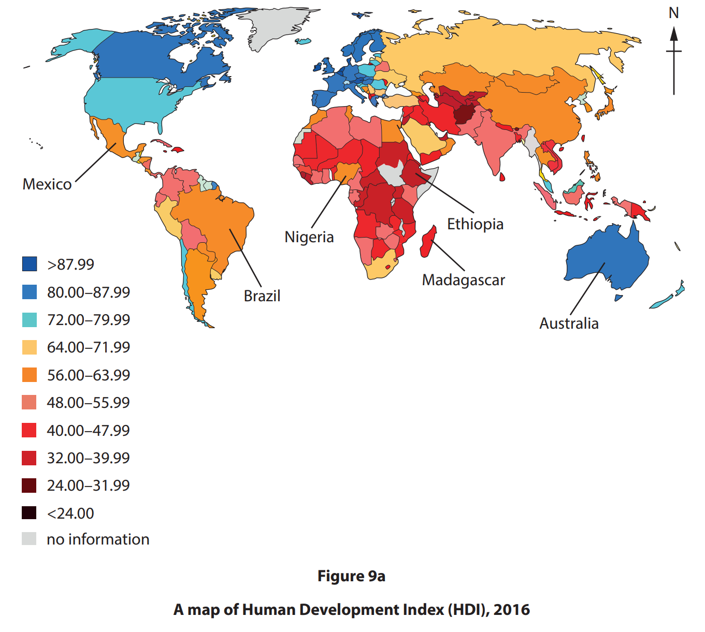
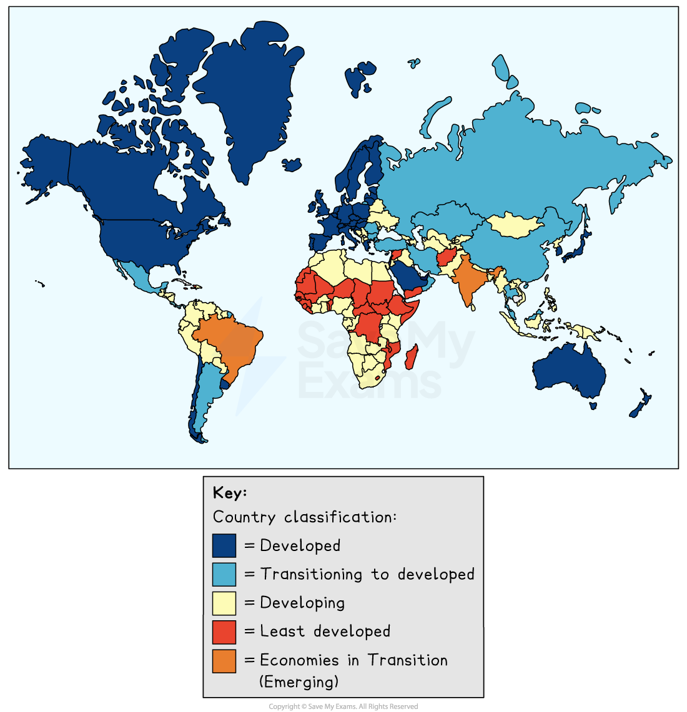
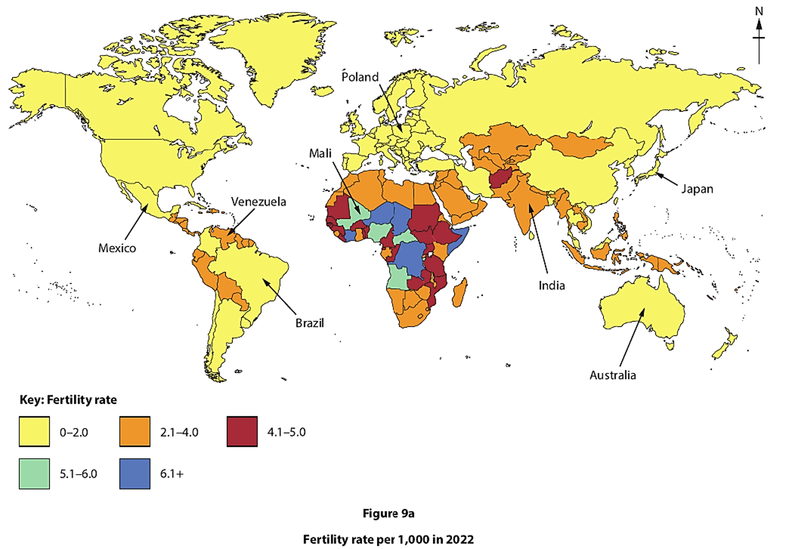
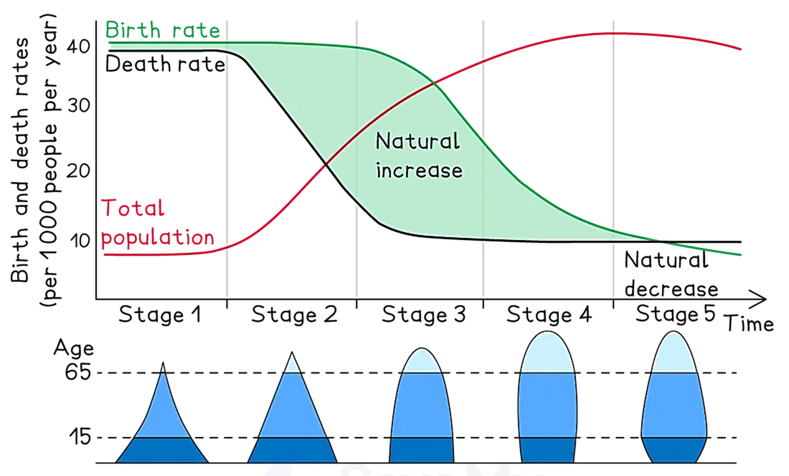
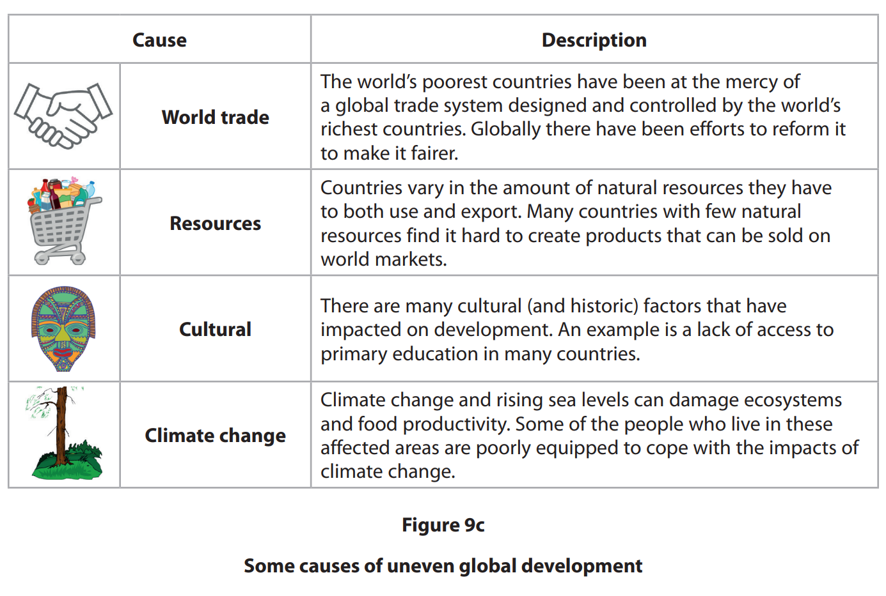
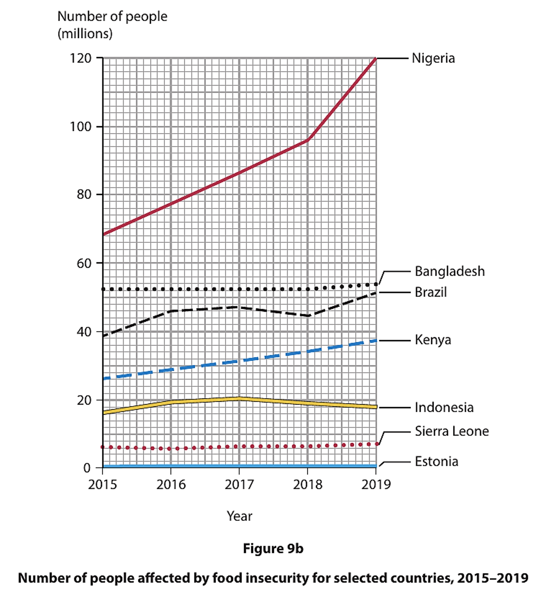
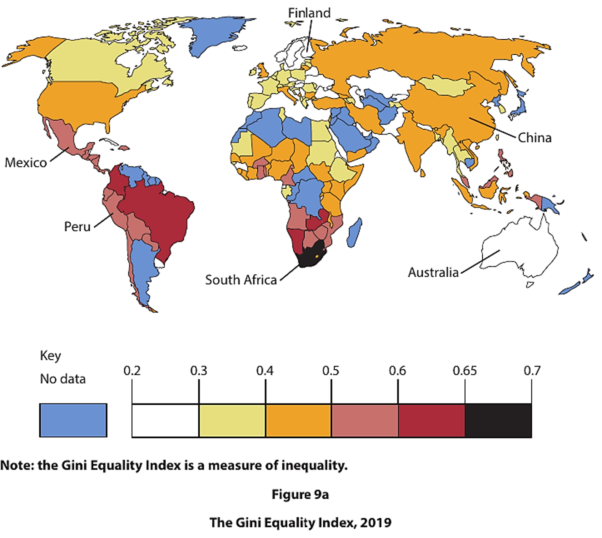
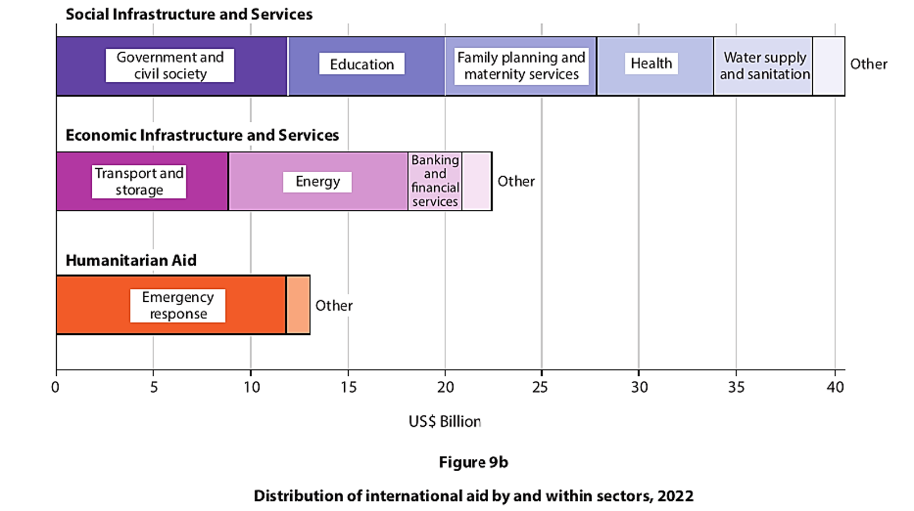

# Exam Questions — Consequences of Uneven Development
**Development & Human Welfare** · Edexcel IGCSE Geography (4GE1)
> Source: [https://www.savemyexams.com/igcse/geography/edexcel/19/topic-questions/9-development-and-human-welfare/9-2-consequences-of-uneven-development/exam-questions/](https://www.savemyexams.com/igcse/geography/edexcel/19/topic-questions/9-development-and-human-welfare/9-2-consequences-of-uneven-development/exam-questions/) · 21 questions · total 98 marks

## Q1 — easy — 2 marks · exam-questions

### 13() — 2 marks — command: suggest — structured — from paper June 2017 · 4GE1/01
Suggest **one **issue resulting from population change.

## Q2 — easy — 5 marks · exam-questions

### 13() — 1 mark — command: which — structured — from paper June 2018 · 4GE1/01
Study Figure 13a, which shows data for three indicators of human welfare in six London boroughs in 2014.

Which is the most deprived borough?

| **Borough       ** | **Rank** | **Average income per person p.a.(£) ** | **Unemployment Rate** | **Rank** | **Average life ** **expectancy (years) ** |
|---|---|---|---|---|---|
| Kensington   & Chelsea | 1 | 98 400 | 5.0 | 1 | 84.1 |
| Wandsworth | 2 | 35 600 | 5.2 | 4 | 81.1 |
| Hammersmith   & Fulham | 3 | 32 500 | 6.2 | 3 | 81.2 |
| Lambeth | 4 | 28 800 | 8.0 | 5 | 80.3 |
| Croydon | 5 | 26 400 | 8.4 | 2 | 81.4 |
| Barking &  Dagenham | 6 | 23 300 | 10.0 | 6 | 79.6 |

*** Rank is based on average income and unemployment rate only.  ** Rank is based on average life expectancy. **

**Figure 13a **

### 13() — 3 marks — command: give — structured — from paper June 2018 · 4GE1/01
Give three pieces of evidence that the level of human welfare varies greatly between these London boroughs.

### 13() — 1 mark — multiple_choice — from paper June 2018 · 4GE1/01
Name the borough whose average life expectancy rank differs most from the rank shown for average income and unemployment rate.
- **A.** Wandsworth
- **B.** Hammersmith & Fulham
- **C.** Lambeth
- **D.** Croydon

## Q3 — easy — 3 marks · exam-questions

### 9() — 1 mark — multiple_choice — from paper June 2019 · 4GE1/02
Identify the meaning of the term **inequality**.
- **A.** poor access to resources and services
- **B.** good access to resources and services
- **C.** equal access to resources and services
- **D.** unequal access to resources and services

### 9((c)) — 2 marks — command: identify — structured — from paper June 2019 · 4GE1/02
Study Figure 9a.

Identify two countries labelled in Figure 9a as having the highest and lowest inequality.

Highest

Lowest

## Q4 — easy — 4 marks · exam-questions

### 9() — 2 marks — command: identify — structured — from paper June 2019 · 4GE1/02R
Study Figure 9a.

Identify two countries labelled in Figure 9a with an HDI of less than 48.00.

### 9() — 2 marks — command: describe — structured — from paper June 2019 · 4GE1/02R
Describe the extent to which infant mortality rates have changed from 1960-2012 in Figure 9b.

## Q5 — easy — 1 marks · exam-questions

### 9() — 1 mark — command: state — structured — from paper June 2024 · 4GE1/02R
State **one **historic factor that can affect inequality within countries.

## Q6 — easy — 1 marks · exam-questions

### 9() — 1 mark — multiple_choice — from paper June 2024 · 4GE1/02R
Identify one factor that directly affects natural increase in a population.
- **A.** birth rate
- **B.** employment
- **C.** housing
- **D.** manufacturing rate

## Q7 — easy — 1 marks · exam-questions

### 1() — 1 mark — multiple_choice
Identify a reason for lower mortality rates in developed countries.
- **A.** improved access to retail services
- **B.** improved access to healthcare services
- **C.** improved access to airports
- **D.** improved access to legal services

## Q8 — easy — 2 marks · exam-questions

### 1() — 2 marks — command: describe — structured
Study **Figure 4a. **

Describe the global pattern of uneven development.

## Q9 — medium — 4 marks · exam-questions

### 9((c)) — 4 marks — command: suggest — structured — from paper June 2019 · 4GE1/02
Suggest two reasons for the pattern shown on Figure 9a.

## Q10 — medium — 4 marks · exam-questions

### 9() — 4 marks — command: suggest — structured — from paper June 2019 · 4GE1/02R
Study Figure 9a.

Suggest **two** possible reasons for the pattern shown on Figure 9a.

## Q11 — medium — 6 marks · exam-questions

### 9() — 2 marks — command: identify — structured — from paper June 2024 · 4GE1/02R
Study Figure 9a.

Identify the **two** labelled countries with a fertility rate of 2.1–4.0 per 1,000.

### 9() — 4 marks — command: suggest — structured — from paper June 2024 · 4GE1/02R
Suggest **two **reasons for the pattern shown in Figure 9a.

## Q12 — medium — 4 marks · exam-questions

### 9((e)) — 4 marks — command: explain — structured — from paper June 2023 · 4GE1/02
Explain **two **ways uneven development within a country can affect human welfare.

## Q13 — medium — 4 marks · exam-questions

### 9((e)) — 4 marks — command: explain — structured — from paper June 2023 · 4GE1/02
Explain **two **impacts of uneven development within a country.

## Q14 — medium — 1 marks · exam-questions

### 9((c)) — 1 mark — command: explain — structured — from paper June 2019 · 4GE1/02R
Explain **two **impacts of uneven development on the quality of life within a country.

## Q15 — medium — 4 marks · exam-questions

### 1() — 4 marks — command: explain — structured
Study **Figure 5a. **

Explain how demographic data differs between countries at different levels of development.

## Q16 — medium — 4 marks · exam-questions

### 1() — 4 marks — command: explain — structured
Explain the impacts of uneven development on the quality of life of its people in developing or emerging countries.

## Q17 — hard — 6 marks · exam-questions

### 9((e)) — 6 marks — command: assess — structured — from paper June 2019 · 4GE1/02R
Study Figure 9c.

Assess the different factors that have caused uneven global development.

## Q18 — hard — 12 marks · exam-questions

### 9((f)) — 12 marks — command: discuss — structured — from paper June 2024 · 4GE1/02
Discuss the view:

Improvements in human welfare are mainly driven by economic development.

Use Figures 9b and 9c, and your own knowledge and understanding to support your answer.

You must refer to the resources in your answer.

## Q19 — hard — 6 marks · exam-questions

### 9((e)) — 6 marks — command: assess — structured — from paper Nov  2024 · 4GE1/02
Study Figure 9c.

Assess factors that have contributed to the development gap.

You must refer to the resource in your answer.

## Q20 — hard — 12 marks · exam-questions

### 9((f)) — 12 marks — command: discuss — structured — from paper Nov 2023 · 4GE1/02
Discuss the view:

Continuing uneven global development is caused by economic factors.

Use Figures 9a and 9b and your own knowledge and understanding to support your answer.

Refer to the resources in your answer.

## Q21 — hard — 12 marks · exam-questions

### 1() — 12 marks — command: discuss — structured
Discuss the view:

Economic factors are more important than environmental factors in causing uneven global development.

Use Figure 9c and your own knowledge and understanding to support your answer.
Refer to the resources in your answer.
