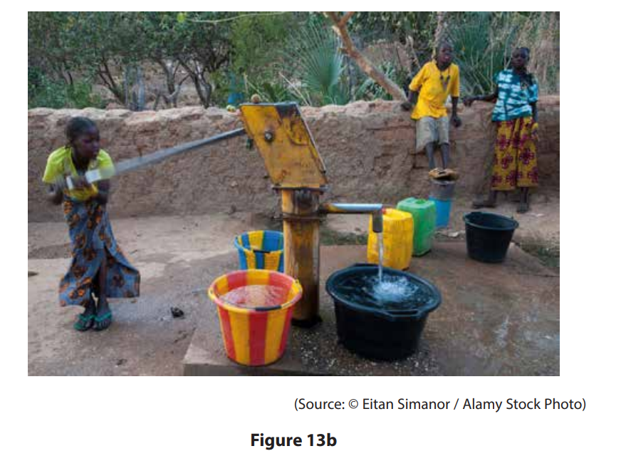
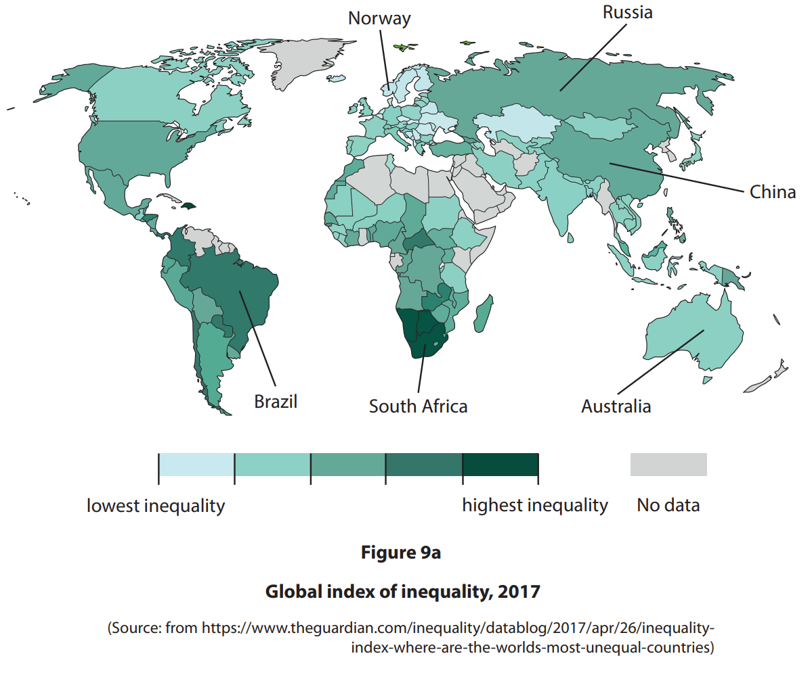
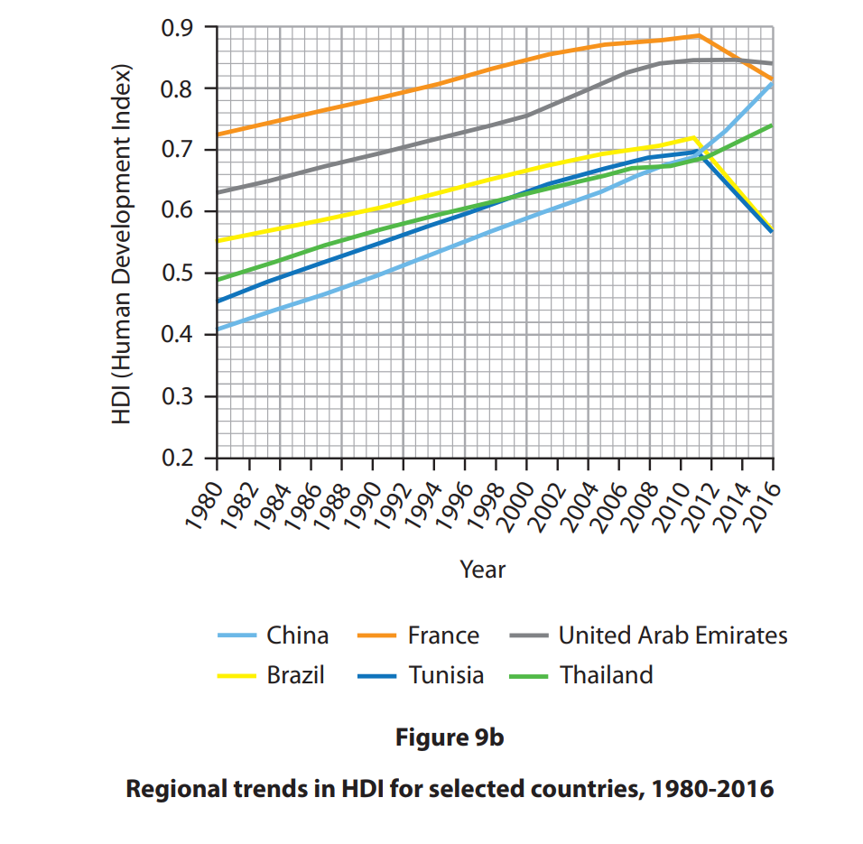
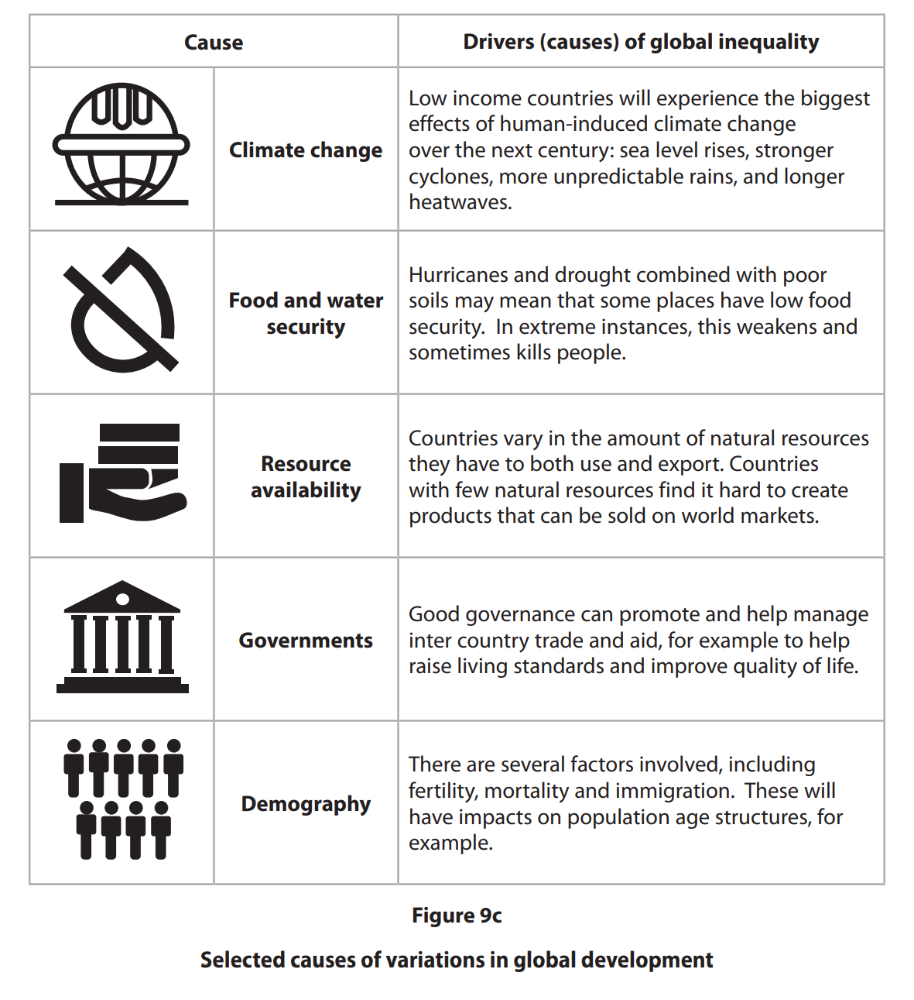
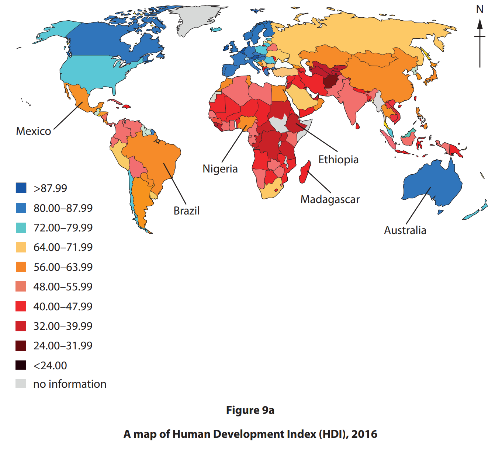
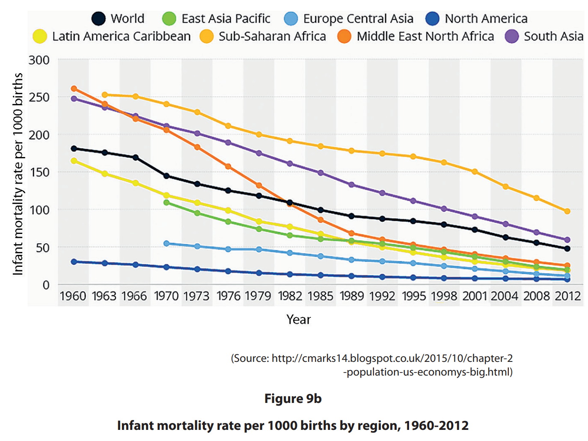
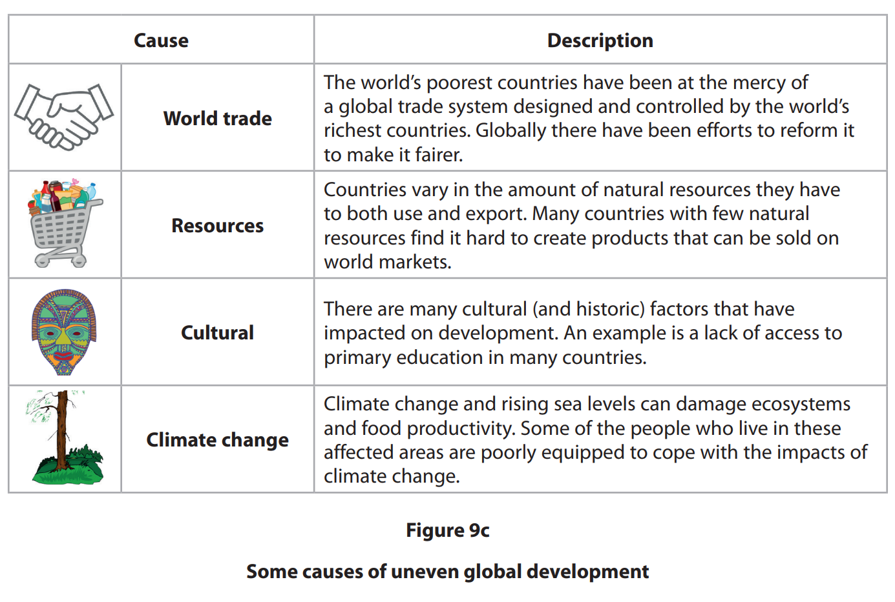

# Exam Questions — Management of Uneven Development
**Development & Human Welfare** · Edexcel IGCSE Geography (4GE1)
> Source: [https://www.savemyexams.com/igcse/geography/edexcel/19/topic-questions/9-development-and-human-welfare/9-3-management-of-uneven-development/exam-questions/](https://www.savemyexams.com/igcse/geography/edexcel/19/topic-questions/9-development-and-human-welfare/9-3-management-of-uneven-development/exam-questions/) · 17 questions · total 70 marks

## Q1 — easy — 2 marks · exam-questions

### 13((b)) — 2 marks — command: what — structured — from paper June 2017 · 4GE1/01
What is meant by the term appropriate aid?

## Q2 — easy — 1 marks · exam-questions

### 9() — 1 mark — multiple_choice — from paper June 2024 · 4GE1/02
Identify an organisation that attempts to address the global development gap.
- **A.** United States Geological Survey
- **B.** North American Free Trade Association (NAFTA)
- **C.** North Atlantic Treaty Organisation (NATO)
- **D.** World Bank

## Q3 — easy — 1 marks · exam-questions

### 9() — 1 mark — command: state — structured — from paper June 2024 · 4GE1/02
State **one **way countries may use international aid to support development

## Q4 — easy — 1 marks · exam-questions

### 9() — 1 mark — multiple_choice — from paper Nov 2024 · 4GE1/02
Identify one top-down way of supporting development.
- **A.** building a well in a village
- **B.** community loans from a charity
- **C.** debt relief
- **D.** small scale training provision

## Q5 — easy — 1 marks · exam-questions

### 9() — 1 mark — command: state — structured — from paper Nov  2024 · 4GE1/02
State **one **disadvantage of top-down development projects.

## Q6 — easy — 2 marks · exam-questions

### 1() — 2 marks — command: explain — structured
Explain **one** international strategy used to reduce uneven development.

## Q7 — easy — 2 marks · exam-questions

### 1() — 2 marks — command: explain — structured
Explain **one **difference between top-down and bottom-up development projects.

## Q8 — medium — 4 marks · exam-questions

### 13((b)) — 4 marks — command: outline — structured — from paper June 2017 · 4GE1/01
Outline two examples of appropriate aid.

## Q9 — medium — 4 marks · exam-questions

### 13((c)) — 4 marks — command: explain — structured — from paper June 2018 · 4GE1/01
Study Figure 13b which shows a water pump which was supplied as part of an appropriate aid project in West Africa.

Explain why appropriate aid is important to developing countries.

## Q10 — medium — 4 marks · exam-questions

### 9((d)) — 4 marks — command: explain — structured — from paper June 2019 · 4GE1/02
Explain how **two** international strategies have attempted to reduce uneven development.

## Q11 — medium — 4 marks · exam-questions

### 9((c)) — 4 marks — command: explain — structured — from paper June 2024 · 4GE1/02
Explain **one **advantage and **one **disadvantage of top-down development projects.

## Q12 — medium — 4 marks · exam-questions

### 9((c)) — 4 marks — command: explain — structured — from paper June 2024 · 4GE1/02r
Explain **two **advantages of bottom-up development projects.

## Q13 — medium — 4 marks · exam-questions

### 9((c)) — 4 marks — command: explain — structured — from paper June 2024 · 4GE1/02
Explain **one **advantage and **one **disadvantage of top-down development projects.

## Q14 — hard — 12 marks · exam-questions

### 9((g)) — 12 marks — command: discuss — structured — from paper June 2019 · 4GE1/02
Discuss the view:

International strategies are only one part of the solution to closing the development gap.

Use Figures 9a, 9b and 9c and your own knowledge and understanding to support your answer.

## Q15 — hard — 6 marks · exam-questions

### 1() — 6 marks — command: discuss — structured
Discuss the management of regional disparities within **one** named country.

Named country:

## Q16 — hard — 12 marks · exam-questions

### 9((f)) — 12 marks — command: discuss — structured — from paper June 2019 · 4GE1/02R
Discuss the view:

Different strategies are needed to reduce the uneven global development.

Use Figures 9a, 9b and 9c and your own knowledge and understanding to support your answer.

## Q17 — hard — 6 marks · exam-questions

### 1() — 6 marks — command: assess — structured
Study** Figure 9a.**

**Figure 9a: **Views on tackling the development gap

| Viewpoint | Approach | Key argument |
|---|---|---|
| National government (developing country) | Large-scale infrastructure investment (top-down) | Building roads, dams, and power stations attracts foreign investment and drives economic growth across the whole country |
| International NGO | Community-led microfinance and education projects (bottom-up) | Small loans and local education programmes directly empower individuals and produce lasting change at community level |
| World Bank | Conditional loans tied to economic reform (top-down) | Structural reforms improve governance and create conditions for sustainable long-term growth |
| Local community group | Grassroots food security and clean water projects (bottom-up) | Meeting basic needs first is essential before any wider economic development can take place |
| Individual donor | Charitable giving to specific projects | Direct funding reaches people in need quickly without bureaucracy slowing the process down |

Using **Figure 9a, **assess how effective these different approaches are in tackling the development gap.
