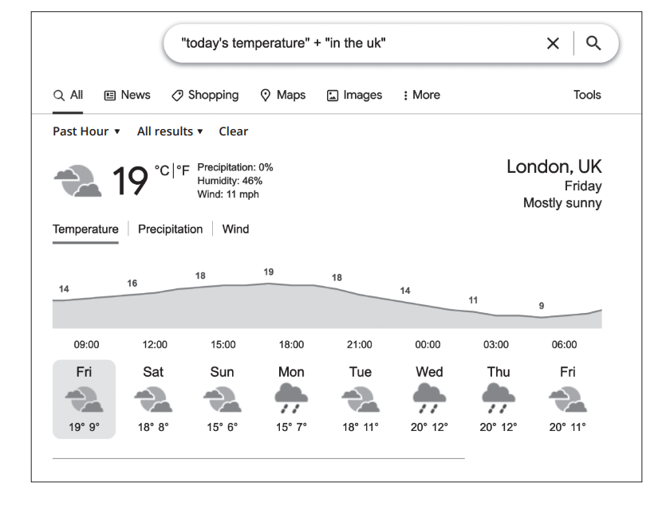

# Exam Questions — ICT Systems to Meet Specified Needs
**1. Digital Devices** · Edexcel IGCSE ICT (4IT1)
> Source: [https://www.savemyexams.com/igcse/ict/edexcel/17/topic-questions/1-digital-devices/ict-systems-to-meet-specified-needs/exam-questions/](https://www.savemyexams.com/igcse/ict/edexcel/17/topic-questions/1-digital-devices/ict-systems-to-meet-specified-needs/exam-questions/) · 5 questions · total 9 marks

## Q1 — medium — 1 marks · exam-questions

### 1() — 1 mark — multiple_choice — from paper Nov 2023 · Paper 1
The system uses software and hardware.

Which** one** of these is the best type of software to use to manage online bookings?
- **A.** Database
- **B.** File management
- **C.** Spreadsheet
- **D.** Web authoring

## Q2 — medium — 2 marks · exam-questions

### 4() — 2 marks — structured — from paper Nov 2023 · Paper 1
Visitors usually bring a digital device to events at the venue.

The venue uses a barcode scanner that connects to the booking system.

Explain **one** benefit to the venue staff of using a barcode scanner.

## Q3 — medium — 2 marks · exam-questions

### 2() — 2 marks — structured — from paper June 2023 · Paper 1
Camille uses digital devices for work.

(a) A distance sensor is used as an input for an embedded system in a car.

(i) Describe how a distance sensor is used by an embedded system in a car.

## Q4 — medium — 2 marks · exam-questions

### 3((g)) — 2 marks — structured — from paper June 2023 · Paper 1
Camille shares family photographs online with friend.

Explain **one** reason why a website should provide accessibility features.

## Q5 — medium — 2 marks · exam-questions

### 4() — 2 marks — structured — from paper June 2023 · Paper 1
Camille’s child, Sarah, uses websites and video sharing sites for her school work.

Sarah is researching changes in global temperatures.

Here is an image of her use of a search engine.

Describe how **one** peripheral device can support users of the search engine who have accessibility needs.
