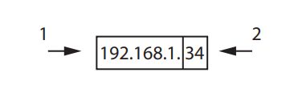

# Exam Questions — Requirements for Connecting to a Network
**2. Connectivity** · Edexcel IGCSE ICT (4IT1)
> Source: [https://www.savemyexams.com/igcse/ict/edexcel/17/topic-questions/2-connectivity/requirements-for-connecting-to-a-network/exam-questions/](https://www.savemyexams.com/igcse/ict/edexcel/17/topic-questions/2-connectivity/requirements-for-connecting-to-a-network/exam-questions/) · 7 questions · total 20 marks

## Q1 — medium — 1 marks · exam-questions

### 1((e)) — 1 mark — multiple_choice — from paper Nov  · 2023
The concert venue uses an online booking system.

Which **one** of these is a role of a server?
- **A.** Handle requests from clients
- **B.** Provide a wireless connection
- **C.** Provide access to a WAN from a LAN
- **D.** Store the client’s operating system

## Q2 — medium — 2 marks · exam-questions

### 3() — 2 marks — structured — from paper Nov 2023 · Paper 1
The venue promotes events on a website.

Gail uploads new images for the website.

Give** two** components of a wired network that are required to upload data.

## Q3 — medium — 4 marks · exam-questions

### 1() — 2 marks — structured — from paper June 2023 · Paper 1
Camille creates a home network.

Camille connects to a LAN.

Describe the role of a wireless access point.

### 1((h)) — 2 marks — structured — from paper June 2023 · Paper 1
Explain why Camille would use a filter in her network.

## Q4 — medium — 1 marks · exam-questions

### 1() — 1 mark — multiple_choice — from paper June 2023 · Paper 1
Which** one** of these is a hardware device that directs traffic between a LAN and a WAN?
- **A.** A Booster
- **B.** Gateway
- **C.** Hub
- **D.** Server

## Q5 — medium — 1 marks · exam-questions

### 3((b)) — 1 mark — multiple_choice — from paper June 2023 · Paper 1
Camille shares family photographs online with friends.

Which **one** of these provides content to client computers?
- **A.** ISP
- **B.** LAN
- **C.** Router
- **D.** Server

## Q6 — medium — 3 marks · exam-questions

### 5((c)) — 1 mark — structured — from paper June 2023 · Paper 1
Camille designs controllers for a games console.

State the device that forwards packets of data in a wide area network

### 5((d)) — 2 marks — structured — from paper June 2023 · Paper 1
Here is an Internet Protocol (IP) address.

State what the labelled parts of this address are used for.

## Q7 — medium — 8 marks · exam-questions

### 3() — 8 marks — structured — from paper June 2024 · Paper 1
Joe connects to different types of networks.

Joe connects to the Internet.

State the purpose of an ISP.

[1]

Joe connects a laptop to a wireless access point.

State two additional components of a network required to connect the laptop to the Internet.

[2]

Describe the role of a web browser when connecting to the Internet.

[2]

(iv)

State one use of an IP address.

[1]

(v)

Explain **one** benefit of using Media Access Control (MAC) rather than an IP address.

[2]
