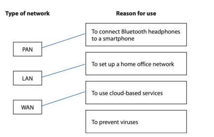
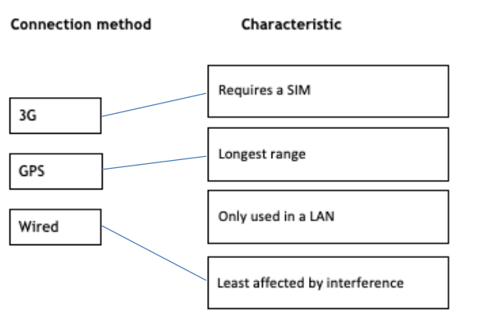

# Mark Schemes — Types of Digital Communications
**2. Connectivity** · Edexcel IGCSE ICT (4IT1)

## Q1 — medium — 4 marks · exam-questions

### 1() — 1 marks
**Correct answer: C** — NFC

> **[mark-scheme]**
> **The correct answer is C** - NFC

### 1() — 3 marks
> **[mark-scheme]**
> 

## Q2 — medium — 2 marks · exam-questions

### 4((b)) — 2 marks
> **[mark-scheme]**
> A description such as:
> 
> - (Connect to the smartphone using) Wi-Fi / Bluetooth (1) by selecting the device name/ SSID (1) Or
> - Create a hotspot / Tether (1) using Wi-Fi / Bluetooth (1)

## Q3 — medium — 8 marks · exam-questions

### 1() — 1 marks
> **[mark-scheme]**
> Any one from:
> 
> - Sharing a connection to mobile broadband
> - Connecting to the Internet via a smartphone/hotspot
> 
> **Do not accept** responses that only refer to sharing a connection to the Internet. Responses must imply the Internet connection is via mobile broadband.

### 1() — 2 marks
> **[mark-scheme]**
> Any two from: •
> 
> - Connects devices within a single site (e.g. a [single] building)
> - Covers a smaller geographical area/range
> - Does not use third party infrastructure/telecomms systems
> - Does not require a gateway
> 
> Accept: A WAN is a collection of LANs

### 1((d)) — 2 marks
> **[mark-scheme]**
> Any two from:
> 
> - Bluetooth
> - Wi-Fi
> - Infra-red / IR
> - Near-field communication / NFC

### 1() — 3 marks
> **[mark-scheme]**
> Award one mark for each correct line, up to a maximum of three marks.
> 
> Ignore clearly crossed out lines and credit replacement if correct.
> 
> Do not award lines between boxes where a box has more than one line.
> 
> Correct answer:
> 
> 

## Q4 — medium — 1 marks · exam-questions

### 1((d)) — 1 marks
> **[mark-scheme]**
> - WAN
> - Wide area network
> 
> Accept: Client –server

## Q5 — medium — 4 marks · exam-questions

### 3() — 4 marks
> **[mark-scheme]**
> (i)
> 
> Any two from:
> 
> - Wi-Fi
> - Bluetooth
> - Infra-red
> 
> (ii)
> 
> An explanation such as: Joe needs access to the Internet (1) because the broadcast is online (1)

## Q6 — medium — 3 marks · exam-questions

### 3() — 1 marks
**Correct answer: D** — The GPS system does not receive data from Joe’s devices

> **[mark-scheme]**
> **The correct answer is D** - The GPS system does not receive data from Joe’s devices

### 3() — 1 marks
**Correct answer: B** — To include location data in image files

> **[mark-scheme]**
> **The correct answer is B** - To include location data in image files

### 3((g)) — 1 marks
> **[mark-scheme]**
> A description to include two from:
> 
> Tether/connect a laptop to a smartphone / mobile hotspot (1) using Bluetooth / Wi-Fi / USB (1) and use its 3G/4G/5G connection (1)
