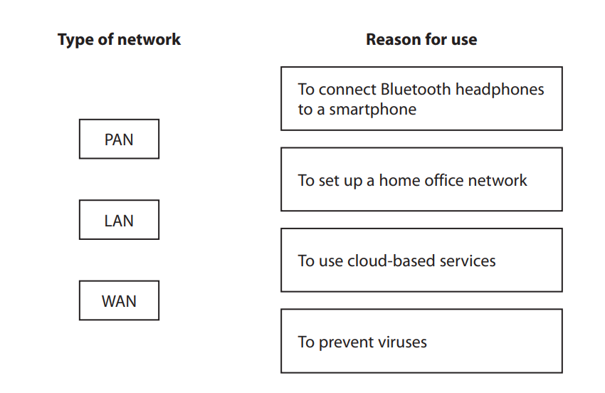
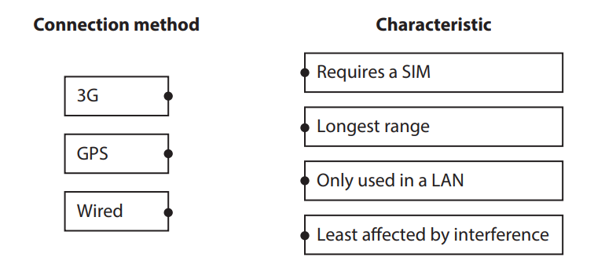

# Exam Questions — Types of Digital Communications
**2. Connectivity** · Edexcel IGCSE ICT (4IT1)
> Source: [https://www.savemyexams.com/igcse/ict/edexcel/17/topic-questions/2-connectivity/types-of-digital-communications/exam-questions/](https://www.savemyexams.com/igcse/ict/edexcel/17/topic-questions/2-connectivity/types-of-digital-communications/exam-questions/) · 6 questions · total 22 marks

## Q1 — medium — 4 marks · exam-questions

### 1() — 1 mark — multiple_choice — from paper Nov 2023 · Paper 1
The concert venue uses an online booking system.

Customers can store a digital ticket to their smartphone and access the venue by scanning their phone.

Which **one** of these is the wireless technology used during this scan?
- **A.** 4G
- **B.** Bluetooth
- **C.** NFC
- **D.** Wi‑Fi

### 1() — 3 marks — structured — from paper Nov 2023 · Paper 1
Gail uses different types of networks in her job.

Draw **one** straight line from** each** type of network to the correct reason for its use.

## Q2 — medium — 2 marks · exam-questions

### 4((b)) — 2 marks — structured — from paper Nov 2023 · Paper 1
Visitors usually bring a digital device to events at the venue.

Describe **one **way a visitor can use features of a tablet to connect it to a smartphone’s mobile broadband connection.

## Q3 — medium — 8 marks · exam-questions

### 1() — 1 mark — structured — from paper June 2023 · Paper 1
Camille creates a home network.

State what is meant by ‘tethering’.

### 1() — 2 marks — structured — from paper June 2023 · Paper 1
Camille connects to a LAN.

State** two **features of a LAN that are different from a WAN.

### 1((d)) — 2 marks — structured — from paper June 2023 · Paper 1
Camille’s mobile phone can receive data using 3G, 4G, 5G and GPS.

State **two** **other** wireless communication methods used by mobile phones.

### 1() — 3 marks — structured — from paper June 2023 · Paper 1
Camille uses wired and wireless connectivity.

Draw **one** straight line from **each** connection method to the correct characteristic.

## Q4 — medium — 1 marks · exam-questions

### 1((d)) — 1 mark — structured — from paper June 2024 · Paper 1
Joe streams a radio show online.

State the type of network required to stream the show to listeners outside of Joe’s LAN.

## Q5 — medium — 4 marks · exam-questions

### 3() — 4 marks — structured — from paper June 2024 · Paper 1
Joe connects to different types of networks.

Joe uses networks to stream his show.

(i)

Give** two **types of wireless connectivity that Joe could use to connect a laptop to a smartphone.

[2]

(ii)

Explain one reason why Joe must use a WAN to stream a show.

[2]

## Q6 — medium — 3 marks · exam-questions

### 3() — 1 mark — multiple_choice — from paper June 2024 · Paper 1
Joe uses GPS.

Which **one** of these statements about GPS is** true**?
- **A.** Data must be sent to multiple satellites for accuracy
- **B.** Devices cannot connect to a network without GPS
- **C.** GPS calculations require data from one GPS satellite
- **D.** The GPS system does not receive data from Joe’s devices

### 3() — 1 mark — multiple_choice — from paper June 2024 · Paper 1
Which one of these is a reason why Joe would use GPS?
- **A.** To connect to a wide area network
- **B.** To include location data in image files
- **C.** To prevent access to files by the general public
- **D.** To provide a connection if a mobile phone network fails

### 3((g)) — 1 mark — structured — from paper June 2024 · Paper 1
Joe’s laptop uses a wired connection to the Internet through broadband.

Joe’s smartphone has mobile broadband connectivity.

The laptop loses its connection to the Internet.

Describe one method Joe could use to keep the laptop online.
