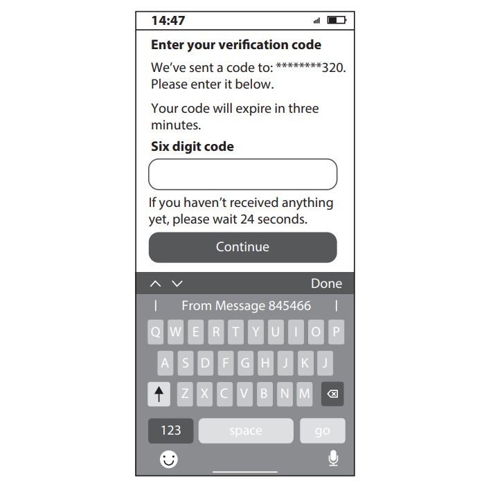

# Exam Questions — Potential Risks to Data
**3. Operating Online** · Edexcel IGCSE ICT (4IT1)
> Source: [https://www.savemyexams.com/igcse/ict/edexcel/17/topic-questions/3-operating-online/potential-risks-to-data/exam-questions/](https://www.savemyexams.com/igcse/ict/edexcel/17/topic-questions/3-operating-online/potential-risks-to-data/exam-questions/) · 6 questions · total 15 marks

## Q1 — medium — 3 marks · exam-questions

### 1((h)) — 3 marks — structured — from paper June 2024 · Paper 1
Listeners can subscribe to get notifications about new shows.

(i) State **one **risk to personal information when subscribing.

(1)

(ii) Describe **one **way a listener can secure their personal information.

(2)

## Q2 — medium — 1 marks · exam-questions

### 2((c)) — 1 mark — structured — from paper June 2024 · Paper 1
Anonymity is a threat to the safety of members of online communities.

State **one **other threat to members of online communities.

## Q3 — medium — 2 marks · exam-questions

### 1((f)) — 2 marks — structured — from paper Nov 2023 · Paper 1
Give **two **types of online payment system that customers could use to pay for tickets.

## Q4 — medium — 1 marks · exam-questions

### 3((b)) — 1 mark — multiple_choice — from paper Nov 2023 · Paper 1
The venue promotes events on a website.

Which **one **of these causes a risk to online safety?
- **A.** Bookmarking
- **B.** Legislation
- **C.** Misrepresentation
- **D.** Vlogging

## Q5 — medium — 4 marks · exam-questions

### 1((g)) — 4 marks — structured — from paper June 2023 · Paper 1
Camille creates a home network.

Camille uses anti-malware to secure her data online.

Describe **two **types of malware.

## Q6 — medium — 4 marks · exam-questions

### 3() — 4 marks — structured — from paper June 2023 · Paper 1
Camille shares family photographs online with friends.

Camille buys extra online storage.

(i) State **two** protocols that could be used to secure online payments.

(2)

(ii) After Camille enters her password correctly, she receives this text message from her bank.

Explain why this message helps keep Camille’s payments secure.

(2)
