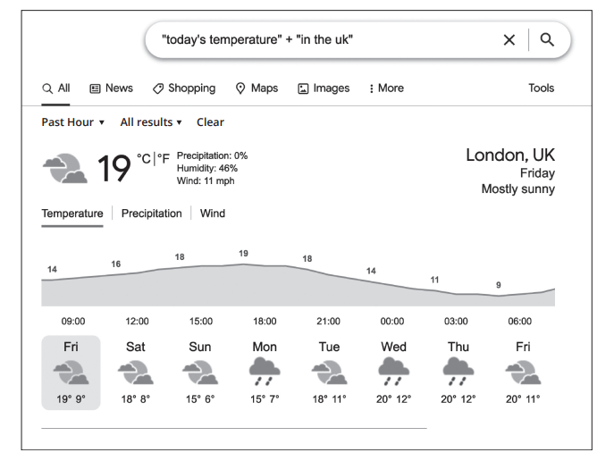

# Exam Questions — Using Online Information
**3. Operating Online** · Edexcel IGCSE ICT (4IT1)
> Source: [https://www.savemyexams.com/igcse/ict/edexcel/17/topic-questions/3-operating-online/using-online-information/exam-questions/](https://www.savemyexams.com/igcse/ict/edexcel/17/topic-questions/3-operating-online/using-online-information/exam-questions/) · 7 questions · total 32 marks

## Q1 — medium — 1 marks · exam-questions

### 2((e)) — 1 mark — multiple_choice — from paper June 2024 · Paper 1
Joe posts a link to the shows on an online community.

People find information online.

Which **one **of these would negatively affect the fitness for purpose of information found in online communities?
- **A.** Bias
- **B.** Collaboration
- **C.** Encryption
- **D.** Plagiarism

## Q2 — medium — 2 marks · exam-questions

### 2() — 2 marks — structured — from paper June 2024 · Paper 1
State **two **methods people can use to check the reliability of online information.

## Q3 — medium — 1 marks · exam-questions

### 2() — 1 mark — multiple_choice — from paper June 2024 · Paper 1
Which **one **of these can be used to avoid plagiarism?
- **A.** Copy and paste
- **B.** Copyrighting
- **C.** Paraphrasing
- **D.** Secondary source

## Q4 — medium — 8 marks · exam-questions

### 5((d)) — 8 marks — structured — from paper June 2024 · Paper 1
Joe’s use of digital technologies has implications.

Joe’s show is available as a radio broadcast and also online.

Discuss how the reliability of broadcast information compares to the reliability of information only available online.

You should consider these points in your response:

- government oversight / regulation
- responsibility of users
- methods available to verify information.

## Q5 — medium — 2 marks · exam-questions

### 3() — 2 marks — structured — from paper Nov 2023 · Paper 1
The venue promotes events on a website.

Gail uploads new images for the website.

Describe **one **method for improving the search rank of the website.

## Q6 — medium — 10 marks · exam-questions

### 4() — 2 marks — structured — from paper June 2023 · Paper 1
Camille’s child, Sarah, uses websites and video sharing sites for her school work.

Sarah is researching changes in global temperatures.

Here is an image of her use of a search engine.

Explain **one **way the search can be improved.

### 4((f)) — 8 marks — structured — from paper June 2023 · Paper 1
Discuss the reliability of information from online sources.

## Q7 — medium — 8 marks · exam-questions

### 5((g)) — 8 marks — structured — from paper June 2023 · Paper 1
Camille designs controllers for a games console.

Camille is writing an article for a website.

Discuss how ICT makes it easier to plagiarise and the impact of plagiarism on others.
