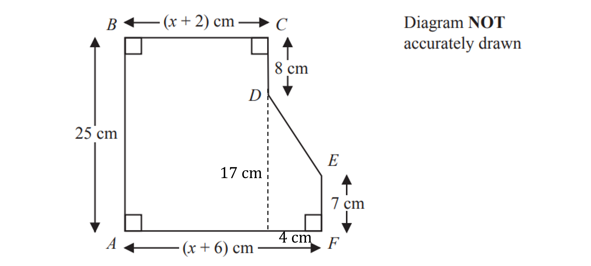

# Mark Schemes — Forming & Solving Equations
**2. Equations, Formulae & Identities** · Edexcel IGCSE Maths A (4MA1) — 18/Foundation

## Q1 — medium — 3 marks · exam-questions

### 8() — 3 marks
> *Convert 7m to centimetres*

> *There are 100 cm in 1m, so*

$7\times100=700\mathrm{cm}$

**[B1]**

> *Calculate how much ribbon was used on the large parcels*

$2\times185=370$

> *Subtract the amount of ribbon used on the large parcels*

$700-370=330$

**[M1]**

> *Divide the remaining ribbon between the three small parcels*

$330\div3=110$

**Final answer:** **110 cm**

**[A1]**

> **[mark-scheme]**
> **A1**: Calculations resulting in the correct answer given in metres will also get the mark such as 1.1 m or 1.1 metres.

## Q2 — medium — 3 marks · exam-questions

### 13((c)) — 3 marks
> *Multiply the number of slices in a pack of cheese by the number of packs bought*

*Small packs = 8***h**

*Large packs = 20***j**

> *To get the total **T** we need to add these together*

**Final answer:** **T = 8h + 20j**

**[B1 B1 B1]**

> **[mark-scheme]**
> **B1:** For having multiplied 8*h* or 20*j*, and adding it to the other term (even if one of them is incorrect).
> 
> **B1:** For having 8*h*+20*j* correct, or for having an equation with *T*= and one term correctly added to an incorrect term, e.g. *T*=8*h*+10*j* or *T*=10*h* +20*j*.
> 
> **B1:** For the fully correct formula.

## Q3 — hard — 4 marks · exam-questions

### 19() — 4 marks
> *Use the angle rule for co-interior angles summing to 180° to form an equation to calculate the value of *$x$

> *Angles ABC and BAD must add up to 180°, so*

$3x+46+4x-27=180$

**[M1]**

> *Collect terms on the left-hand side*

`table row cell 7 x plus 19 end cell equals 180 end table`

> *Solve the equation*

> *First subtract 19 from each side*

`table row cell 7 x end cell equals cell 180 minus 19 end cell row cell 7 x end cell equals 161 end table`

> *Then divide both sides by 7*

`table row x equals cell 161 divided by 7 end cell row x equals 23 end table`

**[A1]**

> *Calculate the size of angle ABC using that value of *$x$

$3\times23+46=115$

**[M1]**

> *Also calculate the size of angle BCD to see which is largest*

> *Co-interior angles sum to 180° so subtract angle CDA to get angle BCD*

`180 minus open parentheses 3 cross times 23 plus 10 close parentheses equals 101`

> *Therefore angle ABC is the largest*

**Final answer:** **115°**

**[A1]**

## Q4 — medium — 4 marks · exam-questions

### 16((b)) — 4 marks
> *Find an expression for the total number of bars*

$y+3y+7+2y-5$

**[M1]**

> *Collect the like terms*

$6y+2$

> *Form an equation to solve*

$6y+2=56$

**[M1]**

> *Solve the equation by first subtracting *$2$* from each side*

$6y=54$

> *Divide both sides by *$6$

$y=9$

**[M1]**

> *Substitute this into the expression for the number of zinc bars*

$2\times9-5$

$18-5$

$13$

**[A1]**

## Q5 — hard — 5 marks · exam-questions

### 26() — 5 marks
> *Split the shape to find an expression for the area*

> *Use the opposite sides to find the missing values for the dimensions of the trapezium*

**[B1]**

> *Work out an expression for the area of the rectangle*

`open parentheses x space plus thin space 2 close parentheses space cross times space 25 space equals space 25 x space plus thin space 50`

> *Work out the area of the trapezium*

`1 half open parentheses 7 space plus thin space 17 close parentheses space cross times space 4 space
equals 1 half space cross times space 24 space cross times space 4 space
equals space 48`

**[M1]**

> *Add these together for the total area*

$25x+50+48=25x+98$

**[M1]**

> *Set this equal to the value given in the question*

$25x+98=258$

**[M1]**

> *Subtract 98 from both sides*

$25x=160$

> *Divide both sides by 25*

$x=\frac{160}{25}=6.4\mathrm{cm}$

$x=6.4\mathrm{cm}$

**[A1]**

## Q6 — medium — 3 marks · exam-questions

### 4() — 3 marks
> *Convert all of the distances to metres*

> **[exam-tip]**
> There are 1000m in a km.

$800m\,2000m\,1700m\,xm$

**[M1]**

> *Form an equation*

$800+2000+1700+x=6250$

**[M1]**

$4500+x=6250$

> *Subtract 4500 from both sides*

$x=1750$

**Final answer:** **1750m**

**[A1]**

> **[mark-scheme]**
> Working in km is also acceptable if you clearly write km.

## Q7 — hard — 3 marks · exam-questions

### 1() — 3 marks
An exterior angle of a triangle is equal to the sum of the other two interior angles of the triangle

`open parentheses 8 x plus 2 close parentheses plus open parentheses 11 x plus 10 close parentheses equals 15 x plus 32`

**[M1]**

Simplify the equation

*  *`table row cell 19 x plus 12 space end cell equals cell space 15 x space plus space 32 end cell row cell 4 x space end cell equals 20 end table`

**[M1]**

Solve

**Final answer:** **  **$x=5$

**[M1]**
