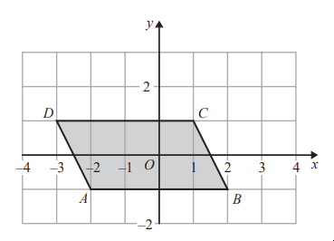
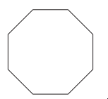
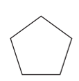
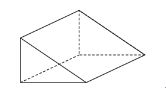
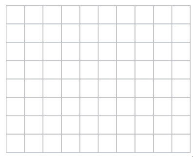
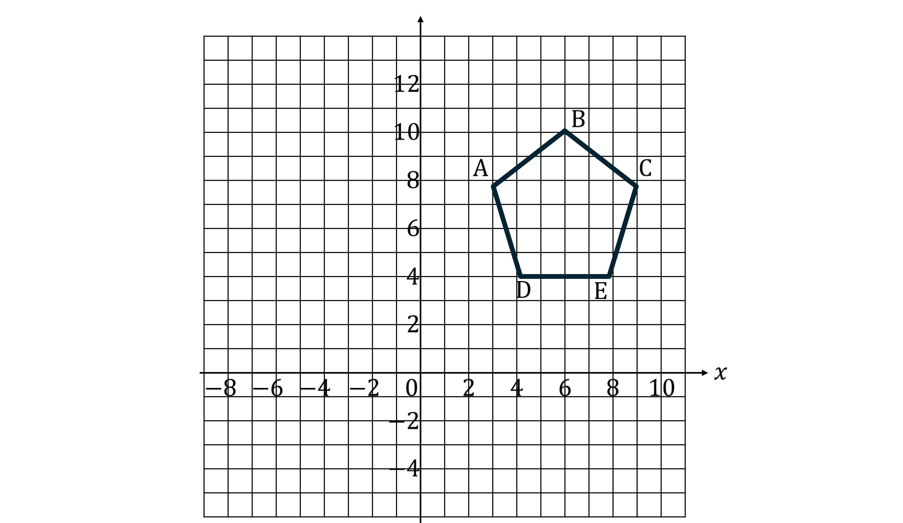

# Exam Questions — 2D & 3D Shapes
**4. Geometry & Trigonometry** · Edexcel IGCSE Maths A (4MA1) — 18/Foundation
> Source: [https://www.savemyexams.com/igcse/maths/edexcel/a/18/foundation/topic-questions/geometry-and-trigonometry/2d-and-3d-shapes/exam-questions/](https://www.savemyexams.com/igcse/maths/edexcel/a/18/foundation/topic-questions/geometry-and-trigonometry/2d-and-3d-shapes/exam-questions/) · 7 questions · total 12 marks

## Q1 — easy — 2 marks · exam-questions

### 8((b)) — 2 marks — command: how — structured — from paper Specimen paper · 4MA1/1F
(i)  How many vertices has a cuboid?

(ii) How many edges has a cuboid?

## Q2 — easy — 4 marks · exam-questions

### 4((a)) — 1 mark — command: write — structured — from paper 4MA1/2F
The diagram shows a quadrilateral $ABCD$ drawn on a coordinate grid.

Write down the coordinates of point $B$

### 4((b)) — 1 mark — command: write — structured — from paper 4MA1/2F
Write down the mathematical name of quadrilateral $ABCD$.

### 4((c)) — 1 mark — command: mark — structured — from paper 4MA1/2F
On the quadrilateral, mark with arrows (>>) a pair of parallel lines.

### 4((d)) — 1 mark — command: mark — structured — from paper Specimen paper · 4MA1/2F
On the diagram, mark an obtuse angle with the letter T.

## Q3 — easy — 1 marks · exam-questions

### 6((a)) — 1 mark — command: write — structured — from paper 2023 June · 4MA1/2F
Write down the mathematical name of this polygon.

## Q4 — easy — 2 marks · exam-questions

### 3((c)) — 1 mark — command: write — structured — from paper 2023 Nov · 4MA1/1F
Here is a polygon.

Write down the mathematical name of this polygon.

### 3((d)) — 1 mark — command: write — structured — from paper 2023 Nov · 4MA1/1F
Here is a solid prism.

Write down the number of edges of this solid prism

## Q5 — easy — 1 marks · exam-questions

### 6((a)) — 1 mark — command: draw — structured — from paper 2023 Nov · 4MA1/2F
Here is a centimetre grid

On the grid, draw a right-angled triangle.

## Q6 — easy — 1 marks · exam-questions

### 1() — 1 mark — command: write — structured
Here is a 3D shape.

Write down the mathematical name of the shape.

## Q7 — easy — 1 marks · exam-questions

### 1() — 1 mark — command: write — structured

Write down the mathematical name of shape ABCDE
