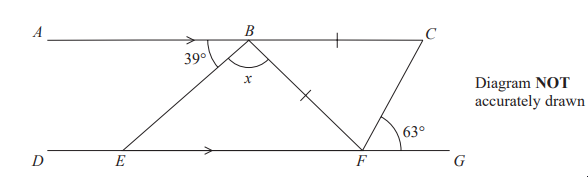

# Exam Questions — Angles in Polygons & Parallel Lines
**4. Geometry & Trigonometry** · Edexcel IGCSE Maths A (4MA1) — 18/Foundation
> Source: [https://www.savemyexams.com/igcse/maths/edexcel/a/18/foundation/topic-questions/geometry-and-trigonometry/angles-in-polygons-and-parallel-lines/exam-questions/](https://www.savemyexams.com/igcse/maths/edexcel/a/18/foundation/topic-questions/geometry-and-trigonometry/angles-in-polygons-and-parallel-lines/exam-questions/) · 6 questions · total 24 marks

## Q1 — hard — 5 marks · exam-questions

### 13() — 5 marks — command: work_out — structured — from paper Specimen paper · 4MA1/1F

$ABC$ is parallel to $DEFG$
$BC=BF$ 
Angle $ABE=39^{\circ}$
Angle $CFG=63^{\circ}$

Work out the size of angle $x$. 
Give a reason for each stage in your working.

## Q2 — hard — 5 marks · exam-questions

### 22() — 5 marks — command: work_out — structured — from paper Specimen paper · 4MA1/2F
The diagram shows two congruent regular pentagons drawn inside a regular octagon.

One side of each pentagon lies along a side of the octagon.

$AB$ is a side of the octagon. 
$AC$ is a side of one of the pentagons. 
$BC$ is a side of the other pentagon.

Work out the size of angle $y$. 
Show your working clearly

## Q3 — hard — 3 marks · exam-questions

### 27() — 3 marks — command: work_out — structured — from paper 2023 June · 4MA1/2F
Here is a 9-sided regular polygon $ABCDEFGHJ$, with centre $O$

$ODK$ and $FEK$are straight lines.

Work out the value of $x$

## Q4 — hard — 4 marks · exam-questions

### 9() — 4 marks — command: work_out — structured — from paper 2023 Nov · 4MA1/1F
The diagram shows two triangles $ABE$ and $ECD$

Triangle $ABE$ is isosceles with $AE=EB$
$ADE$ and $EBC$ are straight lines.

Angle $CDE=42^{\circ}$
The reflex angle $ECD=296^{\circ}$
 Angle $BAE=x^{\circ}$

Work out the value of $x$

## Q5 — medium — 4 marks · exam-questions

### 8((a)) — 1 mark — command: write — structured — from paper 2023 Nov · 4MA1/2F

$ABCD$and $EFGH$are straight lines. 
$KFBJ$and $MGCL$are parallel straight lines.

$\mathrm{angle}ABJ=125^{\circ}\mathrm{angle}BFG=32^{\circ}\mathrm{angle}FGM=x^{\circ}\mathrm{angle}LCD=y^{\circ}$

Write down the value of $x$

### 8((b)) — 3 marks — command: work_out — structured — from paper 2023 Nov · 4MA1/2F
(i) Work out the value of $y$

(ii) Give a reason for your answer to (b) (i)

## Q6 — hard — 3 marks · exam-questions

### 1() — 3 marks — command: find — structured
The diagram below shows a triangle $PRQ$ and straight line $PQS$. The diagram is not drawn to scale.

- Angle `P R Q equals open parentheses 8 x plus 2 close parentheses degree`
- Angle `Q P R equals open parentheses 11 x plus 10 close parentheses degree`
- Angle `R Q S equals open parentheses 15 x plus 32 close parentheses degree`

Find the value of $x$
