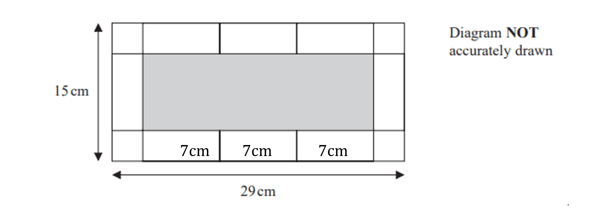
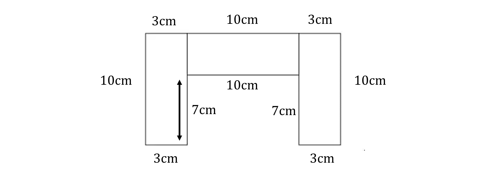
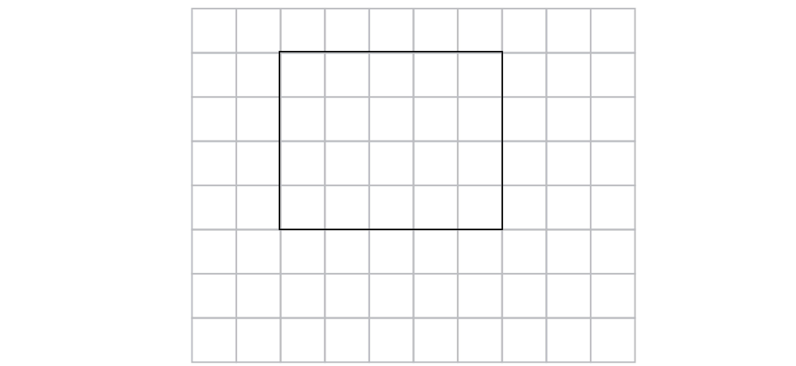

# Mark Schemes — Area & Perimeter
**4. Geometry & Trigonometry** · Edexcel IGCSE Maths A (4MA1) — 18/Foundation

## Q1 — medium — 5 marks · exam-questions

### 14() — 5 marks
> *Calculate the difference between the length and width of the larger rectangle*

$29-15=14\mathrm{cm}$

**[M1]**

> *There are two extra rectangular tiles along the length compared to the width whilst the number of square tiles is the same*

> *Therefore the length of two rectangular tiles is equivalent to the difference in length*

*2 rectangular tile lengths=14cm*

*and therefore*

*1 rectangular tile length=7cm*

**[M1]**

> *Substitute the length of the rectangular tiles along the length of the larger rectangle as below (using the width of the large rectangle will also work):*

> *Calculate the difference between the full length of the rectangle and the three rectangular tiles*

`29 minus open parentheses 7 plus 7 plus 7 close parentheses equals 8 cm`

> *The two square tiles left are equivalent to this distance meaning:*

*2 square tile lengths=8cm*

*and therefore*

*1 square tile length=4cm*

**[M1]**

> *Therefore the width of a rectangular tile is also 4cm as the length of the square tiles and width of the rectangular tiles are equal*

> *The area of the rectangular tile can be calculated using the formula for the area of a rectangle, *$\mathrm{area}=\mathrm{length}\times\mathrm{width}$

$7\times4=28$

**[M1]**

**Final answer:** **28 cm****2**

**[A1]**

## Q2 — hard — 4 marks · exam-questions

### 12() — 4 marks
> *Assign a variable to represent the length of the rectangle, for example *$x$

$\mathrm{Let}x=\mathrm{length} \mathrm{of} \mathrm{the} \mathrm{rectangle}$

> *Write the width of the rectangle as an expression in terms of *$x$

*Width = *$x-8$

> *The perimeter is the total distance around the outside of the rectangle*

> *Write an expression for the perimeter of the rectangle by adding the expressions for the two lengths and the two widths together*

$x+x+x-8+x-8$

> *Simplify the expression by collecting like terms to give*

$4x-16$

> *Equate the expression for the perimeter to the given length of the perimeter to form an equation*

$4x-16=54$

**[M1]**

> *Solve the equation for *$x$*by using inverse operations and doing the same to both sides of the equation*

`table row cell 4 x minus 16 end cell equals 54 row cell 4 x end cell equals cell 54 plus 16 end cell row cell 4 x end cell equals 70 row x equals cell 70 over 4 end cell row x equals cell 17.5 end cell end table`

**[M1]**

> *This means the length of the rectangle is 17.5 cm*

> *The width is 8 cm less than the length giving:*

$17.5-8=9.5\mathrm{cm}$

> *Calculate the area of the rectangle by substituting the values into the formula *$\mathrm{area}=\mathrm{length}\times\mathrm{width}$

$17.5\times9.5=166.25$

**[M1]**

**Final answer:** **166.25 cm****2**

**[A1]**

## Q3 — hard — 4 marks · exam-questions

### 15() — 4 marks
> **[exam-tip]**
> When using $π$ in calculations it is helpful to use exact values, working in terms of $π$ throughout until the final answer is evaluated.
> 
> This ensures that the final answers is accurate.

> *Calculate the area of the circle using *$πr^{2}$

$π\times8.5^{2}=72.25π$

**[M1]**

> *Substitute known values into the formula for the area of a trapezium,*`1 half open parentheses a plus b close parentheses h`

`1 half open parentheses 20 plus 25 close parentheses h`

**[M1]**

> *Form an equation by, equating the expression for the area of the trapezium to the area of the circle, and solve to find the value of *$h$

`1 half open parentheses 20 plus 25 close parentheses h equals 72.25 pi`

> *Simplify*

`table row cell 1 half cross times 45 cross times h end cell equals cell 72.25 pi end cell row cell 22.5 h end cell equals cell 72.25 pi end cell end table`

> *Solve to find the value of *$h$

$h=\frac{72.25π}{22.5}\,h=10.088...$

**[M1]**

> *Round the value of *$h$* to 1 decimal place as stated in the question*

$h=10.1$

**[A1]**

## Q4 — medium — 3 marks · exam-questions

### 7() — 3 marks
> *The perimeter is the length of all the outside added together*

> *Write all the lengths on the shape to help*

> *To get the length inside the middle (marked on the diagram below with an arrow) subtract the short side from the long side*

$10-3=7$

**[M1]**

> *Add all the lengths together*

$10+3+10+3+10+3+7+10+7+3$

**[M1]**

**Final answer:** **66 cm**

**[A1]**

## Q5 — hard — 5 marks · exam-questions

### 1() — 5 marks
Work out the difference between the width and the length

- This will tell you the length of two rectangles

$47-25=22\mathrm{cm}$

**[M1]**

Divide this by two to work out the length of one rectangle

$22\div2=11\mathrm{cm}$

**[M1]**

Subtract the length of one rectangle from the width of the big rectangle and divide by 2 to find the length of the square

$25-11=14\mathrm{cm}$

$14\div2=7\mathrm{cm}$

**[M1]**

Multiply the sides to find the area of the square

$7\times7=49\mathrm{cm}^{2}$

**[M1]**

$49\mathrm{cm}^{2}$

**[A1]**

## Q6 — medium — 3 marks · exam-questions

### 13((a)) — 3 marks
> *Calculate the perimeter of the triangle*

> *The triangle is isosceles, so the missing side is the same length as the other side with the dash through it*

$8+8+12=28$

**[M1]**

> *The rectangle has the same perimeter so subtract the two sides of 5 that we know*

$28-5-5=18$

> *Divide it by 2 to find the length of the rectangle*

$18\div2=9$

> *Calculate the area of the rectangle*

*Area = length × width*

$9\times5=45$

**[M1]**

**Final answer:** **45**

**[A1]**

## Q7 — easy — 2 marks · exam-questions

### 6((b)) — 2 marks
> *The area of a rectangle is the width multiplied by the length*

> *Find two numbers that multiply to make 20*

**[B1 B1]**

> **[mark-scheme]**
> **B1: **For any rectangle or any shape with area $20\mathrm{cm}^{2}$.
> 
> **B1: **For a rectangle with area $20\mathrm{cm}^{2}$.

> **[exam-tip]**
> The rectangle could be 5x4, 4x5, 10x2, or 2x10. Check that there are 20 squares inside your rectangle.

## Q8 — medium — 4 marks · exam-questions

### 1() — 4 marks
Write an expression for the length and width

`table row cell Length space end cell equals cell space x space end cell row cell Width space end cell equals cell space x space minus space 6 space end cell end table`

Form an equation using the perimeter

`table row cell x plus x minus 6 plus x plus x minus 6 space end cell equals cell 4 x space minus 12 end cell end table`

**[M1]**

Equal the expression to the perimeter and solve for *x*

`table row cell 4 x space minus space 12 space end cell equals cell space 26 end cell row cell 4 x space end cell equals cell space 38 end cell row cell x space end cell equals cell space 9.5 end cell end table`

**[M1]**

Find the width and multiply by the length to find the area of the rectangle

$\mathrm{Width}=3.5\mathrm{cm}\,3.5\times9.5=33.25$

**[M1]**

**Final answer:** **33.25cm****2**

**[A1]**

> **[mark-scheme]**
> **M1**: For forming an equation using the perimeter in terms of one unknown. It does not need to be simplified. You can use $x$ and $x-6$, or  $x$ and $x+6$.
> 
> **M1**: For solving your equation.
> 
> **M1**: For multiplying your length and width.
> 
> **A1**: Correct answer. You do not need units for this mark.
