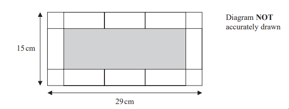
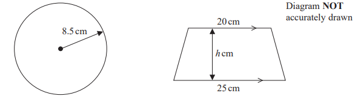
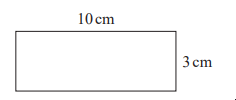
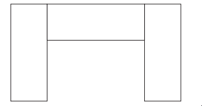
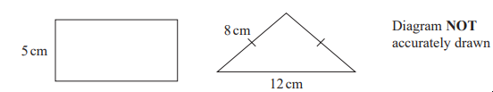

# Exam Questions — Area & Perimeter
**4. Geometry & Trigonometry** · Edexcel IGCSE Maths A (4MA1) — 18/Foundation
> Source: [https://www.savemyexams.com/igcse/maths/edexcel/a/18/foundation/topic-questions/geometry-and-trigonometry/area-and-perimeter/exam-questions/](https://www.savemyexams.com/igcse/maths/edexcel/a/18/foundation/topic-questions/geometry-and-trigonometry/area-and-perimeter/exam-questions/) · 8 questions · total 30 marks

## Q1 — medium — 5 marks · exam-questions

### 14() — 5 marks — command: work_out — structured — from paper Specimen paper · 4MA1/1F
Calvin has 8 identical rectangular tiles and 4 identical square tiles. 
He arranges the tiles to fit exactly round the edge of a rectangle, as shown in the diagram below.

Work out the area of one of Calvin’s rectangular tiles

## Q2 — hard — 4 marks · exam-questions

### 12() — 4 marks — command: find — structured — from paper Specimen paper · 4MA1/2F
The width of a rectangle is 8 cm less than the length of the rectangle.
The perimeter of the rectangle is 54 cm.

Find the area of the rectangle.

## Q3 — hard — 4 marks · exam-questions

### 15() — 4 marks — command: work_out — structured — from paper Specimen paper · 4MA1/2F
The diagram shows a circle and a trapezium.

The height of the trapezium is $h$ cm.

The area of the circle is equal to the area of the trapezium.

Work out the value of $h$. 
Give your answer correct to 1 decimal place.

## Q4 — medium — 3 marks · exam-questions

### 7() — 3 marks — command: work_out — structured — from paper 2023 June · 4MA1/1F
The diagram shows a rectangle measuring 10cm by 3 cm.

A shape is made by placing 3 of these rectangles together as shown in the diagram.

Work out the perimeter of the shape.

## Q5 — hard — 5 marks · exam-questions

### 1() — 5 marks — command: work_out — structured
Baasit has 8 identical rectangular tiles and 4 identical square tiles. He arranges the tiles to fit exactly around the edge of a rectangle, as shown in the diagram below.

Work out the area of one of Baasit's square tiles.

## Q6 — medium — 3 marks · exam-questions

### 13((a)) — 3 marks — command: find — structured — from paper 2023 June · 4MA1/1F
The diagram shows a rectangle and an isosceles triangle.

The perimeter of the rectangle is equal to the perimeter of the triangle.

Find the area of the rectangle

## Q7 — easy — 2 marks · exam-questions

### 6((b)) — 2 marks — command: draw — structured — from paper 2023 Nov · 4MA1/2F
Here is a centimetre grid

On the grid, draw a rectangle with an area of 20cm2

## Q8 — medium — 4 marks · exam-questions

### 1() — 4 marks — command: find — structured
The width of a rectangle is 6 cm less than the length of the rectangle. The perimeter of the rectangle is 26 cm.

Find the area of the rectangle.

........... cm2
