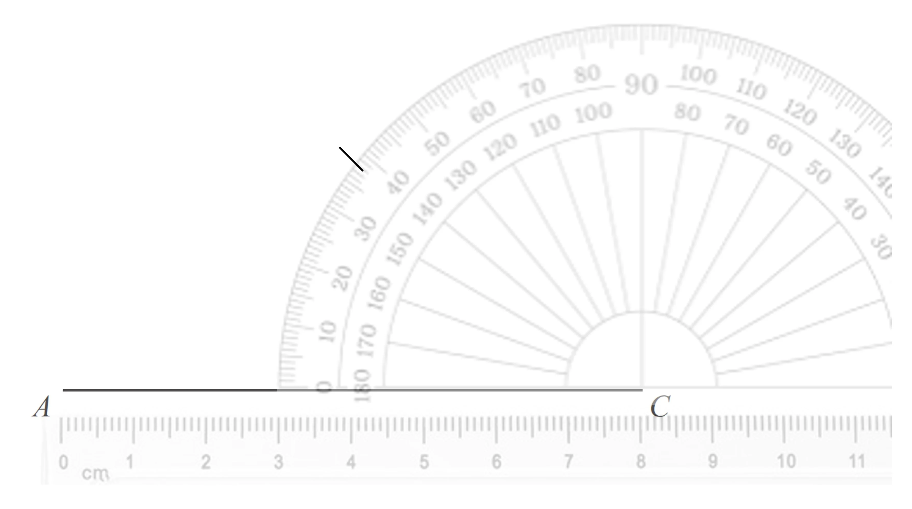
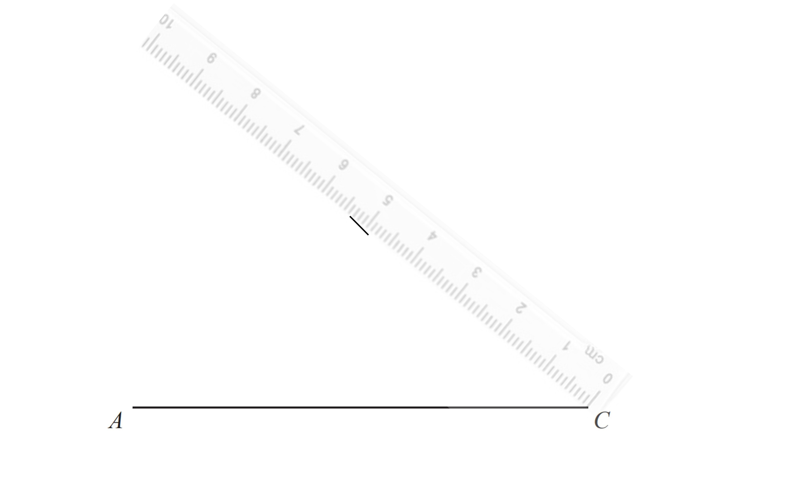
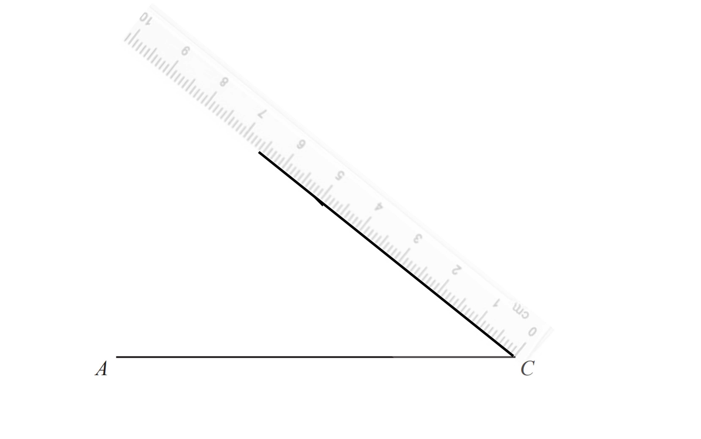
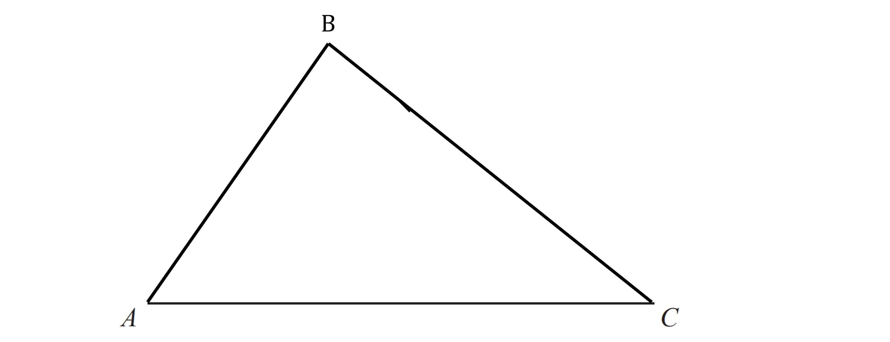
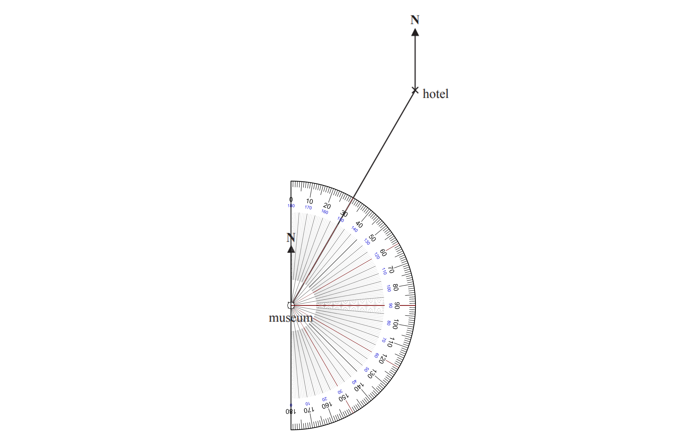
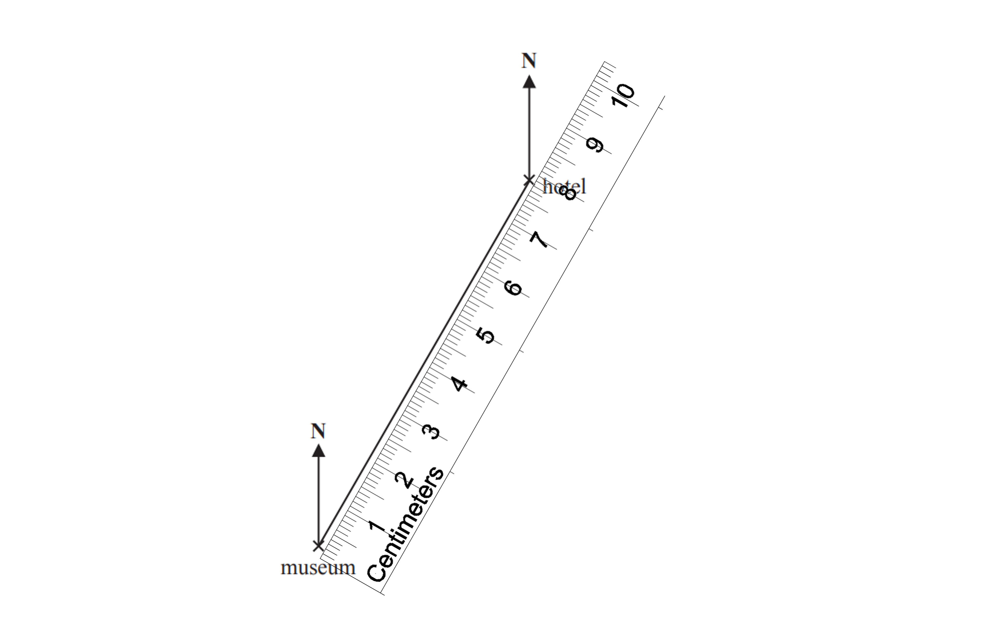

# Mark Schemes — Bearings, Scale Drawing & Constructions
**4. Geometry & Trigonometry** · Edexcel IGCSE Maths A (4MA1) — 18/Foundation

## Q1 — easy — 1 marks · exam-questions

### 6((b)) — 1 marks
> *Carefully line your ruler up with the zero on the end of the line at A*

> *Read off the number of the end of the line at B*

**Final answer:** **8.6**

**[B1]**

> **[mark-scheme]**
> **B1:** Answers in the range 8.4-8.8 will get this mark.

## Q2 — easy — 2 marks · exam-questions

### 9() — 2 marks
> *Line up your protractor horizontally with the centre cross on C*

> *Measure round from the zero nearest A until you get to 38° and mark that point*

> *Line up your ruler between C and your mark keeping 0 on C*

> *Draw a line 6.5cm long keeping your ruler in that position*

Join the end and the end of your line with a straight line to complete the triangle

**[B1 B1]**

> **[mark-scheme]**
> **B1: **For correctly marking an angle of 38° or measuring a line BC of 6.5cm. Your angle must be in the range of 36°-40°. BC must be in the range of 6.3cm-6.7cm.
> 
> **B1:** Your complete triangle accurately drawn within the ranges given in the first mark.

## Q3 — easy — 4 marks · exam-questions

### 16((a)) — 1 marks
> *Line your protractor up on Q with 0° on the North line and the cross in the middle of your protractor on Q*

> *Measure round from 0 to the line that goes to P*

**Final answer:** **104°**

**[B1]**

> **[mark-scheme]**
> **B1:** Answers in the range 102-106 will be accepted.

### 16((b)) — 3 marks
> *Measure the distance between P and Q*

*9.4 cm*

> *Using the scale 1cm = 50km, convert to km*

$9.4\times50=470\mathrm{km}$

**[M1]**

> *speed = distance ÷ time*

*speed *$=470\div2$

**[M1]**

**Final answer:** **235**

**[A1]**

> **[mark-scheme]**
> **A1:** Answers in the range 230-240 will be accepted.

## Q4 — easy — 3 marks · exam-questions

### 14((a)) — 1 marks
> **[exam-tip]**
> Remember the three rules for bearings:
> 
> 1. Measured from North.
> 2. Measured clockwise.
> 3. Written with 3 digits.

> *Line your protractor up with the 0 on the North line of the museum and measure the angle*

$030^{\circ}$

**[B1]**

> **[mark-scheme]**
> **B1: **Answers between 28-32 are accepted.

### 14((b)) — 2 marks
> *Use your ruler to measure the distance on the paper*

> *The distance on paper is 8cm *

$1\mathrm{cm}=4.5\mathrm{km}\,8\mathrm{cm}=4.5\mathrm{km}\times8$

**[M1]**

**Final answer:** **36km**

**[A1]**

> **[mark-scheme]**
> **M1: **7.8-8.2 allowed
> 
> **A1: **35-37 allowed
