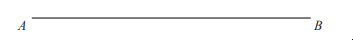
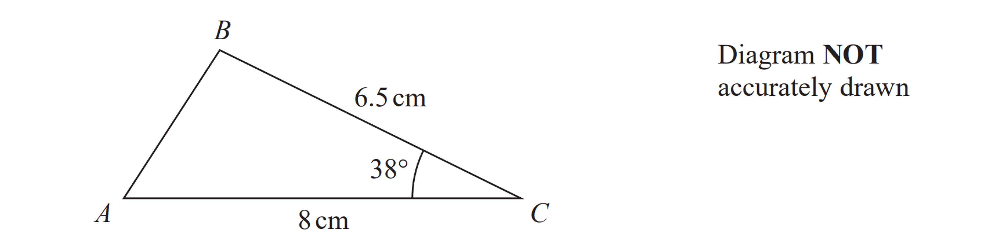
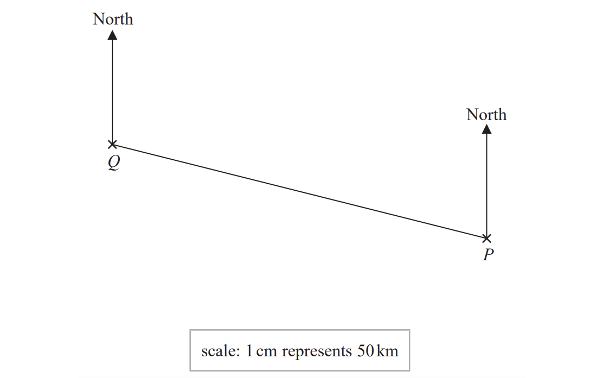
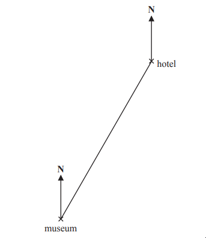

# Exam Questions — Bearings, Scale Drawing & Constructions
**4. Geometry & Trigonometry** · Edexcel IGCSE Maths A (4MA1) — 18/Foundation
> Source: [https://www.savemyexams.com/igcse/maths/edexcel/a/18/foundation/topic-questions/geometry-and-trigonometry/bearings-scale-drawing-and-constructions/exam-questions/](https://www.savemyexams.com/igcse/maths/edexcel/a/18/foundation/topic-questions/geometry-and-trigonometry/bearings-scale-drawing-and-constructions/exam-questions/) · 4 questions · total 10 marks

## Q1 — easy — 1 marks · exam-questions

### 6((b)) — 1 mark — command: measure — structured — from paper 2023 June · 4MA1/2F
Measure the length of the line $AB$ 
Give your answer in centimetres.

## Q2 — easy — 2 marks · exam-questions

### 9() — 2 marks — command: construct — structured — from paper 2023 June · 4MA1/2F
Here is a sketch of triangle $ABC$

$AC=8\mathrm{cm}BC=6.5\mathrm{cm} \mathrm{angle}ACB=38^{\circ}$

In the space below, make an accurate drawing of triangle $ABC$
The line $AC$ has been drawn for you.

## Q3 — easy — 4 marks · exam-questions

### 16((a)) — 1 mark — command: find — structured — from paper 2023 June · 4MA1/2F
The scale drawing shows the positions of two airports $P$ and $Q$

Find, by measuring, the bearing of $P$ from $Q$

### 16((b)) — 3 marks — command: work_out — structured — from paper 2023 June · 4MA1/2F
A small plane flies directly from $P$ to $Q$
The plane takes 2 hours to fly from $P$ to $Q$

Work out the average speed of the plane. 
Give your answer in km/ h

## Q4 — easy — 3 marks · exam-questions

### 14((a)) — 1 mark — command: measure — structured — from paper 2023 Nov  · 4MA1/1F
Here is an accurate scale drawing showing the positions of a hotel and a museum.

Scale: 1 cm represents 4.5 km

Find, by measuring, the bearing of the hotel from the museum.

### 14((b)) — 2 marks — command: work_out — structured — from paper 2023 Nov · 4MA1/1F
Work out the real distance between the hotel and the museum.
