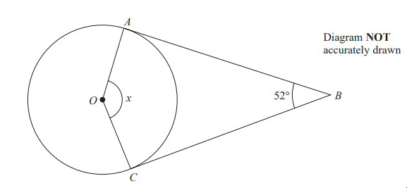
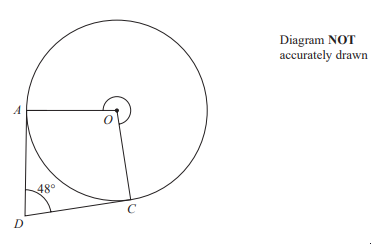
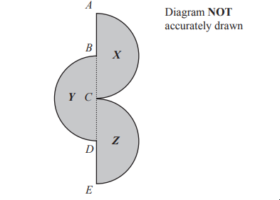
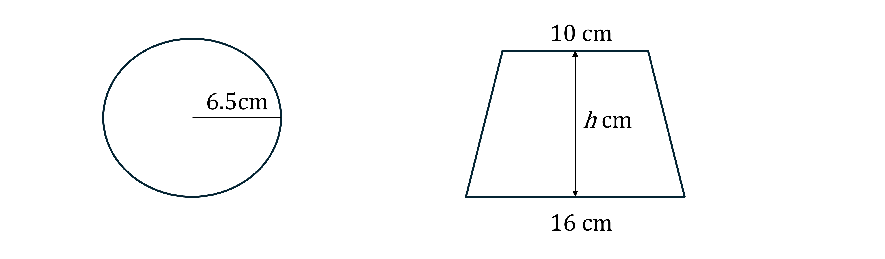

# Exam Questions — Circles, Arcs & Sectors
**4. Geometry & Trigonometry** · Edexcel IGCSE Maths A (4MA1) — 18/Foundation
> Source: [https://www.savemyexams.com/igcse/maths/edexcel/a/18/foundation/topic-questions/geometry-and-trigonometry/circles-arcs-and-sectors/exam-questions/](https://www.savemyexams.com/igcse/maths/edexcel/a/18/foundation/topic-questions/geometry-and-trigonometry/circles-arcs-and-sectors/exam-questions/) · 8 questions · total 25 marks

## Q1 — hard — 4 marks · exam-questions

### 20() — 4 marks — command: work_out — structured — from paper Specimen paper · 4MA1/2F

$A$ and $C$ are points on a circle, centre $O$.
 $AB$ and $CB$are tangents to the circle. 
Angle $ABC$ = 52°

Work out the size of angle $x$. 
Give a reason for each stage of your working.

## Q2 — easy — 2 marks · exam-questions

### 12() — 2 marks — command: work_out — structured — from paper 2023 June · 4MA1/2F
A circle has radius 8.5cm.

Work out the circumference of the circle. Give your answer correct to 3 significant figures.

## Q3 — hard — 3 marks · exam-questions

### 23() — 3 marks — command: work_out — structured — from paper 2023 June · 4MA1/2F

$A$ and $C$ are points on a circle, centre $O$ 
$DA$ is the tangent to the circle at $A$ and $DC$ is the tangent to the circle at $C$

Angle $ADC$ = 48°

Work out the size of reflex angle $AOC$

## Q4 — easy — 1 marks · exam-questions

### 3((b)) — 1 mark — command: write — structured — from paper 2023 Nov · 4MA1/1F

$P$ is a point on a circle with centre $O$

Write down the mathematical name of the line  $OP$

## Q5 — medium — 4 marks · exam-questions

### 13() — 4 marks — command: work_out — structured — from paper 2023 Nov · 4MA1/1F
A wheel on a tractor has a diameter of 160 cm.

The tractor travels 1750 metres

Work out the number of complete turns made by the wheel. 
Show your working clearly

## Q6 — hard — 4 marks · exam-questions

### 1() — 4 marks — command: work_out — structured

A and B are points on a circle, centre O.

AC and BC are tangents to the circle.

Angle ACB = 48° .

Work out the size of angle $x$.

Give a reason for each stage of your working

$x=$............°

## Q7 — hard — 3 marks · exam-questions

### 19() — 3 marks — command: work_out — structured — from paper 2023 Nov · 4MA1/1F
The diagram shows a shaded shape made from three identical semicircle, $X$,  $Y$ and $Z$

$ABCDE$ is a straight line.

$AC$ is the diameter of semicircle  $X$and $B$ is the centre of semicircle   $X$ 
$BD$ is the diameter of semicircle $Y$ and $C$is the centre of semicircle  $Y$ 
$CE$ is the diameter of semicircle $Z$ and $D$ is the centre of semicircle $Z$

$AC=BD=CE=20\mathrm{cm}$

Work out the perimeter of the shaded shape. 
Give your answer correct to the nearest whole number.

## Q8 — medium — 4 marks · exam-questions

### 1() — 4 marks — command: work_out — structured
The diagram shows a circle and a trapezium.

The height of the trapezium is $h$ cm.

The area of the circle is equal to the area of the trapezium.

Work out the value of $h$.

Give your answer correct to 1 decimal place.
