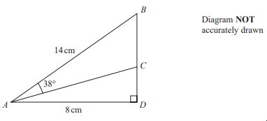
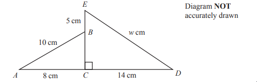
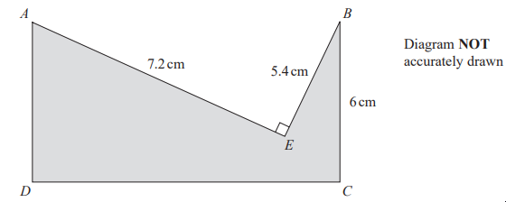

# Exam Questions — Pythagoras & Trigonometry
**4. Geometry & Trigonometry** · Edexcel IGCSE Maths A (4MA1) — 18/Foundation
> Source: [https://www.savemyexams.com/igcse/maths/edexcel/a/18/foundation/topic-questions/geometry-and-trigonometry/pythagoras-and-trigonometry/exam-questions/](https://www.savemyexams.com/igcse/maths/edexcel/a/18/foundation/topic-questions/geometry-and-trigonometry/pythagoras-and-trigonometry/exam-questions/) · 7 questions · total 26 marks

## Q1 — hard — 4 marks · exam-questions

### 23() — 4 marks — command: work_out — structured — from paper Specimen paper · 4MA1/1F
The diagram shows an isosceles triangle.

Work out the area of the triangle.

## Q2 — medium — 3 marks · exam-questions

### 1() — 3 marks — command: calculate — structured
Calculate the size of angle $x$.

Give your answer correct to 1 decimal place.

$x=$............°

## Q3 — medium — 3 marks · exam-questions

### 19() — 3 marks — command: calculate — structured — from paper Specimen paper · 4MA1/2F

Calculate the size of angle $x$. 
Give your answer correct to 1 decimal place.

## Q4 — hard — 4 marks · exam-questions

### 28() — 4 marks — command: work_out — structured — from paper 2023 June · 4MA1/2F
The diagram shows right-angled triangle $ABD$

$AB=14\mathrm{cm}AD=8\mathrm{cm}$

$C$ is the point on $BD$ such that angle $BAC$ = 38°

Work out the length of $CD$ 
Give your answer correct to 3 significant figures.

## Q5 — medium — 4 marks · exam-questions

### 18() — 4 marks — command: work_out — structured — from paper 2023 Nov · 4MA1/2F
The diagram shows triangle $ABC$and triangle $ECD$

$ACD$ and $EBC$ are straight lines.

$AB=10\mathrm{cm}AC=8\mathrm{cm}EB=5\mathrm{cm}CD=14\mathrm{cm}ED=w\mathrm{cm}$

Work out the value of $w$
Give your answer correct to one decimal place.

## Q6 — hard — 4 marks · exam-questions

### 20() — 4 marks — command: work_out — structured — from paper 2023 June · 4MA1/1F
The diagram shows a shaded shape $AEBCD$ made by removing triangle $AEB$ from rectangle $ABCD$.

$AE=7.2\mathrm{cm}BE=5.4\mathrm{cm}BC=6\mathrm{cm} \mathrm{angle}AEB=90^{\circ}$

Work out the perimeter of the shaded shape

## Q7 — hard — 4 marks · exam-questions

### 1() — 4 marks — command: work_out — structured
The diagram shows an isosceles triangle.

Work out the area of the triangle. Give your answer to 3 significant figures.

........... cm2
