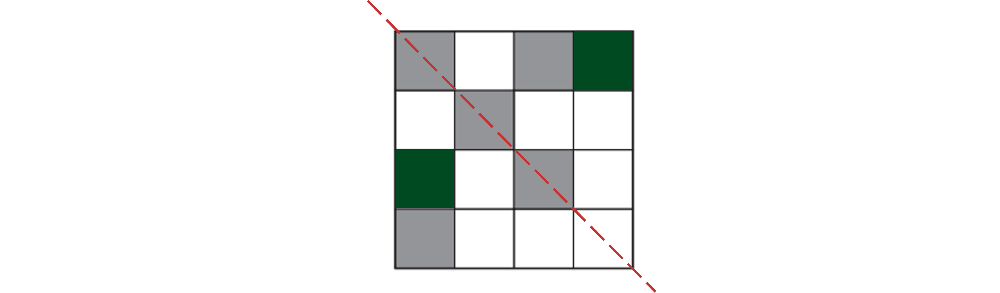
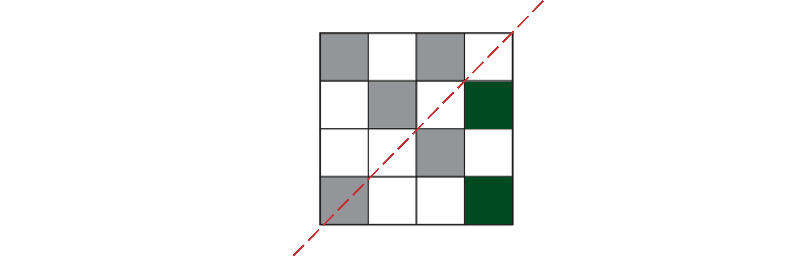
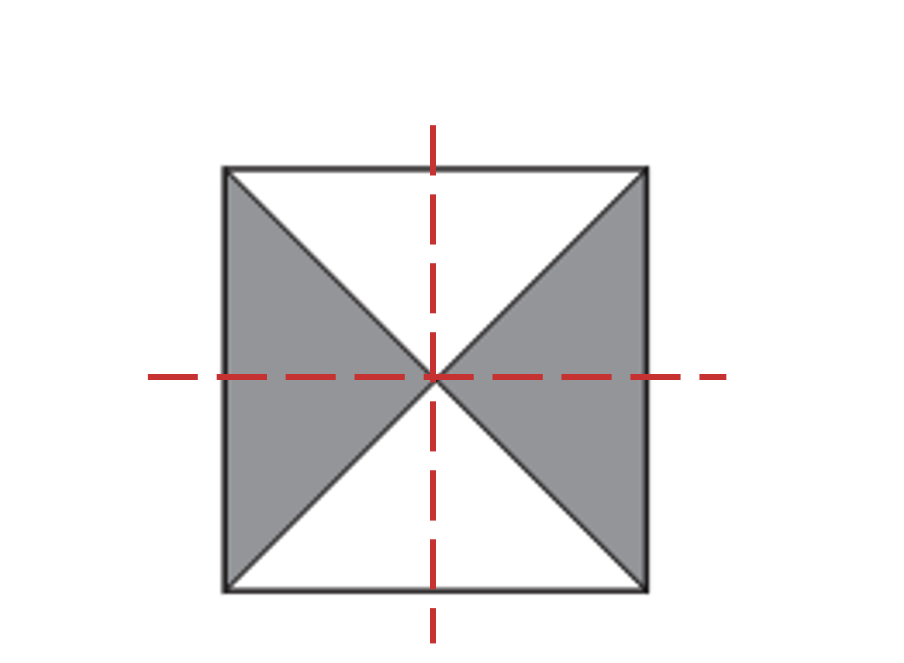
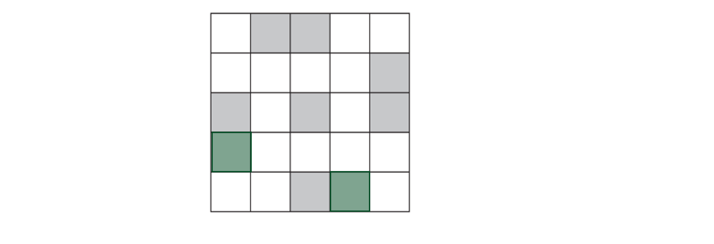
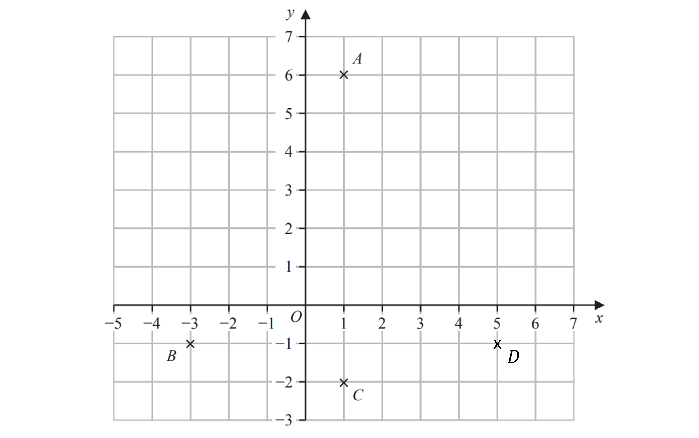
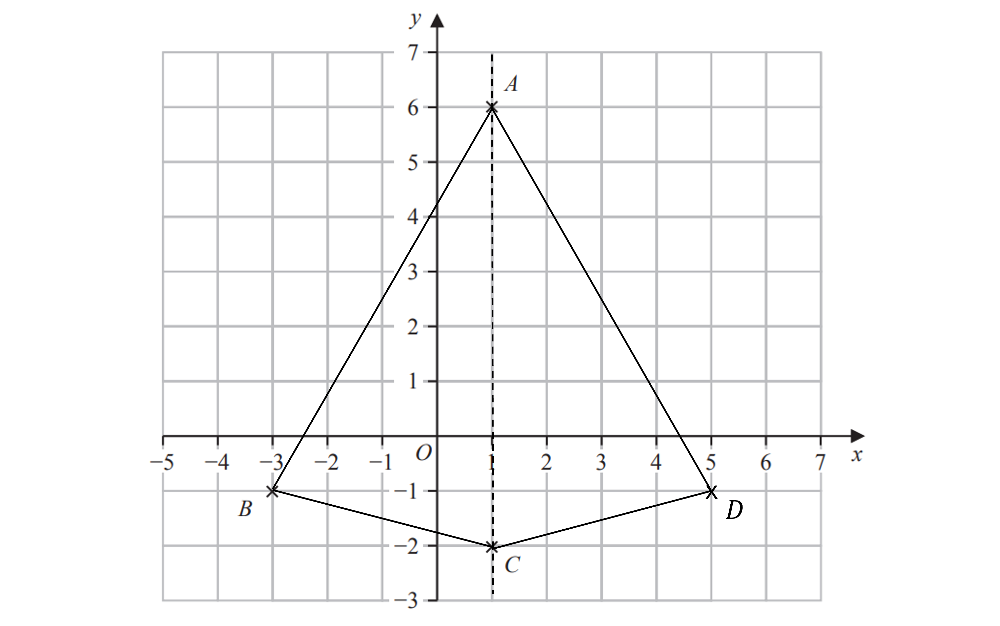
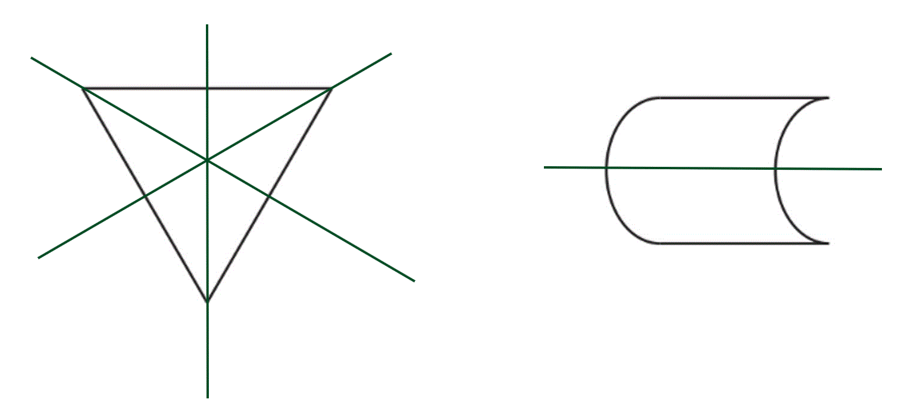
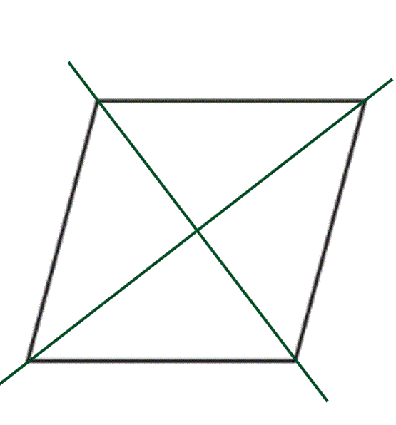
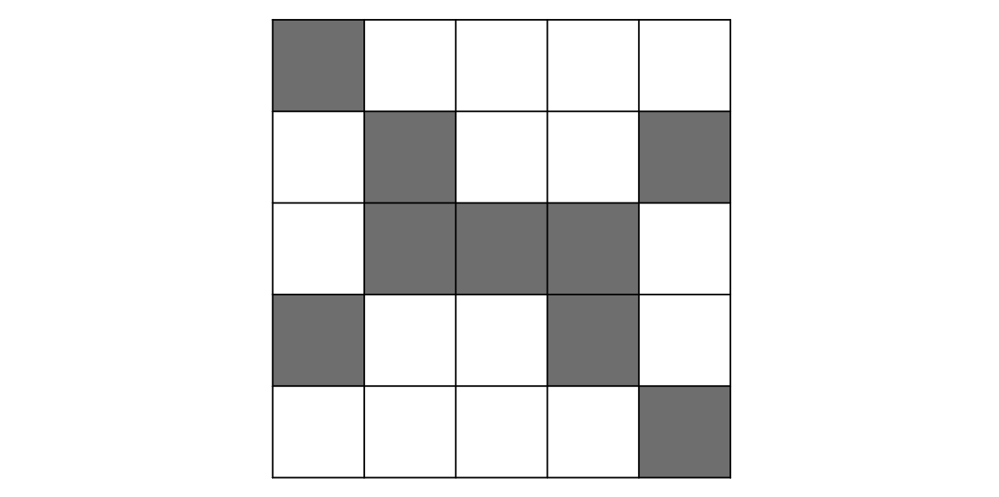
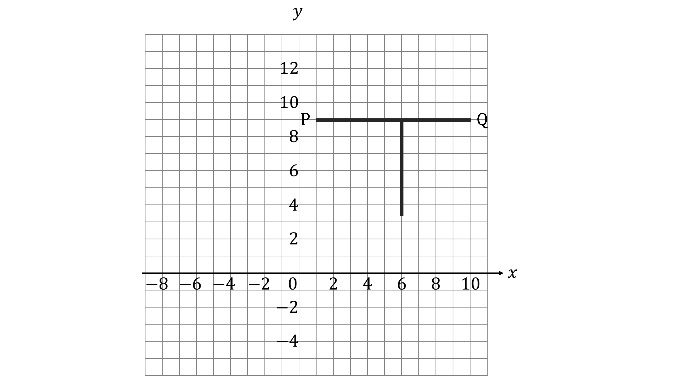

# Mark Schemes — Symmetry & Shapes
**4. Geometry & Trigonometry** · Edexcel IGCSE Maths A (4MA1) — 18/Foundation

## Q1 — medium — 2 marks · exam-questions

### 4() — 2 marks
> *If the first shape was rotated, it would look the same **4 times** as it passed through a full *$360^{\circ}$* turn.*

> *The second shape would look the same **2 times.*

> * *

**4      2** **[2]**

**one mark for each**

## Q2 — hard — 1 marks · exam-questions

### 14((a)) — 1 marks
> *The shape currently has no lines of symmetry.*
* We would need to shade more than two squares for there to be a horizontal or vertical line of symmetry, so the line of symmetry must be diagonal.*
* A line of symmetry acts as a mirror line so the shape must be identical on either side of the line.*
* Drawing in the line of symmetry will help.*

> *Or*

**Either pattern ****[1]**

## Q3 — easy — 1 marks · exam-questions

### 3((a)) — 1 marks
> *The angle is greater than *$180^{\circ}$

**Final answer:** **Reflex**

**[B1]**

## Q4 — medium — 2 marks · exam-questions

### 14((b)) — 2 marks
> *A line of symmetry means that the shape is identical either side of it, like a mirror line. This shape has a vertical line of symmetry and a horizontal line of symmetry. It can help to draw the lines of symmetry on the shape and check that it is identical either side.*

**2 lines of symmetry ****[1]**

> *Rotational symmetry refers to how many times a shape looks identical when it has been rotated. Take care to consider which triangles have been shaded for this shape. If we rotated the shape by 90°, it would not look the same because the shaded triangles would be in a different place, so we would need to rotate it by 180°, and then 180° again. It would only look the same twice.*

**order of rotational symmetry 2** **[1]**

## Q5 — hard — 1 marks · exam-questions

### 7((b)) — 1 marks
> *As the shape has a rotational symmetry of order 4, the shape must be identical to the original after every rotation of*

$\frac{360}{4}=90^{\circ}$

> *Shade the appropriate two squares*

**[1]**

## Q6 — easy — 2 marks · exam-questions

### 4((d)) — 1 marks
A kite has two pairs of adjacent, equal sides

**[B1]**

> **[exam-tip]**
> If needed, check with your ruler that the adjacent lines would be equal in length.

### 4((e)) — 1 marks
> *Use your ruler to draw dotted lines to find lines of symmetry*

> **[exam-tip]**
> The shape should be exactly the same on both sides of the mirror line. You can gently fold your page to check if needed.

**Final answer:** **1 line of symmetry**

**[B1]**

## Q7 — easy — 1 marks · exam-questions

### 3() — 1 marks
> *A **regular octagon **will look the same 8 times as it is rotated through *$360^{\circ}$*.*

> * *

**8** **[1]**

## Q8 — easy — 4 marks · exam-questions

### 4((a)) — 3 marks
> *An **equilateral **triangle has three lines of symmetry, one through each vertex.*

> *The second shape only has one line of symmetry.*

> *Draw the lines onto the shapes with a ruler.*

> * *

**All correct with no extras ****[3]**

### 4((b)) — 1 marks
> *The shape will look the same **2 **times as it is rotated though *$360^{\circ}$*.*

** ****2** **[1]**

## Q9 — easy — 1 marks · exam-questions

### 9() — 1 marks
> *The shape will look the same **two **times as it is rotated *$360^{\circ}$*about its centre.*

> * *

**2** **[1]**

## Q10 — easy — 1 marks · exam-questions

### 2() — 1 marks
> *Rotational symmetry refers to the number of times a shape looks the same as it is rotated *$360^{\circ}$* about its centre. If we put a pencil in the centre of the pentagon and turn it, it will look the same 5 times.*

**5**** ****[1]**

## Q11 — easy — 1 marks · exam-questions

### 3() — 1 marks
> *A reflex angle is greater than *$180^{\circ}$*.*

**Angle **$C$** is a reflex angle**** ****[1]**

## Q12 — easy — 2 marks · exam-questions

### 5((a)) — 2 marks
> *On a rhombus, the only places we can draw lines of symmetry are on the diagonals.*

**one mark for each line**** ****[2]**

## Q13 — easy — 1 marks · exam-questions

### 1() — 1 marks
> *Reflect each square horizontally and then vertically through centre lines*

**[B1]**

## Q14 — easy — 1 marks · exam-questions

### 1() — 1 marks

**[B1]**

> **[mark-scheme]**
> **B1**: Any lines that meet at a right angle will get the mark here and the line can be any length.
