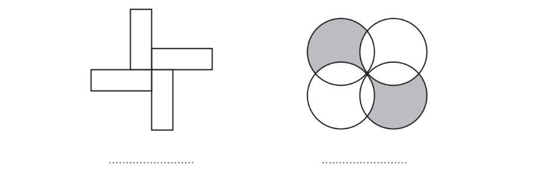
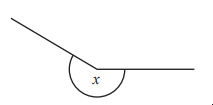
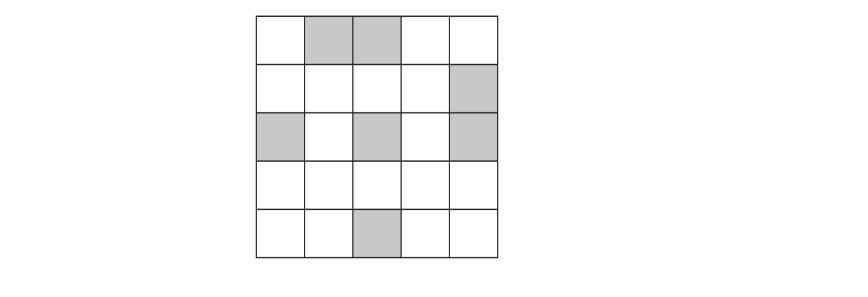
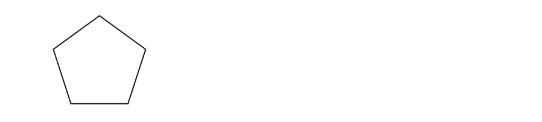
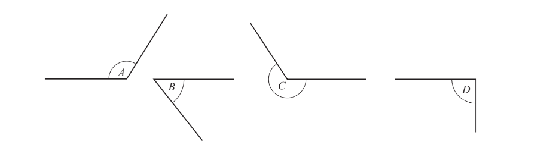
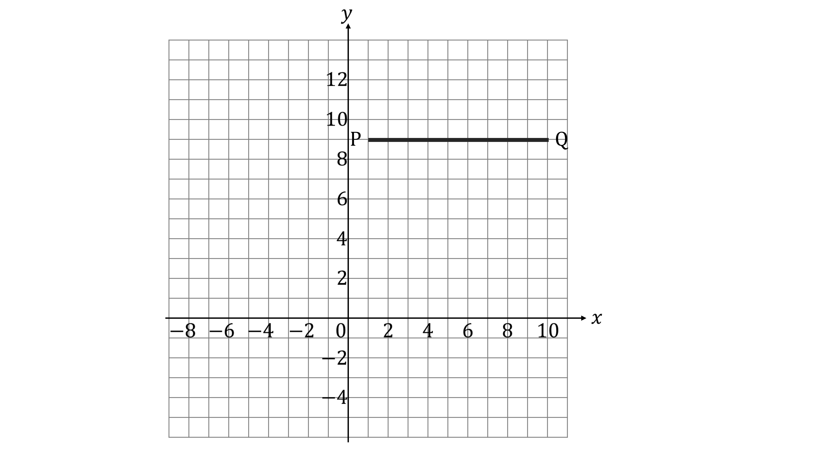

# Exam Questions — Symmetry & Shapes
**4. Geometry & Trigonometry** · Edexcel IGCSE Maths A (4MA1) — 18/Foundation
> Source: [https://www.savemyexams.com/igcse/maths/edexcel/a/18/foundation/topic-questions/geometry-and-trigonometry/symmetry-and-shapes/exam-questions/](https://www.savemyexams.com/igcse/maths/edexcel/a/18/foundation/topic-questions/geometry-and-trigonometry/symmetry-and-shapes/exam-questions/) · 14 questions · total 21 marks

## Q1 — medium — 2 marks · exam-questions

### 4() — 2 marks — command: write — structured — from paper Nov 2020 · 0580/13
Write down the order of rotational symmetry of each shape.

## Q2 — hard — 1 marks · exam-questions

### 14((a)) — 1 mark — command: fill — structured — from paper Nov 2019 · 0580/12

Shade two more small squares to give a pattern with exactly one line of symmetry.

## Q3 — easy — 1 marks · exam-questions

### 3((a)) — 1 mark — command: write — structured — from paper 2023 Nov · 4MA1/1F

Write down the mathematical name of the angle marked $x$

## Q4 — medium — 2 marks · exam-questions

### 14((b)) — 2 marks — command: complete — structured — from paper Nov 2019 · 0580/12

Complete the description of this pattern.

The pattern has ................ lines of symmetry

and order of rotational symmetry ................

## Q5 — hard — 1 marks · exam-questions

### 7((b)) — 1 mark — command: fill — structured — from paper June 2019 · 0580/12
Shade two more squares so that this grid has rotational symmetry of order 4.

## Q6 — easy — 2 marks · exam-questions

### 4((d)) — 1 mark — command: mark — structured — from paper 2023 Nov · 4MA1/1F
The point $D$is such that the shape $ABCD$ is a kite

On the grid, mark with a cross (×) the point  $D$
Label the point  $D$

### 4((e)) — 1 mark — command: find — structured — from paper 2023 Nov · 4MA1/1F
How many lines of symmetry has kite $ABCD$?

## Q7 — easy — 1 marks · exam-questions

### 3() — 1 mark — command: write — structured — from paper Nov 2020 · 0580/12

Write down the order of rotational symmetry of this regular octagon.

## Q8 — easy — 4 marks · exam-questions

### 4((a)) — 3 marks — command: draw — structured — from paper June 2020 · 0580/11

On each shape draw all the lines of symmetry.

### 4((b)) — 1 mark — command: write — structured — from paper June 2020 · 0580/11

Write down the order of rotational symmetry of this shape.

## Q9 — easy — 1 marks · exam-questions

### 9() — 1 mark — command: write — structured — from paper June 2020 · 0580/12

Write down the order of rotational symmetry of the diagram.

## Q10 — easy — 1 marks · exam-questions

### 2() — 1 mark — command: write — structured — from paper June 2019 · 0580/11

Write down the order of rotational symmetry of this regular pentagon.

## Q11 — easy — 1 marks · exam-questions

### 3() — 1 mark — command: complete — structured — from paper March 2019 · 0580/12

Complete the statement.

Angle ...................... is a reflex angle.

## Q12 — easy — 2 marks · exam-questions

### 5((a)) — 2 marks — command: draw — structured — from paper Nov 2020 · 0580/11

The diagram shows a rhombus

On the diagram, draw all the lines of symmetry

## Q13 — easy — 1 marks · exam-questions

### 1() — 1 mark — command: shade — structured
Shade 4 more squares so that the diagram has a rotational symmetry of 2.

## Q14 — easy — 1 marks · exam-questions

### 1() — 1 mark — command: draw — structured

On the grid above, draw a line segment that is perpendicular to line PQ.
