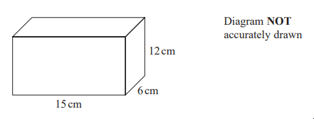
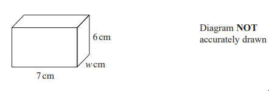
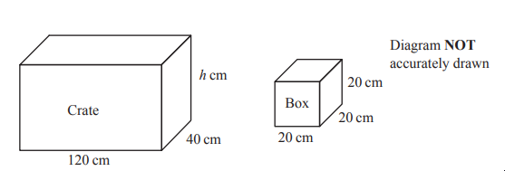

# Exam Questions — Volume & Surface Area
**4. Geometry & Trigonometry** · Edexcel IGCSE Maths A (4MA1) — 18/Foundation
> Source: [https://www.savemyexams.com/igcse/maths/edexcel/a/18/foundation/topic-questions/geometry-and-trigonometry/volume-and-surface-area/exam-questions/](https://www.savemyexams.com/igcse/maths/edexcel/a/18/foundation/topic-questions/geometry-and-trigonometry/volume-and-surface-area/exam-questions/) · 4 questions · total 10 marks

## Q1 — easy — 2 marks · exam-questions

### 8((a)) — 2 marks — command: work_out — structured — from paper Specimen paper · 4MA1/1F
Here is a cuboid.

Work out the volume of the cuboid.

## Q2 — medium — 2 marks · exam-questions

### 13((b)) — 2 marks — command: calculate — structured — from paper 2023 June · 4MA1/1F
The diagram shows a cuboid.

The volume of the cuboid is 231cm3

Calculate the value of $w$

## Q3 — easy — 2 marks · exam-questions

### 1() — 2 marks — command: work_out — structured
Here is a cuboid.

Work out the volume of the cuboid.

.................. mm3

## Q4 — medium — 4 marks · exam-questions

### 16() — 4 marks — command: work_out — structured — from paper 2023 Nov · 4MA1/2F

A crate is in the shape of a cuboid with inside lengths of 120 cm, 40 cm and $h$ cm 
The crate has a lid.

Micah has 48 boxes. 
Each box is in the shape of a cube 20 cm by 20 cm by 20 cm

Micah wants to put all the boxes in the crate and shut the lid.

Work out the least possible value of $h$
