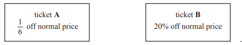
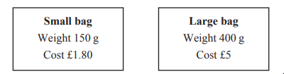

# Exam Questions — Exchange Rates & Best Buys
**1. Numbers & the Number System** · Edexcel IGCSE Maths A (4MA1) — 18/Foundation
> Source: [https://www.savemyexams.com/igcse/maths/edexcel/a/18/foundation/topic-questions/numbers-and-the-number-system/exchange-rates-and-best-buys/exam-questions/](https://www.savemyexams.com/igcse/maths/edexcel/a/18/foundation/topic-questions/numbers-and-the-number-system/exchange-rates-and-best-buys/exam-questions/) · 4 questions · total 13 marks

## Q1 — medium — 3 marks · exam-questions

### 14((a)) — 1 mark — command: change — structured — from paper 2023 June · 4MA1/2F
| 1 dollar = 0.85 euros |
|---|
| 1 dollar = 6.45 yuan |

Change 720 dollars to euros.

### 14((b)) — 2 marks — command: change — structured — from paper 2023 June · 4MA1/2F
Change 2580 yuan to euros.

## Q2 — medium — 3 marks · exam-questions

### 1() — 3 marks — command: which — structured
Tanja sees the same jacket in the UK, Greece and the USA.

The jacket costs £42 in the UK.

The jacket costs 47 euros in Greece.

The jacket costs \$59 in the USA.

The exchange rates are

£1 = 1.13 euros

£1 = \$1.38 dollars

In which of these countries is the jacket cheaper? You must show your working.

## Q3 — medium — 4 marks · exam-questions

### 20() — 4 marks — command: work_out — structured — from paper 2023 Nov · 4MA1/1F
Juan wants to buy a ticket to fly from Madrid to Berlin.

He finds two different types of ticket he can buy in a sale, ticket **A** and ticket **B**.

The sale price of ticket **A** is 140 euros. 
The sale price of ticket **B** is 136 euros.

Work out the difference between the normal price of ticket **A** and the normal price of ticket **B**.

## Q4 — medium — 3 marks · exam-questions

### 15() — 3 marks — command: work_out — structured — from paper 2023 Nov · 4MA1/2F
Yuan sells fudge in small bags and in large bags.

Work out which bag is the better value for money. 
Show your working clearly
