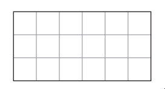

# Exam Questions — Fractions
**1. Numbers & the Number System** · Edexcel IGCSE Maths A (4MA1) — 18/Foundation
> Source: [https://www.savemyexams.com/igcse/maths/edexcel/a/18/foundation/topic-questions/numbers-and-the-number-system/fractions/exam-questions/](https://www.savemyexams.com/igcse/maths/edexcel/a/18/foundation/topic-questions/numbers-and-the-number-system/fractions/exam-questions/) · 9 questions · total 27 marks

## Q1 — easy — 2 marks · exam-questions

### 1((a)) — 1 mark — command: write — structured — from paper Specimen paper · 4MA1/1F
Write $\frac{12}{15}$ as a fraction in its simplest form.

### 1((b)) — 1 mark — command: shade — structured — from paper Specimen paper · 4MA1/1F
Shade $\frac{1}{6}$ of the shape below

## Q2 — medium — 4 marks · exam-questions

### 11((a)) — 1 mark — command: write — structured — from paper Specimen paper · 4MA1/2F
Write $\frac{56}{9}$ as a mixed number.

### 11((b)) — 1 mark — command: show — structured — from paper Specimen paper · 4MA1/2F
Show that $\frac{2}{3}\div\frac{1}{2}=\frac{4}{3}$

### 11((c)) — 2 marks — command: show — structured — from paper Specimen paper · 4MA1/2F
Show that  $\frac{7}{10}-\frac{1}{4}=\frac{9}{20}$

## Q3 — easy — 2 marks · exam-questions

### 1((a)) — 1 mark — command: shade — structured — from paper 2023 June · 4MA1/1F
Shade $\frac{4}{5}$ of this shape.

|   |   |   |   |   |
|---|---|---|---|---|
|   |   |   |   |   |
|   |   |   |   |   |

### 1((b)) — 1 mark — command: write — structured — from paper 2023 june · 4MA1/1F
Write $\frac{27}{36}$ as a fraction in its simplest form.

## Q4 — medium — 3 marks · exam-questions

### 8() — 3 marks — command: work_out — structured — from paper 2023 June · 4MA1/2F
A hall has 26 rows of seats. 
There are 14 seats in each row.

Annie sells tickets for $\frac{3}{4}$of the seats in the hall for a concert. She sells each ticket for 15 euros.

Work out the total amount Annie gets from selling tickets.

## Q5 — medium — 3 marks · exam-questions

### 17() — 3 marks — command: show — structured — from paper 2023 June · 4MA1/2F
Show that $4\frac{2}{3}\div1\frac{1}{5}=3\frac{8}{9}$

## Q6 — easy — 2 marks · exam-questions

### 5((a)) — 1 mark — command: shade — structured — from paper 2023 Nov · 4MA1/1F
Here is a shape made of squares.

|   |   |   |   |   |   |
|---|---|---|---|---|---|
|   |   |   |   |   |   |

Shade  $\frac{2}{3}$ of the shape.

### 5((d)) — 1 mark — command: write — structured — from paper 2023 Nov  · 4MA1/1F
Write $\frac{46}{7}$as a mixed number.

## Q7 — medium — 3 marks · exam-questions

### 22() — 3 marks — command: show — structured — from paper 2023 Nov · 4MA1/2F
Show that  $3\frac{3}{7}\div2\frac{2}{3}=1\frac{2}{7}$

## Q8 — easy — 2 marks · exam-questions

### 1() — 1 mark — command: write — structured
Write $\frac{18}{40}$ as a fraction in its simplest form.

### 2() — 1 mark — command: fill — structured
Shade $\frac{3}{4}$of the shape below

## Q9 — medium — 6 marks · exam-questions

### 1() — 1 mark — command: write — structured
Write $\frac{73}{8}$ as a mixed number.

### 2() — 3 marks — command: show — structured
Show that  $2\frac{7}{10}\div1\frac{2}{3}=1\frac{31}{50}$

### 3() — 2 marks — command: show — structured
Show that  $\frac{2}{7}+\frac{7}{9}=1\frac{4}{63}$
