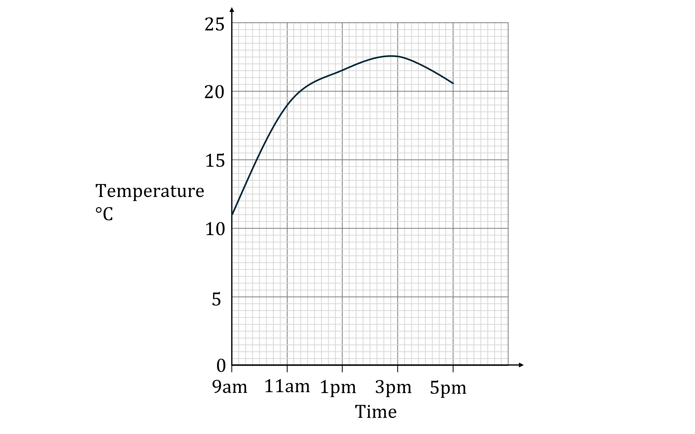

# Exam Questions — Percentages
**1. Numbers & the Number System** · Edexcel IGCSE Maths A (4MA1) — 18/Foundation
> Source: [https://www.savemyexams.com/igcse/maths/edexcel/a/18/foundation/topic-questions/numbers-and-the-number-system/percentages/exam-questions/](https://www.savemyexams.com/igcse/maths/edexcel/a/18/foundation/topic-questions/numbers-and-the-number-system/percentages/exam-questions/) · 9 questions · total 32 marks

## Q1 — medium — 6 marks · exam-questions

### 20((a)) — 3 marks — command: work_out — structured — from paper Specimen paper · 4MA1/1F
Lijuan’s salary is 180000 Hong Kong Dollars (HK\$). 
She gets a salary increase of 3%

Work out Lijuan’s salary after this increase.

### 20((b)) — 3 marks — command: work_out — structured — from paper Specimen paper · 4MA1/1F
In a sale, all normal prices are reduced by 15% 
The sale price of a camera is HK\$6630

Work out the normal price of the camera.

## Q2 — easy — 2 marks · exam-questions

### 3((e)) — 2 marks — command: express — structured — from paper Specimen paper · 4MA1/2F
India produces 155 million tonnes of rice per year. 
China produces 205 million tonnes of rice per year.

Express 155 as a percentage of 205 
Give your answer correct to 1 decimal place.

## Q3 — easy — 2 marks · exam-questions

### 6((a)) — 2 marks — command: work_out — structured — from paper 2023 June · 4MA1/1F
Vivienne makes bread. 
The weight of yeast she uses is 1% of the weight of flour she uses. 
Vivienne uses 750 g of flour.

Work out the weight of yeast she uses

## Q4 — hard — 4 marks · exam-questions

### 11() — 4 marks — command: find — structured — from paper 2023 June · 4MA1/1F
Pablo buys some tickets to go to the theatre.

3 of the tickets are for adults. 
The remaining tickets are for children.

Each adult ticket costs 12 euros. 
The children’s tickets each cost 30% less than an adult ticket.

The total amount of money that Pablo pays for all the tickets is 94.80 euros.

Find the number of children’s tickets Pablo buys.

## Q5 — medium — 3 marks · exam-questions

### 1() — 3 marks — command: find — structured

The line graph shows the temperature one day in May in Scotland.

Find the percentage increase in the temperature from 11am to 3pm. Give your answer to 1 decimal place.

## Q6 — medium — 3 marks · exam-questions

### 1() — 3 marks — command: work_out — structured
Lily’s home cost 290 000 euros to purchase 7 years ago. Lily is now selling her home for 7% more than this amount.

Work out the amount that Lily is selling her home for.

## Q7 — hard — 4 marks · exam-questions

### 18() — 4 marks — command: work_out — structured — from paper 2023 June · 4MA1/1F
Nanette buys 60 notebooks for a total cost of 780 dirhams.

Nanette sells 70% of the notebooks for 22 dirhams each. 
She sells the remaining notebooks for 19 dirhams each.

Work out Nanette’s percentage profit. 
Give your answer correct to 3 significant figures

## Q8 — medium — 4 marks · exam-questions

### 17() — 4 marks — command: work_out — structured — from paper 2023 Nov · 4MA1/1F
Joshua buys a car for \$12 500

He sells the car to Nina.

Nina pays

- a deposit of \$1500
- followed by 36 monthly payments of \$450

Work out Joshua’s percentage profit.

## Q9 — medium — 4 marks · exam-questions

### 13() — 4 marks — command: work_out — structured — from paper 2023 Nov · 4MA1/2F
Bella buys 150 football shirts for a total cost of 1800 dollars.

She gives 10% of the shirts to the local football team. 
Bella sells the rest of the shirts for $g$ dollars each. 
She makes a total profit of 360 dollars.

Work out the value of $g$
