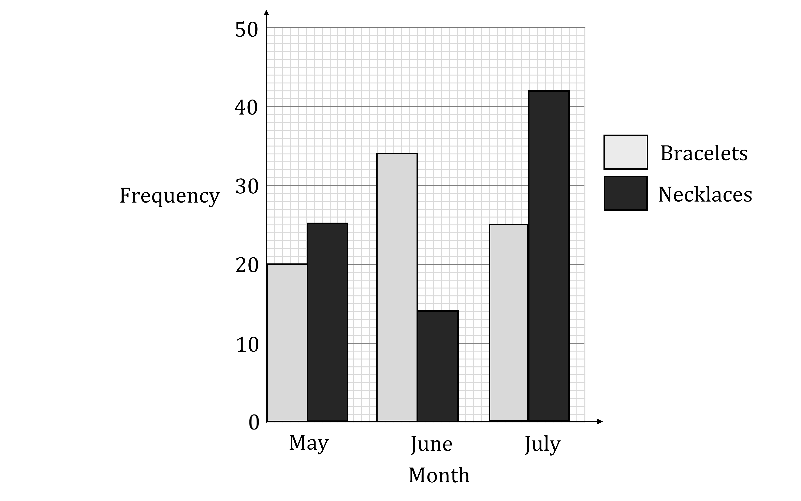

# Exam Questions — Ratio
**1. Numbers & the Number System** · Edexcel IGCSE Maths A (4MA1) — 18/Foundation
> Source: [https://www.savemyexams.com/igcse/maths/edexcel/a/18/foundation/topic-questions/numbers-and-the-number-system/ratio/exam-questions/](https://www.savemyexams.com/igcse/maths/edexcel/a/18/foundation/topic-questions/numbers-and-the-number-system/ratio/exam-questions/) · 8 questions · total 27 marks

## Q1 — medium — 3 marks · exam-questions

### 15() — 3 marks — command: how — structured — from paper Specimen paper · 4MA1/1F
Aiko, Max and Pau share 5400 yen in the ratios 5:3:4

How much money does each of them get?

Aiko ....................................................... yen
 Max ....................................................... yen
Pau ....................................................... yen

## Q2 — medium — 4 marks · exam-questions

### 1() — 4 marks — command: calculate — structured
Adam buys a new car.  The cost of the car is \$7600.

Adam pays \$1200 deposit in September. Adam pays the remaining amount in three instalments in October, November and December. The amount paid in October, November and December is in the ratio 4:5:7.

Calculate the amount Adam pays in October, November and December.

October \$..........

November \$..........

December \$..........

## Q3 — hard — 3 marks · exam-questions

### 16() — 3 marks — command: work_out — structured — from paper 2023 June · 4MA1/1F
Last season, the number of goals scored by Arjun, by Simon and by Kath for their football team were in the ratios 2 : 5 : 8

Simon scored 12 more goals than Arjun.

Work out the number of goals scored by Kath.

## Q4 — medium — 4 marks · exam-questions

### 21() — 4 marks — command: how — structured — from paper 2023 June · 4MA1/2F
Nancy has some coins with a total value of 85 pence. 
She has only 2 pence coins and 5 pence coins.

The ratio

number of 2 pence coins: number of 5 pence coins = 1:3

Nancy has more 5 pence coins than 2 pence coins.

How many more?

## Q5 — hard — 5 marks · exam-questions

### 11() — 5 marks — command: work_out — structured — from paper 2023 Nov · 4MA1/1F
A rental company has 360 cars and some vans.

The ratio of the number of cars to the number of vans is 3 : 5

$\frac{4}{9}$ of the cars are electric.

36% of the vans are electric.

The company has more electric vans than electric cars.

Work out how many more. 
Show your working clearly

## Q6 — medium — 2 marks · exam-questions

### 1() — 2 marks — command: write — structured
The bar chart shows information about the number of bracelets and necklaces a jewellery shop sold in May, June and July last year.

Write the number of bracelets to necklaces sold in June as a ratio in its simplest form.

## Q7 — hard — 3 marks · exam-questions

### 21() — 3 marks — command: work_out — structured — from paper 2023 Nov · 4MA1/2F
Avril bakes a cake.

She uses flour, butter and sugar such that

weight of flour : weight of butter = 6 : 5 
weight of butter : weight of sugar = 3 : 2

Avril uses 120 grams of sugar.

Work out the weight of flour Avril uses

## Q8 — hard — 3 marks · exam-questions

### 1() — 3 marks — command: how — structured
Tony runs a restaurant.

He is ordering desserts.

He checks 580 previous orders to see what he needs.

35% of the orders were cheesecake.

$\frac{2}{5}$ of all orders were trifle .

The remaining orders were sticky toffee pudding and a fruit plate in the ratio 22:7.

How many fruit plates does Tony need to buy?
