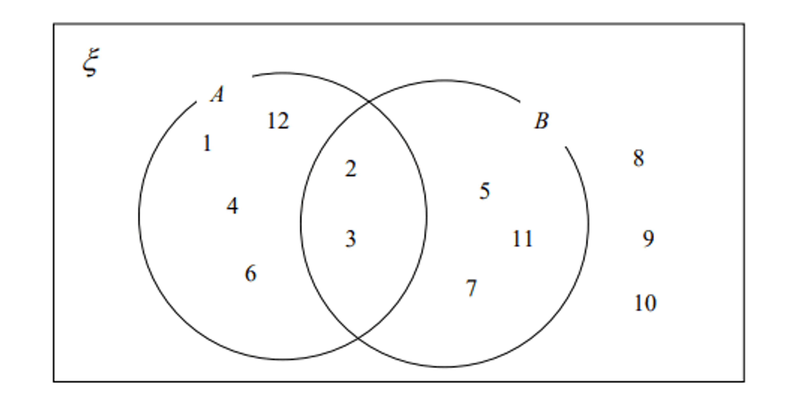
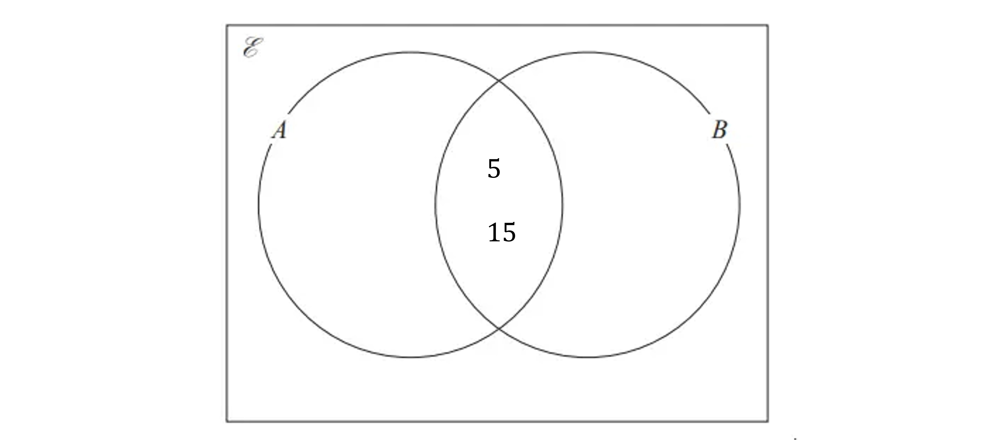
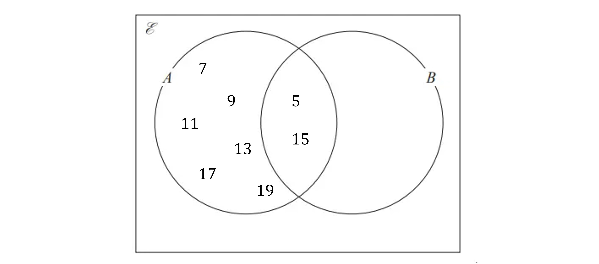
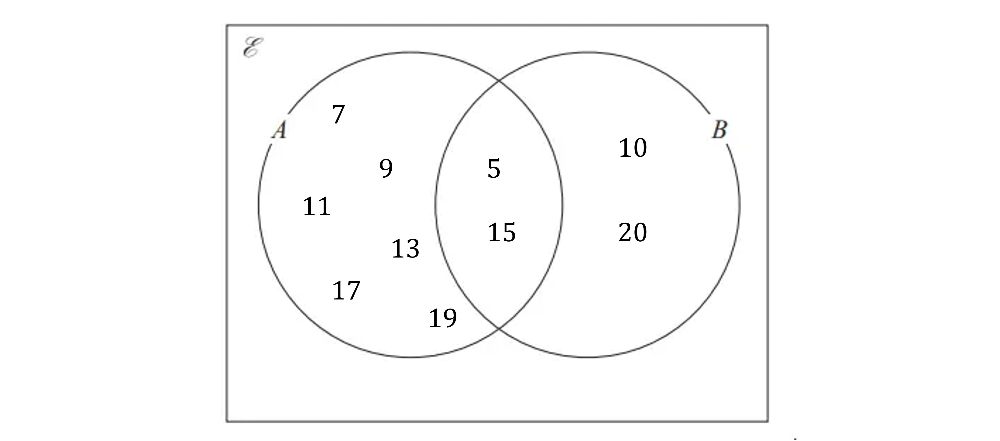
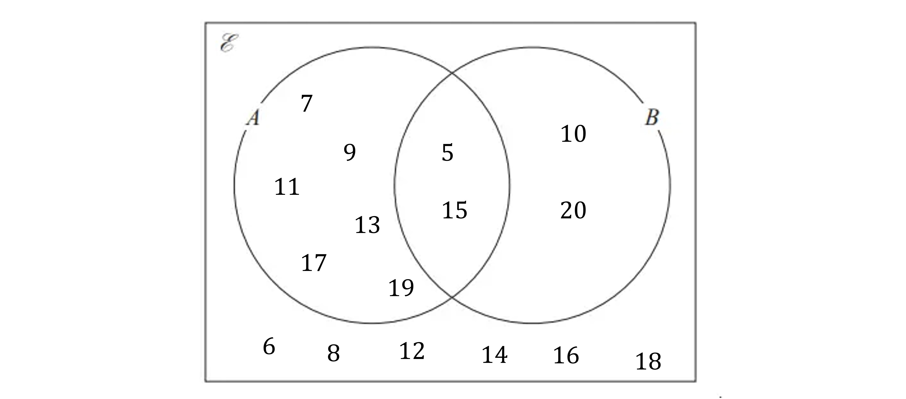
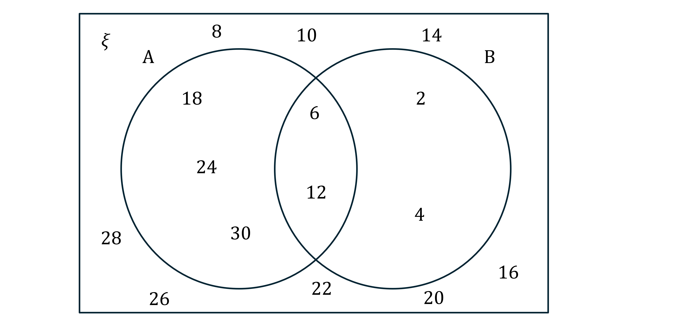

# Mark Schemes — Set Notation & Venn Diagrams
**1. Numbers & the Number System** · Edexcel IGCSE Maths A (4MA1) — 18/Foundation

## Q1 — easy — 5 marks · exam-questions

### 6((a)) — 3 marks
> **[exam-tip]**
> Set notation is commonly used in Venn diagram questions.
> 
> $ξ$ means the universal set and defines all the elements contained within the Venn diagram.
> 
> Subsets are represented within the circles in the Venn diagram and their members will share a common property (e.g. factors of 12).

> *The numbers 1 to 12 must be included in the Venn diagram as they are all members of the universal set*

> *Look for values that are in both subset** A** and subset **B** and place them once in the overlapping section of the circles (the intersection)*

*2, 3*

**[M1]**

> *Place the numbers left over from subset **A** in the crescent shape for circle **A*

*1, 4, 6, 12*

**[M1]**

> *Place the numbers left over from subset **B** in the crescent shape for circle **B*

*5, 7, 11*

> *Place any numbers left over in the universal set that are not contained in the subsets **A** and** B** in the area within the rectangle but outside of the circles*

*8, 9 , 10*

> *The correct completed Venn diagram is below:*

**[A1]**

### 6((b)) — 2 marks
> **[exam-tip]**
> $\cap$is the intersection of subsets and the members of the listed subsets will meet the criteria of each.
> 
> You can use the word 'and' when reading this (for example members of *A*$\cap$*B* means members contained within the subsets of both *A* and *B*).

(i)

> *List the numbers that are in both subset **A** and subset **B**, shown in the overlapping circles section in the Venn diagram*

**Final answer:** **2, 3**

**[B1]**

(ii)

> **[exam-tip]**
> $B'$ means the numbers that are not contained in subset *B*

> *List the numbers that are not in subset **B**, shown in the crescent shape section of **A** and the numbers outside of the circles in the Venn diagram*

**Final answer:** **1, 4, 6, 12, 8, 9, 10**

**[B1]**

> **[mark-scheme]**
> Both marks are awarded if values are listed correctly from the previous question's incorrect Venn diagram.

## Q2 — medium — 3 marks · exam-questions

### 15() — 3 marks
> *Odd numbers end in 1, 3, 5, 7 or 9*

> *List the numbers that go in A from the set of numbers*

`A italic equals stretchy left curly bracket straight 5 straight comma straight space straight 7 straight comma straight space straight 9 straight comma straight space straight 11 straight comma straight space straight 13 straight comma straight space straight 15 straight comma straight space straight 17 straight comma straight space straight 19 stretchy right curly bracket`

> *Multiples of 5 are the numbers in the 5 times table*

> *List the numbers that go in B from the set of numbers*

`B equals open curly brackets 5 comma space 10 comma space 15 comma space 20 close curly brackets`

> *Any numbers that appear in the lists for **A** **and** **B** go in the overlapping circles on the Venn diagram*

> *Fill in the remaining numbers from set** A*

> *Fill in the remaining numbers from set **B*

> *The remaining numbers from the original list should be put inside the rectangle but outside the circles as they are not included in **A** or **B*

**[B1 B1 B1]**

> **[mark-scheme]**
> **B1: **For one correct region. This could be the values outside the circles, in the overlapping section, just in A or just in B.
> 
> **B1:** For two or three correct regions.
> 
> **B1: **For the whole Venn diagram being correct.

## Q3 — medium — 3 marks · exam-questions

### 15((a)) — 1 marks
> *The members of set *$A$* are all of the numbers in circle *$A$

**Final answer:** **5, 7, 9, 11, 13, 15**

**[B1]**

> **[mark-scheme]**
> **B1: **Numbers can be in any order.

### 15((b)) — 1 marks
> $A\capB$* is the part where the circles overlap*

**Final answer:** **5, 15**

**[B1]**

### 15((c)) — 1 marks
> $A\cupB$* is anything contained in the circles so *`open parentheses A space union space B close parentheses apostrophe`* is anything outside of the circles*

**Final answer:** **6, 8, 12, 14, 16**

**[B1]**

## Q4 — medium — 5 marks · exam-questions

### 1() — 3 marks
6 and 12 are members of both A and B so they go in the intersection

18, 24 and 30 are multiples of 3, so they go in A

2 and 4 are factors of 12 so they go in B

The rest of the numbers go on the outside

**[M1 M1 A1]**

> **[mark-scheme]**
> **M1: **For 6, 12, 18, 24 and 30 in A or 2, 4, 6 and 12 in B.
> 
> **M1: **For 6 and 12 in the intersection, or 8, 10, 14, 16, 20, 22, 26 and 28 on the outside.
> 
> **A1: **For all numbers in the correct places.

### 2() — 1 marks
List the numbers in the intersection (between the two circles)

**Final answer:** **6, 12**

**[B1]**

> **[mark-scheme]**
> **B1**: You can get the marks for this even if your Venn diagram is wrong, as long as you've written what is in the middle of yours!

### 3() — 1 marks
Count the number of items in the union of A and B (everything in both circles)

**Final answer:** **7**

**[B1]**
