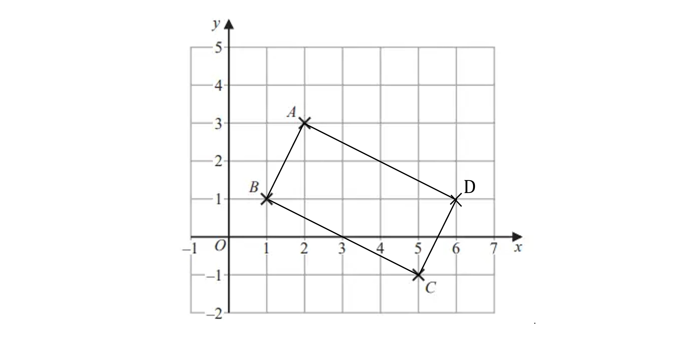
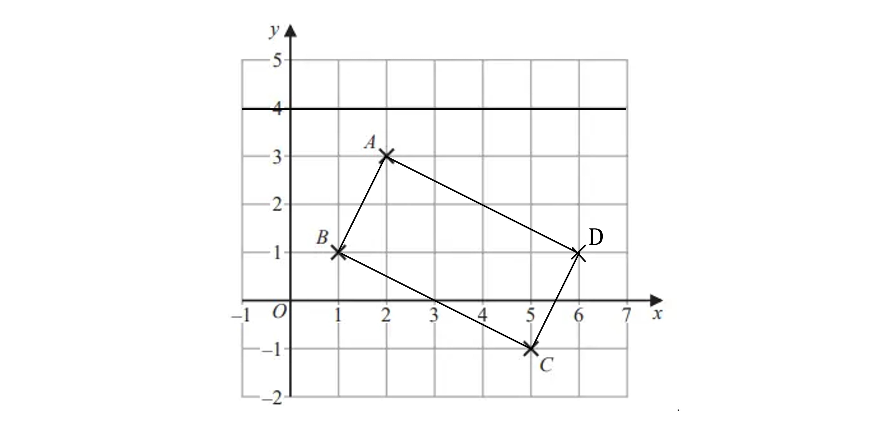
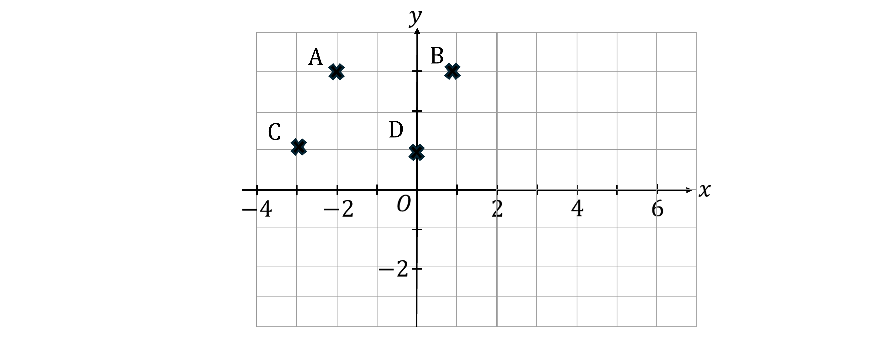
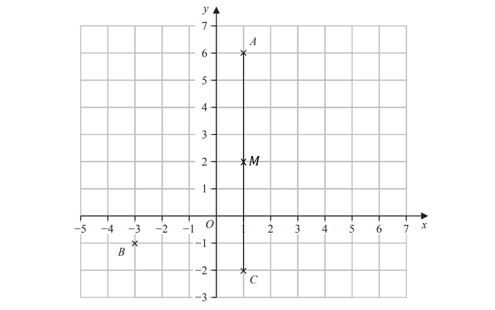

# Mark Schemes — Coordinate Geometry
**3. Sequences, Functions & Graphs** · Edexcel IGCSE Maths A (4MA1) — 18/Foundation

## Q1 — easy — 5 marks · exam-questions

### 5((a)) — 1 marks
> *Look at the *$x$*value (the across value) first, then the *$y$* value (the up value)*

**Final answer:** **(2, 3)**

**[B1]**

### 5((b)) — 1 marks
> *Join up the points given*

> *Draw lines parallel to this to complete the rectangle*

> *Label point D in the missing corner*

**[B1]**

> **[mark-scheme]**
> **B1**: This mark is for having point $D$ in the right place; you don't need to draw the rectangle to get the mark.

### 5((c)) — 2 marks
> *Add the coordinates of A and C together and divide by two to find the middle*

*A (2, 3) and C (5, -1)*

`open parentheses fraction numerator 2 plus 5 over denominator 2 end fraction comma space fraction numerator 3 plus open parentheses negative 1 close parentheses over denominator 2 end fraction close parentheses`

`open parentheses 7 over 2 comma space 2 over 2 close parentheses`

`open parentheses 3.5 comma space 1 close parentheses`

**[B1 B1]**

> **[mark-scheme]**
> **B1: **For getting the correct calculation for either coordinate or for having the correct numbers in your answer but the other way around (1, 3.5).
> 
> **B1:** For the correct answer. `open parentheses 7 over 2 comma space 1 close parentheses` will also get the mark.

### 5((d)) — 1 marks
> *y = 4 is a horizontal line though 4 on the y axis*

**[B1]**

## Q2 — medium — 1 marks · exam-questions

### 1() — 1 marks
Plot point D

**[B1]**

> **[mark-scheme]**
> **B1**: Point plotted at (0, 1).

## Q3 — easy — 3 marks · exam-questions

### 4((a)) — 1 marks
> **[exam-tip]**
> Remember that co-ordinates should be written in brackets with the $x$ co-ordinate first, then the $y$ co-ordinate.

**Final answer:** **(1, 6)**

**[B1]**

### 4((b)) — 1 marks
> **[exam-tip]**
> Remember that co-ordinates should be written in brackets with the $x$ co-ordinate first, then the $y$ co-ordinate.

**Final answer:** **(-3, -1)**

**[B1]**

### 4((c)) — 1 marks
> *Draw a line from point A to point C and find the halfway point*

**[B1]**

## Q4 — easy — 1 marks · exam-questions

### 1() — 1 marks
**Final answer:** **(3, 8)**

**[B1]**
