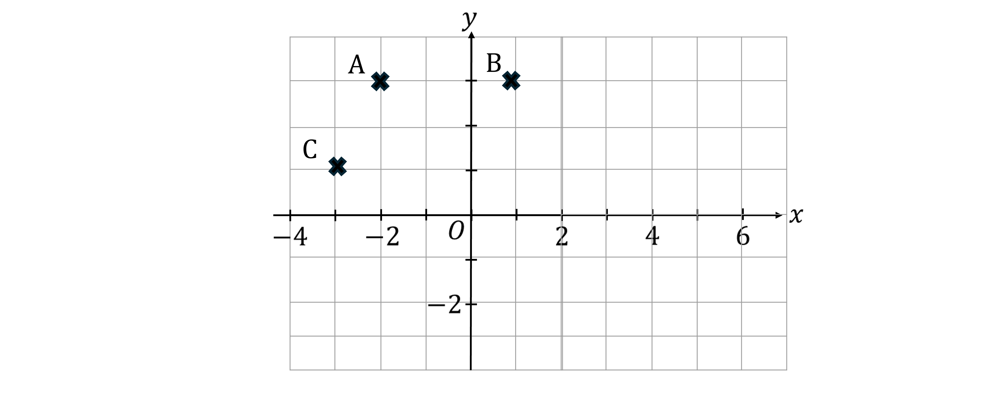
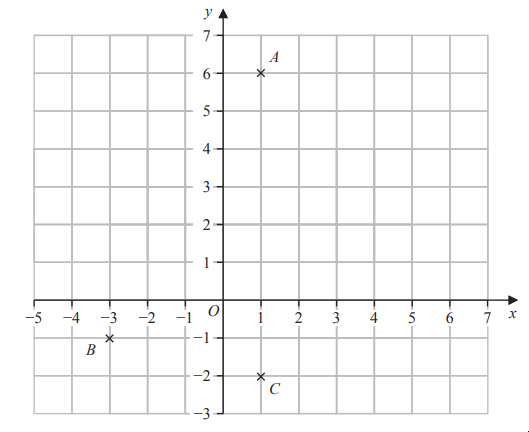

# Exam Questions — Coordinate Geometry
**3. Sequences, Functions & Graphs** · Edexcel IGCSE Maths A (4MA1) — 18/Foundation
> Source: [https://www.savemyexams.com/igcse/maths/edexcel/a/18/foundation/topic-questions/sequences-functions-and-graphs/coordinate-geometry/exam-questions/](https://www.savemyexams.com/igcse/maths/edexcel/a/18/foundation/topic-questions/sequences-functions-and-graphs/coordinate-geometry/exam-questions/) · 4 questions · total 10 marks

## Q1 — easy — 5 marks · exam-questions

### 5((a)) — 1 mark — command: write — structured — from paper 2023 June · 4MA1/2F
The diagram shows three points, $A,B$ and $C$, marked on a grid.

Write down the coordinates of point $A$

### 5((b)) — 1 mark — command: mark — structured — from paper 2023 June · 4MA1/2F
On the grid, mark with a cross (×) the point $D$ so that $ABCD$ is a rectangle.

### 5((c)) — 2 marks — command: find — structured — from paper 2023 June · 4MA1/2F
Find the coordinates of the midpoint of $AC$

### 5((d)) — 1 mark — command: draw — structured — from paper 2023 June · 4MA1/2F
On the grid, draw the line with equation $y=4$

## Q2 — medium — 1 marks · exam-questions

### 1() — 1 mark — command: plot — structured
Points A, B and C are plotted on the grid below.

Plot point D on the grid to make the parallelogram ABDC.

## Q3 — easy — 3 marks · exam-questions

### 4((a)) — 1 mark — command: write — structured — from paper 2023 Nov · 4MA1/1F
The diagram shows three points, $A,B$ and $C$, marked on a grid.

Write down the coordinates of point $A$

### 4((b)) — 1 mark — command: write — structured — from paper 2023 Nov  · 4MA1/1F
Write down the coordinates of point $B$

### 4((c)) — 1 mark — command: mark — structured — from paper 2023 Nov · 4MA1/1F
$M$ is the midpoint of the line $AC$

On the grid, mark with a cross (×) the point $M$
Label the point $M$

## Q4 — easy — 1 marks · exam-questions

### 1() — 1 mark — command: write — structured
Write down the coordinates of vertex A

