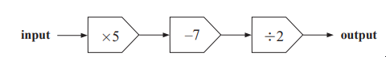
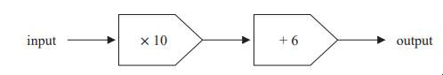
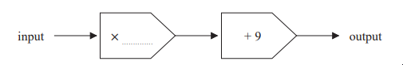
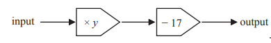
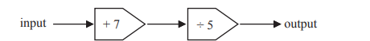

# Exam Questions — Functions
**3. Sequences, Functions & Graphs** · Edexcel IGCSE Maths A (4MA1) — 18/Foundation
> Source: [https://www.savemyexams.com/igcse/maths/edexcel/a/18/foundation/topic-questions/sequences-functions-and-graphs/functions/exam-questions/](https://www.savemyexams.com/igcse/maths/edexcel/a/18/foundation/topic-questions/sequences-functions-and-graphs/functions/exam-questions/) · 4 questions · total 17 marks

## Q1 — medium — 5 marks · exam-questions

### 7((a)) — 1 mark — command: work_out — structured — from paper Specimen paper · 4MA1/2F
Here is a number machine.

Work out the output when the input is 15

### 7((b)) — 2 marks — command: work_out — structured — from paper Specimen paper · 4MA1/2F
Work out the input when the output is 124

### 7((c)) — 2 marks — command: write — structured — from paper Specimen paper · 4MA1/2F
The input is $p$. 
The output is $T$

Write down a formula for $T$ in terms of $p$.

## Q2 — medium — 3 marks · exam-questions

### 9((a)) — 1 mark — command: work_out — structured — from paper 2023 June · 4MA1/1F
Here is a number machine.

Work out the output when the input is 14

### 9((b)) — 2 marks — command: write — structured — from paper 2023 June · 4MA1/1F
Here is a different number machine

When the input is 11 the output is 64

Write a number on the dotted line to complete the number machine.

## Q3 — medium — 4 marks · exam-questions

### 10((a)) — 2 marks — command: work_out — structured — from paper 2023 Nov · 4MA1/2F
Here is a number machine.

When the input is 7 the output is 60

Work out the value of $y$

### 10((b)) — 2 marks — command: write — structured — from paper 2023 Nov · 4MA1/2F
Here is a different number machine.

The input is $x$

Write down an expression, in terms of $x$, for the output.

## Q4 — medium — 5 marks · exam-questions

### 1() — 1 mark — command: work_out — structured
Here is a number machine.

Work out the output when the input is 14

### 2() — 2 marks — command: work_out — structured
Work out the input when the output is 21

### 3() — 2 marks — command: write — structured
The input is $a$. The output is $B$. Write down a formula for $B$ in terms of $a$.
