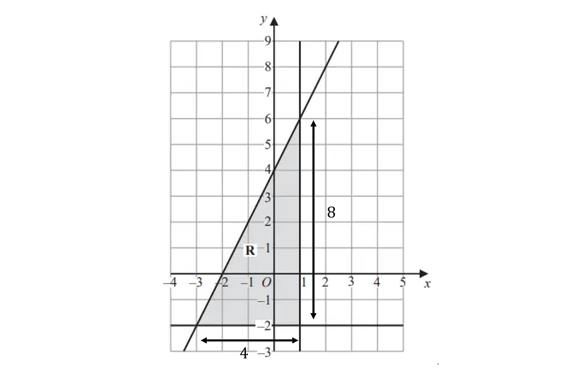

# Mark Schemes — Graphing Inequalities
**3. Sequences, Functions & Graphs** · Edexcel IGCSE Maths A (4MA1) — 18/Foundation

## Q1 — hard — 4 marks · exam-questions

### 22() — 4 marks
> *Find the equation of each line that makes the triangle enclosing R*

> *Vertical lines are x = the number it passes through on the x-axis*

> *Horizontal lines are y = the number it passes through on the y-axis*

> *Decide whether the inequality is less than or greater than by seeing which side is shaded*

> *Each line is solid so is either *$\geq\mathrm{or}\leq$

> **[exam-tip]**
> If you aren't sure which sign to use, $\leq$ or $\geq$, pick a pair of coordinates and test if they work in your inequality.

$x\leq1$

**[B1]**

$y\geq-2$

**[B1]**

> *For the diagonal line, you need to calculate the gradient and y-intercept*

> *For the gradient, pick two points on the line and count the change in the y-coordinates and the change in the x-coordinates*

> *It is easiest to use the whole triangle you are given for this*

$\mathrm{Gradient}=\frac{8}{4}\,\mathrm{Gradient}=2$

> *The y-intercept is the number where the line crosses the y-axis*

*4*

> *Use these values in *$y=mx+c$* where the gradient is m and the y-intercept is c but change the equals sign for an inequality sign*

> *The shaded area is below the line so it is "less than or equal to"*

$y\leq2x+4$

**[M1 A1]**

> **[mark-scheme]**
> **B1**: Correct inequality.
> 
> **B1**: Correct inequality.
> 
> **M1**: $y=2x+c$ or $y=mx+4$.
> 
> **A1**: Correct inequality.

## Q2 — hard — 3 marks · exam-questions

### 22((b)) — 3 marks
> *The equations of the straight lines are*

$x=7$

$y=2$

$y=x$

> *The shaded area is to the left of the vertical line, *$x=7$

$x\leq7$

**[B1]**

> *The shaded area is above the horizontal line, *$y=2$

$y\geq2$

**[B1]**

> *The shaded area is below the diagonal line, *$y=x$

$y\leqx$

**[B1]**
