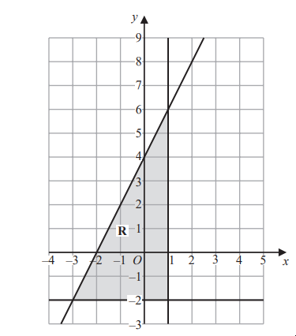
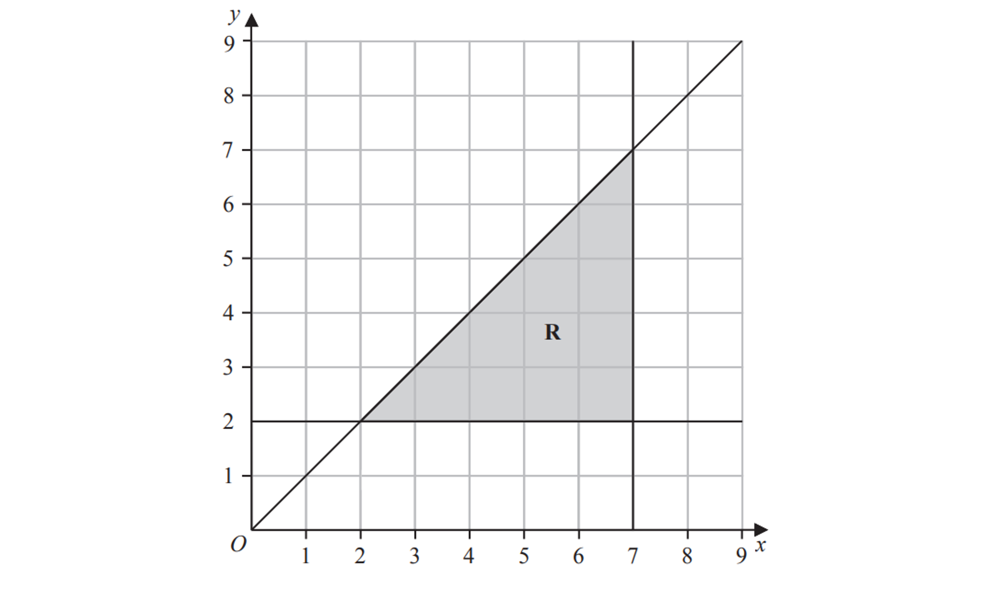

# Exam Questions — Graphing Inequalities
**3. Sequences, Functions & Graphs** · Edexcel IGCSE Maths A (4MA1) — 18/Foundation
> Source: [https://www.savemyexams.com/igcse/maths/edexcel/a/18/foundation/topic-questions/sequences-functions-and-graphs/graphing-inequalities/exam-questions/](https://www.savemyexams.com/igcse/maths/edexcel/a/18/foundation/topic-questions/sequences-functions-and-graphs/graphing-inequalities/exam-questions/) · 2 questions · total 7 marks

## Q1 — hard — 4 marks · exam-questions

### 22() — 4 marks — command: find — structured — from paper 2023 June · 4MA1/1F

The region **R,** shown shaded in the diagram, is bounded by three straight lines.

Find the inequalities that define **R**

## Q2 — hard — 3 marks · exam-questions

### 22((b)) — 3 marks — command: write — structured — from paper 2023 Nov · 4MA1/1F
The region **R**, shown shaded in the diagram, is bounded by three straight lines.

Write down the three inequalities that define the region **R**
