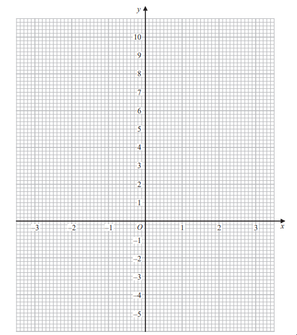

# Exam Questions — Graphs of Functions
**3. Sequences, Functions & Graphs** · Edexcel IGCSE Maths A (4MA1) — 18/Foundation
> Source: [https://www.savemyexams.com/igcse/maths/edexcel/a/18/foundation/topic-questions/sequences-functions-and-graphs/graphs-of-functions/exam-questions/](https://www.savemyexams.com/igcse/maths/edexcel/a/18/foundation/topic-questions/sequences-functions-and-graphs/graphs-of-functions/exam-questions/) · 1 questions · total 4 marks

## Q1 — medium — 4 marks · exam-questions

### 20((a)) — 2 marks — command: complete — structured — from paper 2023 June · 4MA1/2F
Complete the table of values for $y=x^{2}-x-4$

| $x$ | -3 | -2 | -1 | 0 | 1 | 2 | 3 |
|---|---|---|---|---|---|---|---|
| $y$ |   | 2 |   |   | -4 |   |   |

### 20((b)) — 2 marks — command: draw — structured — from paper 2023 June · 4MA1/2F
On the grid below, draw the graph of $y=x^{2}-x-4$ for values of $x$ from -3 to 3

