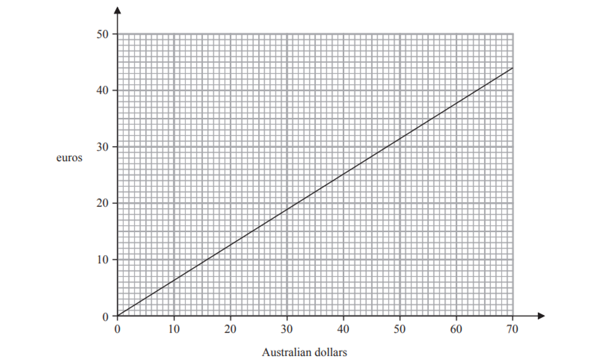

# Exam Questions — Real-Life Graphs
**3. Sequences, Functions & Graphs** · Edexcel IGCSE Maths A (4MA1) — 18/Foundation
> Source: [https://www.savemyexams.com/igcse/maths/edexcel/a/18/foundation/topic-questions/sequences-functions-and-graphs/real-life-graphs/exam-questions/](https://www.savemyexams.com/igcse/maths/edexcel/a/18/foundation/topic-questions/sequences-functions-and-graphs/real-life-graphs/exam-questions/) · 1 questions · total 4 marks

## Q1 — easy — 4 marks · exam-questions

### 11((a)) — 2 marks — command: convert — structured — from paper 2023 Nov · 4MA1/2F
The graph below can be used to change between Australian dollars and euros

Use the graph to change

(i) 35 Australian dollars to euros

(ii) 20 euros to Australian dollars

### 11((b)) — 2 marks — command: work_out — structured — from paper 2023 Nov · 4MA1/2F
Lachlan changes 500 Australian dollars to euros.

Work out how many euros he should receive.
